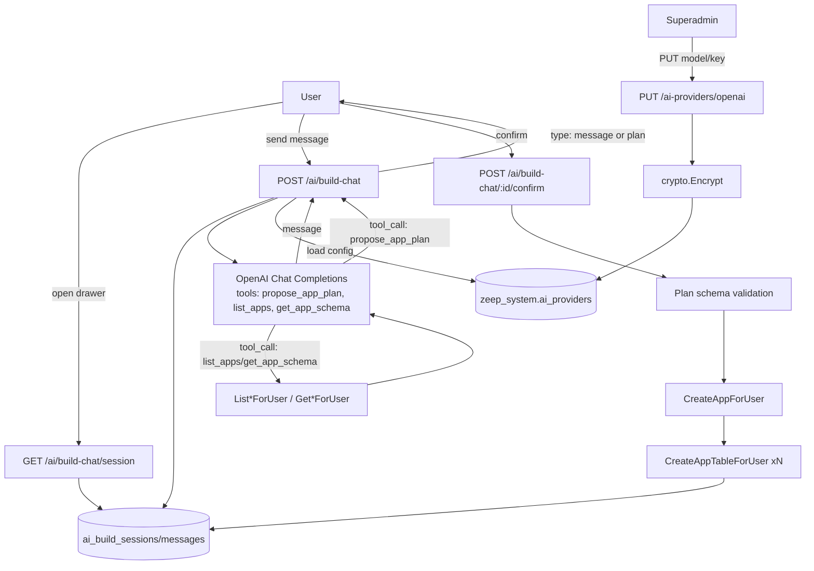

# Build with AI — Chat-Driven App Creation Design

**Spec**: `.specs/features/ai-build-chat/spec.md`
**Status**: Approved

---

## Architecture Overview

Two independent slices that compose: (1) a superadmin-only provider config store, and (2) a per-user chat flow that calls the configured provider with forced function-calling, persists every turn, and — only on explicit confirm — replays the plan through the exact same `*ForUser` handlers the REST API and MCP already share.



---

## Code Reuse Analysis

### Existing Components to Leverage

| Component | Location | How to Use |
| --- | --- | --- |
| `crypto.Encrypt`/`Decrypt` (AES-256-GCM) | `internal/crypto/aes.go:49-56` | Same primitive as `auth_providers_store.go`; new dedicated key resolver `aiProviderEncryptionKey()` added to `internal/crypto/aes.go` alongside `webhookTokenEncryptionKey()` (same shape: dedicated env var, `DASHBOARD_BOOTSTRAP_SECRET` fallback, independent rotation). |
| `mergeProviderConfig` pattern | `internal/dashboard/auth_providers_store.go:222-247` | Same merge-on-absent-key semantics reused (not the same function — different config shape) for the AI provider's model-only update. |
| `platformPerms` / `HasPlatformPermission` | `internal/dashboard/platform_roles.go:20-56` | Reuse existing `ActionManageIntegrations` (already superadmin-only, `platform_roles.go:33-35`) to gate the provider-config endpoint — no new `PlatformAction` needed; an AI provider is an integration in the same sense GitHub/SSO providers are. |
| `Handler.CreateAppForUser` | `internal/dashboard/handler.go:922` | Called directly by the confirm endpoint with `AppRequestBody{Name, AuthEmailEnabled}`, origin `"ai_chat"` — identical call shape to `internal/mcpserver/tools.go:227-232`. |
| `Handler.CreateAppTableForUser` | `internal/dashboard/handler.go:1196` | Called once per planned table with `TableRequestBody{Name, RLS, Columns, Indexes}`, origin `"ai_chat"` — identical call shape to `internal/mcpserver/tools.go:249-253`. |
| `dashboard.UserFromContext` | used throughout `handler.go`/`tools.go` | Same context-based auth resolution for the chat/confirm HTTP handlers as the dashboard's own REST handlers use. |
| `List*ForUser`/`Get*ForUser` read handlers (backing `orbit_list_apps`/`orbit_get_app_schema`) | `internal/mcpserver/tools.go` (read-only tool registrations) | Wrapped as two OpenAI function-calling tools so the model can look up an existing app's real schema instead of guessing. |
| `RequireRole` (frontend gate) | `internal/dashboard/ui/src/components/patterns/RequireRole.tsx` | Reused to gate the new AI Provider settings panel to `superadmin`, same pattern as the GitHub Integrations page (`App.tsx:157`). |

### Integration Points

| System | Integration Method |
| --- | --- |
| OpenAI Chat Completions API | Server-side HTTP call from a new `internal/dashboard/ai` package; never called from the frontend (key never leaves the backend). Uses `tools` + `tool_choice: "auto"` (not a forced single-name choice — see Tech Decisions). |
| `zeep_system` schema | Two new tables: `ai_providers`, `ai_build_sessions`, `ai_build_messages` — same schema/migration convention as `auth_providers`. |
| Dashboard audit log | `h.audit(ctx, ...)` call inside the confirm handler, same call shape as `CreateAppTableForUser`'s existing audit line (`handler.go`), with action strings distinguishable by the `"ai_chat"` origin already threaded through `*ForUser`'s `ip` parameter. |

---

## Components

### `internal/dashboard/ai_providers_store.go` (new)

- **Purpose**: CRUD for the single global AI provider row, encryption/decryption at rest, merge-on-absent-key partial update.
- **Location**: `internal/dashboard/ai_providers_store.go`
- **Interfaces**:
  - `GetAIProvider(ctx, pool, provider string) (*AIProviderResponse, error)` — returns `{Provider, Model, Enabled, HasKey bool}`, never the key.
  - `UpsertAIProvider(ctx, pool, provider string, input *aiProviderUpsertInput) (*AIProviderResponse, error)` — encrypts key if present, merges model-only updates against the stored key.
  - `resolveDecryptedAIProviderKey(ctx, pool, provider string) (model string, key string, err error)` — internal-only accessor used by the chat call path; never exposed over HTTP.
- **Dependencies**: `internal/crypto`, `internal/db`.
- **Reuses**: `crypto.Encrypt`/`Decrypt`; merge-on-absent-key pattern from `mergeProviderConfig`.

### `internal/dashboard/ai_provider_handlers.go` (new)

- **Purpose**: HTTP handlers for `GET`/`PUT /api/dashboard/ai-providers/{provider}`.
- **Location**: `internal/dashboard/ai_provider_handlers.go`
- **Interfaces**:
  - `(h *Handler) GetAIProviderConfig(w, r)` — any authenticated user; returns `{has_key, model, enabled}` for `openai`, and a static `{available: false}` shape for `gemini`/`claude`.
  - `(h *Handler) UpsertAIProviderConfig(w, r)` — gated by `HasPlatformPermission(user.Role, ActionManageIntegrations)`; `gemini`/`claude` path params return `501 Not Implemented`.
- **Dependencies**: `ai_providers_store.go`.
- **Reuses**: existing `writeJSON`, `h.decodeJSONBody`, `UserFromContext` patterns already used by every other dashboard handler in `handler.go`.

### `internal/dashboard/ai_build_sessions_store.go` (new)

- **Purpose**: Session/message persistence and lifecycle transitions (`in_progress` → `completed`/`abandoned`).
- **Location**: `internal/dashboard/ai_build_sessions_store.go`
- **Interfaces**:
  - `GetOrCreateInProgressSession(ctx, pool, userID string) (*AIBuildSession, []AIBuildMessage, error)`
  - `AppendMessage(ctx, pool, sessionID string, role string, content string, plan json.RawMessage) error`
  - `AbandonAndRestartSession(ctx, pool, userID string) (*AIBuildSession, error)`
  - `CompleteSession(ctx, pool, sessionID string, appID string) error`
  - `SetSessionCreatedApp(ctx, pool, sessionID string, appID string) error` — called after `CreateAppForUser` succeeds, before per-table creation, so a partial failure still has `created_app_id` set (spec AIBC-22).
- **Dependencies**: `internal/db`.
- **Reuses**: standard `pool.QueryRow`/`pool.Exec` pattern already used throughout `internal/dashboard/*_store.go`.

### `internal/dashboard/ai/client.go` (new package)

- **Purpose**: Thin OpenAI Chat Completions client — request building, tool schema definitions, response parsing into the two normalized shapes the chat handler returns to the frontend.
- **Location**: `internal/dashboard/ai/client.go`
- **Interfaces**:
  - `type ChatTurnResult struct { Kind string /* "message" | "plan" */; Content string; Plan *AppPlan }`
  - `func CallModel(ctx context.Context, model, apiKey string, history []Message, readTools ReadToolInvoker) (ChatTurnResult, error)` — builds the request with the 3 tools (`propose_app_plan`, `list_apps`, `get_app_schema`), `tool_choice: "auto"`; on a `list_apps`/`get_app_schema` tool call, invokes `readTools` and feeds the result back as a `tool` role message in a second round-trip before returning the final result to the caller; on `propose_app_plan`, parses and validates its arguments against `AppPlan`'s Go struct (`json.Unmarshal` + struct tags — invalid/incomplete plan JSON is treated as a provider error, not surfaced as a valid plan).
  - `type ReadToolInvoker func(ctx context.Context, name string, args json.RawMessage) (json.RawMessage, error)` — closure built by the caller, closing over the authenticated `user` and `h.DashH`, so this package never imports `dashboard` directly (keeps the OpenAI client free of dashboard-specific auth types) and calls back into `List*ForUser`/`Get*ForUser` type resolution done by the caller-side closure.
- **Dependencies**: standard `net/http`; no OpenAI SDK dependency — the Chat Completions endpoint is a plain JSON POST, avoiding a new third-party Go module for a single well-documented REST call.
- **Reuses**: nothing existing (new integration); isolated in its own sub-package specifically so a future Gemini/Claude client is a sibling file, not a rewrite of this one.

### `internal/dashboard/ai_build_chat_handlers.go` (new)

- **Purpose**: HTTP handlers for `POST /api/dashboard/ai/build-chat` and `POST /api/dashboard/ai/build-chat/{session_id}/confirm`; orchestrates session store + AI client + `*ForUser` mutation calls.
- **Location**: `internal/dashboard/ai_build_chat_handlers.go`
- **Interfaces**:
  - `(h *Handler) BuildChatTurn(w, r)` — loads/creates session, appends user message, resolves provider config, calls `ai.CallModel`, appends assistant response, returns `{type, content}` or `{type, plan}`. On any provider/config error, returns a fixed generic message (`AIBC-16`) and logs the real error via the same server-side-log-only pattern `AGENTS.md §4` already mandates for other 500s.
  - `(h *Handler) BuildChatConfirm(w, r)` — validates plan shape, calls `CreateAppForUser` then `CreateAppTableForUser` per table (skipping any table name that `GetApp`'s returned `app.Tables` shows already exists — the idempotent-retry requirement, AIBC-23), sets `created_app_id` right after app creation succeeds (not after all tables), marks session `completed` on full success.
  - `(h *Handler) RestartBuildChatSession(w, r)` — thin wrapper over `AbandonAndRestartSession`.
- **Dependencies**: `ai_build_sessions_store.go`, `ai_providers_store.go`, `internal/dashboard/ai`, `Handler.CreateAppForUser`/`CreateAppTableForUser`.
- **Reuses**: exact same `*ForUser` call shape as `internal/mcpserver/tools.go:227-253`, with origin `"ai_chat"` instead of `"mcp"`.

### Frontend: `BuildWithAIDrawer` (existing shell, new behavior)

- **Purpose**: Replace the current static "em breve" drawer mockup with live chat, wired to the three new endpoints.
- **Location**: `internal/dashboard/ui/src/components/...` (existing drawer component location — enable the button, remove the badge).
- **Interfaces**: React Query mutations against `POST /ai/build-chat`, `POST /ai/build-chat/{id}/confirm`, `POST /ai/build-chat/restart`; on mount, `GET /ai/build-chat/session` to resume.
- **Dependencies**: existing dashboard API client (`src/lib/api.ts`), `sonner` toast for error display (`AGENTS.md §5`), `react-i18next` for every user-facing string.
- **Reuses**: existing drawer shell/animation already in the mockup; existing `RequireRole` for the separate superadmin-only AI Provider settings panel (new page/section, not this drawer).

---

## Data Models

### `zeep_system.ai_providers`

```sql
CREATE TABLE zeep_system.ai_providers (
    provider          text PRIMARY KEY,          -- 'openai' | 'gemini' | 'claude'
    model             text NOT NULL DEFAULT '',
    api_key_encrypted text NOT NULL DEFAULT '',
    enabled           boolean NOT NULL DEFAULT false,
    updated_at        timestamptz NOT NULL DEFAULT now()
);
```

**Relationships**: none (singleton config row per provider name, same shape as `zeep_system.auth_providers`).

### `zeep_system.ai_build_sessions`

```sql
CREATE TABLE zeep_system.ai_build_sessions (
    id              uuid PRIMARY KEY DEFAULT gen_random_uuid(),
    owner_user_id   uuid NOT NULL,
    status          text NOT NULL DEFAULT 'in_progress', -- in_progress | completed | abandoned
    created_app_id  uuid,
    created_at      timestamptz NOT NULL DEFAULT now(),
    updated_at      timestamptz NOT NULL DEFAULT now()
);
CREATE INDEX ai_build_sessions_owner_status_idx
    ON zeep_system.ai_build_sessions (owner_user_id, status);
```

**Relationships**: `owner_user_id` → dashboard user; `created_app_id` → app (nullable until confirm succeeds, AIBC-08/AIBC-22).

### `zeep_system.ai_build_messages`

```sql
CREATE TABLE zeep_system.ai_build_messages (
    id          uuid PRIMARY KEY DEFAULT gen_random_uuid(),
    session_id  uuid NOT NULL REFERENCES zeep_system.ai_build_sessions(id) ON DELETE CASCADE,
    role        text NOT NULL,            -- 'user' | 'assistant'
    content     text NOT NULL DEFAULT '',
    plan_json   jsonb,
    created_at  timestamptz NOT NULL DEFAULT now()
);
CREATE INDEX ai_build_messages_session_idx
    ON zeep_system.ai_build_messages (session_id, created_at);
```

**Relationships**: many-to-one with `ai_build_sessions`; `plan_json` populated only on the assistant message that carries a `propose_app_plan` result.

---

## Error Handling Strategy

| Error Scenario | Handling | User Impact |
| --- | --- | --- |
| No provider configured / `enabled = false` | `GetAIProviderConfig` returns `enabled: false`; frontend disables the "Build with AI" entry point instead of opening the drawer (AIBC-18). | Entry point shows a disabled/"not configured" state, no drawer opens. |
| OpenAI call fails (auth, quota, timeout, network) | `BuildChatTurn` returns a fixed generic chat message; real error logged server-side with request context (session ID, provider, non-secret error class). | Chat shows "Não consegui gerar um plano agora, tente novamente." (i18n key), nothing persisted beyond the user's own message. |
| Model returns malformed/incomplete `propose_app_plan` arguments | Treated identically to a provider failure (generic chat message + server log) — never partially trusted. | Same generic error message; no plan card rendered. |
| Non-superadmin calls provider config `PUT` | `403 Forbidden`, no store mutation (AIBC-02). | Settings page never shows this control to non-superadmins (frontend gate) — the 403 is the defense-in-depth backend check. |
| Confirm called by user without `CanWrite()` | `CreateAppForUser`'s existing validation path already returns `ErrForbidden`; handler maps to `403` before any mutation (AIBC-20). | Chat shows the same generic "you don't have permission" message the manual create-app form already shows. |
| Partial failure: app created, Nth table fails | `created_app_id` already persisted; session stays `in_progress`; generic error in chat; retry re-runs confirm, skipping tables that already exist (AIBC-22/AIBC-23). | User sees "algo falhou, tentando novamente resolve" framing, retries via the same Confirm button; no orphaned app with no recovery path. |
| Plan table name collides with a reserved name (e.g. `_auth_users`) | Confirm handler validates against the same reserved-name check `validateTableInput` already applies (`handler.go`); rejected before any provisioner call. | Chat shows a validation error, plan is not created. |
| Provider key fails to decrypt (rotated key, corrupted ciphertext) | `resolveDecryptedAIProviderKey` returns an error; treated as "provider unconfigured" for chat purposes (not a crash). | Same as "no provider configured" from the user's point of view; real decrypt error logged for superadmin. |

---

## Risks & Concerns

| Concern | Location (file:line) | Impact | Mitigation |
| --- | --- | --- | --- |
| No streaming means a multi-second OpenAI round-trip blocks the HTTP request open the whole time | new `BuildChatTurn` handler | A slow/hung OpenAI response ties up a server goroutine and leaves the user staring at a spinner with no incremental feedback. | Explicit MVP trade-off (spec Out of Scope) — set a bounded client-side HTTP timeout (e.g. 30s) on the OpenAI call so a hang fails fast into the generic-error path rather than hanging indefinitely; revisit streaming as a fast-follow if response latency proves to be a real UX problem. |
| `AppRequestBody.AuthProviders` is `json.RawMessage`, but the plan only carries a boolean `auth` flag | `internal/dashboard/handler.go:882` vs. spec's `propose_app_plan(name, tables[], auth: bool)` | A plan with `auth: true` needs to map to *something* concrete on `AppRequestBody`. | Map `plan.auth == true` to `AppRequestBody.AuthEmailEnabled = true` only (the field that already exists specifically for this, `handler.go:881`) — leave `AuthProviders` untouched/empty in the MVP. Matches the mockup's "Email & password authentication" line exactly; OAuth-provider selection via chat is out of scope. |
| `CreateAppTableForUser` provisions the physical table via `h.prov.Apply` *before* persisting metadata (`handler.go` comment above the function) — if the confirm handler's own retry logic re-derives "does this table exist" from `app.Tables` (the persisted metadata list) rather than the live provisioner state, a table that provisioned but failed to persist its metadata row could look "not yet created" to a naive retry and get attempted again. | `internal/dashboard/handler.go:1196-1245` | A retry could hit a provisioner-level "table already exists" error instead of skipping cleanly, surfacing a confusing error instead of the intended idempotent skip. | The confirm handler's per-table skip check must call `GetApp` fresh right before each table attempt (not once at the top) and treat a `CreateAppTableForUser` failure whose underlying error indicates "already exists" at the provisioner level as a successful no-op for retry purposes — not just an `app.Tables` name match. Call this out explicitly as a task-level test case (retry after a metadata-row-write failure, not just after a full early success). |
| A single global provider row means a leaked/compromised key affects every app in the instance, with no per-app blast-radius limit | `zeep_system.ai_providers` (design) | If the key leaks, every user's chat sessions are affected until the superadmin rotates it. | Accepted per spec's explicit single-global-key decision; mitigation is operational (superadmin can disable `enabled` immediately, independent of key rotation) rather than architectural — flagging so it's a conscious trade-off, not an oversight. |
| No test coverage today for "LLM returns malformed tool-call arguments" class of failure, because no LLM integration exists yet in this codebase | new `internal/dashboard/ai/client.go` | Untested failure path is exactly where a real OpenAI response shape surprise would first surface in production. | Task-level requirement: unit tests for `CallModel` must include a fixture with malformed/partial `propose_app_plan` arguments and assert it returns an error, not a best-effort partial plan. |

---

## Tech Decisions (only non-obvious ones)

| Decision | Choice | Rationale |
| --- | --- | --- |
| `tool_choice` value | `"auto"` with 3 tools available (`propose_app_plan`, `list_apps`, `get_app_schema`), not a hard-forced single function name every turn | Forcing `propose_app_plan` on every request would prevent the model from asking clarifying questions or looking up existing apps (spec AIBC-13/AIBC-15) — `auto` lets the system prompt drive *when* the model reaches for which tool, while still guaranteeing structured output whenever it does call `propose_app_plan` (arguments are schema-validated regardless of `tool_choice` mode). |
| No OpenAI Go SDK dependency | Plain `net/http` POST to `https://api.openai.com/v1/chat/completions` | Chat Completions with tool-calling is a stable, well-documented JSON REST contract; avoids pulling in a new third-party module tree for a single endpoint, consistent with how this codebase already hand-rolls its other external HTTP integrations rather than depending on provider SDKs. |
| Reuse `ActionManageIntegrations` instead of a new `PlatformAction` | No new entry added to `platformPerms` | `platform_roles.go:33-35` already scopes `ActionManageIntegrations` to `superadmin` only — exactly the gate this feature needs. Adding a parallel `ActionManageAIProvider` action with an identical role set would be a redundant distinction with no behavioral difference. |
| Session/message persistence lives in Postgres, not in-memory | New `ai_build_sessions`/`ai_build_messages` tables | `AGENTS.md §4` prohibits in-memory state keyed by process for anything a later request depends on, since the service runs multiple non-sticky replicas — a chat session that only lived in one pod's memory would randomly disappear depending on which pod served the next request. |
| `created_app_id` is set immediately after `CreateAppForUser` succeeds, not after the whole confirm flow completes | Explicit intermediate write inside `BuildChatConfirm`, before the per-table loop | Directly required by AIBC-22 (partial failure must leave `created_app_id` pointing at what was actually created) — deferring this write to "only on full success" would violate that criterion outright. |

