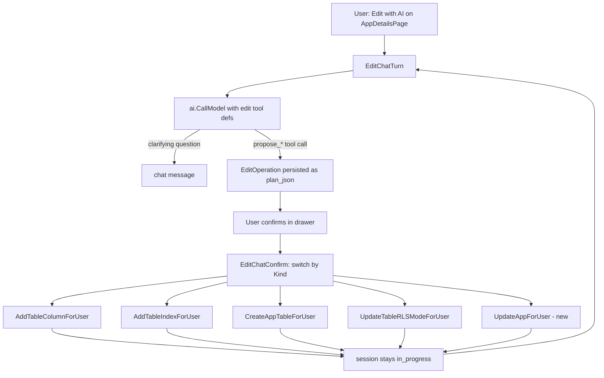

# AI Edit Chat Design

**Spec**: `.specs/features/ai-edit-chat/spec.md`
**Status**: Approved

---

## Architecture Overview

Same backbone as `ai-build-chat` (system prompt + persisted history → OpenAI function-calling → typed tool call → confirm → `*ForUser` handler), but the confirm step applies exactly one operation immediately instead of a batched multi-table plan, and the session is scoped to one existing app from creation instead of becoming an app only on confirm.



---

## Code Reuse Analysis

### Existing Components to Leverage

| Component | Location | How to Use |
| --- | --- | --- |
| `AddTableColumnForUser` | `internal/dashboard/handler.go:1455` | Called unchanged for `add_column` and `add_reference` (reference set via `col.References`) |
| `AddTableIndexForUser` | `internal/dashboard/handler.go:1531` | Called unchanged for `add_index` |
| `CreateAppTableForUser` | `internal/dashboard/handler.go` (existing) | Called unchanged for `add_table` |
| `UpdateTableRLSModeForUser` | `internal/dashboard/handler.go:1385` | Called unchanged for `set_rls_mode` |
| `ai.CallModel` / `ai.AppPlan` pattern | `internal/dashboard/ai/client.go` | Same OpenAI call shape, new tool defs and a new `EditOperation` result type alongside the existing `AppPlan` |
| `ai_build_sessions` store pattern (`GetOrCreateInProgressSession`, `AppendMessage`, `AbandonAndRestartSession`) | `internal/dashboard/ai_build_sessions_store.go` | Extended with `mode`/`target_app_id`, not replaced |
| Owner-scoped IDOR guard (`loadOwnedBuildChatSession`) | `internal/dashboard/ai_build_chat_handlers.go` | Same guard logic, parameterized by `mode` and reused for `loadOwnedEditChatSession` |
| `buildChatSystemPrompt` structural-constraints block | `internal/dashboard/ai_build_chat_handlers.go` | Same column-type/naming rules and off-topic guard, ported into a new `editChatSystemPrompt`, plus a note that schema already exists and must be read via `get_app_schema`, not guessed |
| MCP tool wiring pattern (`orbit_add_table_column`, `orbit_add_table_index`) | `internal/mcpserver/tools.go` | Same pattern applied to the new `orbit_update_app` tool |
| `mergeProviderConfig`-style RBAC gate (`HasPlatformPermission`/`CanWrite()`) | existing per-app RBAC | Every new/reused handler keeps its own existing RBAC check; no new authorization logic invented |

### Integration Points

| System | Integration Method |
| --- | --- |
| OpenAI Chat Completions | Same `ai.CallModel`, new `tools` array (6 `propose_*` schemas) passed only on the edit-chat code path |
| `ai_build_sessions` / `ai_build_messages` | Additive columns (`mode`, `target_app_id`); message rows unchanged shape, `plan_json` now sometimes holds a single `EditOperation` instead of an `AppPlan` |
| MCP server | New tool `orbit_update_app`, calling the new `UpdateAppForUser` — extends existing REST/MCP parity, no new pattern |

---

## Components

### `internal/dashboard/ai/client.go` (extended)

- **Purpose**: Add edit-mode tool schemas and a typed result for a single proposed operation.
- **Location**: `internal/dashboard/ai/client.go`
- **Interfaces**:
  - `EditOperation{Kind string, AddTable *PlanTable, AddColumn *PlanColumnOp, AddIndex *PlanIndexOp, AddReference *PlanReferenceOp, SetRLSMode *PlanRLSOp, ToggleAuth *PlanAuthOp}` — exactly one field populated, matching `Kind`
  - `editToolDefs() []toolDef` — the 6 `propose_*` schemas, separate from `toolDefs()` used by creation
  - `ChatTurnResult` gains an optional `EditOp *EditOperation` field (nil on the creation path)
- **Dependencies**: none new — same `net/http` OpenAI client
- **Reuses**: existing `CallModel`, existing `AppPlan`/`PlanTable`/`PlanColumn` types for the shapes that overlap (`add_table` reuses `PlanTable` as-is)

### `internal/dashboard/ai_edit_chat_handlers.go` (new file)

- **Purpose**: Edit-mode chat turn, confirm, session fetch, and restart — mirrors `ai_build_chat_handlers.go`'s structure without touching it.
- **Location**: `internal/dashboard/ai_edit_chat_handlers.go`
- **Interfaces**:
  - `EditChatTurn(ctx, user, appID, message) (*ChatTurnResponse, error)` — loads/creates the `mode=edit` session for `(user, appID)`, injects `editChatSystemPrompt` + current schema + history, calls the model
  - `EditChatConfirm(ctx, user, sessionID) (*EditChatConfirmResponse, error)` — loads the session's last persisted `EditOperation`, switches on `Kind`, calls exactly one handler, appends the result message, session stays `in_progress`
  - `GetEditChatSession(ctx, user, appID) (*EditChatSession, error)`
  - `RestartEditChatSession(ctx, user, appID) (*EditChatSession, error)`
- **Dependencies**: `ai_build_sessions_store.go` (extended), `ai.CallModel`, the reused/new `*ForUser` handlers
- **Reuses**: owner-scoping/IDOR-guard pattern, generic/specific error-surfacing pattern, audit origin `ai_chat`, all already established by `ai-build-chat`

### `internal/dashboard/handler.go` (extended)

- **Purpose**: New `UpdateAppForUser`, following the exact shape of the other `*ForUser` handlers.
- **Location**: `internal/dashboard/handler.go`
- **Interfaces**:
  - `UpdateAppForUser(ctx, user *DashboardUser, appID string, authEmailEnabled bool, origin, ip string) (*App, error)`
- **Dependencies**: existing `CanWrite()` RBAC check, existing store `UpdateApp`
- **Reuses**: store `UpdateApp` (`apps_store.go`) unchanged; audit logging pattern from sibling `*ForUser` handlers

### `internal/mcpserver/tools.go` (extended)

- **Purpose**: `orbit_update_app` tool, calling `UpdateAppForUser` — closes the REST/MCP parity gap this handler would otherwise introduce.
- **Location**: `internal/mcpserver/tools.go`
- **Reuses**: the same registration pattern as `orbit_add_table_column`/`orbit_add_table_index`

### `internal/dashboard/ui/src/components/patterns/EditWithAIDrawer.tsx` (new)

- **Purpose**: Chat UI scoped to one app, one-operation-at-a-time confirm affordance (not the "Proposed setup" card used for whole-app creation).
- **Location**: `internal/dashboard/ui/src/components/patterns/EditWithAIDrawer.tsx`
- **Dependencies**: new API calls in `src/lib/api.ts` (`editChatTurn`, `editChatConfirm`, `getEditChatSession`, `restartEditChatSession`)
- **Reuses**: `Textarea`, `Drawer`/sheet primitives, and the `sonner` toast-on-error pattern already used by `BuildWithAIDrawer`; kept as a separate component per the user's explicit call to isolate the two flows rather than generalize one drawer for both

### `internal/dashboard/ui/src/pages/AppDetailsPage.tsx` (extended)

- **Purpose**: New "Edit with AI" entry point, gated on the same `CanWrite()`-derived permission the manual edit form already checks.
- **Location**: `internal/dashboard/ui/src/pages/AppDetailsPage.tsx`

---

## Data Models

### `zeep_system.ai_build_sessions` (altered, additive)

```sql
-- provisioner.go convention: idempotent ADD COLUMN IF NOT EXISTS / CREATE INDEX IF NOT EXISTS,
-- appended to the existing stmts slice, same as family_id in dashboard_pats.
ALTER TABLE zeep_system.ai_build_sessions ADD COLUMN IF NOT EXISTS mode TEXT NOT NULL DEFAULT 'create';
ALTER TABLE zeep_system.ai_build_sessions ADD COLUMN IF NOT EXISTS target_app_id UUID REFERENCES zeep_system.apps(id);

-- one in_progress edit session per (owner_user_id, target_app_id):
CREATE UNIQUE INDEX IF NOT EXISTS ai_build_sessions_edit_in_progress_uidx
    ON zeep_system.ai_build_sessions (owner_user_id, target_app_id)
    WHERE mode = 'edit' AND status = 'in_progress';
```

`created_app_id` is untouched and stays `mode='create'`-only (populated on confirm, as today). For `mode='edit'`, `target_app_id` is populated at session creation, never null while `in_progress`.

### `EditOperation` (Go, `internal/dashboard/ai/client.go`)

```go
type PlanColumnOp struct {
    Table  string
    Column PlanColumn
}
type PlanIndexOp struct {
    Table   string
    Name    string
    Columns []string
    Unique  bool
}
type PlanReferenceOp struct {
    Table          string
    Column         PlanColumn
    RefTable       string
    RefColumn      string
    OnDelete       string
}
type PlanRLSOp struct {
    Table string
    Mode  string
}
type PlanAuthOp struct {
    EmailEnabled bool
}
type EditOperation struct {
    Kind         string // "add_table" | "add_column" | "add_index" | "add_reference" | "set_rls_mode" | "toggle_auth"
    AddTable     *PlanTable
    AddColumn    *PlanColumnOp
    AddIndex     *PlanIndexOp
    AddReference *PlanReferenceOp
    SetRLSMode   *PlanRLSOp
    ToggleAuth   *PlanAuthOp
}
```

**Relationships**: `EditOperation` is what a `mode='edit'` message's `plan_json` deserializes into; `AppPlan` (unchanged) is what a `mode='create'` message's `plan_json` deserializes into — the two never mix within one session.

---

## Error Handling Strategy

| Error Scenario | Handling | User Impact |
| --- | --- | --- |
| OpenAI call fails (network/API) | Same generic error path as `ai-build-chat` | Generic chat error, session stays `in_progress` |
| Proposed operation fails handler validation (duplicate column, bad identifier, disallowed type, invalid reference target) | Handler's specific error surfaced verbatim in chat, same `respondBuildChatConfirmError`-style deviation already accepted for creation | User sees the concrete reason, can ask the AI to retry with a fix |
| User lacks `CanWrite()` on the target app | 403 at every edit-chat endpoint, before any handler runs | Generic authorization error; button hidden client-side too |
| Confirm called with no pending operation (e.g. double-click, stale state) | Same idempotent-retry style guard as `BuildChatConfirm`'s re-check pattern — re-derive from the session's last persisted operation, no-op if already applied | No duplicate mutation |
| FK requested on a column that already exists | AI declines in chat before proposing anything (system-prompt instruction) — if it slips through anyway, `AddTableColumnForUser` itself already rejects existing-column names, surfacing that same validation error | Clear explanation, no partial state |

---

## Risks & Concerns

| Concern | Location (file:line) | Impact | Mitigation |
| --- | --- | --- | --- |
| `UpdateAppTable` full-replace metadata drift (found during investigation, pre-existing) | `internal/dashboard/handler.go:1289-1373`, `apps_store.go:642-685` | Not touched by this feature — edit-chat never calls `UpdateAppTable`, only the incremental `*ForUser` handlers, so this feature does not add to the drift risk. Documented here so a future feature touching `UpdateAppTable` doesn't rediscover it from scratch. | No mitigation needed in this design; out of scope, tracked as pre-existing debt |
| RLS/`owner_id` not retroactively applied when app auth is toggled on an app with existing tables (found during investigation) | `internal/dashboard/handler.go` `UpdateApp` (store-level, not the new `UpdateAppForUser`) | User toggling auth via edit-chat gets the exact same gap the manual dashboard already has today — existing tables stay unprotected until someone runs `set_rls_mode` per table | Explicitly out of scope per spec Assumptions; not fixed, not surfaced with a warning (user's explicit choice) |
| Git worktree base-branch hazard (AD-005) | n/a (process, not code) | If Execute uses isolated-worktree sub-agents, a stale/wrong base can silently reintroduce old release commits into `develop` | Apply AD-005's standing mitigation: verify worktree base against current `develop` tip before dispatch; diff release-tracked files before any fast-forward |

---

## Tech Decisions (only non-obvious ones)

| Decision | Choice | Rationale |
| --- | --- | --- |
| One `propose_*` tool per operation vs. one generic tool + `kind` field | One tool per operation | Keeps per-operation required-field validation in OpenAI's JSON schema instead of hand-written Go dispatch logic |
| `EditChatConfirm` as a new file/function vs. generalizing `BuildChatConfirm` | New, separate (`ai_edit_chat_handlers.go`) | Isolates the one-op-and-continue lifecycle from the batch-and-complete lifecycle; zero regression risk to the already-verified creation flow |
| Session model: extend `ai_build_sessions` vs. new `ai_edit_sessions` table | Extend additively | Reuses already-tested owner-scoping/IDOR-guard/restart logic; safe since the table hasn't reached production yet |
| `UpdateAppForUser` added despite being outside "only reuse what exists" | Added, following the identical established `*ForUser` pattern | User explicitly opted in, accepting the small new-backend-wiring cost for a complete edit story (P3) |
