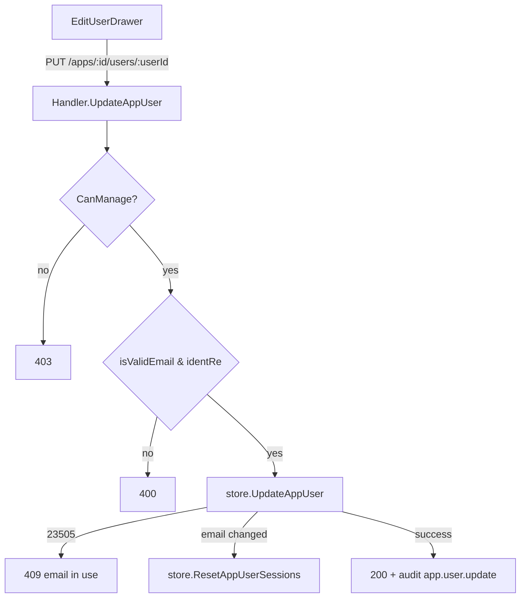

# App User Edit Fields Design

**Spec**: `.specs/features/app-user-edit-fields/spec.md`
**Status**: Approved

---

## Architecture Overview

Single vertical slice, no new architectural pattern — extends the existing app-user mutation family (`activate`/`deactivate`/`role`) with one more endpoint that folds `email`+`phone` into what was a role-only update.

---

## Code Reuse Analysis

### Existing Components to Leverage

| Component | Location | How to Use |
| --- | --- | --- |
| `isValidEmail` / `normalizeEmail` | `internal/dashboard/handler.go:64-71` | Call as-is on the submitted email before persisting |
| `identRe` | `internal/dashboard/handler.go` (existing pkg var) | Reuse unchanged for role validation |
| `ResetAppUserSessions` | `internal/dashboard/app_users_store.go:177-192` | Call from the new store function when email changed |
| `GetApp` + `role.CanManage()` | `internal/dashboard/handler.go` (pattern in `UpdateAppUserRole` etc.) | Copy the existing auth-check block verbatim |
| `h.decodeJSONBody` / `http.MaxBytesReader(w, r.Body, 4*1024)` | same pattern as `UpdateAppUserRole` (`handler.go:2414-2420`) | Reuse verbatim |
| `h.audit(...)` | existing helper | New action string `app.user.update` |
| `EditRoleDrawer` (React) | `AppUsersPage.tsx:52-112` | Rename to `EditUserDrawer`, add two `Input` fields using the existing `Label`/`Drawer*` primitives already imported |
| `useUpdateAppUserRole` hook | `internal/dashboard/ui/src/lib/api.ts` | Replace with `useUpdateAppUser`, same mutation-hook shape, new payload |

### Risks & Concerns

| Concern | Mitigation |
| --- | --- |
| Removing `/role` route + `UpdateAppUserRole` handler/store breaks any other caller | Grep confirmed the only caller is the dashboard frontend shipped in this same change (no SDK/docs reference the `/role` path); safe to remove outright per AGENTS.md's no-compat-shim rule |
| `email_confirmed_at` reset + session wipe on every email edit, even a case-only change (`Foo@x.com` → `foo@x.com`) | Compare post-`normalizeEmail` values, not raw strings, so a case-only "change" is a no-op (spec AC AUE-05 covers this) |
| New endpoint does 2 statements (UPDATE + conditional session delete) without a transaction | Acceptable: if the session delete fails after a successful UPDATE, the row is already correct and a retry of "reset sessions" is available via the existing standalone reset-sessions button; not worth wrapping in an explicit transaction for this scope |
| Frontend must send `phone` as `""` (not omitted) to clear it | Document as a comment at the call site; `EditUserDrawer`'s local state already defaults populated fields from `user.phone ?? ''`, so no code path naturally omits the key |

---

## Components and Interfaces

### Backend: `Handler.UpdateAppUser`

- **Location**: `internal/dashboard/handler.go`, placed where `UpdateAppUserRole` currently is (replaces it)
- **Route**: `PUT /dashboard/api/apps/{id}/users/{userId}` (replaces `PUT .../role`; update router registration accordingly)
- **Request body**: `{"email": string, "phone": string, "role": string}` — all three required keys (empty string allowed for `phone`)
- **Response**: `200 {"message": "user updated"}` / `400` / `403` / `404` / `409` (see spec AC AUE-07..11)
- **Depends on**: `GetApp`, `role.CanManage()`, `isValidEmail`, `normalizeEmail`, `identRe`, `store.UpdateAppUser`, `h.audit`

### Backend: `store.UpdateAppUser`

- **Location**: `internal/dashboard/app_users_store.go`, replaces `UpdateAppUserRole`
- **Signature**: `UpdateAppUser(ctx context.Context, pool *db.Pool, schema, userID, email, phone, role string) (emailChanged bool, err error)`
- Implementation: `SELECT email FROM _auth_users WHERE id = $1` first (needed to compare pre/post-normalization and to return `ErrNotFound` early); if the normalized new email differs, `UPDATE ... SET email=$1, phone=$2, role=$3, email_confirmed_at = NULL, updated_at = now() WHERE id = $4`, else same `UPDATE` without touching `email_confirmed_at`. On `pgconn.PgError.Code == "23505"` return a sentinel `ErrEmailConflict`. On 0 rows affected, `ErrNotFound`.
- Handler calls `ResetAppUserSessions` when `emailChanged` is true, after the update succeeds (best-effort per Risks table — log-and-continue if it errors, don't fail the whole request since the row update already committed).

### Frontend: `EditUserDrawer`

- **Location**: `AppUsersPage.tsx`, replaces `EditRoleDrawer`
- **State**: `email`, `phone`, `role` local state, initialized from `user.email`, `user.phone ?? ''`, `user.role`
- **Submit**: `useUpdateAppUser().mutate({ appId, userId: user.id, email, phone, role }, { onSuccess: onClose, onError: (e) => toast.error(e.message) })`
- Role `<Select>` unchanged from today; add two `<Input>` rows above it using the same `Label`/`flex flex-col gap-1.5` block already used for role

### Frontend: `useUpdateAppUser` (lib/api.ts)

- Replaces `useUpdateAppUserRole`; same `useMutation` shape, PUT to the new URL with the 3-field body

---

## Data Model

No schema change. Existing `_auth_users` columns (`internal/provisioner/auth.go:12-25`) already cover `email`, `phone`, `email_confirmed_at`; no migration needed.
