# column-enum-type Design

**Spec**: `.specs/features/column-enum-type/spec.md`
**Context**: `.specs/features/column-enum-type/context.md`
**Status**: Draft

---

## Architecture Overview

`enum` is not a new physical Postgres type. A column declared `type: "enum"` is provisioned as `TEXT` with a `CHECK ("col" IN ('v1', 'v2', ...))` constraint attached — same choice the spec already locked in (context.md, rejecting native `ENUM` for `ALTER TYPE` locking reasons). The feature has two independent code paths:

1. **Creation path** (P1 story 1) — `type: "enum"` flows through the exact same pipeline every other column type already uses: request validation (`config.ValidateTables`) → `columnDDL` → `CREATE TABLE` / `ALTER TABLE ... ADD COLUMN`. No new endpoints, no new provisioner entry points — just a new case in existing switches.
2. **Widen/narrow path** (P1 stories 2-3) — mutating `AllowedValues` on an *existing* enum column cannot flow through the generic table-update path (`PUT /tables/{id}`), for the same structural reason `References` changes on an existing column can't: `addMissingColumns`/`columnDDL` only ever run for columns that don't exist yet (`internal/provisioner/table.go:284-302`) — an existing column's DDL is never re-emitted. This is the exact bug class AD-007 already fixed once for foreign keys (silent no-op on `PUT /tables/{id}` because `ReferenceConfig` changes weren't actually re-applied). column-enum-type reuses that fix's pattern instead of reintroducing the bug: a **dedicated endpoint**, mirroring `AddColumnForeignKeyForUser`/`DropColumnForeignKeyForUser`.

```mermaid
graph TD
    subgraph "Creation (new table or new column)"
        A[Dashboard / MCP / AI chat] --> B["config.ValidateTables (+ validateEnumValues)"]
        B --> C["provisioner.columnDDL (CHECK inline)"]
        C --> D["CREATE TABLE / ALTER TABLE ADD COLUMN"]
    end

    subgraph "Widen / Narrow existing enum column"
        E[Dashboard action / MCP tool] --> F["UpdateColumnEnumValuesForUser"]
        F --> G["config.ValidateEnumValues (caps + Default-membership)"]
        G --> H["provisioner.ReplaceColumnEnumValues"]
        H --> I{removed values?}
        I -->|yes| J["COUNT(*) WHERE col = ANY(removed)"]
        J -->|count > 0| K["EnumValueInUseError (typed, no raw SQL)"]
        J -->|count = 0| L["catalog lookup: find current CHECK constraint"]
        I -->|no| L
        L --> M["single ALTER TABLE: DROP CONSTRAINT + ADD CONSTRAINT (atomic)"]
    end
```



---

## Approach Exploration

### Decision 1 — how to locate/replace the CHECK constraint on widen/narrow

Postgres has no `ALTER TABLE ... ALTER CONSTRAINT ... CHECK (...)`; changing the allowed set means dropping and re-adding the constraint. The question is how the code finds the constraint to drop.

| Approach | Trade-off |
| --- | --- |
| **A. Deterministic name** (e.g. `<column>_enum_check`, always assumed) | Simple, no lookup query. But column names may reach 63 bytes (`identRe`, `handler.go:93`) — Postgres identifiers are capped at 63 bytes too, so `<column>_enum_check` can silently truncate/collide. Also contradicts the codebase's own established rule: `AddColumnForeignKey`'s comment (`table.go:374-380`) explicitly rejects naming conventions for exactly this reason and mandates catalog lookup. |
| **B. Catalog lookup** (recommended) | Mirrors `DropColumnForeignKey` (`table.go:402-428`) exactly: query `information_schema.table_constraints` joined to `key_column_usage`, filtered to `constraint_type = 'CHECK'` and the target column, to get the constraint's real name — whatever Postgres actually assigned it, truncated or not. Zero naming-collision risk, and it's the same pattern already reviewed and shipped for FKs (AD-007). |
| **C. Own bookkeeping table** (track constraint names ourselves) | Duplicates what Postgres's catalog already gives for free — a new persistence surface with no benefit, more to keep in sync. |

**Recommendation: B.** Not just cheaper — it's the pattern this codebase has already committed to for the identical problem (locating a constraint that can't be assumed by name). Confirmed via **Decision 1** below.

### Decision 2 — where widen/narrow lives (endpoint shape)

| Approach | Trade-off |
| --- | --- |
| **A. Allow it through `PUT /tables/{id}` (full column replace)** | Cheapest to write, but reproduces the exact silent-no-op AD-007 fixed: the request would validate successfully (new `AllowedValues` looks fine) and "succeed" with `200 OK`, yet `applyColumnChanges` never touches an existing column's constraint — the client would believe the change applied when nothing happened in Postgres. |
| **B. Dedicated endpoint** (recommended) | Mirrors `AddColumnForeignKeyForUser`/`RemoveColumnForeignKeyForUser` (`handler.go:1682`, `:1760`) exactly: one Handler method, one REST route, one MCP tool, all doing the real DDL and returning a real error (`EnumValueInUseError`) instead of a silent 200. `PUT /tables/{id}` gets one more line in its existing `existingRefs`-style rejection block (`handler.go:1343-1356`) telling the caller to use the dedicated endpoint instead — same UX the FK case already has. |
| **C. Special-case the diff inside `PUT`'s handler and actually run the DDL there too** | Splits the same DDL-triggering logic across two call sites (`PUT` and a hypothetical dedicated route) for no reason — harder to keep both correct, no user-facing benefit over B. |

**Recommendation: B**, for the same reason B won Decision 1: it's not a new pattern, it's applying the one this codebase already adopted for the identical shape of problem.

*(Both decisions are feature-local implementation choices, not new project conventions — AD-007 already established "existing-column mutation needs a dedicated endpoint + catalog lookup" as the pattern. Nothing new goes into `.specs/STATE.md` Decisions.)*

---

## Code Reuse Analysis

### Existing Components to Leverage

| Component | Location | How to Use |
| --- | --- | --- |
| `columnDDL` | `internal/provisioner/table.go:72-95` | Add a branch: when `col.Type == "enum"`, append `CHECK ("col" IN (...))` after the `UNIQUE` clause, before `REFERENCES`. Same function already used by both `createTable` and `addMissingColumns` — one change covers both P1 AC1 and AC2. |
| `pgType` | `internal/provisioner/table.go:26-47` | Add `case "enum": return "TEXT"` (currently falls through to the `default: return "TEXT"` case already — making it explicit documents intent and avoids relying on the fallthrough). |
| Single-quote escaping for `Default` | `internal/provisioner/table.go:83` (`strings.ReplaceAll(col.Default, "'", "''")`) | Reuse verbatim for each `AllowedValues` entry when building the `CHECK (... IN (...))` clause — same escaping precedent context.md already points to. |
| `DropColumnForeignKey`'s catalog-lookup query shape | `internal/provisioner/table.go:402-428` | Copy the join shape (`table_constraints` + `key_column_usage`), swap `constraint_type = 'FOREIGN KEY'` for `'CHECK'`, to locate the current CHECK constraint on a column. |
| `ForeignKeyViolationError` pattern | `internal/provisioner/errors.go:44-58` | Template for the new `EnumValueInUseError` — safe `Error()` string, `Cause` for server-side-only logging via `Unwrap()`. |
| `AddColumnForeignKeyForUser` / `DropColumnForeignKeyForUser` skeleton | `internal/dashboard/handler.go:1682`, `:1760` | Template for `UpdateColumnEnumValuesForUser`: load app/role/table, validate, call provisioner, persist to store, audit, return `*AppTableRow`. |
| `existingRefs` rejection block in `UpdateAppTable` | `internal/dashboard/handler.go:1343-1356` | Extend with the same shape for `AllowedValues`: if an existing enum column's `AllowedValues` differs from what's stored, reject with 400 pointing at the new endpoint. |
| `validateDefault` | `internal/config/validate.go:74-123` | Add `case "enum":` checking `col.Default` is a member of `col.AllowedValues` (only runs when `col.Default != ""`, same early-return already in place). |
| `allowedTypes` map | `internal/dashboard/handler.go:96-98` | Add `"enum": true`. |
| MCP FK tool wiring (`orbit_add_column_foreign_key`) | `internal/mcpserver/tools.go` (search for `AddColumnForeignKeyForUser` call site) | Template for the new `orbit_update_column_enum_values` tool — same shape, different Handler method. |
| `TableCard.tsx` FK "edit" action pattern | `internal/dashboard/ui/src/components/TableCard.tsx` | Template for a small dedicated "edit allowed values" action on an existing enum column, instead of folding it into the generic save-all-columns form (which maps to the rejected `PUT` path). |

### Integration Points

| System | Integration Method |
| --- | --- |
| Postgres | `CHECK` constraint, `information_schema.table_constraints`/`key_column_usage` for catalog lookup, `COUNT(*) ... WHERE col = ANY($1) GROUP BY col` for the narrowing pre-check. |
| Dashboard REST API | One new route: `PATCH /dashboard/api/apps/{id}/tables/{tableId}/columns/{columnName}/enum-values`. |
| MCP | One new tool: `orbit_update_column_enum_values`. Two existing tools (`orbit_create_table`, `orbit_add_table_column`) gain `AllowedValues` for free since they already pass `config.ColumnConfig` straight through. |
| AI build/edit chat | Prompt text edit only (`ai_build_chat_handlers.go`, `ai_edit_chat_handlers.go`) — no new tool for widen/narrow via chat (out of scope per spec's P2 ACs: chat only needs to *propose* `enum` at column-creation time). |
| i18n | New strings in both `en.json` and `pt-BR.json` for the enum type option, allowed-values input, and the "edit allowed values" action. |

---

## Components

### `config.ColumnConfig` (extended)

- **Purpose**: Carry `AllowedValues` alongside the existing `Type` field.
- **Location**: `internal/config/types.go:49-63`
- **Change**: add `AllowedValues []string \`json:"allowed_values,omitempty" yaml:"allowed_values,omitempty"\`` — `omitempty` so every non-enum column's JSON/YAML is untouched.
- **Dependencies**: none new.
- **Reuses**: existing `ColumnConfig` struct shape (same pattern as `References *ReferenceConfig`).

### `config.ValidateEnumValues` (new, exported)

- **Purpose**: Single source of truth for the caps from context.md — 1-50 values, each 1-100 chars, no exact-match duplicates. Exported so both `ValidateTables` (creation path) and the new dedicated Handler method (widen/narrow path) call the identical check — no drift between the two surfaces.
- **Location**: `internal/config/validate.go` (new function, near `validateDefault`)
- **Interfaces**:
  - `ValidateEnumValues(values []string) error` — returns a specific error identifying which rule failed (empty list, too many, empty entry, entry too long, duplicate entry) and, where relevant, the offending value.
- **Dependencies**: none.
- **Reuses**: called from `ValidateTables`'s per-column loop (creation path, alongside `validateDefault`) and from `UpdateColumnEnumValuesForUser` (widen/narrow path, before touching Postgres).

### `validateDefault` (extended)

- **Purpose**: Reject an `enum` column whose `Default` isn't a member of its own `AllowedValues` (CENUM-05).
- **Location**: `internal/config/validate.go:74-123`
- **Change**: new `case "enum":` in the type switch — membership check against `col.AllowedValues`, same error-message shape as the other type cases.

### `columnDDL` (extended)

- **Purpose**: Emit the `CHECK` clause for an `enum` column at creation time (covers both `CREATE TABLE` and `ALTER TABLE ADD COLUMN`, since both call this function).
- **Location**: `internal/provisioner/table.go:72-95`
- **Change**: after the existing `UNIQUE` block, `if col.Type == "enum" { sb.WriteString(fmt.Sprintf(" CHECK (%q IN (%s))", col.Name, quotedList(col.AllowedValues))) }` where `quotedList` is a small new helper reusing the same escaping as `Default`.
- **Reuses**: `Default`'s single-quote escaping precedent.

### `provisioner.ReplaceColumnEnumValues` (new)

- **Purpose**: The whole widen/narrow operation — pre-check, catalog lookup, atomic constraint swap.
- **Location**: `internal/provisioner/table.go` (new function, near `AddColumnForeignKey`/`DropColumnForeignKey`)
- **Interfaces**:
  - `ReplaceColumnEnumValues(ctx context.Context, schemaName, tableName, columnName string, oldValues, newValues []string) error`
  - Behavior: computes `removed := oldValues - newValues` (set difference). If `removed` is non-empty, runs `SELECT "col", COUNT(*) FROM schema.table WHERE "col" = ANY($1) GROUP BY "col"` scoped to `removed` only (per spec's edge case — never an unscoped full-table scan). Any row with `count > 0` aborts before touching the constraint, returning `*EnumValueInUseError` naming every offending value and its count (not just the first one found). If the pre-check passes (or there was nothing to remove — pure widen), looks up the current CHECK constraint's real name via the catalog query (Decision 1), then runs one `ALTER TABLE %q.%q DROP CONSTRAINT %q, ADD CONSTRAINT CHECK (%q IN (%s))` statement — single DDL statement, so Postgres either applies both clauses or neither (CENUM-12's "never partially migrated" requirement, satisfied by relying on single-statement atomicity rather than hand-rolled transaction bookkeeping).
- **Dependencies**: `p.pool` (existing).
- **Reuses**: `DropColumnForeignKey`'s catalog-lookup query shape; `Default`'s escaping.

### `provisioner.EnumValueInUseError` (new)

- **Purpose**: Typed, safe-to-expose error for a rejected narrowing (CENUM-10).
- **Location**: `internal/provisioner/errors.go` (new type, next to `ForeignKeyViolationError`)
- **Interfaces**:
  - `type EnumValueInUseError struct { Column string; Counts map[string]int; Cause error }`
  - `Error() string` — e.g. `cannot remove value(s) from "status": "closed" is used by 1 row(s)` (join multiple offending values if more than one).
  - `Unwrap() error` — returns `Cause` for server-side logging only, per `ForeignKeyViolationError`'s precedent.

### `Handler.UpdateColumnEnumValuesForUser` (new)

- **Purpose**: The auth-checked, store-persisting orchestration behind both the REST route and the MCP tool — same role `AddColumnForeignKeyForUser` plays for FKs.
- **Location**: `internal/dashboard/handler.go` (new method, near `AddColumnForeignKeyForUser`)
- **Interfaces**:
  - `UpdateColumnEnumValuesForUser(ctx context.Context, user *DashboardUser, appID, tableName, columnName string, newValues []string, ip string) (*AppTableRow, error)`
  - Flow: `GetApp` + `role.CanWrite()` check → find table/column, `404` if missing, `400` if the column's `Type != "enum"` → `config.ValidateEnumValues(newValues)` → if the column has a non-empty `Default`, re-check it's still in `newValues` (a narrow that drops the column's own default is exactly as broken as CENUM-05's creation-time check, just discovered later) → `p.prov.ReplaceColumnEnumValues(...)`, mapping `*provisioner.EnumValueInUseError` to a `400` with its own safe `Error()` text (same pattern `UpdateAppTable` already uses for `*TypeChangeError`, `handler.go:1370-1375`) → persist `newValues` into the stored column config → audit (`app.table.column.enum_values.update`) → return refreshed `*AppTableRow`.
- **Dependencies**: `h.pool`, `h.prov`, `h.reg` (registry refresh, same as `UpdateAppTable`).
- **Reuses**: `AddColumnForeignKeyForUser`'s structure; `UpdateAppTable`'s typed-error-to-400 mapping idiom.

### `UpdateAppTable` (extended)

- **Purpose**: Close the same silent-no-op door AD-007 closed for `References`, now for `AllowedValues`.
- **Location**: `internal/dashboard/handler.go:1343-1356`
- **Change**: alongside the existing `existingRefs` map/loop, build an `existingEnumValues map[string][]string` and reject (400, "enum value changes on an existing column must go through the dedicated endpoint") if an existing enum column's `AllowedValues` in the request body differs from what's stored — comparison is a simple set-equality helper, not `ReferenceConfig.Equal` (different shape) but the same idea.

### `server.HandleCreate` / `server.HandleUpdate` (extended)

- **Purpose**: Map a Postgres `23514` (`check_violation`) error on an app-table row write to a safe, non-leaking `400`, satisfying CENUM-03. Confirmed by reading the code that neither handler has any `pgconn.PgError`-code branching today — every write failure currently falls through to a generic `500 failed to insert/update row`, which is both the wrong status (a check violation is caller error, not server error) and would otherwise leak nothing useful to fix it.
- **Location**: `internal/server/handler.go:145-198` (`HandleCreate`), `:250-303` (`HandleUpdate`)
- **Change**: add `var pgErr *pgconn.PgError; if errors.As(err, &pgErr) && pgErr.Code == "23514"` before the existing generic-error fallthrough, returning `400` with a message built from `pgErr.ColumnName`/`pgErr.ConstraintName` (never `pgErr.Message`/`pgErr.Detail` raw — those can echo back attempted values or internal naming).
- **Reuses**: `ForeignKeyViolationError`'s "typed error carries safe text, `Cause` carries the raw error for server-side logging" shape, adapted inline here rather than as a new provisioner type (this error originates at the row-write path, not inside the provisioner).

### MCP: `orbit_update_column_enum_values` (new tool)

- **Purpose**: Expose widen/narrow to MCP callers.
- **Location**: `internal/mcpserver/tools.go` (new tool registration, near `orbit_add_column_foreign_key`/`orbit_remove_column_foreign_key`)
- **Interfaces**: input `{app_id, table_name, column_name, allowed_values []string}` → calls `deps.DashH.UpdateColumnEnumValuesForUser`.
- **Reuses**: existing tool-registration boilerplate (`mcp.NewTool(...)`), same call-site shape as the FK tools.

### `TableCard.tsx` (extended)

- **Purpose**: Let a client pick `enum` and enter its values from the Dashboard.
- **Location**: `internal/dashboard/ui/src/components/TableCard.tsx`
- **Changes**:
  - `COLUMN_TYPES` (line 20-28): add `"enum"`.
  - When `type === "enum"` in the *new-column* form: render a values-list input (add/remove chips, backed by a `string[]` bound to the column draft's `allowed_values`) — client-side mirrors the same 1-50/1-100/no-dup caps for immediate feedback, server still re-validates via `ValidateEnumValues`.
  - On an *existing* enum column: `AllowedValues` is **not** editable inline in the generic column-edit form (that form's save goes through `PUT /tables/{id}`, which now rejects the change per the `UpdateAppTable` extension above). Instead, a small dedicated action — "Edit allowed values" — opens a focused editor that calls the new `PATCH .../enum-values` endpoint directly, mirroring how FK add/remove is already its own action rather than a field in the generic form.
- **Reuses**: existing `FormDrawer`/`ConfirmDialog` patterns already used for the FK edit actions in this same file.

### i18n

- **Purpose**: All new user-facing strings added to both locales in the same change (AGENTS.md §5).
- **Location**: `internal/dashboard/ui/src/locales/en.json`, `.../pt-BR.json`
- **New keys** (indicative, final naming decided during Execute): `columnType.enum`, `column.allowedValues.label`, `column.allowedValues.addValue`, `column.allowedValues.edit`, `column.allowedValues.editOnlyDedicated` (explains why an existing column's values aren't inline-editable), `errors.enumValueInUse`.

### AI prompts (`ai_build_chat_handlers.go`, `ai_edit_chat_handlers.go`)

- **Purpose**: Stop forbidding `enum`, tell the model when to use it (CENUM-15).
- **Location**: `ai_build_chat_handlers.go:48`, `ai_edit_chat_handlers.go:587` (the "Column types — use ONLY these..." sentence in both system prompts)
- **Change**: replace `text, integer, bigint, numeric, boolean, uuid, timestamptz, jsonb. Never propose a type outside this list (no "string", "varchar", "date", "float", "enum", etc. ...)` with the same list **plus** `enum` (drop it from the parenthetical "never propose" examples), and add one sentence: *"Use `enum` for a status-like field with a small, fixed set of values (e.g. order status, request state) — provide the values as `allowed_values`; don't use `enum` for open-ended text."* The tool schema the model calls to propose a column (`propose_app_plan`'s table/column shape in build chat; `propose_add_column` in edit chat) needs `allowed_values` wired through the same way `references` already is, since both prompts already handle FK proposals identically.

---

## Data Models

```go
// internal/config/types.go — ColumnConfig, extended
type ColumnConfig struct {
    Name                string
    Type                string // now includes "enum"
    Required            bool
    Default             string
    DefaultIsExpression bool
    Unique              bool
    RenameFrom          string
    References          *ReferenceConfig
    AllowedValues       []string `json:"allowed_values,omitempty" yaml:"allowed_values,omitempty"` // required, non-empty, only meaningful when Type == "enum"
}
```

**Relationships**: `AllowedValues` has no relationship to `References` — a column cannot be both `enum` and a foreign key (not explicitly forbidden by this design since no real use case needs it, but also not a case anyone requested; `ValidateEnumValues` does not need to reject `References != nil` — left as an unenforced combination with no defined behavior if someone tries it, same as several other type/flag combinations already unenforced in this config today).

---

## Error Handling Strategy

| Error Scenario | Handling | User Impact |
| --- | --- | --- |
| `type: "enum"` with empty/duplicate/too-long/too-many `AllowedValues` | `config.ValidateEnumValues` rejects at request-validation time, before any DDL | `400` with a specific message naming the rule violated (empty / duplicate / too long / too many) |
| `Default` not a member of `AllowedValues` (creation) | `validateDefault`'s new `case "enum"` | `400`, same shape as every other type's default-mismatch error |
| Write with an out-of-set value | Postgres `CHECK` violation (code `23514`) | **New** mapping required — confirmed by reading `internal/server/handler.go`. `HandleCreate` (line ~145-198) and `HandleUpdate` (line ~250-303) currently have **no** `pgconn.PgError`-code branching at all: any `Exec`/insert/update failure (constraint violation or otherwise) falls through to a generic `writeError(w, http.StatusInternalServerError, "failed to insert row")` / `"failed to update row"` — wrong status code (500, not 400) and no indication of which value/column was the problem. This feature must add an explicit `errors.As(err, &pgErr) && pgErr.Code == "23514"` branch in both handlers, returning `400` with a safe message (e.g. `"value not allowed for column %q"`, from `pgErr.ColumnName`/constraint name — never `pgErr.Message` raw) rather than 500. |
| Narrowing removes a value still in use | `*EnumValueInUseError` from `ReplaceColumnEnumValues` | `400` naming the value(s) and row count(s), no raw Postgres text |
| `AllowedValues` change submitted via `PUT /tables/{id}` on an existing enum column | `UpdateAppTable`'s extended rejection block | `400` telling the caller to use the dedicated endpoint (same UX as the existing FK case) |
| `orbit_update_column_enum_values` / `PATCH .../enum-values` targets a non-enum column | `UpdateColumnEnumValuesForUser`'s type check | `400`, "column is not an enum column" |


---

## Risks & Concerns

| Concern | Location (file:line) | Impact | Mitigation |
| --- | --- | --- | --- |
| Postgres identifier length limit (63 bytes) could truncate/collide a `<column>_enum_check`-style deterministic constraint name for long column names | `internal/dashboard/handler.go:93` (`identRe` allows up to 63-char column names) | A deterministic-name approach (rejected Decision 1 option A) could silently target/replace the wrong constraint | Design uses catalog lookup (Decision 1, option B) instead of any assumed name — this risk doesn't materialize in the chosen approach |
| Unknown whether the app-table row write path (INSERT/UPDATE) has any existing generic-constraint-to-typed-error mapping | write path not read during this Design pass | CENUM-03 could require either extending an existing mapping or building one from scratch — different task sizes | Flagged above in Error Handling Strategy; first Execute task for this AC should start by reading that path before writing any code |
| `AllowedValues` values are free text with no length-sum cap on the generated `CHECK (col IN (...))` clause beyond the per-value 100-char / 50-value caps | `internal/provisioner/table.go:72` (`columnDDL`) | Worst case ~5KB `CHECK` clause (50 × 100 chars) — trivial for Postgres, not a real performance concern | No mitigation needed; caps already sized generously per context.md's own reasoning |
| Narrowing pre-check (`COUNT(*) ... WHERE col = ANY($1)`) has no index guarantee on `col` | new `ReplaceColumnEnumValues` query | On a very large table, this could be a full sequential scan | Acceptable per spec's edge case (explicitly flagged there as "implementation detail for Design, not a new product behavior") — the query is already scoped to `removed` values only (not comparing against the full new/old set), which is the actual mitigation the spec asked for; no index is required by this feature |

---

## Tech Decisions (only non-obvious ones)

| Decision | Choice | Rationale |
| --- | --- | --- |
| Constraint identification on widen/narrow | Catalog lookup, not deterministic naming | Matches the already-established FK pattern (AD-007); avoids the 63-byte identifier collision risk a deterministic name would carry |
| Widen/narrow surface | Dedicated endpoint (REST + MCP), not folded into `PUT /tables/{id}` | Reuses the exact fix pattern AD-007 already applied to the identical "existing-column mutation invisible to the generic add-only path" problem — not a new convention, an application of an existing one |
| Constraint swap atomicity | Single `ALTER TABLE` statement with both `DROP CONSTRAINT` and `ADD CONSTRAINT` clauses | Postgres executes a single DDL statement atomically — no explicit transaction bookkeeping needed to satisfy CENUM-12's "never partially migrated" requirement |
| `ValidateEnumValues` exported from `config` | Yes, shared by both the creation path and the widen/narrow path | Avoids the two surfaces drifting on caps (50 values / 100 chars / no-dup) the way two independently-written checks eventually would |

---

## Tips (from template — not part of the design itself)

N/A — this section intentionally left without content; see the SKILL.md template's own tips for process guidance.
