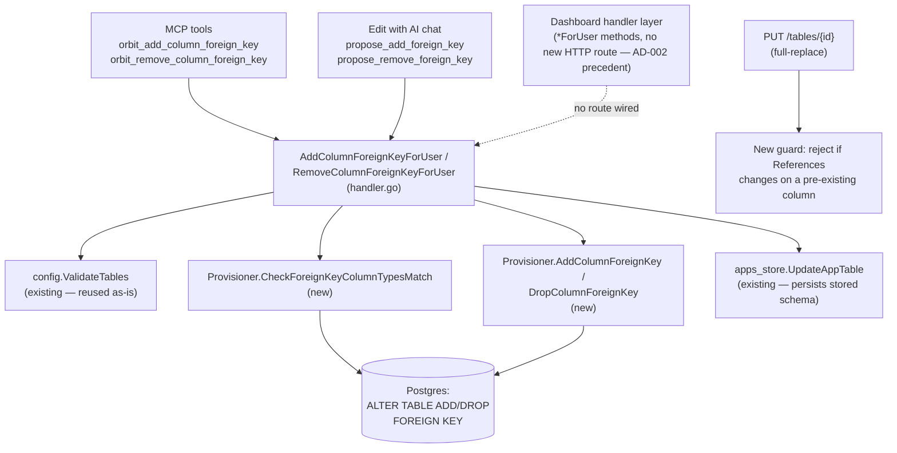

# Add/Remove Foreign Key on an Existing Column Design

**Spec**: `.specs/features/column-foreign-key/spec.md`
**Status**: Draft

---

## Architecture Overview

Two new `*ForUser` handler methods (`AddColumnForeignKeyForUser`, `RemoveColumnForeignKeyForUser`) join the existing `AddTableColumnForUser`/`AddTableIndexForUser` family in `internal/dashboard/handler.go`, following their exact fetch → mutate-one-field → validate → apply(DDL) → persist → refresh registry → audit shape. They call two brand-new `internal/provisioner` functions that run the actual `ALTER TABLE` DDL — this is the one genuinely new mechanism, since the existing `Provisioner.Apply` reconciliation path (`addMissingColumns`) only ever adds *missing* columns and silently skips any column that already exists, which is exactly the bug this feature closes.



---

## Code Reuse Analysis

### Existing Components to Leverage

| Component | Location | How to Use |
| --- | --- | --- |
| `AddTableColumnForUser`/`AddTableIndexForUser` shape | `internal/dashboard/handler.go:1492-1626` | Copy the fetch→mutate→validate→apply→persist→audit skeleton verbatim for the two new functions. |
| `config.ValidateTables` (via `validateTableInput`) | `internal/dashboard/handler.go:127-171`, `internal/config/validate.go:38-56,135-186` | Already validates a `References` value fully (target existence, `on_delete`, `_auth_users` uuid rule, reference cycles) — reused unmodified by mutating the target column's `References` in a copy of the table's columns and calling `validateTableInput` exactly as `AddTableColumnForUser` does. |
| `fetchExistingColumns` (`map[column]udt_name`) | `internal/provisioner/table.go:320-340` | Already returns the *real* physical Postgres type per column — exactly what the new type-compatibility check needs. Called twice (source table, target table) inside the new `CheckForeignKeyColumnTypesMatch`. |
| `TypeChangeError` pattern (safe-to-expose struct error, `Cause` for logging) | `internal/provisioner/errors.go` | Template for the new `ForeignKeyViolationError`. |
| `checkDependents`'s catalog-join query style | `internal/provisioner/table.go:213-236` | Template for the new constraint-lookup query in `DropColumnForeignKey` (same three-way `information_schema` join, different filter direction). |
| `respondEditChatConfirmError` / `mapWriteError` dispatch pattern | `internal/dashboard/ai_edit_chat_handlers.go:420-439`, `internal/mcpserver/tools.go:175-...` | Both already switch on sentinel errors and `errors.As` for struct errors (`ValidationError`, `TypeChangeError`) — the two new sentinel errors and `ForeignKeyViolationError` slot into the same `case` chains. |
| `ReferenceConfig` | `internal/config/types.go:65-73` | Reused as-is as the add-operation's input shape (`Table`, `Column`, `OnDelete`) — no new config type needed. |
| `editChatSystemPromptFor` / `editToolDefs` / `parseEditOperation` / `applyEditOperation` | `internal/dashboard/ai_edit_chat_handlers.go`, `internal/dashboard/ai/client.go` | Extended with two more `propose_*` entries — same shape as the existing 6, not a new mechanism. |
| `orbit_add_table_column`/`orbit_add_table_index` MCP registration pattern | `internal/mcpserver/tools.go:315-335` | Copied verbatim for the two new MCP tools. |

### Integration Points

| System | Integration Method |
| --- | --- |
| Postgres (DDL) | Two new `Provisioner` methods run `ALTER TABLE ... ADD FOREIGN KEY` / `ALTER TABLE ... DROP CONSTRAINT` directly — bypassing `Provisioner.Apply`'s reconciliation loop entirely, since that loop is structurally add-only for columns (see Risks & Concerns). |
| `app_tables` (stored schema) | Same `apps_store.UpdateAppTable` full-array-overwrite call every sibling handler already uses — no new persistence code. |
| Audit log | Same `h.audit(...)` call every sibling handler already uses, two new action strings (`app.table_column.add_foreign_key`, `app.table_column.remove_foreign_key`). |
| MCP server | Two new tools registered in `registerAppConfigWriteTools` (`internal/mcpserver/tools.go`), same `CanWrite()` tier as `orbit_add_table_column`. |
| Edit-with-AI chat | Two new `propose_*` tool defs, two new `EditOperation.Kind` values, one prompt-text change (removing the current "decline" instruction). |

---

## Components

### `provisioner.AddColumnForeignKey`

- **Purpose**: Run the actual `ALTER TABLE ... ADD FOREIGN KEY` DDL for one already-existing column, translating a Postgres FK-violation (orphaned rows) into a typed, safe-to-expose error.
- **Location**: `internal/provisioner/table.go` (new function, alongside `addMissingColumns`/`applyColumnChanges`)
- **Interfaces**:
  - `func (p *Provisioner) AddColumnForeignKey(ctx context.Context, schemaName, tableName, columnName string, ref config.ReferenceConfig) error` — runs `ALTER TABLE %q.%q ADD FOREIGN KEY (%q) REFERENCES %q.%q(%q) ON DELETE %s` (constraint left unnamed so Postgres applies its own `<table>_<column>_fkey` convention — identical naming to a column created with an inline `REFERENCES` clause, so a FK's origin, added-at-creation vs added-later, is never distinguishable by name). Returns `*ForeignKeyViolationError` when the underlying Postgres error code is `23503`.
- **Dependencies**: `onDeleteSQL` (existing, `table.go:50-61`)
- **Reuses**: The `columnDDL`/`onDeleteSQL` DDL-fragment style already established in this file.

### `provisioner.DropColumnForeignKey`

- **Purpose**: Locate the real FK constraint on a column via the Postgres catalog (never assume a naming convention) and drop it.
- **Location**: `internal/provisioner/table.go`
- **Interfaces**:
  - `func (p *Provisioner) DropColumnForeignKey(ctx context.Context, schemaName, tableName, columnName string) (found bool, err error)` — `found=false, err=nil` means no FK constraint exists on that column in Postgres right now (the caller treats this as the Edge Case "stale stored schema" convergence case, not an error).
- **Dependencies**: none beyond `p.pool`
- **Reuses**: The three-table `information_schema` join style already established in `checkDependents` (`table.go:213-236`), with the join direction flipped (`tc.table_name = tableName` instead of `ccu.table_name = tableName`) and an added `kcu.column_name = columnName` filter.

### `provisioner.CheckForeignKeyColumnTypesMatch`

- **Purpose**: Compare the *real* physical Postgres type of the existing column against the *real* physical type of the target column, before any DDL runs — closes the type-compatibility gap `validateReference` leaves open for the general (non-`_auth_users`) case.
- **Location**: `internal/provisioner/table.go`
- **Interfaces**:
  - `func (p *Provisioner) CheckForeignKeyColumnTypesMatch(ctx context.Context, schemaName, tableName, columnName, refTableName, refColumnName string) error` — `nil` if compatible; otherwise a plain `fmt.Errorf` naming both real types (wrapped by the caller into `*dashboard.ValidationError`, matching the existing convention where `provisioner`-originated validation text becomes a 400 through the handler, never a struct type of its own — no new error type needed here since, unlike the FK-violation case, this check runs *before* any DDL and never touches a `pgconn.PgError`).
- **Dependencies**: `fetchExistingColumns` (existing, unexported, already in this file — called twice, once for `tableName`, once for `refTableName`, including the `_auth_users` case since it's a real physical table in the same schema).
- **Reuses**: `fetchExistingColumns` verbatim, no new SQL.

### `ForeignKeyViolationError`

- **Purpose**: A safe-to-expose, typed error for the one Postgres runtime failure this feature can hit (`23503`, orphaned rows), carrying the constraint-violation detail the user decision (spec Assumptions) says to expose.
- **Location**: `internal/provisioner/errors.go` (alongside `TypeChangeError`)
- **Interfaces**:
  - `type ForeignKeyViolationError struct { Column string; Detail string; Cause error }`
  - `func (e *ForeignKeyViolationError) Error() string` → `fmt.Sprintf("cannot add foreign key on %q: existing data violates it (%s)", e.Column, e.Detail)`
  - `func (e *ForeignKeyViolationError) Unwrap() error { return e.Cause }`
- **Dependencies**: none
- **Reuses**: `TypeChangeError`'s exact shape (public `Error()`, `Cause` for logging via `Unwrap`).

### `Handler.AddColumnForeignKeyForUser`

- **Purpose**: The shared operation behind the MCP tool and the chat's `propose_add_foreign_key` confirm step — adds a foreign key to an existing column.
- **Location**: `internal/dashboard/handler.go` (new function, placed after `AddTableIndexForUser`)
- **Interfaces**:
  - `func (h *Handler) AddColumnForeignKeyForUser(ctx context.Context, user *DashboardUser, appID, tableName, columnName string, ref config.ReferenceConfig, ip string) (*AppTableRow, error)`
- **Dependencies**: `GetApp`, `findAppTableByName`, `validateTableInput`, `h.prov.CheckForeignKeyColumnTypesMatch`, `h.prov.AddColumnForeignKey`, `UpdateAppTable` (store), `h.reg.Register`, `h.audit`
- **Reuses**: `AddTableColumnForUser`'s exact control flow shape (see Data Models below for the field-level diff)

### `Handler.RemoveColumnForeignKeyForUser`

- **Purpose**: The shared operation behind the MCP tool and the chat's `propose_remove_foreign_key` confirm step — removes a foreign key from an existing column without touching the column itself.
- **Location**: `internal/dashboard/handler.go` (new function, placed immediately after `AddColumnForeignKeyForUser`)
- **Interfaces**:
  - `func (h *Handler) RemoveColumnForeignKeyForUser(ctx context.Context, user *DashboardUser, appID, tableName, columnName string, ip string) (*AppTableRow, error)`
- **Dependencies**: `GetApp`, `findAppTableByName`, `h.prov.DropColumnForeignKey`, `UpdateAppTable` (store), `h.reg.Register`, `h.audit`
- **Reuses**: Same skeleton, minus the pre-DDL validation step (nothing to validate when removing).

### `UpdateAppTable` full-replace guard (modified, not new)

- **Purpose**: Close the silent-no-op gap — reject a `PUT /tables/{id}` request outright if it would change `References` on a column that already exists, instead of accepting it, "applying" it, and persisting a lie.
- **Location**: `internal/dashboard/handler.go:1290-1374` (insert right after `decodeJSONBody`, before `validateTableInput` — line ~1332)
- **Interfaces**: no new exported interface — an inline check inside the existing handler.
- **Dependencies**: new `config.ReferenceConfig.Equal` helper (see Data Models)
- **Reuses**: `existingTable.Columns` (already fetched by this handler) as the "before" side of the comparison.

### MCP tools (2 new)

- **Purpose**: Expose both operations to MCP-calling agents.
- **Location**: `internal/mcpserver/tools.go`, inside `registerAppConfigWriteTools` (alongside `orbit_add_table_column`/`orbit_add_table_index`)
- **Interfaces**:
  - `orbit_add_column_foreign_key` — input `{app_id, table_name, column_name, references: config.ReferenceConfig}`
  - `orbit_remove_column_foreign_key` — input `{app_id, table_name, column_name}`
- **Dependencies**: `deps.DashH.AddColumnForeignKeyForUser`/`RemoveColumnForeignKeyForUser`, `mapWriteError`
- **Reuses**: `orbit_add_table_column`'s exact registration shape.

### Edit-with-AI chat additions (no new component, existing ones extended)

- **`ai.PlanForeignKeyOp`** (new type, `internal/dashboard/ai/client.go`): `{Table, Column, RefTable, RefColumn, OnDelete string}` — `propose_add_foreign_key`'s parsed arguments.
- **`ai.PlanRemoveForeignKeyOp`** (new type, same file): `{Table, Column string}` — `propose_remove_foreign_key`'s parsed arguments.
- **`ai.EditOperation`** gains `AddForeignKey *PlanForeignKeyOp` / `RemoveForeignKey *PlanRemoveForeignKeyOp` fields and two new `Kind` values.
- **`parseEditOperation`**, **`editProposalToolNames`**, **`editToolDefs`**: each gains two matching entries, same shape as the existing 6.
- **`editChatSystemPromptFor`**: the current sentence "If the user asks to add a foreign key to a column that already exists, decline..." (`propose_add_reference`'s description and the prompt body) is replaced with routing guidance: new column → `propose_add_reference`; existing column, adding → `propose_add_foreign_key`; existing column, removing → `propose_remove_foreign_key`.
- **`applyEditOperation`** (`ai_edit_chat_handlers.go`): two new `case` branches calling the two new `*ForUser` handlers with `ip="ai_chat"`.
- **`respondEditChatConfirmError`**: two new `errors.Is` cases (the new sentinels) plus one new `errors.As` case (`*provisioner.ForeignKeyViolationError` → 400, `Error()` verbatim — already includes the Postgres detail per the spec's decision).

---

## Data Models

### `config.ReferenceConfig` (existing — reused unmodified as the add-operation's input)

```go
type ReferenceConfig struct {
    Table    string
    Column   string
    OnDelete string // cascade|restrict|set_null|no_action, empty = no_action
}
```

**New method** (`internal/config/types.go`), needed by the full-replace guard to compare old vs. new nil-safely:

```go
// Equal reports whether two References values (either may be nil) describe
// the same foreign key. Used only to detect a References *change* on an
// already-existing column — never to validate a reference's correctness.
func (r *ReferenceConfig) Equal(other *ReferenceConfig) bool {
    if r == nil || other == nil {
        return r == other // both nil is equal; exactly one nil is not
    }
    return r.Table == other.Table && r.Column == other.Column && r.OnDelete == other.OnDelete
}
```

**Relationships**: Unchanged — still a single optional pointer field on `ColumnConfig`, one FK per column (Out of Scope: composite/multiple FKs).

### `ai.EditOperation` (existing, extended)

```go
type EditOperation struct {
    Kind             string // + "add_foreign_key" | "remove_foreign_key"
    // ...existing fields unchanged...
    AddForeignKey    *PlanForeignKeyOp       `json:"add_foreign_key,omitempty"`
    RemoveForeignKey *PlanRemoveForeignKeyOp `json:"remove_foreign_key,omitempty"`
}

type PlanForeignKeyOp struct {
    Table     string `json:"table"`
    Column    string `json:"column"`
    RefTable  string `json:"ref_table"`
    RefColumn string `json:"ref_column"`
    OnDelete  string `json:"on_delete,omitempty"`
}

type PlanRemoveForeignKeyOp struct {
    Table  string `json:"table"`
    Column string `json:"column"`
}
```

**Relationships**: Same "exactly one non-nil field besides `Kind`" invariant every existing `EditOperation` already holds.

---

## Error Handling Strategy

| Error Scenario | Handling | User Impact |
| --- | --- | --- |
| Column already has a `References` (add) | New sentinel `ErrColumnAlreadyHasReference`, checked in `AddColumnForeignKeyForUser` before any validation/DDL | HTTP 400 (REST/MCP) or chat message: "column already has a foreign key — remove it first" |
| Column has no `References` (remove) | New sentinel `ErrColumnHasNoReference` | HTTP 400 / chat message: "column has no foreign key to remove" |
| Target table/column invalid, bad `on_delete`, `_auth_users` type rule, reference cycle | Existing `config.ValidateTables` (via `validateTableInput`), wrapped in `*ValidationError` exactly like `AddTableColumnForUser` already does | HTTP 400 with the existing specific message (unchanged behavior, just a new caller) |
| Real column type ≠ real target-column type | New `Provisioner.CheckForeignKeyColumnTypesMatch`, wrapped in `*ValidationError` by the handler | HTTP 400 naming both real Postgres types |
| Orphaned rows violate the new constraint (Postgres `23503`) | New `*provisioner.ForeignKeyViolationError`, caught inside `AddColumnForeignKey`, `errors.As` in `respondEditChatConfirmError`/REST error mapping | HTTP 400 with Postgres's own violation detail (per spec's user-confirmed decision) |
| Caller lacks `CanWrite()` | Existing `ErrForbidden` (unchanged) | HTTP 403 |
| Table/column not found | Existing `ErrNotFound` (unchanged) | HTTP 404 |
| Remove requested, stored schema says `References` set but Postgres has no matching constraint (drift) | `DropColumnForeignKey` returns `found=false, err=nil`; handler proceeds to clear the stored `References` anyway (self-healing) | No visible error — the operation "succeeds" and the drift is corrected |
| `PUT /tables/{id}` changes `References` on a pre-existing column | New inline guard, `ReferenceConfig.Equal` | HTTP 400: use the dedicated endpoint instead; request rejected wholesale, nothing persisted |
| Crash between successful `ALTER TABLE` and persisting stored schema, then retried | Not specially handled (Out of Scope) — retry sees `References == nil` locally, re-attempts `AddColumnForeignKey`, Postgres raises `42710` (constraint already exists), falls through to the generic error path | HTTP 500, generic message, real error logged server-side (matches sibling handlers' existing unhandled crash window) |

---

## Risks & Concerns

| Concern | Location (file:line) | Impact | Mitigation |
| --- | --- | --- | --- |
| `Provisioner.Apply`'s reconciliation loop (`addMissingColumns`) is structurally add-only for columns — it silently skips any column that already exists, which is *why* the `PUT /tables/{id}` silent-no-op bug exists today. | `internal/provisioner/table.go:284-290` (the `if _, found := existing[col.Name]; found { continue }` line) | If a future feature reuses the generic `Apply` path expecting it to reconcile *any* column-level change (not just additions), it will silently no-op again, the same class of bug this feature fixes for `References` specifically. | This feature deliberately does **not** try to make `Apply`/`addMissingColumns` generically reconcile-aware — that's a much larger change (would need to diff every column property, not just existence). Instead it (a) adds narrow, purpose-built DDL functions for exactly this one property, and (b) closes the *symptom* at the `PUT /tables/{id}` layer by rejecting the specific unsupported change outright. Flagging this here so a future column-property-mutation feature doesn't assume `Apply` already reconciles it. |
| No test today exercises `PUT /tables/{id}` with a `References` change on an existing column — the bug was found by code reading, not a failing test. | `internal/dashboard/handler.go:1290-1374`, `internal/dashboard/*_test.go` (no matching test found) | Without this feature's new guard *and* a regression test for it, the bug could silently return in a future refactor of `UpdateAppTable`. | Tasks phase must include a test asserting the new 400 rejection, and a second test confirming a `References` change on a *brand-new* column in the same `PUT` request still works (AC3) — both are now easy to write since the codebase already has `TestEditChatConfirm_*`-style fixtures to model. |
| Constraint auto-naming convention (`<table>_<column>_fkey`) is assumed but not enforced by Postgres — a table renamed via some other tool, or a FK created through raw SQL outside this platform, could carry a differently-named constraint. | N/A (design choice, not existing code) | If `DropColumnForeignKey` only looked for the conventional name, it could report "no foreign key to remove" on a column that clearly has one. | Already designed around: `DropColumnForeignKey` looks the constraint up via `information_schema` by `(schema, table, column)`, never by assumed name — see Components above. |

> No security/performance concerns beyond the above — this feature's authorization (`CanWrite()`) and audit-logging shape are identical to already-shipped, already-verified siblings (`AddTableColumnForUser`/`AddTableIndexForUser`).

---

## Tech Decisions (only non-obvious ones)

| Decision | Choice | Rationale |
| --- | --- | --- |
| Public REST HTTP route | **None added** — only the `*ForUser` handler method (MCP + chat callers) | Conforms to the active `AD-002` project decision (`.specs/STATE.md`): `AddTableColumnForUser`/`AddTableIndexForUser` were deliberately shipped as MCP-tool-only with no new REST HTTP route, to avoid duplicating `UpdateAppTable`'s full-replace surface with a second, narrower one. This feature's two new operations are the same shape (single-field, additive/subtractive mutation on an existing table) and follow the same precedent rather than introducing an inconsistent third pattern. The spec's "dashboard REST" framing refers to this shared handler-layer function, not a new public HTTP endpoint — MCP and the chat are the two real callers either way. |
| Constraint naming on add | **Unnamed** (`ADD FOREIGN KEY`, not `ADD CONSTRAINT <name> FOREIGN KEY`) | Postgres auto-generates `<table>_<column>_fkey`, identical to the naming a column gets when created with an inline `REFERENCES` clause (`columnDDL`, `table.go:90-92`) — keeps FK naming indistinguishable by "when it was added," and removal never depends on knowing this name anyway (catalog lookup, not string-building). |
| Where the type-compatibility check lives | Inside `Provisioner` (new `CheckForeignKeyColumnTypesMatch`), not in `config.ValidateTables` | `config.ValidateTables` only ever sees the *declared* config type, which can be stale for a column that already exists physically (the exact drift class this whole feature is closing off, per the full-replace bug). The check needs the *real* Postgres `udt_name`, which only `Provisioner` (holding `p.pool`) can see — `config` package has no DB access by design. |
| Reject vs. auto-drop-and-recreate when adding a FK to a column that already has one | **Reject** (`ErrColumnAlreadyHasReference`), two explicit steps required | User-confirmed in spec Assumptions — avoids an implicit two-effect (drop + add) operation behind a single confirm. |
| `PUT /tables/{id}` behavior on a `References` change to an existing column | **Reject the whole request**, not partial-apply or silent-ignore | User-confirmed in spec Assumptions — avoids duplicating DDL/validation/error-handling in two pipelines; a loud, explicit 400 is strictly better than the current silent no-op. |

---

## Tips

(Not applicable — implementation guidance only, no user-facing tips needed for this backend feature.)
