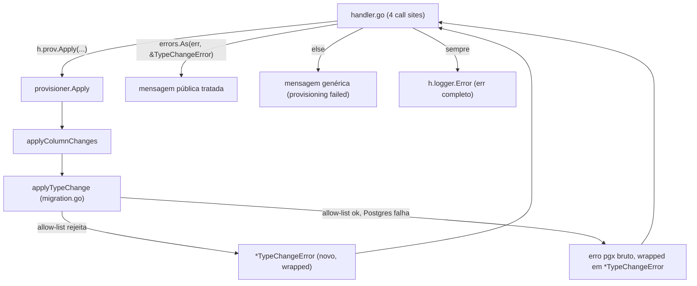

# Column Type Change Feedback Design

**Spec**: `.specs/features/column-type-change-feedback/spec.md`
**Status**: Draft

---

## Architecture Overview

Sem componente novo — correção cirúrgica em dois pontos já existentes: (1) mensagens de erro dentro de `applyTypeChange` (`internal/provisioner/migration.go`), que já são razoáveis mas precisam de formato consistente e de um tipo de erro distinguível; (2) os 4 call sites em `internal/dashboard/handler.go` que hoje quebram a garantia documentada no próprio `writeError` ("sends only publicMsg to the client so internals never leak over the wire", `handler.go:1371`) ao passar `err.Error()` bruto como `publicMsg`.



---

## Code Reuse Analysis

### Existing Components to Leverage

- `writeError` (`handler.go:1372-1380`) já separa log interno (`err` completo) de mensagem pública (`publicMsg`) — a correção é só parar de construir `publicMsg` a partir de `err.Error()` nos 4 sites, não mudar `writeError` em si.
- `safeTypeConversions` (`migration.go:13-22`) e a lógica de rejeição (linhas 132-148) já fazem o trabalho de decisão — só precisam produzir um erro tipado em vez de `fmt.Errorf` genérico, pra o handler conseguir distinguir "rejeitado pela allow-list" de "outro erro de provisioning".
- Padrão de erro sentinela/tipado já não existe no pacote `provisioner` (confirmado por não ter achado nada em `errors.New`/tipo customizado nesse pacote durante a spec anterior) — esta é a primeira introdução desse padrão ali, mantendo simples (um único tipo de erro cobre os 2 sub-casos da spec).

### Integration Points

- `internal/provisioner/migration.go:134,146,154-156` — as 3 origens de erro dentro de `applyTypeChange` passam a usar o novo tipo `*TypeChangeError`.
- `internal/dashboard/handler.go:813,909,997,1073` — os 4 call sites passam a fazer `errors.As` no erro retornado por `h.prov.Apply` pra decidir a mensagem pública; caso não seja `*TypeChangeError`, mantém o comportamento genérico atual (mas sem concatenar `err.Error()` — ver Tech Decisions).

---

## Components

### `provisioner.TypeChangeError` (novo tipo)

```go
type TypeChangeError struct {
	Column       string
	CurrentType  string
	DesiredType  string
	Reason       string // "no_conversions_defined" | "unsafe_narrowing" | "runtime_failure"
	Cause        error  // erro original (pgx, se houver) — nunca exposto via Error() público
}

func (e *TypeChangeError) Error() string {
	return fmt.Sprintf("cannot change type of %q from %s to %s: %s", e.Column, e.CurrentType, e.DesiredType, e.publicReason())
}

func (e *TypeChangeError) Unwrap() error { return e.Cause }

func (e *TypeChangeError) publicReason() string {
	switch e.Reason {
	case "no_conversions_defined":
		return fmt.Sprintf("source type %s does not support automatic conversion", e.CurrentType)
	case "unsafe_narrowing":
		return "unsafe conversion — would narrow or lose data"
	case "runtime_failure":
		return "conversion failed — check that existing data is compatible with the new type"
	default:
		return "conversion failed"
	}
}
```

Note: `Error()` já retorna texto seguro pra expor publicamente (não inclui `Cause`/SQLSTATE) — isso é o que resolve o vazamento, já que hoje `err.Error()` de um erro `%w`-wrapped inclui a cadeia inteira até o pgx.

### `applyTypeChange` (modificado)

- Linha 134: em vez de `fmt.Errorf(...)`, retorna `&TypeChangeError{Column: col.Name, CurrentType: currentType, DesiredType: desiredType, Reason: "no_conversions_defined"}`.
- Linha 146: idem, `Reason: "unsafe_narrowing"`.
- Linha 154-156: em vez de `fmt.Errorf("change type of %q ...: %w", ..., err)`, retorna `&TypeChangeError{Column: col.Name, CurrentType: currentType, DesiredType: desiredType, Reason: "runtime_failure", Cause: err}` — preserva `err` original via `Unwrap()` pra log server-side continuar completo.

### `handler.go` (4 call sites modificados)

Padrão novo, idêntico nos 4 pontos:

```go
if _, err := h.prov.Apply(r.Context(), &config.Config{Apps: []config.AppConfig{cfg}}); err != nil {
	var typeErr *provisioner.TypeChangeError
	if errors.As(err, &typeErr) {
		h.writeError(w, r, http.StatusBadRequest, typeErr.Error(), err)
	} else {
		h.writeError(w, r, http.StatusInternalServerError, "provisioning failed — check server logs for details", err)
	}
	return
}
```

Nota: `errors.As` funciona porque `applyColumnChanges`/`Apply` devem preservar o `Unwrap()` chain (`fmt.Errorf("...: %w", err)`) até a origem — já é o padrão hoje em `provisioner.go:73` e em `applyColumnChanges`, então nenhuma mudança extra é necessária nesses níveis intermediários além de garantir que continuam usando `%w` (já usam).

---

## Data Models

Nenhum modelo de dado novo — mudança é só em tipo de erro Go e formato de mensagem HTTP. O campo `error` da resposta JSON (`writeJSON(w, status, map[string]string{"error": publicMsg})`, `handler.go:1379`) continua com o mesmo shape.

---

## Error Handling Strategy

- `TypeChangeError` distinguível via `errors.As` — decisão central desta spec. Alternativa descartada: checar `strings.Contains(err.Error(), "unsafe conversion")` no handler — frágil, acopla handler ao texto exato da mensagem do provisioner, quebra silenciosamente se a mensagem mudar.
- Status HTTP: `TypeChangeError` (erro de validação/allow-list ou falha de conversão) retorna **400 Bad Request** em vez de 500 — é erro de entrada do usuário (schema incompatível com dado existente), não falha interna do sistema. Os 4 call sites hoje usam 500 pra tudo; esta spec introduz a distinção.
- Erro genérico (não `TypeChangeError`) nos 4 call sites perde o `err.Error()` concatenado — passa a usar mensagem fixa "provisioning failed — check server logs for details", fechando o vazamento também pra qualquer outro erro de provisioning não relacionado a type change (rename, create table, index, etc.) que passe por esses mesmos 4 pontos.
- Log server-side (`h.logger.Error` dentro de `writeError`) não muda — `err` completo (com `Cause`/pgx original via `Unwrap()`) continua sendo logado, nada se perde para debugging.

---

## Tech Decisions (only non-obvious ones)

- **Erro tipado (`*TypeChangeError`) em vez de sentinelas (`errors.Is` com `var ErrUnsafeConversion = errors.New(...)`)**: sentinela não carrega dado dinâmico (nome da coluna, tipos envolvidos) sem gambiarra de formatação externa; struct tipado com `Error()` já pronto pra expor publicamente é mais direto aqui, e o pacote não tem convenção prévia de erro sentinela para copiar.
- **Só type-change ganha erro tipado, não os outros erros do provisioner nesta spec**: escopo definido pela spec original (Out of Scope) — outros fluxos de erro (rename, create table) continuam com o tratamento genérico "provisioning failed — check server logs" corrigido, mas sem tipo próprio; se depois quiserem o mesmo tratamento granular, é spec própria.
- **400 em vez de 500 pra `TypeChangeError`**: é uma mudança de contrato de API (código de status muda pra esse caso específico) — sinalizar isso explicitamente pro time de frontend/dashboard consumir, já que hoje tudo que vem de `Apply` retorna 500 independente da causa.
