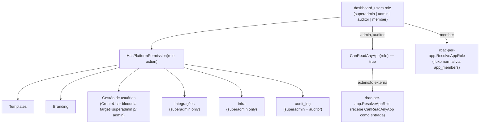

# Dashboard Global Roles Design

**Spec**: `.specs/features/dashboard-global-roles/spec.md`
**Status**: Draft

---

## Architecture Overview

Reestruturação de `dashboard_users.role` (2 → 4 valores) mais uma função central de resolução de permissão de plataforma, no mesmo espírito de `ResolveAppRole` desenhada em `rbac-per-app` — mas para o eixo global, não por app. Ponto de integração explícito com `rbac-per-app`: `admin`/`auditor` precisam de leitura irrestrita de qualquer app, o que exige uma extensão em `ResolveAppRole` (função daquela outra spec), não uma segunda função paralela aqui.



---

## Code Reuse Analysis

### Existing Components to Leverage

| Component | Location | How to Use |
|---|---|---|
| Padrão de checagem inline (`role == "superadmin"`) | `internal/dashboard/handler.go` | Substituído por `HasPlatformPermission`, não removido do estilo (ainda inline, sem middleware novo) |
| Invariante "≥1 admin por app" | `rbac-per-app` (mesma técnica) | Replicado como "≥1 superadmin na plataforma" |
| Audit log | `internal/dashboard/audit_store.go` | Evento `user.role_changed` em toda mutação de role |
| `CreateUser` existente | `internal/dashboard/handler.go` | Ganha checagem de `CanCreateUserWithRole` antes de persistir |

### Integration Points

| System | Integration Method |
|---|---|
| `rbac-per-app.ResolveAppRole` (a ser implementada naquela spec) | Precisa aceitar um parâmetro/checagem adicional: `if CanReadAnyApp(user.Role) { return ReadOnlyRole }` antes do lookup normal em `app_members` — documentado aqui, implementado onde `ResolveAppRole` for implementada |
| `CreateUser` (`internal/dashboard/handler.go`, já existe) | Adiciona `CanCreateUserWithRole(actor.Role, body.Role)` antes de persistir |
| Endpoint novo `PATCH /dashboard/api/users/{id}` (não existe ainda — hoje só há `CreateUser`/`DeleteUser`) | Necessário para promover/rebaixar role de um usuário existente |

---

## Components

### `internal/dashboard.HasPlatformPermission`

- **Purpose**: Checagem central de permissão de plataforma por role.
- **Location**: `internal/dashboard/platform_roles.go`
- **Interfaces**:
  ```go
  type PlatformAction string

  const (
      ActionManageTemplates    PlatformAction = "templates"
      ActionManageBranding     PlatformAction = "branding"
      ActionManageUsers        PlatformAction = "users"
      ActionManageIntegrations PlatformAction = "integrations"
      ActionManageInfra        PlatformAction = "infra"
      ActionViewAudit          PlatformAction = "audit"
      ActionManageOwnApps      PlatformAction = "own_apps"
  )

  func HasPlatformPermission(role string, action PlatformAction) bool

  func CanReadAnyApp(role string) bool
  // true para "superadmin", "admin", "auditor" — false para "member"

  func CanCreateUserWithRole(actorRole, targetRole string) bool
  // false se targetRole == "superadmin" e actorRole != "superadmin"
  ```
- **Dependencies**: nenhuma (funções puras sobre strings de role)
- **Reuses**: nenhum precedente idêntico — mesmo espírito de `HasFeature` (enterprise-licensing) e `ResolveAppRole` (rbac-per-app), mas eixo de plataforma

### Alterações em `internal/dashboard/handler.go`

- **Purpose**: Aplicar `HasPlatformPermission`/`CanCreateUserWithRole` nos endpoints existentes e novos.
- **Location**: `internal/dashboard/handler.go` (edição de `CreateUser`), `internal/dashboard/users.go` (novo, `PATCH /dashboard/api/users/{id}` para mudança de role)
- **Interfaces**: `PATCH /dashboard/api/users/{id}` `{role}` — só `superadmin` promove pra `superadmin`; `admin` promove/atribui `member`/`auditor`/`admin`, nunca `superadmin`
- **Dependencies**: `HasPlatformPermission`, `CanCreateUserWithRole`, `InsertAuditLog`
- **Reuses**: `bcrypt`/validação já usados em `CreateUser`

---

## Data Models

```sql
-- Migração, nesta ordem exata:
UPDATE zeep_system.dashboard_users SET role = 'member' WHERE role = 'admin';

ALTER TABLE zeep_system.dashboard_users
    DROP CONSTRAINT dashboard_users_role_check; -- nome exato a confirmar na implementação

ALTER TABLE zeep_system.dashboard_users
    ADD CONSTRAINT dashboard_users_role_check
    CHECK (role IN ('superadmin', 'admin', 'auditor', 'member'));
```

Nenhuma tabela nova — só a migração de valores + constraint da coluna já existente.

---

## Error Handling Strategy

| Error Scenario | Handling | User Impact |
|---|---|---|
| `admin` tenta criar/promover `superadmin` | 403 explícito | Mensagem clara: só superadmin cria superadmin |
| `auditor`/`member` acessa tela de plataforma fora da própria matriz | 403 uniforme | UI já omite a tela (não é só bloqueio de API) |
| Operação resultaria em zero `superadmin` | 400, operação não aplicada | Mesma UX do invariante de app admin em `rbac-per-app` |
| `ResolveAppRole` chamada sem a extensão de `CanReadAnyApp` implementada ainda | `admin`/`auditor` ficam sem leitura de apps de terceiros até a integração ser feita | Regressão temporária aceitável se as specs forem implementadas fora de ordem — documentado, não escondido |

---

## Tech Decisions (only non-obvious ones)

| Decision | Choice | Rationale |
|---|---|---|
| Nome do papel de leitura global | `auditor`, não `viewer` | Colisão com `app_members.role = 'viewer'` (escopo por app) — nomes iguais com escopos diferentes é fonte garantida de bug futuro; decisão explícita do usuário após o risco ser levantado |
| Spec separada de `rbac-per-app` | Sim | Eixos diferentes (role global vs. membership por app); specs focadas são mais fáceis de revisar/implementar independentemente — decisão explícita do usuário |
| Migração `admin → member` | Substituição direta, sem opção de manter `admin` antigo coexistindo | `admin` de hoje é funcionalmente idêntico ao `member` novo; manter os dois seria duplicar sem propósito |
| `admin` global também gerencia apps próprios | Sim, via `app_members` normal (mesmo caminho de `member`) | Correção explícita do usuário durante o brainstorm — inicialmente `admin` seria só plataforma, mas o usuário quis que ele também pudesse ter apps próprios |
| `auditor` vê `audit_log` | Sim | Correção explícita do usuário — coerente com o nome do papel (audita tudo, edita nada) |
| Onde a extensão de `CanReadAnyApp` é implementada | Dentro de `ResolveAppRole` (spec `rbac-per-app`), não uma função paralela aqui | Evita duas fontes de verdade sobre "quem pode ler qual app" — uma função central, um lugar só |

---

## Tips aplicadas

- Dependência cruzada com `rbac-per-app` tratada como requisito de integração explícito (Data Models + Error Handling), não escondida nem duplicada como segunda implementação.
- Correções do usuário durante o brainstorm (admin ganha apps próprios, auditor ganha audit log) registradas na tabela de Tech Decisions com o "porquê", não só o "o quê".
- Nomenclatura (`auditor` vs `viewer`) resolvida antes do design, evitando ambiguidade estrutural entre dois eixos de permissão.
