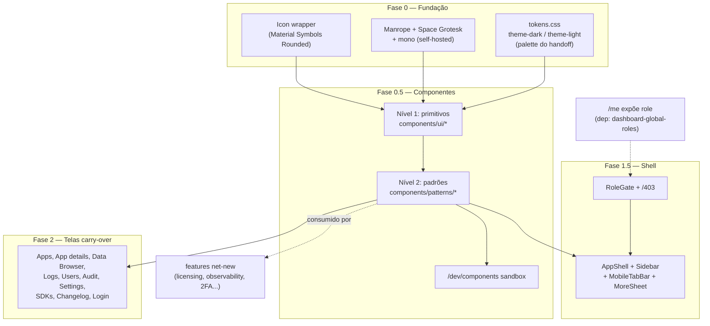

# Dashboard Redesign Design

**Spec**: `.specs/features/dashboard-redesign/spec.md`
**Status**: Draft

---

## Architecture Overview

Redesign é migração de camada de apresentação sobre a stack existente (React 18 + Vite + Tailwind v4 + Radix + TanStack Query + react-router 7 + i18next + sonner). Três blocos, nesta ordem de dependência: **fundação** (tokens/fontes/ícones) → **biblioteca de componentes em 3 níveis** → **shell + telas**. Backend RBAC de 4 papéis (`dashboard-global-roles`) entra cedo para o shell nascer consciente de role.



---

## Code Reuse Analysis

### Existing Components to Leverage

| Component | Location | How to Use |
|---|---|---|
| Primitivos shadcn/Radix | `internal/dashboard/ui/src/components/ui/*` | Restilizar para tokens novos, manter Radix; não recriar do zero |
| `DeleteConfirmDialog` | `src/components/DeleteConfirmDialog.tsx` | Generalizar em `ConfirmDialog` (nível 2), servindo delete **e** logout com título/mensagem adaptáveis |
| `TableCard` | `src/components/TableCard.tsx` | Absorver no `DataTable` de nível 2 (sort/paginação/row-actions/estados) |
| `usePublicConfig` | `src/lib/api.ts` | Padrão de fetch pré-first-paint mantido para tema/idioma; campo `theme` (brand) deixa de ser consumido |
| `i18n` setup | `src/lib/i18n.ts` | Reusar para toggle de idioma (`changeLanguage` + persist), sem slug de URL |
| `DashboardShell` nav/role | `src/pages/DashboardShell.tsx` (já lê `user.role`) | Base da lógica role-aware; reescrever visual, preservar a leitura de role da sessão |
| Toaster (sonner) | `src/App.tsx` | Manter; ajustar estilo do toast para tokens novos (hoje hardcoded dark) |

### Integration Points

| System | Integration Method |
|---|---|
| `dashboard-global-roles` | Shell consome `role` de 4 valores via `/me`; enquanto não implementado, degrada para modelo 2-papéis (ver Error Handling). Enforcement é daquela spec, não daqui. |
| `enterprise-licensing` | Consome `EnterpriseBadge`/`UpgradeModal` (nível 2) desta spec para gate visual. |
| `observability-integrations` | Consome `ProviderCard`, `MaskedSecretField`, `StatusPill` (nível 2). |
| `two-factor-auth` | Consome `FormDrawer`/`ConfirmDialog`/`CodeInput`; componentes específicos de TOTP (`TotpSetup`, `BackupCodes`) ficam na spec de 2FA, mas seguem os primitivos daqui. |
| Backend preferência tema/idioma | Contrato definido aqui (ver Data Models); implementação server-side é gap a coordenar. Fallback localStorage até existir. |
| Backend `usePublicConfig`/`/me` | `theme` (brand) removido do consumo; `company_name` preservado. |

---

## Components

### Nível 0 — Fundação

#### `tokens.css`
- **Purpose**: CSS custom properties dark/light da palette do handoff.
- **Location**: `internal/dashboard/ui/src/styles/tokens.css` (importado por `index.css`)
- **Interfaces**: classes `.theme-dark` / `.theme-light`, cada uma definindo `--bg-page`, `--surface`, `--surface-raised`, `--sunken`, `--border`, `--border-strong`, `--text-primary/secondary/tertiary`, `--primary`, `--primary-hover`, `--primary-tint`, `--accent`, `--accent-hover`, `--accent-tint`, `--success`/tint, `--warning`/tint, `--danger`/tint, `--overlay`, `--shadow-sm`, `--shadow-md`. Valores exatos do handoff (README linhas 50-66).
- **Dependencies**: nenhuma.
- **Reuses**: substitui `@theme` atual e `lib/themes.ts`.

#### `Icon`
- **Purpose**: Wrapper único para Material Symbols Rounded.
- **Location**: `src/components/ui/icon.tsx`
- **Interfaces**: `<Icon name="settings" size={18} />` → `<span class="material-symbols-rounded" style={{fontSize}}>settings</span>`, cor via `currentColor`.
- **Dependencies**: fonte Material Symbols self-hosted.
- **Reuses**: substitui gradualmente `lucide-react` (uma tela por vez).

### Nível 1 — Primitivos (`components/ui/*`)

Restilizar existentes (`button`, `input`, `table`, `dialog`, `badge`, `switch`, `tabs`, `select`, `label`, `separator`) para tokens novos + shape do handoff (cards 12-16px, pills full-round, icon-btn ~8px). Adicionar novos: `drawer` (Radix Dialog lateral), `accordion` (Radix Accordion), `tooltip` (Radix Tooltip), `skeleton`.

### Nível 2 — Padrões (`components/patterns/*`)

| Componente | Interface (resumo) | Reuses / substitui |
|---|---|---|
| `PageHeader` | `{title, subtitle?, actions?, breadcrumb?}` | markup de título repetido em toda página |
| `DataTable<T>` | `{columns, rows, sort?, pagination?, rowActions?, empty, loading, error}` | `TableCard` + estados inline |
| `StatusPill` | `{status: 'active'\|'trial'\|'revoked'\|'paused'\|'inactive'\|..., label}` | badges de status espalhados |
| `EmptyState` / `ErrorState` / `LoadingState` | `{icon?, title, description?, action?}` | os 3 estados repetidos por fetch |
| `ConfirmDialog` | `{open, title, message, confirmLabel, destructive?, onConfirm}` | `DeleteConfirmDialog` (generalizado p/ delete + logout) |
| `ProviderCard` | accordion card `{name, status, badge?, disabled?, children}` | login/storage/observability/deploy providers |
| `SettingRow` | `{label, description?, control}` | linhas de config em Settings/Database/Security |
| `EnterpriseBadge` + `UpgradeModal` | `{feature}` / `{open, feature, onClose}` | gate Enterprise (consumido por licensing/observability) |
| `MaskedSecretField` | `{value?, onReplace, placeholder}` | API keys mascaradas + "Replace" |
| `FormDrawer` | `{open, title, children, onClose, footer?}` | drawer lateral de config/criação |
| `RoleGate` | `{allow: Role[], children, fallback?}` | esconder por papel (sidebar + inline) |

### Nível Shell — Layout (`components/layout/*`)

`AppShell` (grid sidebar+conteúdo), `Sidebar` (nav role-aware via `RoleGate`), `SidebarFooter` (`ThemeToggle` + `LanguageToggle` + logout com `ConfirmDialog`), `MobileTabBar` (Apps/Data/Logs), `MobileMoreSheet` (bottom-sheet com resto da nav + footer).

### Hooks compartilhados (`lib/`)

`useTheme()` (lê/persiste tema, aplica classe root), `useLanguage()` (wrap `i18n.changeLanguage` + persist), `useCurrentRole()` (deriva role da sessão `/me`).

---

## Data Models

Sem tabela nova nesta spec. **Contrato de persistência de preferência** (a implementar no backend, fora do escopo de código desta spec, mas definido aqui para o time de backend):

```
GET  /dashboard/api/me         → inclui { theme_pref: "dark"|"light"|null, lang_pref: "en"|"pt-BR"|null }
PATCH /dashboard/api/me/prefs  → body { theme_pref?, lang_pref? }  (merge-on-absent, regra AGENTS §4)
```

Enquanto o endpoint não existir: `useTheme`/`useLanguage` persistem em `localStorage` (`zeep.theme`, `zeep.lang`) como fallback documentado. A migração para persistência server-side não muda a API dos hooks.

Remoção de brand-theme: `theme` (seleção de paleta brand) deixa de ser consumido no frontend. `company_name` permanece. O campo `theme` só é dropado do backend após confirmação de que nenhum outro cliente depende dele (regra AGENTS §4 sobre não quebrar contrato).

---

## Error Handling Strategy

| Error Scenario | Handling | User Impact |
|---|---|---|
| `/me` retorna modelo antigo (2 papéis) porque `dashboard-global-roles` não foi implementado | `useCurrentRole` mapeia `admin`→papel mais permissivo não-super, `superadmin`→superadmin | Shell funciona sem crash; itens de 4-papéis aparecem quando backend evoluir |
| Endpoint de prefs inexistente | Fallback localStorage, gap sinalizado ao backend | Preferência persiste no device, não cross-device, até backend existir |
| Navegação direta a URL bloqueada | Rota `/403` genérica (não crash/tela branca) | Mensagem clara de acesso negado |
| Mutação de tela migrada falha | `toast.error(error.message)` (sonner), mensagem do backend em inglês (AGENTS §4) | Erro visível, nunca silencioso |
| Campo `theme` (brand) removido antes de confirmar contrato | Não remover do backend até confirmar; frontend só para de consumir | Zero quebra de contrato |
| Fonte/ícone self-hosted falha ao carregar | Fallback de fonte do sistema via `font-family` stack | Degradação graciosa, sem layout quebrado |

---

## Tech Decisions (only non-obvious ones)

| Decision | Choice | Rationale |
|---|---|---|
| Brand-themes (`azure`/`emerald`/`ruby`) | Remover por completo | Decisão explícita do usuário; palette do handoff é fixa dark/light, brand-theme legado não tem lugar |
| Idioma | Modelo i18next atual (`changeLanguage` + persist), sem slug de URL | Decisão explícita do usuário; slug de idioma adicionaria complexidade de rota sem ganho |
| Migração de ícones | Incremental por tela, não big-bang | Decisão explícita; permite revisar cada tela isolada e remover `lucide-react` só no fim |
| Backend RBAC | Antes do shell (Fase 1) | Shell role-aware precisa dos 4 papéis da sessão; nascer com modelo antigo forçaria retrabalho |
| Componentização | Nível 2 é fonte única de cada padrão; PR que reintroduz inline é rejeitado | Pedido central do usuário: matar duplicação que existe hoje em ~9.5k linhas de páginas |
| Sandbox `/dev/components` | Gated, não em produção | Revisar primitivos/padrões isolados em ambos os temas antes de aplicar em tela real |
| Persistência de prefs | localStorage como fallback, contrato server-side definido mas não implementado aqui | Não bloquear o redesign no backend; migração transparente quando endpoint existir |
| Fontes/ícones | Self-hosted, não CDN | CSP/offline (mesmo princípio dos Artifacts e do binário embutido); evita dependência de rede em runtime |
| `company_name` vs `theme` | Preservar `company_name`, remover só seleção de paleta | Branding textual é ortogonal ao brand-theme de cor; um sai, outro fica |

---

## Tips aplicadas

- Componentização elevada a pilar (Nível 2 = fonte única) porque é o pedido central do usuário e o problema real do código atual (padrões replicados inline em cada página).
- Features net-new tratadas como **consumidoras** dos componentes desta spec (dependência documentada em Integration Points), nunca re-especificadas — evita conflito com `two-factor-auth`/`enterprise-licensing`/`observability-integrations`/`dashboard-global-roles`.
- Remoção de brand-theme e do campo `theme` do backend separadas: frontend para de consumir já; backend só dropa após confirmar contrato (regra AGENTS §4).
- Fallback localStorage documentado explicitamente para não bloquear o redesign no gap de backend, com API de hook estável para migração transparente.
- Degradação do shell para modelo 2-papéis registrada, para o redesign não travar caso seja implementado antes de `dashboard-global-roles`.
