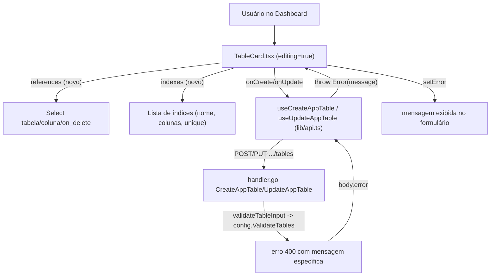

# Dashboard UI for Foreign Keys and Indexes Design

**Spec**: `.specs/features/dashboard-relationships-ui/spec.md`
**Status**: Draft

---

## Architecture Overview

Frontend-only. Nenhuma mudança de contrato de API — `ColumnConfig.References`/`TableConfig.Indexes` (Go) já aceitam exatamente o shape que vamos passar a enviar do TypeScript. O trabalho é: (1) estender os tipos TS pra espelhar o contrato Go, (2) estender `TableCard.tsx` com os campos de formulário, (3) garantir que erro 400 do backend (`config.ValidateTables`) chega legível na UI.



---

## Code Reuse Analysis

### Existing Components to Leverage

- `TableCard.tsx` já tem toda a estrutura de estado local (`useState` por campo), padrão de erro (`setError`/`error &&`), e o layout de linha por coluna (grid) — a extensão de FK/índice segue o mesmo padrão, não introduz Redux/Zustand/Context novo.
- `apiFetch` (`lib/api.ts:43-56`) já propaga `body.error` da resposta HTTP como `Error.message` — a User Story P2 (erros legíveis) já é coberta pelo código existente, só precisa ser confirmada/testada no caminho novo, não implementada do zero.
- `useApp(id)` (`lib/api.ts:66-72`) já carrega `app.tables` com todas as tabelas do app — é a fonte do select "referenciar outra tabela", sem nova chamada de API.
- Padrão de `Select`/`SelectContent`/`SelectItem` (Radix, já importado em `TableCard.tsx`) reusado para os novos selects de tabela/coluna/on_delete.

### Integration Points

- `internal/dashboard/ui/src/lib/api.ts:10-23` — `ColumnDef`/`TableDef` ganham `references?`/`indexes?`.
- `internal/dashboard/ui/src/components/TableCard.tsx` — novo bloco de UI por coluna (referência) e por tabela (índices); `save()` (linha 97-123) já serializa `columns`/o objeto de tabela inteiro, references/indexes viajam junto sem mudança na função em si.
- `internal/dashboard/ui/src/pages/AppDetailsPage.tsx` — passa `app.tables` pro `TableCard` já hoje; usado para popular a lista de tabelas referenciáveis (só precisa passar a prop adiante, já disponível no escopo).

---

## Components

### Tipos TypeScript (`lib/api.ts`)

```ts
export interface ReferenceDef {
  table: string
  column: string
  on_delete?: '' | 'cascade' | 'restrict' | 'set_null' | 'no_action'
}

export interface ColumnDef {
  name: string
  type: string
  required: boolean
  default: string
  unique: boolean
  references?: ReferenceDef | null   // novo
}

export interface IndexDef {
  name: string
  columns: string[]
  unique?: boolean
}

export interface TableDef {
  id?: string
  name: string
  rls: string
  columns: ColumnDef[]
  indexes?: IndexDef[]   // novo
}
```

Espelha 1:1 `config.ReferenceConfig`/`config.IndexConfig` (Go) — mesmos nomes de campo, já que o JSON trafega sem transformação em nenhum dos dois lados.

### `TableCard.tsx` — bloco de referência por coluna

Por linha de coluna, abaixo dos controles existentes (nome/tipo/required/unique), um toggle "FK" que expande:
- `Select` de tabela alvo: opções = `otherTables` (prop nova, passada de `AppDetailsPage.tsx` a partir de `app.tables`, filtrando tabelas sem `id` — draft ainda não salvo — e a própria tabela sendo editada, conforme spec AC2).
- `Select` de coluna alvo: opções = `"id"` + colunas da tabela escolhida com `unique: true`. Recalculado quando a tabela alvo muda.
- `Select` de `on_delete`: `no_action` (default), `cascade`, `restrict`, `set_null`.
- Estado: `col.references` no mesmo objeto `ColumnDef` já gerenciado por `updateColumn` — nenhum `useState` novo, só estende o objeto existente.

### `TableCard.tsx` — bloco de índices por tabela

Nova seção abaixo da lista de colunas, antes do botão "Salvar tabela":
- Estado novo: `const [indexes, setIndexes] = useState<IndexDef[]>(table.indexes ?? [])`, espelhando o padrão de `columns`.
- Cada índice: input de nome, multi-select (ou checkboxes) das colunas já declaradas em `columns` (estado local, não da tabela salva — permite escolher uma coluna adicionada na mesma sessão de edição), toggle `unique`.
- Botão "Adicionar índice" / remover índice, mesmo padrão visual de `addColumn`/`removeColumn`.
- `save()` passa `indexes` no payload de `onCreate`/`onUpdate` junto com `columns`.

### Exibição somente-leitura (tabela não em edição)

Bloco resumido (spec Goal 5): lista compacta tipo `"customer_id → customers.id (cascade)"` por FK, e `"idx_users_email (email) UNIQUE"` por índice, abaixo do nome da tabela — reaproveita o mesmo card colapsado (`!editing`), sem novo componente.

---

## Data Models

Nenhum modelo novo no backend. No frontend, `ReferenceDef`/`IndexDef` conforme acima — tipos puros, sem persistência local (tudo vem/vai via API a cada save).

---

## Error Handling Strategy

- Erros de validação (`config.ValidateTables`) chegam como `body.error` (string única, não lista) — a UI mostra essa string inteira no bloco de erro já existente (`setError(err.message)`), sem parsing/split por campo. Não há indicação granular de "qual seleção está errada" nesta iteração — o texto do erro já cita o nome da coluna/tabela envolvida (ex.: `"table \"pedidos\", column[0] (cliente_id): references unknown table \"clientess\""`), suficiente para o usuário corrigir.
- Alternativa descartada: parsear a mensagem de erro no frontend pra destacar o campo exato — frágil (acopla ao texto exato da mensagem Go) e fora do que a spec pede (só "aparecer de forma legível", não "destacar campo").

---

## Tech Decisions (only non-obvious ones)

- **FK e índice vivem no mesmo objeto `ColumnDef`/`TableDef` que já existe** (via campos opcionais), em vez de um novo componente/estado separado: minimiza diff, aproveita o fluxo de save/error já testado manualmente pelo usuário em produção.
- **Select de tabela referenciável exclui rascunhos (tabela sem `id`)**: o backend já rejeita referência a uma tabela que não existe (ela só existe após o primeiro save) — expor a opção no select e deixar falhar no submit seria pior UX que simplesmente não oferecer a opção.
- **Sem novo endpoint pra listar "colunas unique de outra tabela"**: `app.tables` já vem completo (todas as colunas) de `useApp`, então o filtro é só client-side — evita round-trip extra.
