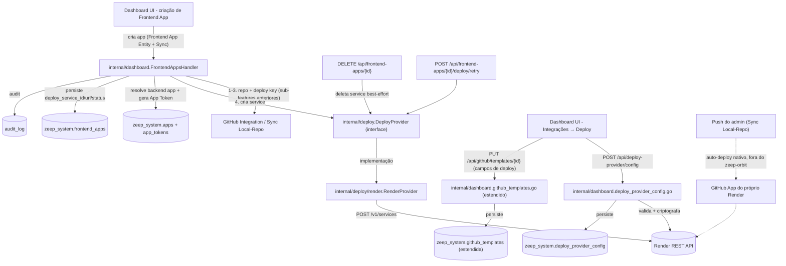

# Deploy Provider Integration Design

**Spec**: `.specs/features/deploy-provider-integration/spec.md`
**Status**: Draft

---

## Architecture Overview

A criação de frontend app (Frontend App Entity + Sync Local↔Repo) ganha um passo final, na mesma chamada síncrona: criar um service no provider de deploy conectado, apontando pro repo recém-criado. O acoplamento ao Render fica isolado atrás de uma interface `DeployProvider` — nenhum outro componente do sistema conhece detalhes da API do Render diretamente. Não há webhook recebido pelo zeep-orbit: o Render escuta push no GitHub via sua própria GitHub App instalada na org, e dispara auto-deploy nativo, fora do ciclo de vida do zeep-orbit.



---

## Code Reuse Analysis

### Existing Components to Leverage

| Component | Location | How to Use |
|---|---|---|
| `internal/dashboard.FrontendAppsHandler` | `internal/dashboard/frontend_apps.go` | Estender criação e delete pra incluir criação/remoção de service; adicionar rota de retry |
| `internal/crypto` (AES-256-GCM) | pacote já usado por GitHub App config, sync credentials | Criptografar API Key do provider |
| Audit log | `internal/dashboard/audit_store.go` | Eventos `deploy_provider.config.update`, `frontend_app.deploy.create/retry/delete` |
| Middleware superadmin-only | `internal/dashboard/middleware.go` (`RequireSuperadmin`) | Endpoints de config de provider e de deploy em templates |
| Middleware auth padrão | `internal/dashboard/middleware.go` (`RequireAuth`) | Rotas de deploy no frontend app (criação/retry/delete), mesmo guard de admin usado em Frontend App Entity |
| `internal/dashboard.app_tokens_store.go` (feature já implementada) | já existe | Gerar App Token pro backend app linkado, na criação do frontend app |
| Provisionamento `zeep_system.*` | `internal/dashboard/provisioner.go` | Adicionar `CREATE TABLE IF NOT EXISTS deploy_provider_config`; `ALTER TABLE frontend_apps ADD COLUMN ...`; `ALTER TABLE github_templates ADD COLUMN ...` |

### Novo Componente

| Component | Location | How to Use |
|---|---|---|
| `internal/deploy.DeployProvider` (interface) | `internal/deploy/provider.go` (novo pacote) | Contrato único consumido pelo `FrontendAppsHandler`; nenhuma outra camada importa `internal/deploy/render` diretamente |
| `internal/deploy/render.RenderProvider` | `internal/deploy/render/render.go` (novo) | Implementação concreta contra a REST API do Render |

### Integration Points

| System | Integration Method |
|---|---|
| Render REST API | Novo client HTTP em `internal/deploy/render/client.go`, autenticado via API Key (`Authorization: Bearer`) |
| PostgreSQL (`zeep_system`) | Tabela nova `deploy_provider_config` (singleton); colunas novas em `frontend_apps` e `github_templates` |
| Audit log | Eventos de config de provider, criação/retry/delete de service |
| `app_tokens_store` | Reuso direto pra gerar credencial de env var quando `backend_app_id` é informado |

---

## Components

### `internal/deploy.DeployProvider`

- **Purpose**: Interface que qualquer provider de deploy implementa. Único ponto de acoplamento consumido pelo resto do sistema.
- **Location**: `internal/deploy/provider.go`
- **Interface**:
  ```go
  type CreateServiceParams struct {
      RepoOwner     string
      RepoName      string
      ServiceType   string // "static_site" | "web_service"
      BuildCommand  string
      PublishPath   string // static_site
      StartCommand  string // web_service
      EnvVars       map[string]string
  }

  type ServiceInfo struct {
      ServiceID string
      URL       string
  }

  type DeployProvider interface {
      CreateService(ctx context.Context, params CreateServiceParams) (ServiceInfo, error)
      DeleteService(ctx context.Context, serviceID string) error
  }
  ```
- **Dependencies**: nenhuma — puramente o contrato
- **Reuses**: n/a (novo)

### `internal/deploy/render.RenderProvider`

- **Purpose**: Implementação do `DeployProvider` contra a API REST do Render.
- **Location**: `internal/deploy/render/render.go`
- **Interfaces**: implementa `deploy.DeployProvider`; internamente chama `POST /v1/services` (criação) e `DELETE /v1/services/{id}` (remoção)
- **Dependencies**: API Key do Render (injetada na construção)
- **Reuses**: `internal/crypto` pra decriptar a API Key antes de instanciar

### Extensão de `internal/dashboard.FrontendAppsHandler`

- **Purpose**: Orquestra a chamada ao `DeployProvider` como último passo da criação do frontend app; expõe retry e integra delete.
- **Location**: `internal/dashboard/frontend_apps.go`
- **Interfaces**:
  - Criação (`POST /api/frontend-apps`) estendida: aceita `backend_app_id` opcional, chama `DeployProvider.CreateService` após repo+sync resolvidos
  - `POST /api/frontend-apps/{id}/deploy/retry` — refaz só a etapa de criação de service
  - `DELETE /api/frontend-apps/{id}` estendido: chama `DeployProvider.DeleteService` best-effort
- **Dependencies**: `internal/deploy.DeployProvider`, `internal/dashboard.app_tokens_store`, `deployProviderConfigStore`, `githubTemplatesStore` (estendido)
- **Reuses**: `middleware.RequireAuth`, `h.audit(...)`

### `internal/dashboard.deploy_provider_config.go` (novo arquivo)

- **Purpose**: CRUD da config singleton do provider conectado.
- **Location**: `internal/dashboard/deploy_provider_config.go`
- **Interfaces**:
  - `GET /api/deploy-provider/status` — `{connected, provider}`
  - `POST /api/deploy-provider/config` — valida contra API do Render antes de persistir
- **Dependencies**: `internal/deploy/render`, `internal/crypto`
- **Reuses**: `middleware.RequireSuperadmin`, mesmo padrão exato de `github_config.go`

---

## Data Models

### `deploy_provider_config` (singleton)

```sql
CREATE TABLE zeep_system.deploy_provider_config (
    provider      TEXT NOT NULL DEFAULT 'render',
    api_key       TEXT NOT NULL,  -- encrypted (crypto.Encrypt)
    connected_at  TIMESTAMPTZ NOT NULL DEFAULT now(),
    updated_at    TIMESTAMPTZ NOT NULL DEFAULT now()
);
CREATE UNIQUE INDEX IF NOT EXISTS idx_deploy_provider_config_singleton
 ON zeep_system.deploy_provider_config ((TRUE));
```

Singleton via unique index em `((TRUE))` — mesmo padrão de `github_app_config` e `system_config`.

### Extensão de `github_templates`

```sql
ALTER TABLE zeep_system.github_templates
    ADD COLUMN render_service_type TEXT NOT NULL DEFAULT '',  -- 'static_site' | 'web_service'
    ADD COLUMN build_command       TEXT NOT NULL DEFAULT '',
    ADD COLUMN publish_path        TEXT NOT NULL DEFAULT '',  -- só static_site
    ADD COLUMN start_command       TEXT NOT NULL DEFAULT '';  -- só web_service
```

`render_service_type = ''` significa "sem config de deploy" — bloqueia criação de frontend app a partir desse template (spec DP-11).

### Extensão de `frontend_apps`

```sql
ALTER TABLE zeep_system.frontend_apps
    ADD COLUMN backend_app_id        UUID REFERENCES zeep_system.apps(id),
    ADD COLUMN deploy_service_id     TEXT NOT NULL DEFAULT '',
    ADD COLUMN deploy_url            TEXT NOT NULL DEFAULT '',
    ADD COLUMN deploy_status         TEXT NOT NULL DEFAULT 'pending',  -- 'ready' | 'pending' | 'failed'
    ADD COLUMN deploy_error_message  TEXT NOT NULL DEFAULT '';
```

`backend_app_id` é `NULL`able e sem `ON DELETE CASCADE` — remoção do backend app não afeta o frontend app (edge case documentado na spec: env vars já injetadas não são revogadas retroativamente).

**Migrações aditivas** — nenhuma coluna ou tabela das sub-features anteriores é alterada em tipo ou removida; `ALTER TABLE ... ADD COLUMN` apenas.

---

## Error Handling Strategy

| Error Scenario | Handling | User Impact |
|---|---|---|
| API Key do Render inválida no `POST /api/deploy-provider/config` | Valida contra `GET /v1/owners` antes de persistir; falha → 400 | "API Key inválida — verifique no dashboard do Render" |
| Provider não conectado na criação do frontend app | Segue criando repo+sync normalmente; `deploy_status: failed` | Frontend app usável (repo existe), deploy pendente até superadmin conectar + admin chamar retry |
| Template sem config de deploy (`render_service_type: ''`) | Rejeitado antes de tentar criar o frontend app | "Template sem configuração de deploy — peça ao superadmin completar" |
| Render retorna "repo not found" (GitHub App do Render sem acesso ao repo) | Erro mapeado explicitamente | "Render não enxerga o repositório — confirme que a GitHub App do Render está instalada com acesso a todos os repositórios" |
| Rate limit da API do Render | Propaga erro claro, sem retry silencioso | "Limite de requisições do Render atingido, tente novamente em alguns minutos" |
| Criação de service falha por qualquer outro motivo | `deploy_status: failed` + `deploy_error_message`; repo e deploy key permanecem intactos | Frontend app usável, retry disponível |
| Retry chamado com `deploy_status: ready` | Rejeita antes de qualquer chamada | "Deploy já configurado" |
| Delete do frontend app, remoção do service falha | Segue mesmo assim (best-effort) | App removido normalmente; service pode ficar órfão no Render até limpeza manual |
| `backend_app_id` informado mas app não existe/não pertence ao usuário | Rejeita antes de criar repo ou service | "Backend app inválido" |

---

## Tech Decisions (only non-obvious ones)

| Decision | Choice | Rationale |
|---|---|---|
| Acoplamento a provider | Interface `DeployProvider`, sem generics/plugins prematuros | Vercel entra depois implementando a mesma interface; evita YAGNI de abstração especulativa além do necessário pra desacoplar chamador de implementação |
| Recebimento de eventos de push | Nenhum — Render escuta GitHub nativamente via GitHub App própria dele | zeep-orbit não precisa manter endpoint de webhook nem repassar evento; Render já resolve isso, mais simples e menos superfície de falha |
| Pré-requisito de escopo GitHub do Render | "All repositories" documentado como setup obrigatório, não resolvido em código | "Only select" quebraria o self-service — cada frontend app novo exigiria re-autorização manual do superadmin |
| Momento de criação do service | Síncrono, junto da criação do frontend app (mesmo padrão das sub-features anteriores) | Consistente com "sem fila/polling" já decidido; falha isolada em `deploy_status: failed` não bloqueia o resto |
| Origem das build settings | Fixas por template (config do superadmin), não `render.yaml` no repo | Superadmin já é dono do ciclo de vida do template (GitHub Integration); manter a config no zeep-orbit evita depender do formato Blueprint do Render e mantém tudo auditável num só lugar |
| Vínculo com backend app | Campo opcional `backend_app_id` na criação do frontend app, sem alterar a spec já commitada da Frontend App Entity | Migração aditiva (`ALTER TABLE`) — não reabre spec já aprovada; env vars (`API_URL`, `APP_TOKEN`) reaproveitam a feature de App Tokens já implementada |
| Múltiplos providers conectados simultaneamente | Não suportado nesta fase — singleton | Nenhum caso de uso real hoje pede 2 providers ativos ao mesmo tempo; trocar de provider é reconfigurar |
| Retry em registro próprio vs. novo registro | Mesmo registro (`UPDATE`), consistente com retry das sub-features anteriores | Evita acumular histórico de tentativas sem necessidade |
