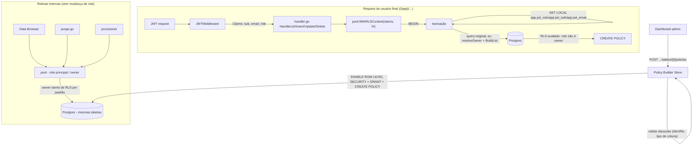

# End-User Row Policies Design

**Spec**: `.specs/features/end-user-row-policies/spec.md`
**Status**: Draft

---

## Architecture Overview

Duas peças novas coexistindo com o que já existe, sem substituí-lo:

1. **Identidade**: `_auth_users.role` (nova coluna) → claim `role` no JWT. `sub`/`email` já existem no JWT hoje (`RegisteredClaims.Subject`, `Claims.Email`).
2. **Enforcement**: um segundo role Postgres (`zeep_app_enduser`, sem ownership/`BYPASSRLS`) que o servidor assume via `SET LOCAL ROLE` só no caminho de request de usuário final (`internal/server/handler.go`). Dashboard, purge e provisionador continuam como o role principal (owner, isento de RLS por padrão do Postgres — nenhuma mudança de código neles). Policies traduzidas de um builder estruturado (coluna/operador/valor) para `CREATE POLICY ... TO zeep_app_enduser USING (...)`.

O RLS-owner atual (`resolveOwner`/`WHERE owner_id = $N` em Go) não muda — continua rodando com o role principal como sempre rodou, ortogonal a este mecanismo novo.



---

## Approach Exploration — Isenção de RLS para rotinas internas

Já resolvido com o usuário no início do Design (ver spec, Assumptions). Registrado aqui pela completude do processo:

| Approach | Trade-off |
| --- | --- |
| **A. Segundo role Postgres + `SET LOCAL ROLE`** (escolhido) | Isenção é permissão real do Postgres (GRANT/membership), aplicada pelo próprio servidor de banco — não uma flag de sessão que um bug futuro possa forjar. Reusa o padrão `SET LOCAL` transacional já existente (`client.go:69`). Custo: uma migration criando o role + `GRANT`/`ALTER DEFAULT PRIVILEGES` por schema provisionado. |
| B. GUC de sessão custom (`app.bypass_rls`) | Mais simples (nenhum role novo), mas é um controle de segurança caseiro — um valor de texto de sessão, não uma permissão verificada pelo Postgres. Qualquer código futuro capaz de executar `SET` a partir de um caminho de usuário final quebraria o isolamento silenciosamente. |
| C. Segundo pool/DSN físico para requests de usuário final | Isolamento mais forte ainda (nem compartilha conexão), mas exige nova infra (env var/secret, wiring em `cmd/zeep/main.go`, dobra o orçamento de `MaxConns=10` do pool atual) para um ganho marginal sobre A — A já isola por transação sem tocar infra. |

**Escolhido: A.** É o padrão nativo do Postgres para RLS multi-tenant (mesmo usado por Supabase: role `authenticated` sem bypass vs. role administrativo com ownership), sem custo de infraestrutura nova.

---

## Code Reuse Analysis

### Existing Components to Leverage

| Component | Location | How to Use |
| --- | --- | --- |
| `Pool.WithTimeout` (padrão `SET LOCAL` transacional) | `internal/db/client.go:59-76` | Modelo direto para o novo `Pool.WithRLSContext` — mesma estrutura (`Begin` → `SET LOCAL ...` → `fn(tx)` → `Commit`, `defer Rollback`). |
| `identRe` (allowlist de identificador) | `internal/dashboard/handler.go:85` | Reusado para validar nome de coluna em cláusulas de policy — mesma regra, sem duplicar regex. |
| `pgType()` (mapeamento tipo lógico → tipo Postgres) | `internal/provisioner/table.go:24-45` | Reusado para decidir o cast (`::uuid`, `::text`) ao comparar coluna com claim/literal numa cláusula. |
| `ResolveAppRole`/`AppRole.CanManage()` | `internal/dashboard/rbac.go:20-39,73` | Reusado como gate de autorização dos endpoints de policy — só `AppRoleAdmin` (ou `superadmin` global via bypass já existente) cria/edita/deleta policy. |
| `InsertAuditLog` | `internal/dashboard/audit_store.go:25` | Reusado nos 3 endpoints de policy (create/update/delete) — mesma assinatura, `resourceType="table_policy"`. |
| `addMissingAuthUserColumns` (migração idempotente de coluna) | `internal/provisioner/auth.go` | Modelo direto para adicionar `role TEXT NOT NULL DEFAULT 'member'` em `_auth_users`. |
| `AppTableRow`/`loadAppTables`/`InsertAppTable`/`UpdateAppTable` | `internal/dashboard/apps_store.go:33-39,364-429` | Não reusados diretamente (tabela `app_tables` não tem coluna pra policies) — nova tabela `zeep_system.table_policies` é análoga em padrão (JSON de cláusulas, mesmo estilo de `columns`/`indexes` já usado). |
| `filterRules`/`draftCol`/`draftOp`/`draftValue` (builder de condição single-clause) | `internal/dashboard/ui/src/pages/DataBrowserPage.tsx:73-76` | Padrão de UI de referência pro novo builder de cláusulas de policy — adaptado pra lista de cláusulas (múltiplas, cada uma além da primeira com conector `AND`/`OR`) em vez de uma condição de filtro por vez. |
| `toast.error(error.message)` (padrão de erro em mutation) | Convenção do repo (`AGENTS.md` §5) | Aplicado no formulário de policy do dashboard. |
| `validateReference`/`columnDDL` (FK genérico já existente) | `internal/config/validate.go:128-160`, `internal/provisioner/table.go:88-89` | Reusado quase inteiro — `columnDDL` já gera `REFERENCES %q.%q(%q)` genérico, funciona pra `_auth_users` sem mudança; só `validateReference` precisa do caso especial (ver Componente novo abaixo). |

### Componente novo — FK explícito para `_auth_users`

`validateReference` (`internal/config/validate.go:128`) hoje só aceita `ref.Table` presente em `tablesByName`, que é montado em `internal/dashboard/handler.go:148-155` a partir só das tabelas do próprio app (`app_tables`) — `_auth_users` nunca entra nesse mapa, então qualquer tentativa de referenciá-la falha com `"references unknown table _auth_users"`. A mudança é um caso especial dentro de `validateReference`: quando `ref.Table == "_auth_users"`, pular o lookup em `tablesByName` e, em vez disso, exigir `ref.Column == "id"` e `col.Type == "uuid"` (mesmas garantias que o `owner_id` automático já tem, só que agora disponível pra qualquer coluna que o admin declare). Nenhuma mudança em `table.go`/`columnDDL` — a DDL gerada (`REFERENCES "schema"."_auth_users"("id")`) já é idêntica à do `owner_id`, só que originada de uma coluna de negócio em vez do campo automático.

### Integration Points

| System | Integration Method |
| --- | --- |
| `internal/server/handler.go` (`HandleList`/`HandleInsert`/`HandleUpdate`/`HandleDelete`) | Troca a chamada atual de `pool.WithTimeout` por `pool.WithRLSContext(ctx, claims, timeoutMs, fn)` — mesma assinatura de `fn(q Querier) error`, sem mudar `query.BuildList`/etc. |
| `internal/auth/jwt.go` (`Claims`, `IssueJWT`) | Novo campo `Role string` em `Claims`; `IssueJWT` recebe o `role` atual do usuário e o embute. |
| `internal/provisioner` (criação de schema por app) | Ao provisionar schema novo, `GRANT USAGE ON SCHEMA` + `ALTER DEFAULT PRIVILEGES ... GRANT SELECT/INSERT/UPDATE/DELETE ... TO zeep_app_enduser` — garante que toda tabela futura do app já nasce acessível ao role de usuário final (antes de qualquer policy existir, respeitando o RLS-owner atual que já filtra por `owner_id`). |
| `zeep_system` (bootstrap único da instância) | Migration one-time cria `zeep_app_enduser` (`CREATE ROLE ... NOSUPERUSER NOBYPASSRLS NOLOGIN`) e concede membership ao role principal (`GRANT zeep_app_enduser TO <role_principal>`) — idempotente (`DO $$ ... IF NOT EXISTS ... $$`). |
| `internal/dashboard/handler.go` (novos endpoints) | 3 rotas novas: `POST/GET /dashboard/api/apps/{id}/tables/{table}/policies`, `DELETE .../policies/{policyId}` — mesmo padrão de autenticação/roteamento dos handlers de `app_tables` já existentes. |
| `internal/dashboard/ui/src/pages/*TableDetail*` (página de detalhe de tabela) | Nova aba "Policies" reusando layout de abas já existente na página de tabela. |

---

## Components

### `db.Pool.WithRLSContext`

- **Purpose**: Executa uma função dentro de uma transação com `SET LOCAL ROLE` + GUCs de claim setados, revertendo tudo ao fim da transação — equivalente ao `WithTimeout` existente, mas para o caminho de request de usuário final.
- **Location**: `internal/db/client.go`
- **Interfaces**:
  - `func (p *Pool) WithRLSContext(ctx context.Context, claims RLSClaims, timeoutMs int, fn func(q Querier) error) error` — `RLSClaims{Role, Sub, Email string}`.
- **Dependencies**: `zeep_app_enduser` já criado e com membership concedida ao role de conexão (falha explícita, não silenciosa, se o role não existir — erro de configuração de ambiente, não de request).
- **Reuses**: mesma estrutura de `WithTimeout` (`Begin`/`SET LOCAL`/`fn(tx)`/`Commit`/`defer Rollback`).

### `policy.Builder` (tradução de cláusula → SQL)

- **Purpose**: Valida e traduz uma lista de cláusulas estruturadas (`{column, operator, value_source, value, logic}`) em fragmentos seguros de `USING`/`WITH CHECK` para `CREATE POLICY`, dobrando as cláusulas left-to-right pelo `logic` de cada uma (totalmente parenteseado a cada passo — sem depender de precedência SQL implícita entre `AND`/`OR`).
- **Location**: `internal/provisioner/policy.go` (novo arquivo, mesmo pacote que já gera DDL de tabela)
- **Interfaces**:
  - `func BuildPolicySQL(schema, table string, def PolicyDef, tableColumns []config.ColumnConfig) (string, error)` — retorna o `CREATE POLICY ...` completo ou erro descrevendo a cláusula inválida.
  - `func quoteLiteral(ctx context.Context, pool *db.Pool, value string) (string, error)` — round-trip `SELECT quote_literal($1)` pra escapar literais com segurança (mesmo princípio de nunca concatenar string de usuário direto em DDL, já seguido em `columnDDL`).
- **Dependencies**: `identRe` (nomes de coluna/papel), `pgType()` (cast).
- **Reuses**: `internal/config.ColumnConfig` (tipo/nome de coluna), `identRe` de `internal/dashboard/handler.go`.

### `dashboard.TablePolicyStore` + handlers

- **Purpose**: CRUD de policy (metadado Go) + trigger do DDL real via `policy.Builder`.
- **Location**: `internal/dashboard/table_policies_store.go`, handlers em `internal/dashboard/handler.go`
- **Interfaces**:
  - `func CreateTablePolicy(ctx, pool, appID, table string, def PolicyDef, actor *DashboardUser) (TablePolicyRow, error)`
  - `func DeleteTablePolicy(ctx, pool, policyID string, actor *DashboardUser) error`
  - `func ListTablePolicies(ctx, pool, appID, table string) ([]TablePolicyRow, error)`
- **Dependencies**: `ResolveAppRole` (gate `CanManage()`), `policy.Builder`, `InsertAuditLog`.
- **Reuses**: padrão transacional dos stores existentes (`apps_store.go`), padrão de audit log de `rbac-per-app`.

### Dashboard UI — aba "Policies"

- **Purpose**: Builder visual de cláusulas (coluna/operador/valor) por tabela, listagem e remoção de policies.
- **Location**: `internal/dashboard/ui/src/pages/` (nova aba na página de detalhe de tabela existente)
- **Interfaces**: hooks `useTablePolicies(appId, table)`, `useCreateTablePolicy()`, `useDeleteTablePolicy()` (padrão `react-query` já usado no resto do dashboard).
- **Dependencies**: schema de colunas da tabela (já carregado pela página de detalhe).
- **Reuses**: padrão de `filterRules`/draft state de `DataBrowserPage.tsx`, `toast.error(error.message)`, `react-i18next`.

---

## Data Models

### `zeep_system.table_policies` (nova tabela)

```sql
CREATE TABLE IF NOT EXISTS zeep_system.table_policies (
    id          UUID PRIMARY KEY DEFAULT gen_random_uuid(),
    app_id      UUID NOT NULL REFERENCES zeep_system.apps(id) ON DELETE CASCADE,
    table_name  TEXT NOT NULL,
    action      TEXT NOT NULL CHECK (action IN ('select','insert','update','delete')),
    roles       JSONB NOT NULL,   -- ["approver","admin"]
    clauses     JSONB NOT NULL,   -- [{"column":"requester_id","operator":"!=","value_source":"claim","value":"sub"},{"column":"aprovado_por","operator":"IS NULL","logic":"AND"}]
    pg_policy_name TEXT NOT NULL, -- nome real usado no CREATE POLICY, pra DROP determinístico
    created_at  TIMESTAMPTZ NOT NULL DEFAULT now(),
    created_by  UUID NOT NULL REFERENCES zeep_system.dashboard_users(id),
    UNIQUE (app_id, table_name, action, pg_policy_name)
);
```

Go model (`internal/dashboard/table_policies_store.go`):

```go
type PolicyClause struct {
    Column      string `json:"column"`
    Operator    string `json:"operator"`      // "=", "!=", "IN", "NOT IN", ">", "<", ">=", "<=", "IS NULL", "IS NOT NULL"
    ValueSource string `json:"value_source,omitempty"` // "claim" | "literal" - vazio para IS NULL/IS NOT NULL (unários)
    Value       string `json:"value,omitempty"`        // "role"/"sub"/"email" quando claim - vazio para IS NULL/IS NOT NULL
    Logic       string `json:"logic,omitempty"`         // "AND" | "OR" - vazio só na primeira cláusula da lista
}

type TablePolicyRow struct {
    ID           string         `json:"id"`
    TableName    string         `json:"table_name"`
    Action       string         `json:"action"`
    Roles        []string       `json:"roles"`
    Clauses      []PolicyClause `json:"clauses"`
    PgPolicyName string         `json:"pg_policy_name"`
    CreatedAt    time.Time      `json:"created_at"`
    CreatedBy    string         `json:"created_by"`
}
```

**Relationships**: `app_id` referencia `apps`; `table_name` referencia logicamente `app_tables.name` (sem FK direta — `app_tables` guarda metadado de schema, `table_policies` guarda metadado de autorização; ambos resolvem pra mesma tabela física via `schemaNameForDB(appName)`).

### `auth.Claims` (extensão)

```go
type Claims struct {
    Email string `json:"email"`
    App   string `json:"app"`
    Role  string `json:"role"` // novo
    jwtlib.RegisteredClaims
}
```

**Relationships**: `Subject` (já existente em `RegisteredClaims`) continua sendo o `sub`/user id — não duplicado como novo campo.

---

## Error Handling Strategy

| Error Scenario | Handling | User Impact |
| --- | --- | --- |
| Cláusula referencia coluna inexistente/fora de `identRe` | `policy.Builder` retorna erro antes de qualquer DDL; handler responde 400 com mensagem em inglês nomeando a cláusula | Toast de erro no formulário do dashboard, sem policy criada |
| Operador fora do allowlist (`=`,`!=`,`IN`,`NOT IN`,`>`,`<`,`>=`,`<=`,`IS NULL`,`IS NOT NULL`) | Mesma validação acima, mesmo fluxo | Idem |
| `IS NULL`/`IS NOT NULL` recebido com `value_source`/`value` preenchidos, ou cláusula não-primeira sem `logic` (ou `logic` fora de `{AND,OR}`) | Mesma validação acima, mesmo fluxo | Idem |
| `zeep_app_enduser` não existe/sem membership no ambiente (erro de config, não de request) | `WithRLSContext` retorna erro explícito (não silencioso); logado como erro 500 real no servidor, resposta genérica ao cliente (`AGENTS.md` §4 — nunca `err.Error()` bruto) | Request de usuário final falha com 500 genérico até o ambiente ser corrigido — nunca falha aberto (nunca substitui por acesso irrestrito) |
| Policy duplicada (mesmo nome/ação/tabela) | `UNIQUE (app_id, table_name, action, pg_policy_name)` retorna erro de constraint; handler mapeia pra 409 | Toast "policy already exists" |
| Tabela deletada com policies associadas | `ON DELETE CASCADE` em `table_policies.app_id`; policies nativas somem junto com `DROP TABLE` | Nenhum, limpeza transparente |

---

## Risks & Concerns

| Concern | Location (file:line) | Impact | Mitigation |
| --- | --- | --- | --- |
| Toda query de usuário final hoje passa por `pool.WithTimeout` direto — trocar pra `WithRLSContext` sem cobertura de teste de regressão pode silenciosamente deixar de aplicar `statement_timeout` | `internal/server/handler.go` (todas as chamadas de `HandleList`/etc.) | Timeout de query deixaria de funcionar em request de usuário final, sem erro visível até um caso de produção travar | `WithRLSContext` deve compor o `SET LOCAL statement_timeout` existente, não substituí-lo — tarefa de Design garante que o novo método herda o comportamento de timeout do antigo, não só adiciona `SET ROLE` |
| `SET LOCAL ROLE` falha silenciosamente se a migration do role/membership não rodou num ambiente (self-hosted, upgrade manual) | `internal/provisioner` (bootstrap) | Toda request de usuário final quebra com 500 até alguém rodar a migration — pior que "sem RLS", é "app fora do ar" | Bootstrap do role deve rodar como parte do `ProvisionZeepSystem` existente (mesmo padrão idempotente de outras migrations), não como passo manual documentado só em `RELEASE.md` |
| `ALTER DEFAULT PRIVILEGES` precisa ser reaplicado a cada schema novo — fácil esquecer num app novo se o provisionador não cobrir esse caminho | `internal/provisioner` (criação de schema) | Tabela nova de app existente fica inacessível ao role de usuário final (nem chega a ter policy — falha antes disso, como "tabela não existe" pra esse role) | Cobrir explicitamente no passo de criação de schema (não só de tabela) — tarefa dedicada nos Tasks, com teste de regressão criando app novo → tabela nova → request de usuário final sem nenhuma policy ainda funciona igual a hoje |
| `quote_literal()` via round-trip ao banco (`SELECT quote_literal($1)`) adiciona uma query extra por cláusula-literal na criação de policy | `internal/provisioner/policy.go` (novo) | Latência extra só na criação/edição de policy (operação rara, admin-only) — não no caminho de request de usuário final | Aceitável — não é hot path; sem necessidade de otimização nesta fase |

> Nenhum risco de "sem mitigação" — todos têm ação associada nos Tasks.

---

## Tech Decisions

| Decision | Choice | Rationale |
| --- | --- | --- |
| Mecanismo de isenção de RLS pra rotinas internas | Segundo role Postgres (`zeep_app_enduser`) + `SET LOCAL ROLE`, sem `FORCE ROW LEVEL SECURITY` | Ver Approach Exploration acima — permissão real do Postgres em vez de flag de sessão. Refina o texto original da spec (que citava `FORCE` + GUC custom) após validação com o usuário; spec já atualizada para refletir isso. |
| Composição de cláusulas | `AND`/`OR` flat, sem agrupamento — fold left-to-right totalmente parenteseado a cada passo (`((c1 AND c2) OR c3)`), nunca depende de precedência implícita SQL | Decisão do usuário (2026-08-07, revisada durante fechamento de Design): cobre casos reais de mistura AND/OR sem o custo de um builder de árvore de expressão (agrupamento arbitrário) — ver spec Assumptions. |
| Operadores unários (`IS NULL`/`IS NOT NULL`) | `value_source`/`value` obrigatoriamente vazios nesses dois; validado no mesmo ponto que o allowlist de operador | Postgres não aceita operando à direita nesses operadores — validar na borda em vez de deixar o `BuildPolicySQL` gerar SQL inválido silenciosamente. |
| Onde a tradução SQL roda | `internal/provisioner` (mesmo pacote que já gera DDL de tabela), não em `internal/dashboard` | Mantém toda geração de SQL/DDL num lugar só, consistente com `table.go` — dashboard só orquestra HTTP + persistência de metadado. |
| Nome do role Postgres novo | `zeep_app_enduser` (fixo, singleton por instância, não por app) | Um role só isolado por transação via `SET LOCAL ROLE` + GUCs de claim já basta pra diferenciar apps/usuários dentro das policies — não precisa de um role Postgres por app (explodiria em N roles por instância). |

> **Project-level decision candidata a `.specs/STATE.md` `## Decisions`**: "Requests de usuário final de app rodam sob um role Postgres dedicado (`zeep_app_enduser`, sem ownership/`BYPASSRLS`), nunca sob o role principal — qualquer feature futura de autorização de dado deve integrar nesse ponto, não inventar um mecanismo de bypass paralelo." Sem `STATE.md` criado ainda neste repo — recomendo criar o arquivo já com essa entrada como `AD-001` quando a primeira feature usando este skill for confirmada, para servir de precedente formal a partir daqui.
