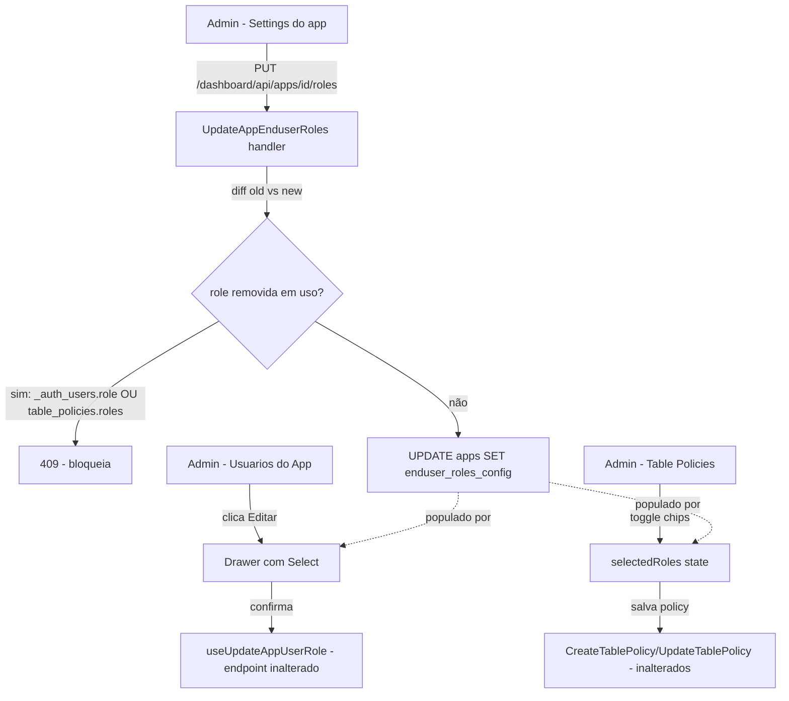

# End-User Roles Configuration Design

**Spec**: `.specs/features/enduser-roles-config/spec.md`
**Status**: Verified — implementado e validado (`validation.md`, PASS 2026-08-08)

---

## Architecture Overview

Nova coluna JSONB `enduser_roles_config` em `zeep_system.apps`, seguindo exatamente o padrão já usado por `auth_providers`/`storage_config`/`rate_limit_config` (`internal/dashboard/provisioner.go:100-102`). Um endpoint dedicado (`PUT /dashboard/api/apps/{id}/roles`) faz replace total da lista, com uma checagem de uso (end-users + policies) antes de aceitar a remoção de qualquer role. A leitura da lista não precisa de endpoint próprio — já viaja embutida no payload de app existente (`GetApp`/`ListApps`), do mesmo jeito que `storage_config` hoje.

Dois pontos de UI passam a consumir essa lista via `Select`/multi-select em vez de `Input` livre — nenhuma mudança no formato do JWT, no claim `role`, ou no `BuildPolicySQL` (que continua validando com `identRe` como segunda camada, independente da UI).



---

## Code Reuse Analysis

### Existing Components to Leverage

| Component | Location | How to Use |
| --- | --- | --- |
| Padrão de coluna JSONB por-app | `internal/dashboard/provisioner.go:100-102` | Adicionar `enduser_roles_config JSONB NOT NULL DEFAULT '["member"]'::jsonb` à mesma lista de `ALTER TABLE ... ADD COLUMN IF NOT EXISTS` — cobre migração de apps existentes E default de apps novos numa linha só (Postgres aplica o `DEFAULT` tanto a linhas existentes preenchidas na migração quanto a `INSERT`s futuros que não especifiquem a coluna). |
| `identRe` (pacote `dashboard`) | `internal/dashboard/handler.go:85` | Reusar exatamente essa instância pra validar cada role submetida no novo endpoint — mesma regra já usada em `UpdateAppUserRole` (`handler.go:2421`), sem criar uma terceira cópia (já existem duas: `handler.go:85` e `provisioner/policy.go:16`). |
| `schemaNameForDB` | conforme `AGENTS.md` — única forma correta de derivar o schema do app | Usar pra montar a query de contagem de uso em `_auth_users.role`. Nunca hardcodear `"app_" + name`. |
| `AppRow` / decode de colunas JSONB de `apps` | `internal/dashboard/apps_store.go:17-30` (struct), `:79-97`/`:186-203` (unmarshal em `ListApps`/`GetApp`) | Adicionar campo `EnduserRolesConfig []string` seguindo o mesmo padrão de unmarshal manual já usado para `StorageConfig`/`RateLimit`. |
| `useUpdateApp`/`useUpdateAppUserRole` (padrão de mutation hook) | `internal/dashboard/ui/src/lib/api.ts:135-148`, `:425-444` | Novo hook `useUpdateAppEnduserRoles` copia a mesma forma (PUT, invalida `['apps']` ou `['apps', id]`). `useUpdateAppUserRole` é reusado **sem alteração** pela P2 (só muda de onde é chamado — do Drawer, não da célula da tabela). |
| `drawer.tsx` (shadcn já instalado) | `internal/dashboard/ui/src/components/ui/drawer.tsx` | Base do drawer de edição de role da P2. Não existe `sheet.tsx` separado — usar `Drawer`/`DrawerContent` mesmo. |
| `select.tsx` (shadcn já instalado) | `internal/dashboard/ui/src/components/ui/select.tsx` | Reusado tal como está dentro do Drawer da P2 (mesmo componente já usado no dropdown de FK do `TableCard.tsx`). |
| `badge.tsx` (shadcn já instalado) | `internal/dashboard/ui/src/components/ui/badge.tsx` | Base dos chips do multi-select da P3 (ver Tech Decisions — não existe combobox/multi-select nativo no projeto, decisão de não trazer dependência nova). |
| Seção de Settings do app (padrão de config por-app) | `internal/dashboard/ui/src/pages/AppDetailsPage.tsx:409-436` (`storage_config`), `:538-601` (`rate_limit`) | Nova seção "Roles de usuário final" segue o mesmo padrão visual/estrutural dessas duas, na mesma página. |
| Coluna "Ações" já existente na tabela de usuários | `internal/dashboard/ui/src/pages/AppUsersPage.tsx:244-313` | Adicionar o botão "Editar" nessa coluna já existente (ao lado de ativar/desativar e resetar sessões) — não precisa criar coluna nova. |
| Gate `authEmailEnabled` | Padrão introduzido no fix `ROWPOL-25` (`internal/dashboard/ui/src/components/TableCard.tsx`) | Mesma prop já é passada hoje pra decidir se `_auth_users` aparece no FK dropdown — reusar o mesmo valor pra decidir se a seção de roles aparece em Settings. |

### Integration Points

| System | Integration Method |
| --- | --- |
| `zeep_system.apps` (Postgres) | Nova coluna JSONB, migrada via `ALTER TABLE ADD COLUMN IF NOT EXISTS` (idempotente, mesmo padrão das 3 colunas já existentes). |
| `zeep_system.table_policies` | Só leitura, na checagem de uso (`roles ? $1` — operador jsonb "existe elemento top-level") antes de bloquear remoção. Nenhuma coluna/constraint nova nessa tabela. |
| `_auth_users` (schema por-app) | Só leitura, na checagem de uso (`SELECT COUNT(*) WHERE role = $1`). Nenhuma mudança na tabela em si — continua `TEXT NOT NULL DEFAULT 'member'`, sem CHECK (decisão registrada no spec: whitelist é só de UI/dashboard, não constraint de banco). |
| `BuildPolicySQL` (`internal/provisioner/policy.go`) | Nenhuma mudança de código — continua validando cada role contra `identRe` (linha 140) como segunda camada, agora redundante com a validação de UI mas mantida como defesa em profundidade (AC ROLECFG-17). |

---

## Components

### Backend: coluna + migração

- **Purpose**: Persistir a lista de roles por app.
- **Location**: `internal/dashboard/provisioner.go` (linha ~102, mesma lista das outras 3 colunas).
- **Interfaces**: N/A (DDL puro).
- **Dependencies**: Nenhuma.
- **Reuses**: Padrão exato de `ALTER TABLE ... ADD COLUMN IF NOT EXISTS ... DEFAULT '...'`.

```sql
ALTER TABLE zeep_system.apps ADD COLUMN IF NOT EXISTS enduser_roles_config JSONB NOT NULL DEFAULT '["member"]'::jsonb
```

### Backend: `AppRow.EnduserRolesConfig`

- **Purpose**: Expor a lista já decodificada no payload de app (mesmo objeto retornado por `GetApp`/`ListApps`/`CreateApp`) — sem endpoint de leitura dedicado.
- **Location**: `internal/dashboard/apps_store.go` (struct `AppRow` ~linha 17-30; unmarshal nos mesmos pontos onde `StorageConfig`/`RateLimit` já são decodificados).
- **Interfaces**: campo `EnduserRolesConfig []string` (JSON tag `enduser_roles_config`).
- **Dependencies**: `encoding/json`.
- **Reuses**: Mesmo padrão de unmarshal manual já usado pra `StorageConfig`.

### Backend: `UpdateAppEnduserRoles` (handler)

- **Purpose**: Endpoint de replace total da lista de roles do app, com bloqueio de remoção em uso.
- **Location**: `internal/dashboard/handler.go` (novo handler, próximo a `UpdateAppUserRole` ~linha 2396).
- **Interfaces**:
  - `PUT /dashboard/api/apps/{id}/roles` — body `{"roles": ["member", "viewer"]}` (array completo, replace total, mesma semântica de `storage_config`/`rate_limit_config` hoje — não é merge-on-absent-key).
  - Resposta sucesso: `{"roles": ["member", "viewer"]}` (lista persistida).
  - Resposta erro de formato (400): `{"error": "role must match ^[a-z][a-z0-9_]{0,62}$"}` — mesma mensagem já usada em `UpdateAppUserRole`.
  - Resposta erro de duplicata (400): `{"error": "role already exists"}`.
  - Resposta erro de remoção bloqueada (409): `{"error": "role in use", "role": "admin", "endUserCount": 3, "policyCount": 1}`.
- **Dependencies**: `identRe` (`handler.go:85`), store novo (`CountAppUsersByRole`, `CountTablePoliciesByRole`, `UpdateAppEnduserRoles` no store).
- **Reuses**: `identRe`, `schemaNameForDB`, padrão de handler de `UpdateAppUserRole`.

**Lógica do handler:**
1. Parse body, valida cada role com `identRe` → 400 se falhar.
2. Rejeita duplicatas dentro do array submetido (comparação exata) → 400.
3. Busca lista atual (`GetApp`), calcula `removed := old \ new`.
4. Para cada role em `removed`: consulta `CountAppUsersByRole` + `CountTablePoliciesByRole`; se soma > 0, retorna 409 com os dois contadores e para no primeiro conflito encontrado.
5. Se nenhuma removida está em uso: `UPDATE zeep_system.apps SET enduser_roles_config = $1 WHERE id = $2`.

### Backend: rota

- **Purpose**: Registrar o endpoint.
- **Location**: `internal/server/server.go` (linha ~188-189, junto da rota de `UpdateAppUserRole`).
- **Interfaces**: `r.Put("/api/apps/{id}/roles", dashH.UpdateAppEnduserRoles)`.
- **Dependencies**: Middleware de auth de dashboard já existente (mesmo grupo de rotas de `/api/apps/{id}/...`).
- **Reuses**: Grupo de rotas já existente, nenhum middleware novo.

### Frontend: hook `useUpdateAppEnduserRoles`

- **Purpose**: Mutation React Query pro novo endpoint.
- **Location**: `internal/dashboard/ui/src/lib/api.ts` (próximo a `useUpdateApp`/`useUpdateAppUserRole`, ~linha 135-148/425-444).
- **Interfaces**: `useUpdateAppEnduserRoles(appId: string): UseMutationResult<{roles: string[]}, ApiError, string[]>`.
- **Dependencies**: `queryClient.invalidateQueries(['apps'])` (mesmo padrão de `useUpdateApp`).
- **Reuses**: Padrão exato de `useUpdateApp`.

### Frontend: seção "Roles de usuário final" (Settings)

- **Purpose**: UI de gestão da lista (P1).
- **Location**: `internal/dashboard/ui/src/pages/AppDetailsPage.tsx`, nova seção ao lado de `storage_config`/`rate_limit` (~linha 409-601), gated por `authEmailEnabled` (mesma prop já usada no fix `ROWPOL-25`).
- **Interfaces**: componente local (ex.: `EnduserRolesSection`), sem export — segue o padrão de seções inline já existentes nessa página (não há indicação de que `storage_config`/`rate_limit` sejam componentes extraídos em arquivo próprio).
- **Dependencies**: `useUpdateAppEnduserRoles`, `Input` (adicionar role nova), `Badge` (listar/remover roles existentes), `toast.error` em `onError` (regra do `AGENTS.md`).
- **Reuses**: `Input`, `Badge`, `Button`, padrão de mutation hook + toast já em uso na página.

### Frontend: `RoleCell` → coluna somente-leitura + botão "Editar" + Drawer

- **Purpose**: Implementa P2 — mover a edição da célula da tabela pro drawer de ações.
- **Location**: `internal/dashboard/ui/src/pages/AppUsersPage.tsx` — coluna `role` (linha ~203, remove uso de `RoleCell` como editor, passa a renderizar texto), coluna `actions` (linhas 244-313, adiciona botão), novo componente local `EditRoleDrawer`.
- **Interfaces**:
  - Coluna `role`: `cell: ({ row }) => <span>{row.original.role}</span>`.
  - Botão "Editar" na coluna `actions`, abre `EditRoleDrawer` com `userId`, `currentRole`, `availableRoles={app.enduserRolesConfig}`.
  - `EditRoleDrawer`: `Drawer` + `Select` (opções = `availableRoles`, mais a `currentRole` como opção extra se ela não estiver na lista — role órfã, AC ROLECFG-12) + botão "Salvar" que chama `useUpdateAppUserRole` (hook inalterado) e fecha o drawer; "Cancelar"/fechar sem chamar mutation.
- **Dependencies**: `Drawer`/`DrawerContent`/`DrawerFooter` (`ui/drawer.tsx`), `Select` (`ui/select.tsx`), `useUpdateAppUserRole` (já existe, inalterado).
- **Reuses**: `RoleCell` é removido/substituído (deixa de existir como editor inline); `useUpdateAppUserRole` reusado 100% sem mudança de contrato.

### Frontend: multi-select de chips pra `TablePolicies`

- **Purpose**: Implementa P3 — troca o `Input` CSV por seleção via chips.
- **Location**: `internal/dashboard/ui/src/components/TablePolicies.tsx` (substitui estado `rolesInput`/`:69`, parse CSV `:98-101`, `Input` `:169-174`).
- **Interfaces**: novo estado `selectedRoles: string[]` (substitui `rolesInput: string`); render: `availableRoles` (de `app.enduserRolesConfig`) como `Badge` clicável (toggle), mais qualquer role já persistida na policy que não esteja em `availableRoles` (role órfã) exibida como chip adicional, sempre visível/selecionada, também clicável pra remover (AC ROLECFG-16 — sem remoção automática, mas o admin pode remover manualmente).
- **Dependencies**: `Badge` (`ui/badge.tsx`).
- **Reuses**: `Badge`. Nenhum componente novo de biblioteca externa — ver Tech Decisions.

---

## Data Models

```typescript
// internal/dashboard/ui/src/lib/api.ts — estendendo o tipo App existente
interface App {
  // ...campos existentes (id, name, authEmailEnabled, storageConfig, rateLimit, ...)
  enduserRolesConfig: string[] // nunca vazio em app com authEmailEnabled=true; seed ["member"]
}
```

```go
// internal/dashboard/apps_store.go
type AppRow struct {
    // ...campos existentes
    EnduserRolesConfig []string `json:"enduser_roles_config"`
}
```

**Relationships**: `AppRow.EnduserRolesConfig` não tem FK/constraint com `_auth_users.role` nem com `table_policies.roles` — é só uma lista de opções pra UI. A checagem de uso no `UpdateAppEnduserRoles` é uma consulta ad-hoc no momento da remoção, não uma constraint de banco (decisão do spec: whitelist é de dashboard, não invariante de dado).

---

## Error Handling Strategy

| Error Scenario | Handling | User Impact |
| --- | --- | --- |
| Role submetida não casa `identRe` | 400, mesma mensagem de `UpdateAppUserRole` | Toast de erro no formulário de Settings, role não é adicionada. |
| Role submetida já existe na lista | 400 `role already exists` | Toast de erro, sem duplicar entrada. |
| Remoção de role em uso (`_auth_users` e/ou `table_policies`) | 409 com contadores | Toast de erro mostrando quantos usuários/policies usam a role, remoção não é aplicada. |
| App sem `auth_email_enabled` tenta acessar endpoint de roles diretamente (fora da UI) | Endpoint **não** valida `auth_email_enabled` — só a UI oculta a seção (ver Tech Decisions) | N/A via dashboard (seção oculta); chamada direta à API continua funcionando, comportamento aceito (mesma exceção já existe hoje pra outros configs por-app que não dependem de auth de end-user). |
| Drawer de edição de role fecha sem salvar | Nenhuma chamada de mutation disparada | Nenhuma mudança persistida, coluna da tabela continua com valor anterior. |
| `enduser_roles_config` fica vazio após remoção deliberada (nenhuma em uso) | Permitido (edge case do spec) | `Select`/multi-select ficam sem opções até admin cadastrar uma nova role; role órfã continua funcionando se algum end-user/policy já tiver um valor persistido de antes. |

---

## Risks & Concerns

| Concern | Location (file:line) | Impact | Mitigation |
| --- | --- | --- | --- |
| `identRe` duplicado em dois pacotes (`dashboard`, `provisioner`) | `internal/dashboard/handler.go:85`, `internal/provisioner/policy.go:16` | Tech debt pré-existente — risco de uma cópia divergir da outra no futuro | Fora do escopo desta feature (nenhum dos dois pontos muda); reusar a cópia de `dashboard` no novo handler, sem criar uma terceira. Registrar como candidato a limpeza futura, não bloqueia esta spec. |
| Nenhuma constraint de banco garante que `_auth_users.role`/`table_policies.roles` respeitem `enduser_roles_config` | `internal/provisioner/auth.go:71` (sem CHECK) | Escrita direta via API (`/auth/register` não seta role, mas nada impede um app custom inserindo via SQL fora do dashboard) pode continuar criando roles fora da lista configurada | Decisão explícita do spec (Assumptions): whitelist é UI-only, não invariante de dado — comportamento aceito, sem mitigação de código adicional. |
| Concorrência: dois admins editando a lista de roles ao mesmo tempo | `UpdateAppEnduserRoles` (novo) | Last-write-wins pode fazer uma adição de um admin desaparecer se outro salvar por cima com uma lista mais antiga | Aceito no spec (Edge Cases) — mesma semântica das demais colunas JSONB de `apps` hoje; sem lock otimista introduzido. |
| Checagem de uso faz 2 queries (end-users + policies) por role removida, sequencial, dentro do handler | Novo handler `UpdateAppEnduserRoles` | Latência extra proporcional ao número de roles removidas numa única chamada — irrelevante na prática (listas pequenas, poucas remoções por request) | Nenhuma — escala esperada é baixa (dezenas de roles no máximo, por app). |

> Nenhum risco de segurança novo identificado — o endpoint roda sob o mesmo middleware de auth de dashboard que já protege `/api/apps/{id}/...`.

---

## Tech Decisions (only non-obvious ones)

| Decision | Choice | Rationale |
| --- | --- | --- |
| Formato do endpoint | Um único `PUT` de replace total do array (`{"roles": [...]}`) em vez de sub-endpoints `POST add`/`DELETE remove` | Consistente com o padrão já usado por `storage_config`/`rate_limit_config` em `apps` (replace total, não merge-on-absent-key); a lógica de "bloquear remoção em uso" fica centralizada num único diff old-vs-new, mais simples que duplicar a checagem em dois handlers. |
| Sem endpoint GET dedicado | Lista viaja embutida no payload de app já existente (`GetApp`/`ListApps`) | Mesmo padrão de `auth_providers`/`storage_config` — já são lidos junto do app, sem endpoint próprio; criar um GET separado seria uma superfície de API redundante. |
| Multi-select da P3 é um componente novo, mínimo, baseado em `Badge` — não uma lib de terceiros | Nenhum combobox/multi-select existe hoje em `internal/dashboard/ui/src/components/ui/` (confirmado: só `accordion, badge, button, dialog, drawer, icon, input, label, select, separator, skeleton, switch, table, tabs, tooltip`) | Trazer uma dependência nova (ex. `cmdk`/Command) só pra um campo é desproporcional; toggle de `Badge` clicável resolve o caso de uso (poucas roles esperadas por app) sem nova dependência. Se o projeto criar mais campos multi-select no futuro, vale revisitar. |
| Checagem de uso em `table_policies.roles` via operador jsonb `?` (existe elemento top-level) | `roles ? $1` em vez de `roles @> $2::jsonb` | `?` é a forma correta pra "esse array jsonb contém esse elemento string" quando o array é plano de strings (é o caso aqui) — mais direto que `@>`, que compara contenção de documento e exigiria envolver o parâmetro num array literal. |
| `RoleCell` como editor inline é removido, não mantido como fallback | Coluna `role` passa a ser 100% somente-leitura na tabela | Decisão explícita do usuário nesta sessão — abre o padrão de drawer de ações que a próxima feature (criar usuário do app pela tela) vai reaproveitar; manter os dois modos (inline E drawer) seria inconsistência de UX sem motivo. |

> Nenhuma decisão aqui estabelece uma convenção de projeto que precise virar `AD-NNN` em `.specs/STATE.md` — `STATE.md` ainda não existe neste projeto (sem decisões ativas registradas a conformar ou suplantar).
