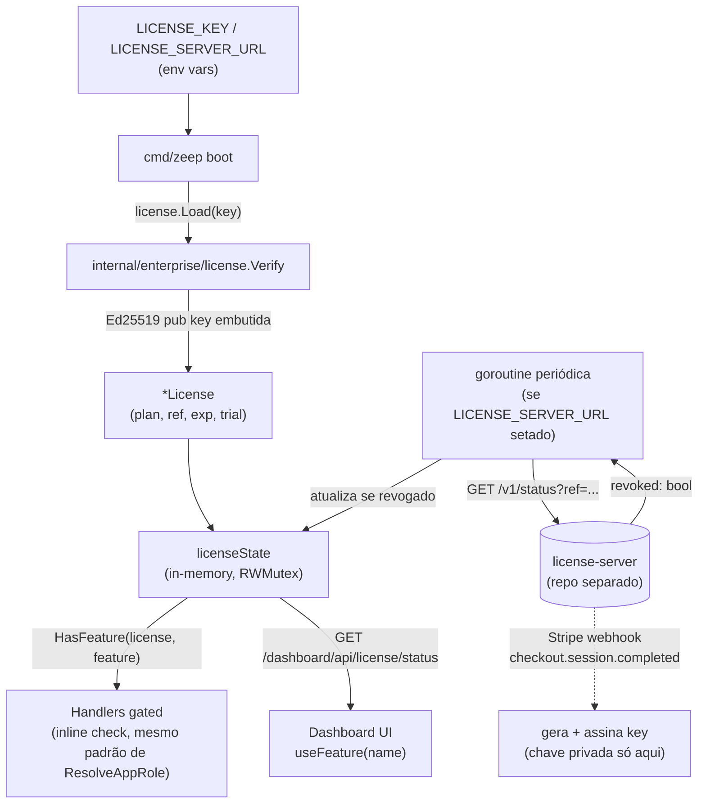

# Enterprise Licensing Design

**Spec**: `.specs/features/enterprise-licensing/spec.md`
**Status**: Draft

---

## Architecture Overview

Pacote novo `internal/enterprise/license` faz toda a verificação/gating do lado do zeep-orbit. Nenhuma dependência de rede é obrigatória — o `license-server` (repo separado da Zeep Labs) é opcional e só entra em jogo se `LICENSE_SERVER_URL` estiver configurado, para revogação. A pasta `internal/enterprise/` inteira (não só `license/`) vive sob `internal/enterprise/LICENSE` própria; o `LICENSE` raiz do repositório passa a ser um disclosure multi-licença apontando pra ela, igual ao padrão GrowthBook.



---

## Code Reuse Analysis

### Existing Components to Leverage

| Component | Location | How to Use |
|---|---|---|
| Padrão de checagem inline (`role == "superadmin"`, `ResolveAppRole`) | `internal/dashboard/*.go` | `HasFeature` chamado do mesmo jeito, sem middleware central novo |
| `usePublicConfig()` | `internal/dashboard/ui/src/lib/api.ts` | `GET /dashboard/api/license/status` entra nesse mesmo hook compartilhado, evita fetch ad-hoc |
| Config via env var + tabela de configuração no README | `README.md` (seção de configuração) | `LICENSE_KEY`, `LICENSE_SERVER_URL`, `LICENSE_REFRESH_INTERVAL` documentadas ali, seguindo `AGENTS.md` |
| Audit log | `internal/dashboard/audit_store.go` | Evento `license.loaded` (plan resolvido) e `license.revoked` no momento da transição |
| Padrão de goroutine periódica com lock | Nenhum idêntico encontrado no repo — introduzido aqui como novo padrão, mas segue o mesmo estilo de simplicidade (sem lib de scheduling externa, `time.Ticker` simples) | Reuso interno apenas |

### Integration Points

| System | Integration Method |
|---|---|
| `cmd/zeep` (boot) | Chama `license.Load()` uma vez na inicialização, guarda resultado em estado global do processo (mesmo nível de "config global" que outras flags de boot) |
| `license-server` (externo, opcional) | `GET {LICENSE_SERVER_URL}/v1/status?ref={ref}` — único endpoint consumido pelo zeep-orbit; contrato de resposta fixado abaixo |
| Dashboard UI | Novo endpoint `GET /dashboard/api/license/status`, novo hook `useFeature`, nova página "Licença" |

---

## Components

### `internal/enterprise/license.License` (tipo + verificação)

- **Purpose**: Decodificar, verificar assinatura e expor o plano/metadados de uma license key.
- **Location**: `internal/enterprise/license/license.go`
- **Interfaces**:
  ```go
  type Plan string

  const (
      PlanOSS        Plan = "oss"
      PlanEnterprise Plan = "enterprise"
  )

  type License struct {
      Org   string
      Plan  Plan
      Ref   string
      Trial bool
      IssuedAt  time.Time
      ExpiresAt *time.Time // nil = vitalícia, sem expiração
  }

  // Verify decodifica e valida a assinatura Ed25519 de uma key no formato
  // base64url(payload).base64url(signature). Nunca retorna erro fatal ao
  // chamador de boot — erros de verificação resultam em License{Plan: PlanOSS}.
  func Verify(key string) *License

  func (l *License) IsExpired() bool
  ```
- **Dependencies**: `crypto/ed25519` (stdlib), chave pública embutida em `internal/enterprise/license/publickey.go` (const, análoga a `public-key.ts` do GrowthBook)
- **Reuses**: nenhum componente pré-existente (pacote novo, sem precedente no repo)

### `internal/enterprise/license.Registry` (gating)

- **Purpose**: Mapear plano → features habilitadas, expor `HasFeature`.
- **Location**: `internal/enterprise/license/features.go`
- **Interfaces**:
  ```go
  type Feature string

  // Cada feature enterprise futura adiciona uma constante aqui.
  // (Nenhuma feature concreta é definida por este spec — ver Out of Scope.)

  var planFeatures = map[Plan][]Feature{
      PlanEnterprise: { /* preenchido conforme features forem criadas */ },
  }

  func HasFeature(l *License, f Feature) bool
  ```
- **Dependencies**: `License`
- **Reuses**: nenhum

### `internal/enterprise/license.State` (estado do processo + refresh)

- **Purpose**: Guardar a licença ativa em memória, rodar refresh periódico de revogação.
- **Location**: `internal/enterprise/license/state.go`
- **Interfaces**:
  ```go
  func Load(key string) *State           // chamado uma vez no boot
  func (s *State) Current() *License     // leitura thread-safe (RLock)
  func (s *State) StartRefresh(ctx context.Context, serverURL string, interval time.Duration)
  ```
- **Dependencies**: `Verify`, cliente HTTP simples (`net/http`, timeout curto, sem retry — se falhar, mantém estado atual)
- **Reuses**: nenhum padrão de scheduling existente no repo (novo)

### `internal/dashboard.LicenseHandler`

- **Purpose**: Expor status da licença pro frontend.
- **Location**: `internal/dashboard/license.go`
- **Interfaces**:
  - `GET /dashboard/api/license/status` — público (mesmo nível de `usePublicConfig`), retorna `{plan, features: []string, org, trial, expires_at}` (nunca vaza a key crua nem o `ref` completo — só o necessário pra UI)
- **Dependencies**: `internal/enterprise/license.State`
- **Reuses**: roteamento padrão do dashboard (`internal/dashboard/router.go` ou equivalente já existente)

### `internal/dashboard/ui/src/enterprise/useFeature.ts`

- **Purpose**: Hook de consulta de feature habilitada no frontend.
- **Location**: `internal/dashboard/ui/src/enterprise/useFeature.ts`
- **Interfaces**: `function useFeature(name: string): boolean`
- **Dependencies**: `usePublicConfig()` (estende o config público já carregado, não faz fetch próprio)
- **Reuses**: `usePublicConfig()` — licença entra como mais um campo do mesmo payload carregado antes do primeiro paint (regra do `AGENTS.md` de frontend)

---

## Data Models

Nenhuma tabela nova em `zeep_system` é necessária no lado do zeep-orbit — o estado de licença é resolvido em memória a partir da env var no boot, não persistido no banco da aplicação. Isso evita acoplar o schema-per-app do produto a um conceito que é global ao processo, não por-app.

**Payload da license key** (JSON antes do encode base64url, contrato fixado no spec, seção `LIC-30`):

```json
{
  "org": "string",
  "plan": "enterprise",
  "iat": "2026-08-01T00:00:00Z",
  "exp": null,
  "trial": false,
  "ref": "lic_abc123"
}
```

**Contrato de resposta do `license-server`** (`GET /v1/status?ref=...`, consumido só pelo refresh de revogação):

```json
{ "ref": "lic_abc123", "revoked": false }
```

Erro/timeout nessa chamada é tratado como "sem informação nova" — nunca como "revogado" (fail-open pra revogação, fail-closed nunca acontece por indisponibilidade de rede, conforme AC LIC-23 do spec).

---

## Error Handling Strategy

| Error Scenario | Handling | User Impact |
|---|---|---|
| Assinatura Ed25519 inválida | `Verify` retorna `License{Plan: PlanOSS}`, loga warning | Nenhum crash; app roda no plano `oss` |
| Payload JSON corrompido | Mesmo tratamento acima | Idem |
| Key expirada (`exp` no passado) | Mesmo tratamento acima | Idem |
| Chave pública desconhecida (rotação) | Erro específico logado (`"unknown public key version"`), mas resultado ainda é `PlanOSS` pro chamador — não derruba boot | Log ajuda suporte a identificar key de versão antiga |
| `LICENSE_SERVER_URL` inacessível no refresh | Mantém `*License` atual sem alteração, loga warning (não error) | Zero impacto no usuário |
| `license-server` confirma revogação | `State` transiciona pra `PlanOSS` no próximo `Current()`, evento `license.revoked` no audit log | Features enterprise somem da UI/API a partir do próximo ciclo, sem restart |
| Endpoint gated chamado sem feature habilitada | 403, corpo em inglês | Toast de erro no frontend (`onError` padrão) |

---

## Tech Decisions (only non-obvious ones)

| Decision | Choice | Rationale |
|---|---|---|
| Algoritmo de assinatura | Ed25519 em vez de RSA-PSS (GrowthBook usa RSA-PSS) | Stdlib Go, sem parâmetro de padding pra errar, assinatura menor — decidido explicitamente no brainstorm, sem motivo pra replicar RSA aqui |
| Onde vive o estado de licença | Memória do processo (global, resolvido no boot), não banco de dados | Licença é config de processo, não dado de aplicação; evita acoplar ao schema-per-app e evita ter que invalidar cache de banco quando a key muda (só precisa reiniciar, que já é o fluxo natural de trocar env var) |
| Cap de seats/usuários | Nenhum — só gating de feature | Decidido explicitamente no brainstorm: licença vitalícia sem conceito de seat seria uma complicação sem valor de negócio real pro modelo escolhido |
| Falha de rede no refresh de revogação | Fail-open (mantém último estado válido) | Indisponibilidade do `license-server` da Zeep Labs nunca deve penalizar o cliente que já tem licença válida — mesmo padrão do GrowthBook |
| Lista de features enterprise concretas | Não definida neste spec/design | Mecanismo é genérico por design; classificar cada feature futura como core/enterprise é decisão de produto tomada quando aquela feature for especificada, não travada aqui (ver Out of Scope do spec) |
| Onde a chave privada de assinatura vive | Só no `license-server`, nunca em nenhum artefato deste repositório | Vazamento da chave privada no zeep-orbit permitiria qualquer pessoa forjar licença enterprise — risco alto, tratado como invariante de segurança, não como detalhe de implementação |
| Contrato `license-server` fixado aqui, implementação lá | Este spec define só o payload da key e o endpoint `/v1/status` | `license-server` é produto separado da Zeep Labs (repo próprio), com seu próprio ciclo de spec/design/tasks — misturar os dois infla o escopo deste spec e acopla releases desnecessariamente |

---

## Tips aplicadas

- Reuso verificado por busca no código antes de declarar "não existe" (padrão de goroutine periódica, hook de config público).
- Nenhuma tabela nova em `zeep_system` — decisão explícita registrada em Data Models, não omissão.
- Texto legal da licença enterprise (`internal/enterprise/LICENSE`) permanece fora deste documento — é artefato jurídico, não técnico (ver spec.md).
