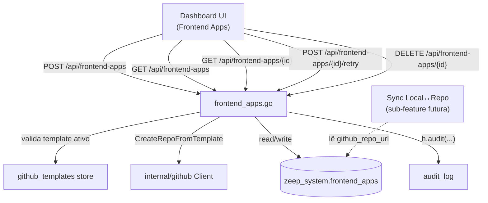

# Frontend App Entity Design

**Spec**: `.specs/features/frontend-app-entity/spec.md`
**Status**: Draft

---

## Architecture Overview

Novo par de arquivos `internal/dashboard/frontend_apps.go` (handler HTTP) + `internal/dashboard/frontend_apps_store.go` (persistência), seguindo o mesmo padrão fino já usado por `github_config.go`/`github_templates.go`. Não há schema PostgreSQL por app nem REST CRUD gerado — a entidade é só metadado em `zeep_system`, e a criação chama diretamente `internal/github.Client.CreateRepoFromTemplate` (síncrono, sem fila/job).



---

## Code Reuse Analysis

### Existing Components to Leverage

| Component | Location | How to Use |
|---|---|---|
| `internal/github.Client.CreateRepoFromTemplate` | `internal/github/client.go` (spec'd em github-integration, ainda não implementado) | Chamada direta e síncrona na criação e no retry |
| `internal/github.Client` — checagem de conexão | mesmo pacote | Antes de criar, checar `github_app_config.installation_id` presente (via store, não repetir chamada de API) |
| `github_templates` store | `internal/dashboard/github_templates.go` | Reusar leitura para validar `template_id` ativo antes de qualquer chamada ao GitHub |
| Audit log | `internal/dashboard/audit_store.go` (`h.audit(...)`) | Eventos `frontend_app.create`, `frontend_app.retry`, `frontend_app.delete` |
| Middleware de autenticação padrão | `internal/dashboard/middleware.go` | `RequireAuth` (não `RequireSuperadmin` — qualquer usuário autenticado, decisão do brainstorm) |
| Provisionamento de tabelas `zeep_system.*` | `internal/dashboard/provisioner.go` | Adicionar `CREATE TABLE IF NOT EXISTS frontend_apps` no mesmo bloco de DDL |
| Padrão de slugify | Nenhum existente identificado no repo — introduzir helper simples em `internal/dashboard/frontend_apps.go` (lowercase, espaço→hífen, remove caracteres não `[a-z0-9-]`) | Reuso interno apenas, sem dependência externa |

### Integration Points

| System | Integration Method |
|---|---|
| `internal/github.Client` | Chamada síncrona em `POST /api/frontend-apps` e `POST /api/frontend-apps/{id}/retry`; chamada de arquivamento (`PATCH /repos/{owner}/{repo}` `archived: true`) em `DELETE` |
| PostgreSQL (`zeep_system`) | Tabela nova `frontend_apps`, com FK para `github_templates(id)` |
| Audit log | Eventos de criação, retry e remoção |

---

## Components

### `internal/dashboard.FrontendAppsHandler`

- **Purpose**: Endpoints HTTP de criação, listagem, retry e remoção de frontend apps.
- **Location**: `internal/dashboard/frontend_apps.go`
- **Interfaces**:
  - `POST /api/frontend-apps` — `{name, template_id}` → valida, slugifica, cria repo, persiste
  - `GET /api/frontend-apps` — lista não-arquivados
  - `GET /api/frontend-apps/{id}` — detalhe
  - `POST /api/frontend-apps/{id}/retry` — refaz criação em registro `failed`
  - `DELETE /api/frontend-apps/{id}` — soft delete + arquiva repo no GitHub
- **Dependencies**: `internal/github.Client`, `github_templates` store, `frontend_apps_store`, `audit_store`
- **Reuses**: `middleware.RequireAuth`, `h.audit(...)`

### `internal/dashboard.frontendAppsStore`

- **Purpose**: CRUD de `zeep_system.frontend_apps` (insert, update de status, soft delete, listagem filtrada por `archived_at IS NULL`).
- **Location**: `internal/dashboard/frontend_apps_store.go`
- **Interfaces**:
  - `Create(ctx, app) (id, error)`
  - `UpdateStatus(ctx, id, status, errorMessage, repoURL string) error`
  - `Get(ctx, id) (*FrontendApp, error)`
  - `List(ctx) ([]FrontendApp, error)`
  - `Archive(ctx, id) error`
  - `SlugExists(ctx, slug string) (bool, error)` — usado antes da chamada ao GitHub, mas a garantia real é o unique index parcial (checagem em código é só pra devolver erro amigável antes de tentar o insert)
- **Reuses**: mesmo padrão de store simples com `pgx` já usado por `github_templates`

---

## Data Models

### `frontend_apps`

```sql
CREATE TABLE zeep_system.frontend_apps (
    id              UUID PRIMARY KEY DEFAULT gen_random_uuid(),
    name            TEXT NOT NULL,
    slug            TEXT NOT NULL,
    template_id     UUID NOT NULL REFERENCES zeep_system.github_templates(id),
    github_repo_url TEXT NOT NULL DEFAULT '',
    status          TEXT NOT NULL DEFAULT 'ready',  -- 'ready' | 'failed'
    error_message   TEXT NOT NULL DEFAULT '',
    created_by      TEXT NOT NULL,
    created_at      TIMESTAMPTZ NOT NULL DEFAULT now(),
    archived_at     TIMESTAMPTZ
);

CREATE UNIQUE INDEX IF NOT EXISTS idx_frontend_apps_slug
    ON zeep_system.frontend_apps (slug) WHERE archived_at IS NULL;
```

**Relationships**: `template_id` referencia `github_templates(id)` com FK real (a sub-feature GitHub Integration deixou essa relação sem FK propositalmente, porque a tabela consumidora ainda não existia — agora existe).

**Status values**: só `ready`/`failed` — não há `pending`, porque a criação é sempre síncrona (AC confirmado no brainstorm).

---

## Error Handling Strategy

| Error Scenario | Handling | User Impact |
|---|---|---|
| `template_id` inválido/inativo | Rejeita antes de qualquer chamada ao GitHub | "Template inválido ou desativado" |
| GitHub não conectado | Checa `github_app_config.installation_id` antes de slugificar | "GitHub não conectado — peça ao admin conectar em Integrações" |
| Slug colide com app não-arquivado | Checagem prévia (`SlugExists`) + unique index parcial como garantia final contra race condition | "Nome já em uso — escolha outro" |
| `CreateRepoFromTemplate` falha (rate limit, rede, 5xx) | Persiste `status: failed` + `error_message`, não propaga stack/erro cru | Registro aparece na listagem como falho, com botão de retry |
| Retry em app não-`failed` | Rejeita antes de chamar o GitHub | "Este app não está em estado de falha" |
| Retry repete erro de slug duplicado | Mesma checagem de `SlugExists` roda de novo, falha de novo (comportamento esperado, não é bug) | "Nome já em uso — escolha outro" (mensagem indica que retry não resolve isso) |
| Arquivamento do repo falha no `DELETE` | Soft delete local já aplicado antes da chamada ao GitHub; falha remota só loga em audit, não reverte o soft delete | App some da listagem no dashboard mesmo se o arquivamento remoto falhar (aceito — ver Tech Decisions) |

---

## Tech Decisions (only non-obvious ones)

| Decision | Choice | Rationale |
|---|---|---|
| Criação síncrona vs. assíncrona | Síncrona, sem fila/job/polling | `CreateRepoFromTemplate` é rápido (segundos); assíncrono adicionaria complexidade (job runner, polling) sem ganho perceptível pro usuário — decisão confirmada no brainstorm |
| Permissão de criação | Qualquer usuário autenticado (`RequireAuth`), sem RBAC | RBAC ainda não existe no produto (ROADMAP M3 pendente); bloquear nisso adiaria a feature inteira — decisão explícita de aceitar esse gap temporariamente |
| Falha preserva registro | Sim — `status: failed` persistido, não descarta a tentativa | Preserva contexto do usuário e habilita retry sem precisar re-digitar nome/template |
| Retry no mesmo registro vs. novo registro | Mesmo registro (`POST .../retry`) | Evita poluir listagem com tentativas mortas; falha mais comum é transitória (rate limit), não erro de input — retry no mesmo registro resolve a maioria dos casos |
| Delete: soft delete + archive no GitHub | Ambos, nessa ordem (soft delete local primeiro, archive remoto depois, sem rollback se o remoto falhar) | Consistente com padrão soft-delete do produto; não bloquear a remoção local por indisponibilidade externa do GitHub |
| Slug único só entre não-arquivados | Unique index parcial (`WHERE archived_at IS NULL`) | Permite reuso de nome depois de um app removido, sem exigir "hard delete" pra liberar o slug |
| `template_id` com FK real | FK direta pra `github_templates(id)` | Diferente do design do GitHub Integration (que não tinha FK por a tabela consumidora não existir ainda) — agora existe, então usar FK de verdade em vez de referência solta |

---

## Tips aplicadas

- Diagramas: `mermaid-studio` não detectado no ambiente — usado mermaid inline conforme fallback do skill.
- Reuso: toda decisão de não-reuso (ex: falta de helper de slugify no repo) foi verificada por busca no código antes de assumir "não existe".
- Interfaces definidas antes de qualquer implementação.
