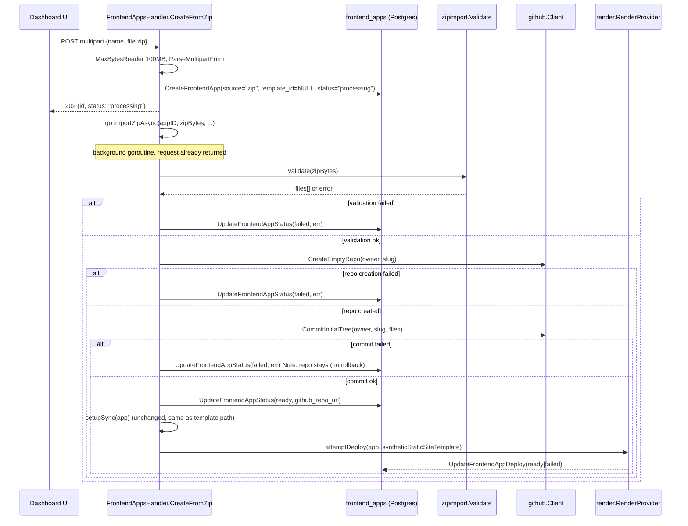

# Frontend App ZIP Import Design

**Spec**: `.specs/features/frontend-app-zip-import/spec.md`
**Status**: Approved

---

## Architecture Overview

The ZIP path plugs into the existing `frontend_apps` lifecycle at the same points the template path already uses (`setupSync`, `attemptDeploy`), replacing only the "how does code end up in the repo" step. The new step runs in a background goroutine so the HTTP handler can return immediately with `status: "processing"` (per spec `ZIP-01`).

### Approach: chosen Git write strategy

**Git Data API** (blob per file → tree → commit → ref update), confirmed with the user over two alternatives:

| Approach | How | Trade-off |
| -------- | --- | --------- |
| **Git Data API** (chosen) | `POST .../git/blobs` (base64) per file → `POST .../git/trees` → `POST .../git/commits` (no parent) → `POST .../git/refs` (`refs/heads/main`) | One commit, atomic ref update, pure REST — matches `client.go`'s existing style. Cost: 1 API call per file (bounded by the spec's 5000-entry ceiling). |
| Contents API (`PUT .../contents/{path}` per file) | Same call count as Git Data API | Rejected: one commit per file (polluted history), no atomicity, no advantage over Git Data API. |
| Local clone + push via SSH deploy key | `git` CLI in a temp dir, push using a deploy key created *before* code exists | Rejected: introduces a new operational dependency (`git` binary, temp dirs) the GitHub client doesn't have today (pure REST client), and forces reordering `setupSync` ahead of commit. |



---

## Code Reuse Analysis

### Existing Components to Leverage

| Component | Location | How to Use |
| --------- | -------- | ---------- |
| `slugify` / `SlugExists` | `internal/dashboard/frontend_apps.go:24-32`, `frontend_apps_store.go` | Reused as-is for name→slug + uniqueness check, identical to the template path. |
| `GetGitHubConfig` | `internal/dashboard/frontend_apps.go` (via provisioner-backed store) | Reused as-is to confirm a GitHub App is connected before starting. |
| `CreateFrontendApp` / `UpdateFrontendAppStatus` / `UpdateFrontendAppDeploy` | `internal/dashboard/frontend_apps_store.go` | Reused as-is; `CreateFrontendApp`'s input widens (see Data Models) but the function signature and callers elsewhere are unaffected. |
| `setupSync` | `internal/dashboard/frontend_apps.go:568-594` | Called unchanged once the ZIP-sourced app reaches `status: "ready"` — sync is repo infrastructure, not template-specific. |
| `attemptDeploy` | `internal/dashboard/frontend_apps.go:604-664` | Called unchanged with a synthetic in-memory `*GitHubTemplate` carrying only the fixed static-site preset fields (no DB row needed) — avoids touching a function three other call sites depend on. |
| `buildDeployProvider`, `render.RenderProvider.CreateService` | `internal/dashboard/frontend_apps.go:596-602`, `internal/deploy/render/render.go:223-305` | Reused as-is; `ServiceType: "static_site"` is an already-handled branch (`render.go:227-231`). |
| `RateLimitError` / `rateLimitErrorFromResponse` | `internal/github/client.go:66-86, 408-431` | Reused by the two new `Client` methods for consistent rate-limit surfacing. |
| `doAuthenticated` | `internal/github/client.go` | Reused by the two new `Client` methods — same installation-token auth path as every existing call. |
| Existing `Dialog`/`Select`/`Input` design-system components | `internal/dashboard/ui/src/pages/FrontendAppsPage.tsx`, `@/components/ui/*` | Reused inside the new tabbed layout; only a `Tabs` component and a file input are net-new UI. |

### Integration Points

| System | Integration Method |
| ------ | ------------------- |
| GitHub REST API (installation token) | Two new `github.Client` methods, same `doAuthenticated` + base URL as existing methods. |
| Render API | No new integration — existing `CreateService` call reused verbatim with a fixed param set instead of template-sourced ones. |
| Postgres (`zeep_system.frontend_apps`) | Additive migration (new column + relaxed constraint), same idempotent `ALTER TABLE ... ADD COLUMN IF NOT EXISTS` pattern already used in `provisioner.go`. |

---

## Components

### `zipimport` (new package)

- **Purpose**: Validate an uploaded ZIP's safety and structure, and return a normalized, flattened file list ready to commit — with zero GitHub/network awareness.
- **Location**: `internal/zipimport/validate.go`
- **Interfaces**:
  - `Validate(data []byte) (Result, error)` — opens the ZIP, enforces size/count/path-safety rules, strips a single common top-level directory if present, checks for `package.json` at the normalized root. Returns `Result{Files []FileEntry}` on success; a typed, user-facing error otherwise (each spec AC ZIP-05/08/09 maps to one distinct error case so the handler can persist a precise `error_message`).
  - `FileEntry{Path string, Content []byte}` — one normalized, safe file ready to become a Git blob.
- **Dependencies**: `archive/zip`, `bytes` (stdlib only — no new third-party dependency).
- **Reuses**: nothing existing (net-new validation domain); every rule here is a direct translation of spec ACs ZIP-04/05/06/08/09.

### `github.Client` additions

- **Purpose**: Create an empty private repo and commit an initial file set to it in one atomic commit, extending the existing template-only client.
- **Location**: `internal/github/client.go`
- **Interfaces**:
  - `CreateEmptyRepo(ctx context.Context, owner, slug string) (htmlURL string, err error)` — `POST /orgs/{owner}/repos` with `{name, private: true, auto_init: false}`. Mirrors `CreateRepoFromTemplate`'s error handling (422/403/429).
  - `CommitInitialTree(ctx context.Context, owner, repo string, files []zipimport.FileEntry, message string) (commitSHA string, err error)` — creates one blob per file (`encoding: "base64"` explicitly, for every file — see Tech Decisions), builds the tree, creates the commit with no parent, then creates `refs/heads/main` pointing at it.
- **Dependencies**: `InstallationTokenCache` (existing), `zipimport.FileEntry`.
- **Reuses**: `doAuthenticated`, `rateLimitErrorFromResponse`, `unexpectedStatusError` — same helpers `CreateRepoFromTemplate` already uses.

### `FrontendAppsHandler.CreateFromZip` (new handler method)

- **Purpose**: HTTP entry point for the "Import ZIP" tab — validates the request, persists the `processing` row, and hands off to the background import.
- **Location**: `internal/dashboard/frontend_apps.go`
- **Interfaces**:
  - `CreateFromZip(w http.ResponseWriter, r *http.Request)` — `POST /dashboard/api/frontend-apps/zip-import`, `multipart/form-data` with fields `name` and `file`.
- **Dependencies**: `zipimport.Validate` (called inside the goroutine, not the handler, so the HTTP response is fast even though validation itself is cheap — keeps all failure paths, including validation, going through the same `status: failed` write path instead of splitting sync-reject vs async-reject arbitrarily for content checks; only request-shape rejects — bad multipart, oversized body, invalid slug/name, GitHub not connected — happen synchronously before persisting the row, matching ACs ZIP-06/07/10/11 which explicitly say "before any processing starts").
- **Reuses**: `slugify`, `SlugExists`, `GetGitHubConfig`, `CreateFrontendApp`, the existing `audit_log` write pattern (`frontend_apps.go:199-204`).

### `importZipAsync` (new private function, background goroutine body)

- **Purpose**: Orchestrate validate → create repo → commit → sync → deploy for one ZIP import, updating `frontend_apps` at each stage boundary.
- **Location**: `internal/dashboard/frontend_apps.go`
- **Interfaces**: `func (h *FrontendAppsHandler) importZipAsync(ctx context.Context, appID uuid.UUID, zipBytes []byte, owner, slug, subdomain string)` — takes a fresh `context.Background()`-derived context (not the request's, since the request has already returned) with its own timeout.
- **Dependencies**: `zipimport.Validate`, `github.Client.CreateEmptyRepo`/`CommitInitialTree`, `setupSync`, `attemptDeploy`.
- **Reuses**: `setupSync`, `attemptDeploy`, `UpdateFrontendAppStatus`, `UpdateFrontendAppDeploy` — all called exactly as the template path already calls them, just from a goroutine instead of inline in the request.

### `FrontendAppsPage.tsx` — "Import ZIP" tab (new UI)

- **Purpose**: Second tab in the existing creation `Dialog`, showing the fixed deploy preset and accepting a name + `.zip` file.
- **Location**: `internal/dashboard/ui/src/pages/FrontendAppsPage.tsx`
- **Interfaces**: Reuses the existing `Dialog` open/close state; adds a `Tabs`/`TabsList`/`TabsTrigger`/`TabsContent` split (`@/components/ui/tabs`, already part of the design system per other pages) between "From template" (existing form, untouched) and "Import ZIP" (new form: name `Input`, static-preset info panel, file `Input type="file" accept=".zip"`).
- **Dependencies**: New mutation calling `POST /dashboard/api/frontend-apps/zip-import` with `FormData`.
- **Reuses**: `Dialog`, `Input`, `Label`, `Button`, `Icon`, `StatusPill` (for rendering the `processing` status in the table, a value it doesn't render yet).

---

## Data Models

### `zeep_system.frontend_apps` (migration, additive)

```sql
ALTER TABLE zeep_system.frontend_apps
  ALTER COLUMN template_id DROP NOT NULL,
  ADD COLUMN IF NOT EXISTS source TEXT NOT NULL DEFAULT 'template';

ALTER TABLE zeep_system.frontend_apps
  ADD CONSTRAINT frontend_apps_source_template_id_check
  CHECK (
    (source = 'template' AND template_id IS NOT NULL) OR
    (source = 'zip' AND template_id IS NULL)
  );
```

Existing rows default to `source = 'template'` with their existing non-null `template_id`, satisfying the check with no backfill needed. `status` gains an accepted value `'processing'` at the Go validation layer only — no DB-level enum/CHECK exists on `status` today (confirmed in `provisioner.go`), so no migration is needed for that part.

**Relationships**: `template_id` remains a nullable FK to `github_templates(id)`; unchanged for `source = 'template'` rows. No new table.

### `FrontendAppInput` (Go struct, widened)

```go
type FrontendAppInput struct {
    Name         string
    Slug         string
    TemplateID   *uuid.UUID // nil when Source == "zip"
    Source       string     // "template" | "zip"
    CreatedBy    string
    BackendAppID *uuid.UUID
    OwnerID      *uuid.UUID
}
```

`TemplateID` changes from a required `uuid.UUID` to `*uuid.UUID` — the two existing call sites (`Create`, `Retry` in `frontend_apps.go`) pass `&templateID` and `Source: "template"`; no behavior change for them.

---

## Error Handling Strategy

| Error Scenario | Handling | User Impact |
| --------------- | -------- | ------------ |
| Multipart body > 100MB | `http.MaxBytesReader` rejects before `ParseMultipartForm` completes | 413/400 synchronously, no row created (ZIP-07) |
| Not a valid ZIP (corrupt / wrong format) | `archive/zip.NewReader` returns an error, surfaced by `zipimport.Validate` | Row created as `status: "processing"` then flipped to `failed` with a clear message (ZIP-06 happens inside the async path since the file is already fully received by then — see note in `CreateFromZip` above) |
| Zip-bomb thresholds exceeded (>500MB uncompressed or >5000 entries) | `zipimport.Validate` counts while iterating, aborts early once either threshold is crossed | `status: "failed"`, size-limit message (ZIP-08) |
| Path traversal / symlink entry | `zipimport.Validate` rejects the whole archive on the first unsafe entry | `status: "failed"`, security-validation message (ZIP-09) |
| No `package.json` at normalized root | `zipimport.Validate` returns a specific "missing package.json" error | `status: "failed"`, explicit message pointing at the requirement shown pre-upload (ZIP-05) |
| Slug collision | Existing `SlugExists` check, synchronous | 409 before any row is created, identical to template path (ZIP-10) |
| GitHub App not connected | Existing `GetGitHubConfig` check, synchronous | Same error as template path (ZIP-11) |
| `CreateEmptyRepo` fails (permissions/rate-limit/name conflict) | Goroutine catches, calls `UpdateFrontendAppStatus(failed, err)` | `status: "failed"` with the underlying GitHub error (ZIP-12's repo-creation half) |
| `CommitInitialTree` fails partway (e.g. rate-limited mid-blob-creation) | Goroutine catches, calls `UpdateFrontendAppStatus(failed, err)`; repo is left in place, uncommitted/partially-committed | `status: "failed"`, repo visible on GitHub for manual inspection/deletion (ZIP-12) |
| Render deploy call fails | Existing `attemptDeploy` behavior, unchanged | `status: "ready"`, `deploy_status: "failed"` (ZIP-13) |

---

## Risks & Concerns

| Concern | Location (file:line) | Impact | Mitigation |
| ------- | --------------------- | ------ | ----------- |
| **Unverified GitHub App permission scope for org-level repo creation.** `CreateRepoFromTemplate`'s existing 403 handler explicitly names "Administration" *repository* permission (`internal/github/client.go:236-238, 274`) as what's already granted for the template `generate` endpoint. `POST /orgs/{owner}/repos` (needed for `CreateEmptyRepo`) may require "Administration" *organization* permission instead — a distinct scope, not confirmed against this instance's actual GitHub App manifest. | `internal/github/client.go:236-238` (existing comment); new `CreateEmptyRepo` | If the permission is missing, every ZIP import fails at the first step with a 403, and existing instances would need the GitHub App manifest updated + reinstalled to grant it (same operational cost as any permission change per `github-integration` spec's decisions). | Add an explicit spike/verification task at the start of Tasks: call `POST /orgs/{owner}/repos` against a real test installation before writing the rest of the pipeline. If missing, document the required permission addition and reinstall step alongside the existing GitHub App setup docs, before shipping. |
| **Per-file Blob API calls exhaust the installation's REST budget on large imports.** A 5000-entry ZIP (the spec's own ceiling) costs up to ~5003 API calls in one import (blobs + tree + commit + ref), against a typical GitHub App installation budget of ~5000 requests/hour. | new `CommitInitialTree`, `internal/github/client.go` | A large-but-within-limits ZIP could exhaust the installation's rate limit mid-import, or leave little budget for other concurrent dashboard operations hitting the same installation token. | Reuse the existing `RateLimitError`/`rateLimitErrorFromResponse` handling so a mid-import rate-limit surfaces as a normal `status: failed` (not a crash or a stuck `processing` row). Document in the UI's fixed-preset panel that practical frontend source ZIPs (no `node_modules`/build output) are typically a few hundred files, well under this. Treat further optimization (e.g. lowering the entry ceiling, or a follow-up bulk-write mechanism) as a future feature — no evidence yet that real usage needs it. |
| **Unbounded concurrent in-memory ZIP buffering.** Each `CreateFromZip` call buffers up to 100MB in the handler/goroutine; there is no queue or concurrency cap on how many imports can run at once. | new `CreateFromZip` / `importZipAsync` | Many simultaneous large imports could pressure memory on the dashboard process. | Accepted for now — no evidence of concurrent-import load in this dashboard's actual usage pattern; a worker-pool/queue is a legitimate future task if usage shows otherwise, not something to build speculatively today. |
| **Trees API inline `content` field's binary-safety is unconfirmed against official docs** (fetched during this design's research; GitHub's docs describe `content` only as "the content you want this file to have," without specifying encoding). | Tech Decisions (below) | Using it for binary files (images, fonts) without confirmation could silently corrupt those files. | Design avoids the question entirely: every file goes through the explicit `Blobs` API with `encoding: "base64"` (documented, verified-safe for both text and binary), never the Trees API's inline `content` shortcut. |
| **`FrontendAppInput.TemplateID` type change is a breaking signature change for two existing call sites.** | `internal/dashboard/frontend_apps.go` (`Create`, `Retry`), `frontend_apps_store.go` | If a Tasks-phase implementer misses one call site, the build fails loudly (Go compiler) — low real risk, but worth naming explicitly so it's not "discovered" mid-implementation. | Both call sites are already known and listed in Code Reuse Analysis above; the Tasks phase should include updating them as part of the same task that changes the struct, not a separate one (keeps the change atomic and always-compiling). |

---

## Tech Decisions (only non-obvious ones)

| Decision | Choice | Rationale |
| -------- | ------ | --------- |
| Git write strategy | Git Data API (blob → tree → commit → ref), confirmed with user over Contents API and local clone+push | See Architecture Overview approach table. |
| Blob encoding | Always `encoding: "base64"` via the Blobs API, never Trees API inline `content` | Official docs don't confirm inline `content` is binary-safe (verified during this design's research); Blobs API's `encoding` field is explicitly documented and covers both text and binary uniformly — one code path instead of a text/binary branch. |
| Where content validation happens | Inside the async goroutine, not the synchronous handler | Only request-shape checks (size, multipart validity, name/slug, GitHub-connected) block the response; ZIP *content* validation (bomb thresholds, path safety, `package.json`) happens after the `processing` row is created and the response has been sent, per the spec's async decision — keeps one failure-reporting path (`status`/`error_message`) for every content-level problem instead of splitting some into a different HTTP error shape. |
| `attemptDeploy` reuse mechanism | Build a synthetic in-memory `*GitHubTemplate` carrying only the fixed static-site preset fields, pass it to the existing unmodified function | Avoids changing a function three code paths already depend on (`Create`, `Retry`, `DeployRetry`); the fixed preset is a value, not a new behavior branch inside `attemptDeploy` itself. |
| Default branch name | `main` | GitHub's current default for new repos; the empty repo created via `CreateEmptyRepo` has no branch until the ref is created, so this is a explicit choice, not inherited from anywhere. |

> **Project-level decision candidate**: none of the above rise to a cross-feature convention — they're specific to how this one feature writes files to a freshly created (as opposed to templated) repo. Nothing appended to `.specs/STATE.md`.
