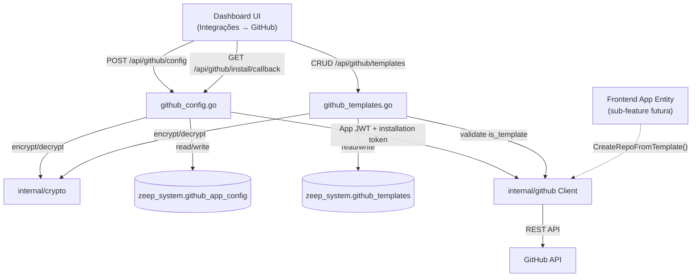

# GitHub Integration Design

**Spec**: `.specs/features/github-integration/spec.md`
**Status**: Verified — implementado e mergeado (verificado 2026-08-10 contra o código; ver `tasks.md`)

---

## Architecture Overview

Um novo pacote de domínio `internal/github/` encapsula toda a interação com a API do GitHub (autenticação de App, geração de repo a partir de template). Ele não sabe nada de HTTP handler nem de dashboard — recebe credenciais já decriptadas e devolve dados ou erro.

A camada `internal/dashboard/` ganha dois arquivos novos (`github_config.go`, `github_templates.go`) seguindo exatamente o padrão já usado por `auth_providers_store.go` e `system_config_store.go`: handlers HTTP finos que carregam config do banco, decriptam com `internal/crypto`, chamam `internal/github`, e persistem resultado.



---

## Code Reuse Analysis

### Existing Components to Leverage

| Component | Location | How to Use |
|---|---|---|
| `crypto.Encrypt` / `crypto.Decrypt` (AES-256-GCM) | `internal/crypto/aes.go` | Criptografar/decriptografar `private_key`, `client_secret`, `webhook_secret` antes de persistir — mesma função já usada pelo Google OAuth e Auth Providers |
| Padrão de store singleton | `internal/dashboard/system_config_store.go` | `github_app_config` é linha única, mesmo padrão de upsert que `system_config` |
| Padrão de store com encrypted config | `internal/dashboard/auth_providers_store.go` | Estrutura de `Get`/`Upsert` com campo `_encrypted` e preservação de valor existente quando não enviado |
| Audit log | `internal/dashboard/audit_store.go` (`h.audit(...)`) | Reusar `InsertAuditLog` direto — sem mudanças no pacote |
| Bootstrap status pattern | `internal/dashboard/handler.go` (`GET /api/bootstrap/status`) | Mesmo formato de status endpoint sem estado sensível exposto, aplicado a `GET /api/github/status` |
| Migração/provisionamento de tabelas `zeep_system.*` | `internal/dashboard/provisioner.go` | Adicionar `CREATE TABLE IF NOT EXISTS github_app_config` e `github_templates` seguindo o mesmo bloco de DDL das tabelas existentes |
| Middleware superadmin-only | `internal/dashboard/middleware.go` | Aplicar aos novos endpoints, mesmo guard usado em Auth Providers e Users |

### Integration Points

| System | Integration Method |
|---|---|
| GitHub REST API | Novo client HTTP em `internal/github/client.go`, autenticado via JWT de App (RS256 assinado com a private key) trocado por installation token de curta duração a cada chamada |
| PostgreSQL (`zeep_system`) | Duas tabelas novas, provisionadas no mesmo bootstrap que as demais tabelas de sistema |
| Audit log | Eventos `github.config.update`, `github.install`, `github.template.create/update/delete` |

---

## Components

### `internal/github.Client`

- **Purpose**: Autenticar como GitHub App e executar operações contra a API do GitHub (criação de repo a partir de template, checagem de `is_template`).
- **Location**: `internal/github/client.go`
- **Interfaces**:
  - `NewClient(cfg AppConfig) (*Client, error)` — recebe credenciais já decriptadas
  - `(c *Client) VerifyTemplateRepo(ctx, owner, repo string) error` — chama `GET /repos/{owner}/{repo}`, valida `is_template: true`
  - `(c *Client) CreateRepoFromTemplate(ctx, templateOwner, templateRepo, newRepoSlug string) (repoURL string, err error)` — chama `POST /repos/{owner}/{repo}/generate`, `private: true`
  - `(c *Client) Status(ctx) (StatusResult, error)` — valida installation token ainda válido, retorna `org_login`
- **Dependencies**: private key PEM (assinatura JWT RS256), `installation_id`, HTTP client com timeout
- **Reuses**: nenhuma dependência externa nova além de biblioteca JWT já presente no `go.mod` (usada hoje para os JWTs de app/auth — reaproveitar `golang-jwt/v5` já importado)

### `internal/github.AppConfig` / `internal/github.InstallationTokenCache`

- **Purpose**: Modelar config decriptada + cachear installation token (expira em ~1h, evita gerar JWT de App a cada chamada)
- **Location**: `internal/github/token.go`
- **Interfaces**:
  - `(t *InstallationTokenCache) Get(ctx) (token string, err error)` — retorna cache válido ou renova
- **Dependencies**: relógio do sistema para checar expiração
- **Reuses**: mesmo padrão de cache já usado em `internal/tokencache` (cache de jti do App Tokens) — TTL simples com mutex

### `internal/dashboard.GitHubConfigHandler`

- **Purpose**: Endpoints HTTP de configuração e instalação do GitHub App
- **Location**: `internal/dashboard/github_config.go`
- **Interfaces**:
  - `POST /api/github/config` — salva credenciais (superadmin only)
  - `GET /api/github/install/callback` — recebe `installation_id`, persiste
  - `GET /api/github/status` — `{"connected": bool, "org_login": string}`
  - `DELETE /api/github/config` — desconecta (limpa `installation_id`, mantém credenciais do App)
- **Dependencies**: `internal/github.Client`, `internal/crypto`, `audit_store`
- **Reuses**: `middleware.RequireSuperadmin`, `h.audit(...)`

### `internal/dashboard.GitHubTemplatesHandler`

- **Purpose**: CRUD de templates de repositório
- **Location**: `internal/dashboard/github_templates.go`
- **Interfaces**:
  - `GET /api/github/templates`
  - `POST /api/github/templates` — valida via `VerifyTemplateRepo` antes de persistir
  - `PUT /api/github/templates/{id}` — editar nome/descrição/framework/active
  - `DELETE /api/github/templates/{id}` — remoção definitiva (ou usar `active:false` — ver Tech Decisions)
- **Dependencies**: `internal/github.Client`, `audit_store`
- **Reuses**: `middleware.RequireSuperadmin`

---

## Data Models

### `github_app_config` (singleton — sempre uma linha, `id` fixo ou `WHERE true LIMIT 1`)

```sql
CREATE TABLE zeep_system.github_app_config (
    app_id           TEXT NOT NULL,
    client_id        TEXT NOT NULL,
    client_secret    TEXT NOT NULL,  -- encrypted (crypto.Encrypt)
    private_key      TEXT NOT NULL,  -- encrypted, PEM
    webhook_secret   TEXT NOT NULL,  -- encrypted
    org_login        TEXT NOT NULL DEFAULT '',
    installation_id  BIGINT,
    installed_at     TIMESTAMPTZ,
    updated_at       TIMESTAMPTZ NOT NULL DEFAULT now()
);
CREATE UNIQUE INDEX IF NOT EXISTS idx_github_app_config_singleton
 ON zeep_system.github_app_config ((TRUE));
```

Singleton via unique index em `((TRUE))` — mesmo padrão exato já usado por `zeep_system.system_config` (`internal/dashboard/provisioner.go:120`). Confirmado no código, não é suposição.

### `github_templates`

```sql
CREATE TABLE zeep_system.github_templates (
    id           UUID PRIMARY KEY DEFAULT gen_random_uuid(),
    name         TEXT NOT NULL,
    description  TEXT NOT NULL DEFAULT '',
    github_owner TEXT NOT NULL,
    github_repo  TEXT NOT NULL,
    framework    TEXT NOT NULL DEFAULT '',
    active       BOOLEAN NOT NULL DEFAULT true,
    created_by   TEXT NOT NULL,
    created_at   TIMESTAMPTZ NOT NULL DEFAULT now()
);
```

**Relationships**: `github_templates` é referenciado por `template_id` na futura tabela de "frontend apps" (sub-feature seguinte) — sem FK nesta feature porque a tabela consumidora ainda não existe.

---

## Error Handling Strategy

| Error Scenario | Handling | User Impact |
|---|---|---|
| Credenciais inválidas no `POST /api/github/config` | Client tenta gerar JWT de App e chamar `GET /app` antes de persistir; falha → 400 | "Credenciais inválidas — verifique App ID e Private Key" |
| Installation revogada externamente | `GET /api/github/status` detecta 401/404 na checagem, retorna `connected: false` | Badge "Desconectado" na UI, sem crash |
| Template repo não existe ou App sem acesso | `VerifyTemplateRepo` retorna 404 antes do insert | "Repositório não encontrado ou App sem acesso" |
| Template repo existe mas não é template | `VerifyTemplateRepo` checa `is_template` | "Repositório não é um template — marque como Template Repository no GitHub" |
| Repo já existe com o slug pedido | `CreateRepoFromTemplate` recebe 422 do GitHub, propaga sem retry | Erro claro pro chamador (sub-feature futura decide como expor ao usuário final) |
| Rate limit do GitHub atingido | Client lê header `X-RateLimit-Reset`, retorna erro tipado `ErrRateLimited` | "GitHub rate limit atingido, tente novamente em Xs" |
| Falta permissão `Administration` no App | GitHub retorna 403 na criação do repo | "App sem permissão para criar repositórios — ajuste as permissões e reinstale" |
| Decriptação de credencial falha (chave de criptografia mudou/corrompida) | Trata como não configurado, não propaga erro cru de crypto | Estado "não conectado", pede reconfiguração |

---

## Tech Decisions (only non-obvious ones)

| Decision | Choice | Rationale |
|---|---|---|
| Autenticação do App | JWT RS256 (App) → troca por installation token (~1h) a cada operação, com cache | Padrão oficial do GitHub para GitHub Apps; evita usar token de longa duração |
| Biblioteca JWT | Reusar `golang-jwt/v5` (já no `go.mod` pelo App Tokens) | Evita nova dependência |
| Geração de repo | `POST /repos/{template_owner}/{template_repo}/generate` (endpoint nativo de "generate from template") | É a única forma suportada pelo GitHub de clonar conteúdo de um template repo via API |
| Acesso automático da installation ao repo novo | Assumido pelo comportamento nativo do GitHub App com `repository_selection: selected` — **não validado ainda, é um risco técnico a confirmar no primeiro task de implementação/spike** | Evita bloquear o design numa suposição não verificada — sinalizado explicitamente como incerto |
| Delete de template | Soft delete via `active: false` em vez de DELETE físico | Consistente com o resto do produto (soft delete já é padrão, ver STATE.md D-003 em diante) e preserva histórico de auditoria |

> **Risco técnico sinalizado**: o comportamento "repo criado por App com escopo `selected` ganha acesso automático" é uma suposição razoável baseada na documentação do GitHub, mas não foi verificado contra a API real neste brainstorm (Knowledge Verification Chain, passo 4 — não fomos ao passo 5 porque a doc pública do GitHub sustenta isso, mas fica marcado `[Provável]`, não `[Certo]`). **Ação**: validar como primeiro passo técnico da fase Tasks, antes de construir o resto em cima disso.

---

## Tips aplicadas

- Diagramas: `mermaid-studio` não detectado no ambiente — usado mermaid inline conforme fallback do skill.
- Reuso: todo componente novo referencia padrão existente (`crypto`, `audit_store`, `system_config`, `tokencache`).
- Interfaces definidas antes de qualquer implementação.
