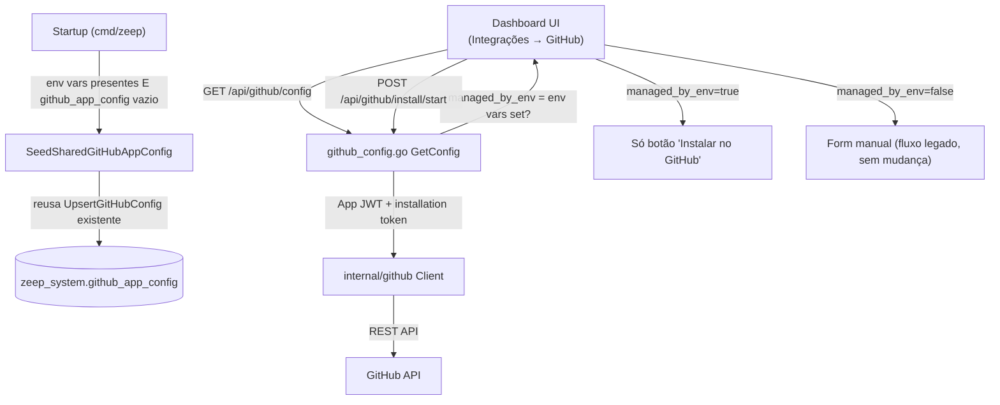

# GitHub Shared App Design

**Spec**: `.specs/features/github-shared-app/spec.md`
**Status**: Abandoned

**Decisão (2026-07-30)**: revertida. Ver `spec.md` para o rationale completo — resumindo: complexidade real (relay stateless obrigatório, distribuição de 7 secrets incluindo private key pra cada instância self-hosted, novo serviço de infra) supera o ganho de UX. Todo código desta feature (T-01 a T-08) foi revertido do repo. Mantido só como registro de design avaliado e descartado.

---

## Architecture Overview

Nenhuma tabela nova, nenhuma mudança de schema. `zeep_system.github_app_config` continua singleton exatamente como hoje (`internal/dashboard/github_config_store.go`, `ON CONFLICT ((TRUE))`). A mudança inteira acontece em **como a linha singleton é populada na primeira vez**:

- **Hoje**: só existe uma forma de popular a linha — o superadmin preenche o form em `GitHubIntegrationPage.tsx`, que chama `POST /api/github/config` (`github_config.go:70` `UpsertConfig`).
- **Depois**: no boot da instância, se existirem env vars do App compartilhado da ZeepLabs **e** ainda não existir linha em `github_app_config`, o próprio processo chama a função `UpsertGitHubConfig` já existente (reuso total, zero SQL novo) com as credenciais lidas do ambiente. Se já existir uma linha (cliente já configurou o próprio App, fluxo antigo), o boot não mexe em nada — é a garantia de compatibilidade retroativa exigida no spec.

A UI decide qual tela mostrar (form manual de credenciais vs. só botão "Instalar no GitHub") baseada em uma nova flag exposta por `GET /api/github/config`: `managed_by_env: bool`, calculada em runtime a partir da presença das env vars — não é um dado persistido, é um fato do ambiente do processo.

---

## Code Reuse Analysis

### Existing Components to Leverage

| Component | Location | How to Use |
|---|---|---|
| `UpsertGitHubConfig` | `internal/dashboard/github_config_store.go:85` | Reusado sem alteração — chamado pelo novo seeder de boot com input construído a partir de env vars, exatamente como já é chamado por `UpsertConfig` a partir do form |
| `GetGitHubConfig` | `internal/dashboard/github_config_store.go:57` | Reusado sem alteração — o seeder de boot chama antes de decidir se semeia (`if existing != nil { return }`) |
| `client.VerifyAppCredentials` | `internal/github/client.go:109` | Reusado — mesmo passo de validação já feito em `UpsertConfig` (`github_config.go:117`), aplicado também às credenciais vindas de env antes de semear, para não persistir uma credencial de produto malformada |
| Fluxo de instalação (`InstallStart`/`InstallCallback`) | `internal/dashboard/github_config.go:236-329` | Zero mudança — já opera sobre a linha singleton independente de como ela foi criada |
| Padrão de leitura de env var obrigatória/opcional na inicialização | `cmd/zeep/main.go` (padrão já usado para `DATABASE_URL`, `GOOGLE_CLIENT_ID`, etc.) | Novo bloco de leitura das 5-6 env vars do App compartilhado, seguindo o mesmo estilo |

### Integration Points

| System | Integration Method |
|---|---|
| Variáveis de ambiente do processo | Lidas uma vez no boot (`cmd/zeep/main.go` ou `internal/config`), nunca relidas em runtime — mudar env var exige reiniciar o processo, comportamento consistente com o resto da config do produto |
| PostgreSQL (`zeep_system.github_app_config`) | Nenhuma mudança de schema; só um novo caminho de escrita (seed condicional no boot) além do já existente (form do superadmin) |

---

## Components

### `internal/dashboard.SeedSharedGitHubAppConfig` (novo)

- **Purpose**: No boot, popular `github_app_config` a partir de env vars do App compartilhado, só quando ainda não há nenhuma linha.
- **Location**: `internal/dashboard/github_shared_app_seed.go`
- **Interfaces**:
  - `SeedSharedGitHubAppConfig(ctx context.Context, pool *db.Pool, cfg SharedGitHubAppEnv) error` — no-op silencioso se `cfg` estiver vazia (env vars não configuradas nesta instância) ou se `GetGitHubConfig` já retornar uma linha existente
- **Dependencies**: `GetGitHubConfig`, `UpsertGitHubConfig`, `github.Client.VerifyAppCredentials`
- **Reuses**: 100% dos stores e do client já existentes — este componente é só orquestração de boot, nenhuma lógica de persistência ou de API GitHub nova

### `internal/config.SharedGitHubAppEnv` (novo, ou struct simples no mesmo pacote de config já usado por outras env vars)

- **Purpose**: Ler e validar as env vars do App compartilhado uma vez no boot.
- **Location**: `internal/config/types.go` (mesmo arquivo que já centraliza outras structs de config lidas de env, reformatado nesta sessão via gofmt)
- **Interfaces**: `LoadSharedGitHubAppEnv() SharedGitHubAppEnv` — campos: `AppID`, `AppSlug`, `ClientID`, `ClientSecret`, `PrivateKeyPEM`, `WebhookSecret`; `(c SharedGitHubAppEnv) Configured() bool` retorna `true` só quando `AppID` e `PrivateKeyPEM` estão presentes (mínimo necessário pra gerar JWT de App)
- **Dependencies**: `os.Getenv`
- **Reuses**: mesmo padrão de leitura de env já usado para as demais credenciais do produto

### `internal/dashboard.GitHubConfigHandler.GetConfig` (modificado)

- **Purpose**: Adicionar o campo `managed_by_env` na resposta, calculado a partir de `SharedGitHubAppEnv.Configured()` injetado no handler (não lido de novo a cada request).
- **Location**: `internal/dashboard/github_config.go:164` (`GetConfig`) e `redactGitHubConfig` (`github_config.go:149`)
- **Dependencies**: `SharedGitHubAppEnv` (armazenado como campo do `GitHubConfigHandler`, preenchido em `NewGitHubConfigHandler`)
- **Reuses**: mesma função `redactGitHubConfig`, só ganha um campo a mais

---

## Data Models

**Nenhuma mudança de schema.** `zeep_system.github_app_config` permanece exatamente como está hoje (`github_config_store.go`). Este é o ponto central do design: a feature inteira é resolvida sem migração.

---

## Error Handling Strategy

| Error Scenario | Handling | User Impact |
|---|---|---|
| Env vars do App compartilhado ausentes nesta instância | `Configured()` retorna `false`, seeder não roda, UI mostra form legado | Nenhum — comportamento idêntico ao de hoje |
| Env vars presentes mas credencial inválida (App ID errado, private key malformada) | Seeder chama `VerifyAppCredentials` antes de persistir; falha → loga erro no boot (nível error) e **não** persiste nada, UI cai para estado "não conectado" com form legado como fallback | Superadmin vê "não conectado"; log do processo indica causa pro time ZeepLabs investigar o deployment |
| Já existe linha em `github_app_config` (cliente com App próprio, fluxo antigo) | Seeder detecta via `GetGitHubConfig != nil` e não faz nada, mesmo com env vars presentes | Cliente já conectado continua funcionando sem interrupção — garantia central de compatibilidade do spec |
| Private key do App compartilhado com quebras de linha (PEM) em env var/K8s Secret | Documentar exigência de base64 na env var (`GITHUB_SHARED_APP_PRIVATE_KEY_B64`), decodificado no `LoadSharedGitHubAppEnv` — evita problemas de multi-linha em YAML/Helm values | Nenhum — deployment já resolve isso na configuração do Secret |

---

## Tech Decisions (only non-obvious ones)

| Decision | Choice | Rationale |
|---|---|---|
| Seed no boot vs. seed lazy (on-demand na primeira request) | Boot | Falha rápido e visível no log de startup, em vez de silenciosamente na primeira request de um usuário; consistente com o resto da validação de config do produto (`cmd/zeep/main.go` já falha cedo em config inválida) |
| Não criar coluna `source`/`managed_by` no banco | `managed_by_env` é computado em runtime a partir da env var atual, não persistido | Mais simples e sempre correto: se o operador remover a env var, a UI volta a mostrar o form legado automaticamente, sem precisar de migração ou flag desatualizada no banco |
| Seed só quando não há linha existente (nunca sobrescreve) | Confirmado no Edge Case do spec | Evita quebrar clientes já conectados com App próprio; troca pro App compartilhado é decisão manual do cliente (desconectar e deixar o próximo boot semear) |
| Private key via env var em base64 | `GITHUB_SHARED_APP_PRIVATE_KEY_B64` em vez de PEM cru | PEM multi-linha é frágil em Helm `values.yaml`/K8s Secret literal; base64 é o padrão já esperado pra esse tipo de valor em Secrets do Kubernetes |
| Reusar `UpsertGitHubConfig` em vez de um INSERT dedicado pro seed | Reuso total | A função já trata criptografia e o `ON CONFLICT ((TRUE))` — nenhuma razão pra duplicar lógica |

---

## Observação fora de escopo (achado durante esta análise)

`GitHubConfigHandler.states` (`github_config.go:38-39`, `generateState`/`validateState`) guarda o state CSRF do fluxo de instalação em mapa in-memory por processo — mesma classe de bug já corrigida para o login Google do dashboard nesta sessão (`AGENTS.md` §4, regra "nunca guardar CSRF/session/OAuth state em mapa in-memory"). Em deployment com múltiplas réplicas, a instalação pode falhar com "invalid or expired state" se o callback do GitHub cair numa réplica diferente da que gerou o state. **Não faz parte desta feature** (nada aqui piora ou depende disso), mas é o mesmo bug de classe e vale abrir como fix separado — sinalizando para não ficar esquecido.

---

## Tips aplicadas

- Nenhuma migração: decisão central do design, validada linha por linha contra o código real de `github_config_store.go`.
- Todo componente novo é orquestração fina sobre stores/clients já existentes — sem lógica de negócio duplicada.
- Achado colateral (state in-memory) documentado como débito técnico separado, não misturado ao escopo desta feature.
