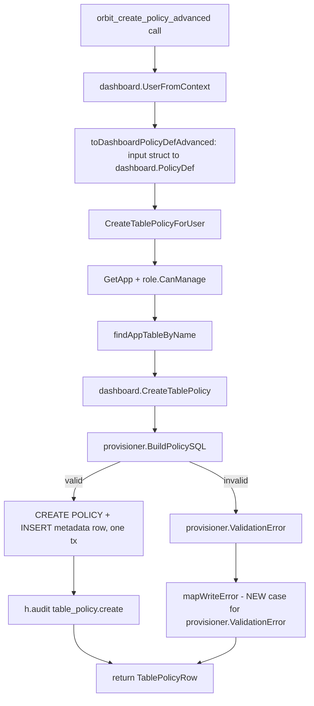

# orbit_create_policy_advanced Design

**Spec**: `.specs/features/mcp-advanced-policy-tool/spec.md`
**Status**: Draft

---

## Architecture Overview

One new MCP tool registration, `orbit_create_policy_advanced`, wired directly onto the existing `CreateTablePolicyForUser` — the exact same call `orbit_create_policy_from_template` already makes once it has built a `dashboard.PolicyDef`. The only new code is (1) an input struct that accepts a full `PolicyDef` shape instead of a `template_id`, (2) a straight-through conversion to `dashboard.PolicyDef` (no template-building logic needed), and (3) one new `mapWriteError` case to surface `provisioner.ValidationError` safely — a pre-existing gap this tool is the first caller to actually exercise on arbitrary input.



**Key architectural choice**: zero new validation, zero new store/handler function. `CreateTablePolicyForUser` already does everything the spec requires (auth tier, schema/table resolution, provisioner validation, RLS enable-on-first-policy, audit). The tool is a pure transport — the only genuinely new logic is the input-struct-to-`PolicyDef` mapping and the `mapWriteError` fix, both mechanical.

---

## Code Reuse Analysis

### Existing Components to Leverage

| Component | Location | How to Use |
|---|---|---|
| `CreateTablePolicyForUser` | `internal/dashboard/handler.go:1928` | Called as-is — `func (h *Handler) CreateTablePolicyForUser(ctx, user *DashboardUser, appID, tableName string, def PolicyDef, ip string) (*TablePolicyRow, error)`. No changes needed. |
| `dashboard.PolicyDef` / `dashboard.PolicyClause` | `internal/dashboard/table_policies_store.go:50-69` | Target shape for the new tool's input conversion — identical fields, no new type needed on the dashboard side. |
| `mapWriteError` | `internal/mcpserver/tools.go:175-223` | Extended with one new `errors.As(err, &provErr)` case for `*provisioner.ValidationError` (see Risks & Concerns) — same fixed-message-exposure pattern already used for `*dashboard.ValidationError`/`*provisioner.TypeChangeError`. |
| `registerTemplateTools` registration pattern | `internal/mcpserver/tools.go:568-621` | New function `registerAdvancedPolicyTool` follows the exact same shape: `dashboard.UserFromContext` check → build/convert `PolicyDef` → call `CreateTablePolicyForUser` → `mapWriteError` on failure → return row on success. |
| `ToolDeps{Pool, DashH}` | `tools.go:33-36` | Unchanged, no new field. |
| `mcp.AddTool` registration | `tools.go` (used throughout) | Same registration call as every other tool. |

### Integration Points

| System | Integration Method |
|---|---|
| Dashboard handler layer | `CreateTablePolicyForUser` — no bypass, no parallel path (spec Goal #2) |
| Postgres RLS/policies | Unchanged — same `provisioner.BuildPolicySQL` → `CREATE POLICY` DDL path every policy creation already uses |
| Audit log | `h.audit(...)` inside `CreateTablePolicyForUser` (`handler.go:1950`) — fires automatically, no new call site needed |
| MCP tool registry | `mcpserver` package's existing `mcp.AddTool` registration mechanism |

---

## Components

### `orbitCreatePolicyAdvancedInput` (new type)

- **Purpose**: MCP tool input schema — a full, structured policy definition, one clause list, no `template_id`.
- **Location**: `internal/mcpserver/tools.go` (co-located with `orbitCreatePolicyFromTemplateInput`)
- **Shape**:
  ```go
  type orbitCreatePolicyAdvancedClauseInput struct {
      Column      string `json:"column" jsonschema:"table column this clause checks"`
      Operator    string `json:"operator" jsonschema:"comparison operator: = != IN NOT IN > < >= <= IS NULL IS NOT NULL"`
      ValueSource string `json:"value_source,omitempty" jsonschema:"claim or literal; omit for IS NULL / IS NOT NULL"`
      Value       string `json:"value,omitempty" jsonschema:"literal value, or claim name (role/sub/email) when value_source is claim"`
      Logic       string `json:"logic,omitempty" jsonschema:"AND or OR joining this clause to the previous one; omit on the first clause"`
  }

  type orbitCreatePolicyAdvancedInput struct {
      AppID     string                                  `json:"app_id" jsonschema:"id of the app that owns the table"`
      TableName string                                  `json:"table_name" jsonschema:"name of the table to create the policy on"`
      Name      string                                  `json:"name" jsonschema:"unique policy name for this table+action"`
      Action    string                                  `json:"action" jsonschema:"select, insert, update, or delete"`
      Roles     []string                                `json:"roles" jsonschema:"roles this policy applies to"`
      Clauses   []orbitCreatePolicyAdvancedClauseInput   `json:"clauses" jsonschema:"one or more structured conditions, ANDed/ORed left to right"`
  }
  ```
- **Dependencies**: none beyond stdlib/mcp-sdk jsonschema tags, same convention every other tool input struct in `tools.go` follows.
- **Reuses**: field names and semantics copied 1:1 from `dashboard.PolicyClause`/`PolicyDef` — no new vocabulary introduced for the LLM to learn beyond what the Dashboard's advanced form and REST API already expose.

### `toDashboardPolicyDefAdvanced` (new helper)

- **Purpose**: Straight-through conversion from the MCP input struct to `dashboard.PolicyDef` — no defaulting, no template logic, no validation (validation stays exclusively in `provisioner.BuildPolicySQL`, per spec's Out of Scope).
- **Location**: `internal/mcpserver/tools.go`, next to `toDashboardPolicyDef` (the existing template-path converter it deliberately does NOT reuse — that one takes `policytemplates.PolicyDef`, a different type, this one takes the new input struct directly).
- **Interface**: `func toDashboardPolicyDefAdvanced(in orbitCreatePolicyAdvancedInput) dashboard.PolicyDef`
- **Behavior**: 1:1 field copy, `Clauses` mapped element-wise into `[]dashboard.PolicyClause`. No branching, no error return — anything wrong with the shape surfaces from `CreateTablePolicyForUser`'s own validation, not here.

### `registerAdvancedPolicyTool` (new registration function)

- **Purpose**: Registers `orbit_create_policy_advanced` on the MCP server.
- **Location**: `internal/mcpserver/tools.go`, alongside `registerTemplateTools` (called from the same place `registerTemplateTools` is called during server setup).
- **Interface**: `func registerAdvancedPolicyTool(server *mcp.Server, deps ToolDeps)`
- **Behavior**:
  1. `mcp.AddTool` with name `orbit_create_policy_advanced`, description stating it creates a policy from an explicit structured clause set (no SQL, no template) — mirrors `orbit_create_policy_from_template`'s description style.
  2. Handler: `dashboard.UserFromContext(ctx)` → `errUnauthorized` if absent (identical to every other write tool).
  3. `def := toDashboardPolicyDefAdvanced(in)`.
  4. `row, err := deps.DashH.CreateTablePolicyForUser(ctx, user, in.AppID, in.TableName, def, "mcp")` — same `ip` placeholder string `"mcp"` the template tool already uses for audit-log provenance.
  5. `if err != nil { return nil, nil, mapWriteError(err) }` — single policy, single call, no partial-success bookkeeping needed (unlike the template tool's multi-policy loop, this tool creates exactly one).
  6. `return nil, row, nil` on success.

---

## Data Models

No new persisted model. Reuses `dashboard.PolicyDef`/`PolicyClause`/`TablePolicyRow` verbatim (`table_policies_store.go:50-83`) — the MCP input struct above is a wire-format mirror, not a new domain type.

---

## Error Handling Strategy

| Error Scenario | Handling | User Impact (MCP caller) |
|---|---|---|
| Missing/invalid auth context | `errUnauthorized` returned before any dashboard call | Fixed "unauthorized" tool error |
| Caller lacks `role.CanManage()` | `CreateTablePolicyForUser` → `ErrForbidden` → `mapWriteError` existing case | Fixed "forbidden" message |
| Table does not exist | `ErrTableNotFound` → existing `mapWriteError` case | Fixed "table not found" message |
| Policy name collides on same table+action | `ErrPolicyAlreadyExists` → existing `mapWriteError` case | Fixed, existing message (verbatim, already safe) |
| Any structural validation failure (unknown column, bad operator, bad `value_source`/claim, bad `logic` placement, bad `action`, empty `roles`/`clauses`) | `provisioner.ValidationError` → **new** `mapWriteError` case (see Risks & Concerns) | The `ValidationError`'s own message, verbatim — same exposure pattern as `TypeChangeError`/`ForeignKeyViolationError` today |
| Any other/unexpected error | Falls to `mapWriteError`'s `default: internalErr(err)` | Fixed generic internal-error message, real error logged server-side (`AGENTS.md` §4) |

---

## Risks & Concerns

| Concern | Location (file:line) | Impact | Mitigation |
|---|---|---|---|
| `mapWriteError` has no case for `*provisioner.ValidationError` — falls to `default: internalErr(err)` | `internal/mcpserver/tools.go:175-223` | Every structural validation failure this tool is expected to surface per spec AC4 (unknown column, bad operator, bad claim name, bad logic placement, etc.) would instead return a generic "internal error" to the MCP caller, with the real reason only in server logs — the caller/LLM gets no actionable feedback to correct its input and retry. Not a hypothetical: `orbit_create_policy_from_template` mostly avoids this today because templates pre-validate their own shape before calling `CreateTablePolicyForUser`; this tool accepts arbitrary structured input, so it hits `provisioner.BuildPolicySQL`'s validation path directly and routinely. | Add one `errors.As(err, &provErr)` case to `mapWriteError` for `*provisioner.ValidationError`, exposing `provErr.Error()` verbatim — same trust level already extended to `*provisioner.TypeChangeError`/`*provisioner.ForeignKeyViolationError` (provisioner-generated messages are pre-vetted as caller-safe, unlike raw `err.Error()` from arbitrary sources). This is a small, isolated fix to a shared helper, done as the first Execute task before the new tool is wired, so the new tool never regresses on AC4. |
| None else found | — | — | Everything else (auth, RLS enable-on-first-policy, audit, DDL generation) is fully covered by `CreateTablePolicyForUser`'s existing, already-tested behavior — this feature adds no new code path through that layer. |

---

## Tech Decisions

| Decision | Choice | Rationale |
|---|---|---|
| Reuse `CreateTablePolicyForUser` directly vs. writing a new dashboard-layer function | Reuse directly, zero new dashboard-layer code | The REST endpoint's handler already does exactly what this tool needs; a new function would be a pointless duplicate, violating the spec's "no parallel validation logic" goal |
| Separate input struct vs. reusing `orbitCreatePolicyFromTemplateInput` | Separate struct (`orbitCreatePolicyAdvancedInput`) | The template input carries `template_id`/`column`/`value`/`roles` (template-specific, flat); this tool needs the full `clauses` array shape. Sharing one struct would make both tools' JSON schemas confusing (irrelevant fields visible to each) — MCP tool schemas are the LLM's only interface, per the `mcp-server` spec's tool-granularity assumption. |
| Fix `mapWriteError`'s missing `provisioner.ValidationError` case as part of this feature, not a separate bug ticket | Fix inline, first Execute task | It's a one-line-shaped fix directly blocking this feature's AC4; deferring it would ship the tool with silently-unhelpful error messages for its most common failure mode (bad user input) |

> No project-level (`AD-NNN`) decision needed — this doesn't set a new convention, it applies existing ones (transport-only MCP tools, `mapWriteError`'s verbatim-safe-message pattern) to a new case.
