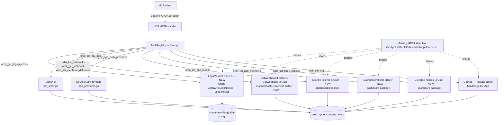

# MCP Read-Only Tools Design

**Spec**: `.specs/features/mcp-read-only-tools/spec.md`
**Status**: Approved

---

## Architecture Overview

Ten new MCP tools are registered against the same `*mcp.Server` `mcp-server`'s `RegisterTools` already builds (`internal/mcpserver/tools.go:49`), through three new grouping functions (`registerAppConfigReadTools`, `registerAccessReadTools`, `registerOperationalReadTools`) called alongside the existing `registerReadTools`/`registerWriteTools`/`registerTemplateTools`. No new transport, no new middleware, no new auth artifact — every tool runs through the same `RequirePAT` → rate-limit → tool-registry pipeline `NewHandler` (`internal/mcpserver/server.go:34`) already wires up.

Each tool is a thin wrapper calling either an existing dashboard package function directly (`GetApp`, `GetAppAuthProviders`, `ListPATs`, `ListWebhooks`, `ListEventMappings`, `ListDeliveries`) or a small new `*ForUser`-shaped function added to `internal/dashboard` for the two cases where the existing function needs a table lookup an MCP tool can't do itself (`ListTablePolicies` needs a table-name→existence check that today lives in an unexported `findAppTableByName` helper). No new authorization model is introduced anywhere in this design — every tool reuses exactly the check its REST handler equivalent already performs, discovered per-tool below (they are **not uniform** — see the Authorization Matrix in Risks & Concerns, a real finding from this design pass).



---

## Code Reuse Analysis

### Existing Components to Leverage

| Component | Location | How to Use |
| --------- | -------- | ---------- |
| `GetApp(ctx, pool, appID, user) (*AppRow, Role, error)` | `internal/dashboard/apps_store.go:~200` (declared), used throughout `handler.go` | Called directly by `orbit_get_app`, and internally by every new `*ForUser` function below — the one shared visibility+role primitive every tool in this spec is built on |
| `AppRow.RedactSecrets()` | `internal/dashboard/apps_store.go` | Called on `GetApp`'s result before returning from `orbit_get_app`, same as `ListAppsForUser` already does per-item |
| `redactAuthProviderSecrets` (via `GetAppAuthProviders`) | `internal/dashboard/app_providers.go:27-36` | `orbit_list_app_auth_providers` calls `GetAppAuthProviders` directly — it already does `GetApp` + redaction internally, nothing to extract |
| `ListPATs(ctx, pool, userID) ([]PATRow, error)` | `internal/dashboard/pat_store.go:143` | `orbit_list_my_pats` calls this directly with `user.ID` — already ownership-scoped, no wrapper needed |
| `mapWriteError`-equivalent error mapping pattern | `internal/mcpserver/tools.go:143-163` | Every new tool maps `ErrNotFound`/`ErrForbidden`/business-rule errors to the same fixed-message convention; internal errors collapse to `errInternal` |
| `mcp.AddTool` registration pattern, `any`-typed output for structs containing `json.RawMessage` | `internal/mcpserver/tools.go:81-112` | Every new tool follows the exact same registration shape as `orbit_list_apps`/`orbit_get_app_schema` |
| `Provisioner`/`RegisterTools` composition in `NewHandler` | `internal/mcpserver/server.go:34-45` | Unchanged — new tools register into the same `*mcp.Server` before it's wrapped by `RequirePAT`/rate-limiting |

### Integration Points

| System | Integration Method |
| ------ | ------------------- |
| Dashboard REST handlers | New `*ForUser` functions (below) become the shared operation functions; existing REST handlers (`ListTablePolicies`, `ListAppMembers`, `ListAppTokens`, `ListWebhooks`, `GetWebhook`, `ListWebhookDeliveries`, `LogsMetrics`) are refactored to call the new function instead of duplicating its body — same "extract, don't duplicate" pattern `mcp-server`'s design used for `CreateAppForUser`/`CreateAppTableForUser` |
| Postgres (`zeep_system` schema) | No new tables, no new columns, no new queries beyond what each wrapped function already runs |
| `RingBuffer` (in-memory log ring, per-replica) | `orbit_get_logs_metrics` reads the same `h.Logs` instance `LogsMetrics`'s REST handler already reads — no new instance, no cross-replica aggregation added (this endpoint has always been per-replica-approximate; this spec doesn't change that) |

---

## Components

### `dashboard.ListTablePoliciesForUser`

- **Purpose**: Resolve+authorize an app and table, then return that table's row policies — the shared operation behind both `ListTablePolicies`'s REST handler and `orbit_list_table_policies`.
- **Location**: `internal/dashboard/table_policies_store.go` (co-located with `ListTablePolicies`, the function it wraps)
- **Interfaces**:
  - `ListTablePoliciesForUser(ctx context.Context, pool *db.Pool, user *DashboardUser, appID, tableName string) ([]TablePolicyRow, error)` — returns `ErrNotFound` if the app doesn't exist/isn't visible, `ErrForbidden` if `!role.CanManage()` (matching the existing REST handler's exact check at `handler.go:1518`), `ErrTableNotFound` if `tableName` doesn't match any table on the app (reusing the existing `findAppTableByName` helper, already unexported and already in the `dashboard` package)
- **Dependencies**: `GetApp`, `findAppTableByName`, `ListTablePolicies` — all already exist
- **Reuses**: `ListTablePolicies`'s existing SQL query — this function only adds the auth+lookup layer the REST handler currently inlines

### `dashboard.ListAppMembersForUser`

- **Purpose**: Resolve+authorize an app (backend-app case only — this spec excludes frontend-apps), then return its member list.
- **Location**: `internal/dashboard/app_members_store.go`
- **Interfaces**:
  - `ListAppMembersForUser(ctx context.Context, pool *db.Pool, user *DashboardUser, appID string) ([]*AppMember, error)` — internally builds `AppRef{BackendAppID: appID}`, calls `ResolveAppRole`, requires `role.CanManage()` (matching `app_members.go:93`'s exact check), then `ListAppMembers`
- **Dependencies**: `ResolveAppRole`, `AppRef`, `ListAppMembers` — all already exist
- **Reuses**: Existing `ListAppMembers` query and `ResolveAppRole` auth primitive; this function is the backend-app-only slice of what `ListAppMembers`'s REST handler already does (that handler also serves frontend-apps via the same route pattern — out of scope here per spec)

### `dashboard.ListAppTokensForUser`

- **Purpose**: Resolve+authorize an app, enforce the existing "no app tokens for email-auth apps" business rule, then return token metadata.
- **Location**: `internal/dashboard/app_tokens_store.go`
- **Interfaces**:
  - `ListAppTokensForUser(ctx context.Context, pool *db.Pool, user *DashboardUser, appID string) ([]AppTokenRow, error)` — returns `ErrNotFound` for an invisible/nonexistent app (matches `handler.go:2911-2914`, which doesn't even distinguish forbidden from not-found here — same behavior preserved), a new `ErrAppTokensNotSupported` sentinel for the `app.AuthEmailEnabled` case (`handler.go:2916-2919`'s 400), then `ListAppTokens`
- **Dependencies**: `GetApp`, `ListAppTokens`
- **Reuses**: Existing `ListAppTokens` query; carries over the email-auth business rule exactly rather than silently dropping it (a real risk if this rule were missed — see Risks & Concerns)

### `dashboard.ListWebhooksForUser` / `GetWebhookForUser` / `ListWebhookDeliveriesForUser`

- **Purpose**: Resolve+authorize an app via the existing `webhookRBACGate` logic (`role.CanManage()`, same as every other webhook operation), then return webhooks / one webhook + its event mappings / one webhook's delivery history.
- **Location**: `internal/dashboard/webhooks_store.go`
- **Interfaces**:
  - `ListWebhooksForUser(ctx context.Context, pool *db.Pool, user *DashboardUser, appID string) ([]WebhookRow, error)`
  - `GetWebhookForUser(ctx context.Context, pool *db.Pool, user *DashboardUser, appID, webhookID string) (*WebhookRow, []EventMappingRow, error)` — combines `GetWebhook` + `ListEventMappings` per spec AC2, scoped so a `webhookID` belonging to a different app returns not-found (reusing whatever scoping `getScopedWebhook` — `webhooks_handler.go:237` — already enforces)
  - `ListWebhookDeliveriesForUser(ctx context.Context, pool *db.Pool, user *DashboardUser, appID, webhookID string, limit, offset int) ([]DeliveryRow, error)` — passes `limit`/`offset` straight through to `ListDeliveries` (`webhook_deliveries_store.go:90`), which already bounds them; the tool's input schema documents the same bounds, it doesn't invent new ones
- **Dependencies**: `webhookRBACGate`'s underlying logic (`GetApp` + `role.CanManage()`), `getScopedWebhook`, `ListWebhooks`, `GetWebhook`, `ListEventMappings`, `ListDeliveries`
- **Reuses**: All existing store queries; the extraction only pulls the auth+scoping logic out of `webhookRBACGate`/`getScopedWebhook` (both already package-private helpers in `dashboard`) into functions callable from `mcpserver`

### `dashboard.LogsMetricsForUser`

- **Purpose**: Reproduce `LogsMetrics`'s REST handler body exactly — resolve the caller's allowed app-name set, return the caller-wide aggregate.
- **Location**: `internal/dashboard/handler.go` (co-located with `LogsMetrics`, or extracted into `logs.go` — implementation detail, not spec-relevant)
- **Interfaces**:
  - `LogsMetricsForUser(ctx context.Context, pool *db.Pool, logs *RingBuffer, user *DashboardUser) (LogMetrics, error)` — note this takes the `*RingBuffer` instance explicitly (there's exactly one, held on `*Handler`), since `ToolDeps` doesn't currently carry `*dashboard.Handler`'s `Logs` field directly — see Tech Decisions for how the tool obtains it
- **Dependencies**: `ListOwnedAppNames`, `RingBuffer.Metrics`
- **Reuses**: Both existing functions unchanged; this is the thinnest wrapper in the spec (two calls, no new logic)

### MCP tool registrations (`internal/mcpserver/tools.go`)

- **Purpose**: Register the 10 new tools, each a `mcp.AddTool` call in the same style as `registerReadTools`.
- **Location**: `internal/mcpserver/tools.go`, three new functions: `registerAppConfigReadTools` (orbit_get_app, orbit_list_table_policies), `registerAccessReadTools` (orbit_list_app_members, orbit_list_app_tokens, orbit_list_app_auth_providers, orbit_list_my_pats), `registerOperationalReadTools` (orbit_list_webhooks, orbit_get_webhook, orbit_list_webhook_deliveries, orbit_get_logs_metrics)
- **Interfaces**: One `orbitXxxInput`/`orbitXxxOutput` struct pair per tool, following the existing naming and `jsonschema` tag convention
- **Dependencies**: `orbit_get_logs_metrics` reaches the ring buffer via `deps.DashH.Logs` (already-exported field, no `ToolDeps` change needed — see Risks & Concerns)
- **Reuses**: `errInternal`, `errUnauthorized`, the existing error-mapping convention

---

## Data Models

No new persisted data models — every tool returns an existing struct (`AppRow`, `TablePolicyRow`, `AppMember`, `AppTokenRow`, `json.RawMessage` auth-provider config, `PATRow`, `WebhookRow`, `EventMappingRow`, `DeliveryRow`, `LogMetrics`) unchanged. Two new Go sentinel errors are added:

```go
// internal/dashboard/app_tokens_store.go (or handler.go, co-located with the business rule it names)
var ErrAppTokensNotSupported = errors.New("app tokens only available for apps without email auth")
```

`ListTablePoliciesForUser` reuses the existing `ErrTableNotFound` sentinel already defined for the write-side table-policy functions (`internal/dashboard/handler.go` — confirm exact declaration site during implementation; referenced by `CreateTablePolicyForUser` at `handler.go:1557`).

---

## Error Handling Strategy

| Error Scenario | Handling | MCP Client Sees |
| --------------- | -------- | ---------------- |
| App doesn't exist / caller has no visibility | `GetApp` returns `ErrNotFound` | Structured tool error, `"not found"` (matches existing `orbit_get_app_schema` wording) |
| Caller's role fails the tool's specific tier (`CanManage()` for policies/members/webhooks, `CanWrite()`-equivalent visibility-only for tokens/auth-providers — see Authorization Matrix below) | Function returns `ErrForbidden` | Structured tool error, `"forbidden"` |
| `orbit_list_table_policies` / webhook tools: sub-resource (table/webhook) not found under an app the caller CAN see | `ErrTableNotFound` / not-found from `getScopedWebhook` | Structured tool error distinguishing "app not found" from "table/webhook not found" — never a bare `[]` |
| `orbit_list_app_tokens` on an email-auth-enabled app | New `ErrAppTokensNotSupported` | Structured tool error with the same message the REST 400 already uses — this is a real business rule, not a permission check, and must not be dropped |
| Any unexpected/internal error (DB failure, etc.) | Caught, logged server-side | Fixed generic `errInternal` message — never `err.Error()` (`AGENTS.md` §4) |
| Zero rows for any list tool | Store functions already `make([]T, 0)` or equivalent | `[]`, never `null` |

---

## Risks & Concerns

| Concern | Location (file:line) | Impact | Mitigation |
| ------- | --------------------- | ------ | ---------- |
| **Authorization is not uniform across these 10 tools** — three different tiers exist today: `role.CanManage()` (table policies, app members, webhooks — all three), plain `GetApp` visibility with no extra role check (`orbit_get_app`, `orbit_list_app_auth_providers`), and ownership-only with no app role at all (`orbit_list_my_pats`, `orbit_get_logs_metrics` via `ListOwnedAppNames`) | `handler.go:1518` (policies), `app_members.go:93` (members), `webhooks_handler.go:89` (webhooks), `app_providers.go:27-36` (auth providers, no check), `pat_store.go:143` (PATs, ownership only) | Spec's stated goal ("every new tool authorizes through the exact same GetApp+role-check path") reads as if one tier applies uniformly; it does not. A future maintainer changing one tool's tier without checking this table could silently over- or under-restrict a tool relative to its REST equivalent | Each new `*ForUser` function's docstring states its exact tier explicitly (as specified per-component above); the task breakdown (`tasks.md`) will require a dedicated authorization test per tool asserting its specific tier, not a shared "same as GetApp" test |
| `ListAppTokens`'s email-auth business rule is easy to drop during extraction — it looks like an auth check but is a feature-availability check | `handler.go:2916-2919` | An agent could otherwise be told a token list is empty (`[]`) rather than "not applicable to this app," misleading a debugging conversation | `ListAppTokensForUser` returns the new `ErrAppTokensNotSupported` sentinel explicitly rather than an empty list; task-level test asserts this specific error, not just "some error" |
| `orbit_get_logs_metrics` reads a per-replica in-memory ring buffer | `internal/dashboard/logs.go:40-46` | An agent calling this tool twice against a load-balanced multi-replica deployment can see different results per call, with no indication this happened — this is pre-existing REST behavior (not introduced by this spec) but an MCP tool description should say so since a human wouldn't necessarily know an agent hit a different replica | Tool description text explicitly notes the metrics reflect "the last minute, on whichever server instance handled this request" — no code change, since fixing the underlying per-replica aggregation is out of scope for a read-only tool spec |
| `orbit_get_logs_metrics` needs to reach the `*RingBuffer` instance | `internal/mcpserver/tools.go:32-35` (`ToolDeps`) | None — resolved during design, not a real risk | `Handler.Logs` is already an exported field (`internal/dashboard/handler.go:38`, `Logs *RingBuffer`), so no new field on `ToolDeps` is needed: the tool calls `LogsMetricsForUser(ctx, deps.Pool, deps.DashH.Logs, user)`, reusing the same `deps.DashH` every write tool already has |

> No security-severity concern found beyond the authorization-tier documentation gap above — every tool's actual enforcement already matches its REST equivalent 1:1 by construction (each new function is an extraction, not a reimplementation).

---

## Tech Decisions

| Decision | Choice | Rationale |
| -------- | ------ | --------- |
| Extraction vs. duplication for tools needing auth logic REST handlers currently inline | Extract a new `*ForUser` function per tool that needs one (5 of 10 tools); the other 5 (`orbit_get_app`, `orbit_list_app_auth_providers`, `orbit_list_my_pats`) call an existing exported function directly with no new wrapper | Matches `mcp-server`'s established precedent (`CreateAppForUser` etc. were extractions, not reimplementations) and this spec's own goal of "never new business logic duplicated between REST and MCP" |
| `orbit_get_webhook` combines webhook config + event mappings in one tool call | Single tool, two internal function calls (`GetWebhook` + `ListEventMappings`), one response object | Matches spec AC2 exactly ("that webhook's full config ... plus its event mappings"); avoids forcing the calling agent into two round-trips for what's conceptually one "show me this webhook" question |
| `orbit_get_logs_metrics` takes no input | No `app_id`, no filter parameters | The REST endpoint it wraps genuinely takes none — inventing an input parameter the underlying function can't honor would be worse than a tool with an empty input schema |
| REST handlers refactored to call the new `*ForUser` functions (not just the MCP tools) | `ListTablePolicies`, `ListAppMembers`, `ListAppTokens`, `ListWebhooks`, `GetWebhook`, `ListWebhookDeliveries`, `LogsMetrics` HTTP handlers are updated to call the new shared function instead of keeping their current inline body | Prevents the two code paths (REST, MCP) from drifting apart the moment either one changes — the exact failure mode `AGENTS.md`'s "shared operation function" convention exists to prevent |

---

## Tips

(Not applicable — implementation notes only, no template tips carried into the design doc itself.)
