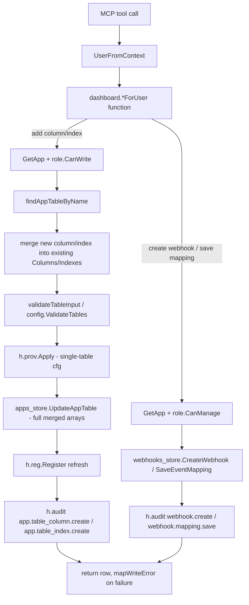

# MCP Safe Mutation Tools Design

**Spec**: `.specs/features/mcp-safe-mutation-tools/spec.md`
**Status**: Approved

---

## Architecture Overview

Two independent additive backend endpoints (add-column, add-index) built on the exact fetch→merge→validate→apply→persist→audit pattern `UpdateTableRLSModeForUser` already established, plus two new `*ForUser` wrappers for webhook writes that don't exist yet (unlike the table endpoints, `CreateWebhook`/`SaveEventMapping` have no context-based RBAC-checking wrapper today — their auth lives in an `http.ResponseWriter`-coupled gate). All four surface as thin MCP tool wrappers following the established `orbit_create_table`/`orbit_set_table_rls_mode` pattern.



**Key architectural choice**: no new validation entry point is introduced. `config.ValidateTables` (`internal/config/validate.go:38`) only accepts a table's *complete* column/index list plus every other app table (FK-cycle detection needs the whole graph) — there is no incremental single-column validator to call. Both new table endpoints therefore replicate `UpdateAppTable`'s exact "merge into a full copy, validate the whole thing, apply the whole thing, persist the whole thing" shape; the only difference from the unsafe full-replace path is *where the full array comes from* — merged server-side from the stored table, never trusted from the request body.

---

## Code Reuse Analysis

### Existing Components to Leverage

| Component | Location | How to Use |
|---|---|---|
| `GetApp` + `role.CanWrite()` gate | `handler.go:1189-1195` (`CreateAppTableForUser`), `rbac.go:33-35` | Identical gate for both new table endpoints |
| `findAppTableByName` | `handler.go:1487-1494` | Resolve target table; `nil` → `ErrNotFound` |
| `validateTableInput` / `config.ValidateTables` | `handler.go:154-163`, `config/validate.go:38` | Validate the merged full table + `otherTables`, exactly like `CreateAppTableForUser`/`UpdateAppTable` already do |
| `buildAppConfig` + `h.prov.Apply` (single-table `cfg.Tables`) | `handler.go:1208-1218`, `1334-1336` | Apply DDL for the merged table before persisting metadata (provision-before-persist ordering, unchanged) |
| `apps_store.UpdateAppTable` (store fn) | `apps_store.go:642-682` | Persist the merged `columns`/`indexes` arrays — this is the **only** persistence primitive available; there is no append-only variant, so both new endpoints call it with the full merged arrays |
| `h.reg.Register` refresh | `handler.go:1421-1425` | Same registry refresh every table mutation already performs |
| `h.audit(...)` | `handler.go:1843` | Same signature, new action strings `app.table_column.create` / `app.table_index.create` |
| `webhooks_store.CreateWebhook` / `SaveEventMapping` | `webhooks_store.go:103`, `webhooks_store.go:530` | Called as-is (already genuinely additive) — only the *wrapper* around them is new |
| `role.CanManage()` gate pattern | `webhooks_handler.go:89` (`webhookRBACGate`) | Replicated context-based (not `http.ResponseWriter`-based) for the two new webhook `*ForUser` functions |
| `mapWriteError` | `tools.go:147-175` | Extended with new sentinel cases, same fixed-message convention (`AGENTS.md` §4) |
| `ToolDeps{Pool, DashH}` | `tools.go:33-36` | Unchanged — no new field needed |

### Integration Points

| System | Integration Method |
|---|---|
| Postgres (DDL) | `h.prov.Apply` → `applyColumnChanges`/`addMissingColumns` (columns), `ensureIndexes` (indexes) — both already idempotent, no `DROP` path exists for either |
| App metadata store | `apps_store.UpdateAppTable` — single `UPDATE ... SET columns=$4, indexes=$5` statement, both fields always written together |
| In-memory registry | `h.reg.Register` — refreshed after every table mutation so `SaveEventMapping`'s `reg.GetTable` lookup sees the new column immediately |
| Audit log | `h.audit(...)` — fire-and-forget after successful mutation, matching every existing write path |

---

## Components

### `AddTableColumnForUser` (new)

- **Purpose**: Add exactly one new column to an existing table, server-side-merged against the table's current stored definition.
- **Location**: `internal/dashboard/handler.go` (co-located with `CreateAppTableForUser`/`UpdateTableRLSModeForUser`, same file/pattern)
- **Interfaces**:
  - `func (h *Handler) AddTableColumnForUser(ctx context.Context, user *DashboardUser, appID, tableName string, col config.ColumnConfig, ip string) (*AppTableRow, error)`
- **Dependencies**: `GetApp`, `role.CanWrite()`, `findAppTableByName`, `validateTableInput`/`config.ValidateTables`, `buildAppConfig`, `h.prov.Apply`, `apps_store.UpdateAppTable`, `h.reg.Register`, `h.audit`
- **Reuses**: `UpdateTableRLSModeForUser`'s exact composition shape (fetch → check → merge one field → validate whole → apply whole → persist whole → refresh → audit)
- **Behavior**:
  1. `GetApp` → `role.CanWrite()` gate → `ErrForbidden`
  2. `findAppTableByName` → `nil` → `ErrNotFound`
  3. IF `col.Name` already exists in `existingTable.Columns` → `ErrColumnAlreadyExists` (new sentinel), no mutation
  4. `col.RenameFrom` is force-cleared to `""` before merge — a brand-new column can never carry a rename (spec's Out-of-Scope: rename is a different operation)
  5. `mergedColumns := append(append([]config.ColumnConfig{}, existingTable.Columns...), col)` (copy, never mutate the slice `app.Tables[i].Columns` in place)
  6. `table := AppTableRow{Name: existingTable.Name, RLS: existingTable.RLS, Columns: mergedColumns, Indexes: existingTable.Indexes}`, `otherTables` = every other table on `app.Tables`
  7. `validateTableInput(table, app.AuthEmailEnabled, otherTables)` — same call `UpdateAppTable`'s handler makes; a bad `references` target or duplicate produces the same `*ValidationError` shape callers already handle
  8. `buildAppConfig(app)` + single-table `Apply` with `mergedColumns`/`existingTable.Indexes`
  9. `apps_store.UpdateAppTable(ctx, h.pool, appID, existingTable.ID, schemaNameForDB(app.Name), existingTable.RLS, mergedColumns, existingTable.Indexes)`
  10. Re-`GetApp` + `h.reg.Register`
  11. `h.audit(ctx, user.ID, user.Email, "app.table_column.create", "app_table", row.ID, app.Name+"/"+row.Name+"/"+col.Name, nil, ip)`

### `AddTableIndexForUser` (new)

- **Purpose**: Add exactly one new index to an existing table, server-side-merged.
- **Location**: `internal/dashboard/handler.go`
- **Interfaces**:
  - `func (h *Handler) AddTableIndexForUser(ctx context.Context, user *DashboardUser, appID, tableName string, idx config.IndexConfig, ip string) (*AppTableRow, error)`
- **Dependencies/Reuses**: identical shape to `AddTableColumnForUser`, mirrored for indexes
- **Behavior**: same 11-step shape as above, with these differences:
  - Step 3: IF `idx.Name` already exists in `existingTable.Indexes` → `ErrIndexAlreadyExists` (new sentinel)
  - Additional check: IF any column in `idx.Columns` is not present in `existingTable.Columns` → surfaced as the same `*ValidationError` `validateIndexes` (`config/validate.go:191-214`) already produces for this case at table-creation time — no new validation logic needed, `ValidateTables` already enforces "index columns must exist on that table's own Columns slice"
  - Merge target is `Indexes`, not `Columns`; `mergedIndexes := append(append([]config.IndexConfig{}, existingTable.Indexes...), idx)`; `Columns` passed through unchanged
  - Audit action `app.table_index.create`

### `CreateWebhookForUser` (new)

- **Purpose**: Context-based, RBAC-checking wrapper around the existing `webhooks_store.CreateWebhook`, since no such wrapper exists today (`webhookRBACGate` is `http.ResponseWriter`-coupled).
- **Location**: `internal/dashboard/webhooks_store.go` (co-located with the `*ForUser` functions `mcp-read-only-tools` already added there)
- **Interfaces**:
  - `func (h *Handler) CreateWebhookForUser(ctx context.Context, user *DashboardUser, appID string, input CreateWebhookInput, ip string) (WebhookRow, error)`
- **Dependencies**: `GetApp`, `role.CanManage()` (not `CanWrite()` — confirmed tier mismatch vs. the table endpoints), `webhooks_store.CreateWebhook`, `h.audit`
- **Reuses**: `webhookRBACGate`'s exact auth logic (`GetApp` + `CanManage()`), reimplemented context-based instead of HTTP-based; `CreateWebhook` store function verbatim
- **Behavior**: `GetApp` → `role.CanManage()` gate → `ErrForbidden`; validate `Method`/`Name`/`EventTypePath` same as the REST handler (`webhooks_handler.go:127-136`); call `webhooks_store.CreateWebhook`; `h.audit(ctx, user.ID, user.Email, "webhook.create", "webhook", row.ID, app.Name+"/"+row.Name, nil, ip)` — same action string the REST handler already uses, not a new one.
- **REST refactor**: `CreateWebhook` REST handler (`webhooks_handler.go:112`) refactored to call this new function instead of inlining the same steps, matching the extraction pattern every T4/T6/T8/T10/T14 task in `mcp-read-only-tools` already established. Behavior-preserving only.

### `SaveEventMappingForUser` (new)

- **Purpose**: Context-based, RBAC-checking wrapper around `webhooks_store.SaveEventMapping`.
- **Location**: `internal/dashboard/webhooks_store.go`
- **Interfaces**:
  - `func (h *Handler) SaveEventMappingForUser(ctx context.Context, user *DashboardUser, appID, webhookID string, def EventMappingDef, ip string) (EventMappingRow, error)`
- **Dependencies**: `GetApp`, `role.CanManage()`, webhook-belongs-to-app scoping (same shape `getScopedWebhook`/`GetWebhookForUser` already enforce — cross-app-scoped `webhook_id` returns not-found, never another app's mapping target), `webhooks_store.SaveEventMapping`, `h.audit`
- **Reuses**: Same auth+scoping shape `GetWebhookForUser` (`mcp-read-only-tools` T11) already implements — **not** refactored into a shared helper in this spec (see Tech Decisions: each `*ForUser` function composes its own auth independently, matching the established convention across every function `mcp-read-only-tools` added; introducing a shared "resolve managed webhook" helper now would require touching already-shipped, already-verified code from a different feature for marginal duplication savings — deferred, not a blocker)
- **Behavior**: `GetApp` → `CanManage()` → resolve+scope the webhook by `webhookID`+`appID` (mirrors `getScopedWebhook`, returns not-found if the webhook belongs to a different app or doesn't exist) → `webhooks_store.SaveEventMapping(ctx, h.pool, h.reg, app.Name, webhookID, def)` → propagate `ErrUnknownTargetTable`/`ErrUnknownTargetColumn`/`ErrMappingConflict` unchanged → `h.audit(ctx, user.ID, user.Email, "webhook.mapping.save", "webhook_event_mapping", row.ID, app.Name+"/"+wh.Name+"/"+row.EventTypeValue, nil, ip)`.
- **REST refactor**: `SaveEventMapping` REST handler (`webhooks_handler.go:376`) refactored to call this function.

### MCP tool registrations (4 new tools)

- **Purpose**: Thin wrappers exposing the four functions above.
- **Location**: `internal/mcpserver/tools.go` — two new registration groups:
  - `registerAppConfigWriteTools` (new, mirrors the existing `registerAppConfigReadTools` naming) → `orbit_add_table_column`, `orbit_add_table_index`
  - `registerOperationalWriteTools` (new, mirrors `registerOperationalReadTools`) → `orbit_create_webhook`, `orbit_save_webhook_event_mapping`
  - Both called from `RegisterTools` (`tools.go:50-57`) alongside the existing 6 registration calls
- **Interfaces**: each follows the exact `orbit_create_table` pattern (`tools.go:200-218`) — resolve `user` via `dashboard.UserFromContext(ctx)` (`errUnauthorized` if absent), call the wrapped `*ForUser` function with `ip = "mcp"`, route any error through `mapWriteError`.
- **Dependencies**: `ToolDeps{Pool, DashH}` (unchanged)
- **Reuses**: `orbit_create_table`/`orbit_set_table_rls_mode`'s exact tool-registration shape, `mapWriteError`

---

## Data Models

### New error sentinels (`internal/dashboard`)

```go
var ErrColumnAlreadyExists = errors.New("column already exists")
var ErrIndexAlreadyExists  = errors.New("index already exists")
```

Co-located with `ErrTableNotFound`/`ErrPolicyAlreadyExists` (same file/pattern those already live in). No new sentinel needed for webhook writes — `ErrUnknownTargetTable`/`ErrUnknownTargetColumn`/`ErrMappingConflict`/`ErrWebhookNotFound` already exist in `webhooks_store.go`/`webhooks_handler.go` and are propagated unchanged.

### Request shapes (MCP tool inputs)

```go
type orbitAddTableColumnInput struct {
    AppID     string                  `json:"app_id"`
    TableName string                  `json:"table_name"`
    Column    orbitColumnConfigInput  `json:"column"`
}

type orbitColumnConfigInput struct {
    Name       string  `json:"name"`
    Type       string  `json:"type"`
    Required   bool    `json:"required"`
    Default    string  `json:"default,omitempty"`
    Unique     bool    `json:"unique,omitempty"`
    References *orbitReferenceInput `json:"references,omitempty"`
}

type orbitReferenceInput struct {
    Table    string `json:"table"`
    Column   string `json:"column"`
    OnDelete string `json:"on_delete,omitempty"`
}

type orbitAddTableIndexInput struct {
    AppID     string   `json:"app_id"`
    TableName string   `json:"table_name"`
    Name      string   `json:"name"`
    Columns   []string `json:"columns"`
    Unique    bool     `json:"unique,omitempty"`
}
```

`RenameFrom`/`DefaultIsExpression` are deliberately **not** exposed in `orbitColumnConfigInput` — a brand-new column has nothing to rename from, and expression defaults are an advanced case not requested by this spec (`config.ColumnConfig.DefaultIsExpression` stays `false` via zero-value when translating input → `config.ColumnConfig`).

Webhook tool inputs mirror `CreateWebhookInput`/`EventMappingDef` fields directly (existing shapes, `webhooks_store.go`) — no new translation struct needed beyond what MCP's schema inference already handles for those types, same as the read-only tools' reuse of existing row types.

---

## Error Handling Strategy

| Error Scenario | Handling | Tool-caller Impact |
|---|---|---|
| Caller lacks `CanWrite()` (table tools) / `CanManage()` (webhook tools) on the app | `ErrForbidden` → `mapWriteError` → `"forbidden"` | Same forbidden message every other write tool returns |
| App/table not visible or doesn't exist | `ErrNotFound` / `ErrTableNotFound` → `mapWriteError` | `"not found"` / `"table not found"` |
| Duplicate column/index name | New `ErrColumnAlreadyExists`/`ErrIndexAlreadyExists` → new `mapWriteError` case, passthrough message | `"column already exists"` / `"index already exists"`, table left untouched |
| Bad FK reference / bad index column / any other `validateTableInput` failure | `*ValidationError` → `mapWriteError` passthrough (existing case, unchanged) | Same structured validation message every table-creation error already returns |
| `h.prov.Apply` DB-level failure not caught by validation (e.g. FK target constraint changed mid-race) | Raw provisioner error → not a typed sentinel → `mapWriteError` default branch → `errInternal` (fixed generic message), real error logged server-side per `AGENTS.md` §4 | Generic `"internal error"`, no raw Postgres string leaked |
| Webhook mapping targets unknown table/column | `ErrUnknownTargetTable`/`ErrUnknownTargetColumn` (existing sentinels) → new `mapWriteError` passthrough cases | Same message the REST endpoint already returns |
| Webhook mapping conflicts with existing mapping for the same `event_type_value` | `ErrMappingConflict` (existing) → new `mapWriteError` passthrough case | Same 409-equivalent message REST already returns; existing mapping untouched |
| `webhook_id` belongs to a different app than `app_id` | Scoped lookup returns not-found (mirrors `getScopedWebhook`) → `mapWriteError` → `"not found"` | Never leaks another app's webhook existence |

---

## Risks & Concerns

| Concern | Location | Impact | Mitigation |
|---|---|---|---|
| `ensureIndexes` uses blocking `CREATE INDEX IF NOT EXISTS`, not `CONCURRENTLY` | `internal/provisioner/index.go:16-35` | `orbit_add_table_index` briefly locks writes on the target table — real impact on a table already receiving production traffic | Confirmed structurally feasible to switch to `CONCURRENTLY` later (`Apply` never opens an explicit transaction, `pool.Exec` per statement — verified, not the transactional blocker spec.md's open question worried about). **Decision for this spec: keep current blocking behavior** — switching requires new failure-cleanup logic for a left-behind `INVALID` index on a failed concurrent build, which doesn't exist anywhere in this codebase today and is out of scope. Tool description explicitly discloses the blocking behavior per spec AC (P2 AC6) so the calling agent/operator is warned. Tracked as a possible follow-up spec if a concrete need for `CONCURRENTLY` shows up. |
| No shared "resolve managed webhook" helper — `GetWebhookForUser` (T11), `ListWebhookDeliveriesForUser` (T12), and the new `SaveEventMappingForUser` each independently compose `GetApp`+`CanManage()`+scoping | `internal/dashboard/webhooks_store.go` | Minor duplication (3 call sites of the same 4-line composition); a future auth-tier change would need 3 edits | Matches the established convention every `*ForUser` function in `mcp-read-only-tools` already uses (no shared gate helper introduced there either) — consistent with existing code, not a new pattern. Revisit only if a 4th call site appears (rule of three). |
| `mapWriteError` has no case yet for the new sentinels | `internal/mcpserver/tools.go:147-175` | Without new `case` branches, `ErrColumnAlreadyExists`/`ErrIndexAlreadyExists`/webhook sentinels fall through to the generic `errInternal`, hiding a legitimate 400-shaped error behind a fake 500 | Design explicitly calls out adding these cases as part of the same task that introduces each sentinel — not a follow-up |
| `config.ValidateTables`' FK-cycle detection (`detectReferenceCycle`, `validate.go:218-269`) runs across the whole app's table graph on every add-column call | `internal/config/validate.go` | Correct today (already runs on every table create/update), but a task must explicitly test that a new column's FK reference completing a cycle is rejected via this *new* code path — the existing test for this behavior only exercises table-creation/full-replace, not the new incremental endpoint | Task-level test requirement, not a design gap — noted here so `tasks.md` doesn't skip it |

---

## Tech Decisions

| Decision | Choice | Rationale |
|---|---|---|
| Table-endpoint auth tier | `role.CanWrite()` for both `orbit_add_table_column`/`orbit_add_table_index` | Matches `CreateAppTableForUser`/`UpdateTableRLSModeForUser` exactly — schema mutations use `CanWrite()` in this codebase, confirmed by code (not assumed) |
| Webhook-endpoint auth tier | `role.CanManage()` for both `orbit_create_webhook`/`orbit_save_webhook_event_mapping` | **Corrects spec.md's implicit uniform-`CanWrite()` assumption** — `webhookRBACGate` (`webhooks_handler.go:89`) gates on `CanManage()`, confirmed by reading the actual REST handler. The new `*ForUser` wrappers must preserve this, not weaken it to `CanWrite()` |
| Persistence primitive | Reuse `apps_store.UpdateAppTable` (both new table endpoints call it with the merged full arrays) — no new store function | It's the only persistence primitive that exists; there is no append-only column/index store call, confirmed by reading `apps_store.go` in full | 
| `CREATE INDEX CONCURRENTLY` | Not adopted in this spec — keep blocking `CREATE INDEX IF NOT EXISTS` | Structurally feasible (no shared transaction blocks it) but requires new `INVALID`-index cleanup/retry logic this codebase doesn't have; disclosed to the caller instead. Resolves spec.md's open question with a concrete answer plus the actual technical reason (not the transactional one originally assumed) |
| Audit action naming | `app.table_column.create` / `app.table_index.create` (new); `webhook.create` / `webhook.mapping.save` (reused, not new) | No central audit-action registry exists (confirmed) — new names follow the established `<domain>.<entity>.<verb>` ad hoc convention; webhook actions reuse the REST handler's existing strings since the underlying mutation is identical, not a new category |
| Webhook `*ForUser` auth composition | Each new function composes `GetApp`+`CanManage()`+scoping independently, no shared "gate" helper introduced | Matches how every `mcp-read-only-tools` function already does it; avoids touching already-shipped/verified code from a different feature for a 2-3-call-site duplication that doesn't yet justify a shared abstraction |

> No new project-level (`AD-NNN`) decision here — the `CanWrite()`/`CanManage()` split and the "no incremental validation" fact are feature-local findings, not new conventions future features must follow (they're existing conventions this design *discovered*, not invented).

---

## Tips

(n/a — implementation guidance is captured above)
