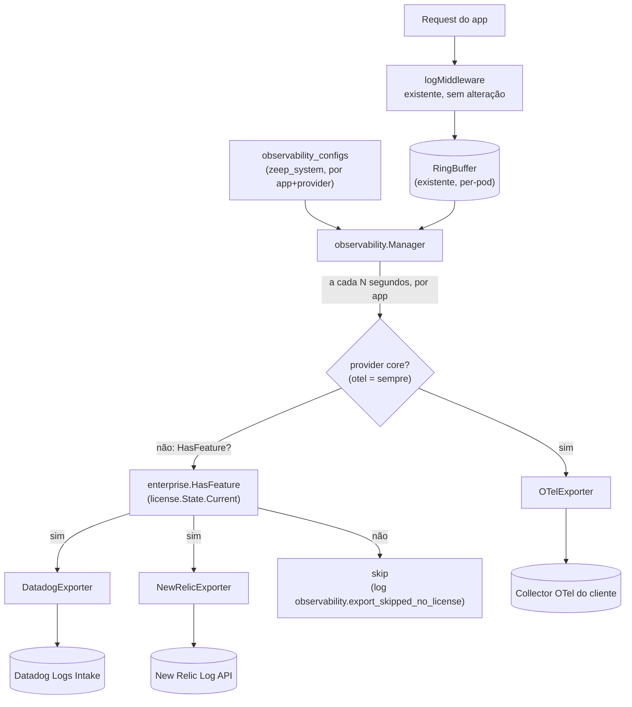

# Observability Integrations Design

**Spec**: `.specs/features/observability-integrations/spec.md`
**Status**: Draft

---

## Architecture Overview

Pacote novo `internal/observability` orquestra a exportação. Nenhuma mudança no `logMiddleware`/`RingBuffer` existentes (`internal/server/server.go`) — eles continuam alimentando a UI de logs do dashboard normalmente; o `Manager` novo apenas lê dali. Gate de licença reusa `internal/enterprise/license.HasFeature`, já desenhado no spec `enterprise-licensing` — esta é a primeira feature concreta a declarar constantes `Feature` reais.



---

## Code Reuse Analysis

### Existing Components to Leverage

| Component | Location | How to Use |
|---|---|---|
| `dashboard.LogEntry` + `RingBuffer` | `internal/server/server.go`, `internal/dashboard` | Fonte de dado do `Manager`, sem alteração no producer |
| `crypto.Encrypt`/`Decrypt` | `internal/crypto` | Criptografar `api_key` de cada provider config, igual `deploy_provider_config.go` |
| Padrão de handler config por app (`DeployProviderConfigHandler`) | `internal/dashboard/deploy_provider_config.go` | Esqueleto direto pra `ObservabilityConfigHandler` (Status/Upsert/UpdateFields) |
| Audit log | `internal/dashboard/audit_store.go` | Evento em toda mutação de config e em todo skip por falta de licença |
| `enterprise.HasFeature` + `license.State` | `internal/enterprise/license` (spec `enterprise-licensing`) | Gate por provider, chamado inline no `Manager` antes de despachar pra Datadog/New Relic |
| Goroutine periódica com lock | `internal/enterprise/license.State.StartRefresh` (mesmo spec) | Mesmo padrão de `time.Ticker` aplicado ao `Manager`, um ciclo por app com provider habilitado |
| Merge-on-absent-key em update parcial | `mergeProviderConfig`, `internal/dashboard/auth_providers_store.go` | Aplicado no `UpdateFields` de `ObservabilityConfigHandler` |

### Integration Points

| System | Integration Method |
|---|---|
| `RingBuffer` existente | Leitura direta (sem endpoint novo), cursor por timestamp mantido em memória pelo `Manager`, por app |
| `internal/enterprise/license` | `HasFeature(state.Current(), providerRegistry[p].Feature)` chamado antes de cada despacho a provider gated |
| Dashboard UI | Novo endpoint `GET/POST/PATCH/DELETE /dashboard/api/observability/configs`, nova página "Observability" |
| Providers externos | `OTelExporter` (OTLP/HTTP `/v1/logs`), `DatadogExporter` (Logs Intake API v2), `NewRelicExporter` (Log API) |

---

## Components

### `internal/observability.Manager`

- **Purpose**: Rodar o ciclo periódico por app, ler `RingBuffer`, checar gate de licença, despachar pros exporters habilitados.
- **Location**: `internal/observability/manager.go`
- **Interfaces**:
  ```go
  type Manager struct { /* unexported: configs, ringBuffer, licenseState, interval */ }

  func NewManager(buf *dashboard.RingBuffer, store ConfigStore, license *license.State, interval time.Duration) *Manager

  // Start roda em goroutine própria por app com config habilitada;
  // idempotente pra apps sem config (no-op).
  func (m *Manager) Start(ctx context.Context)
  ```
- **Dependencies**: `dashboard.RingBuffer`, `ConfigStore`, `license.State`, `providerRegistry`
- **Reuses**: padrão de goroutine+ticker de `license.State.StartRefresh`

### `internal/observability.Exporter` (interface) + registry

- **Purpose**: Abstrair o formato/endpoint de cada provider, permitir registrar novos sem tocar no `Manager`.
- **Location**: `internal/observability/exporter.go`, `otel.go`, `datadog.go`, `newrelic.go`
- **Interfaces**:
  ```go
  type Provider string

  const (
      ProviderOTel     Provider = "otel"
      ProviderDatadog  Provider = "datadog"
      ProviderNewRelic Provider = "newrelic"
  )

  type Exporter interface {
      Send(ctx context.Context, entries []dashboard.LogEntry) error
  }

  type providerDef struct {
      Feature license.Feature // "" = core, sem gate
      New     func(cfg Config) Exporter
  }

  var providerRegistry = map[Provider]providerDef{
      ProviderOTel:     {Feature: "", New: newOTelExporter},
      ProviderDatadog:  {Feature: license.FeatureObservabilityDatadog, New: newDatadogExporter},
      ProviderNewRelic: {Feature: license.FeatureObservabilityNewRelic, New: newNewRelicExporter},
  }
  ```
- **Dependencies**: `net/http` (client com timeout curto, sem retry — mesma postura fail-open do `license-server` refresh)
- **Reuses**: nenhum precedente de exporter no repo (novo)

### `internal/observability.ConfigStore`

- **Purpose**: CRUD de config por app+provider, com `api_key` sempre criptografada.
- **Location**: `internal/observability/config_store.go`
- **Interfaces**:
  ```go
  type Config struct {
      AppName          string
      Provider         Provider
      Enabled          bool
      APIKeyEncrypted  string          // vazio pra otel sem auth
      Endpoint         string
      Extra            json.RawMessage // site (datadog), account_id (newrelic), header custom (otel)
  }

  func UpsertConfig(ctx context.Context, pool *db.Pool, cfg Config) error
  func ListConfigs(ctx context.Context, pool *db.Pool, appName string) ([]Config, error)
  func DeleteConfig(ctx context.Context, pool *db.Pool, appName string, p Provider) error
  ```
- **Dependencies**: `internal/crypto`, `internal/db`
- **Reuses**: schema/estilo de `deploy_provider_config.go`

### `internal/dashboard.ObservabilityConfigHandler`

- **Purpose**: Expor CRUD de config pro frontend, com auditoria.
- **Location**: `internal/dashboard/observability_config.go`
- **Interfaces**: `GET/POST/PATCH/DELETE /dashboard/api/apps/{app}/observability/configs` — nunca retorna `api_key` em claro (só resumo: provider/enabled/endpoint)
- **Dependencies**: `internal/observability.ConfigStore`, `internal/dashboard.InsertAuditLog`
- **Reuses**: esqueleto de `DeployProviderConfigHandler`

### `internal/dashboard/ui/src/pages/ObservabilityPage.tsx`

- **Purpose**: UI de configuração por provider, com badge Enterprise em Datadog/New Relic.
- **Location**: `internal/dashboard/ui/src/pages/ObservabilityPage.tsx`
- **Dependencies**: `useFeature` (do spec `enterprise-licensing`), `EnterpriseBadge`, `sonner` (toast em erro de mutação)
- **Reuses**: `EnterpriseBadge`/`useFeature` já desenhados no `ui-design-brief.md` de `enterprise-licensing`

---

## Data Models

Nova tabela em `zeep_system` (config global da plataforma, mesmo padrão de `deploy_provider_configs`):

```sql
CREATE TABLE zeep_system.observability_configs (
    id                uuid PRIMARY KEY DEFAULT gen_random_uuid(),
    app_name          text NOT NULL,
    provider          text NOT NULL,               -- 'otel' | 'datadog' | 'newrelic'
    enabled           boolean NOT NULL DEFAULT true,
    api_key_encrypted text,                         -- NULL para otel sem auth
    endpoint          text,                         -- obrigatório para otel
    extra             jsonb NOT NULL DEFAULT '{}',  -- {"site": "datadoghq.eu"} | {"account_id": "..."} | {"header": "..."}
    created_at        timestamptz NOT NULL DEFAULT now(),
    updated_at        timestamptz NOT NULL DEFAULT now(),
    UNIQUE (app_name, provider)
);
```

**Payload despachado (formato interno, antes de traduzir por provider)**: reusa `dashboard.LogEntry` como está — nenhum campo novo é adicionado ao producer.

**OTLP/HTTP** (`POST {endpoint}/v1/logs`): log records com atributos `http.method`, `http.path`, `http.status_code`, `duration_ms`, `app`.

**Datadog Logs Intake v2** (`POST https://http-intake.logs.{site}/api/v2/logs`, header `DD-API-KEY`): array de JSON, `status: "error"` quando `http.status_code >= 500`, senão `"info"`.

**New Relic Log API** (`POST https://log-api.newrelic.com/log/v1`, header `Api-Key`): mesma lógica de severidade.

---

## Error Handling Strategy

| Error Scenario | Handling | User Impact |
|---|---|---|
| Provider externo indisponível/timeout/4xx-5xx | Loga erro server-side, segue ciclo seguinte, não afeta outros providers do mesmo app | Gap de dados nesse ciclo, sem crash, sem retry automático |
| Provider gated sem licença cobrindo a feature | Skip explícito (evento `observability.export_skipped_no_license`), distinto de erro de rede | UI mostra "pausado por licença", não "erro" |
| `RingBuffer` sem entries novas | No-op, zero chamada HTTP | Nenhum |
| App sem nenhuma config habilitada | `Manager` não inicia goroutine pra esse app | Nenhum overhead |
| Update parcial de config omitindo campo a limpar | Tratado como "não alterar" (regra do `mergeProviderConfig`) | Cliente precisa saber que precisa enviar valor vazio explícito pra limpar — documentado na UI |
| Licença cai durante exportação ativa de Datadog/New Relic | Próximo ciclo já aplica o gate, sem restart | Provider gated para de receber dados; OTel no mesmo app continua |

---

## Tech Decisions (only non-obvious ones)

| Decision | Choice | Rationale |
|---|---|---|
| Fonte do dado exportado | `RingBuffer`/`LogEntry` já existente, sem SDK novo pro app cliente | Decidido explicitamente no brainstorm: escopo é só exportar o que o zeep-orbit já gera, não introduzir contrato novo de evento custom |
| Frequência de envio | Batch periódico (goroutine+ticker por app), não fire-and-forget por request | Menos chamadas HTTP externas, mais fácil de testar e conter (rate limit do provider), reusa o padrão já validado do refresh de licença |
| Granularidade do gate de licença | Por provider individual (`providerRegistry[p].Feature`), não uma feature única "observability export" | Permite OTel core e Datadog/New Relic enterprise coexistirem no mesmo mecanismo, e generaliza pra decisões futuras provider a provider |
| OpenTelemetry ser core | Sem gate de licença | Padrão aberto/vendor-neutral — decisão explícita do usuário no brainstorm; monetização fica nos providers comerciais (Datadog, New Relic) |
| Multiplicidade de providers por app | 1:N (`UNIQUE(app_name, provider)`), não 1:1 | App pode rodar OTel core + Datadog/New Relic enterprise simultaneamente; perda de licença não zera 100% da observabilidade |
| Coordenação de cursor entre réplicas | Nenhuma — cada pod exporta só o que processou localmente | `RingBuffer` já é per-process; introduzir coordenação cross-pod infla escopo sem valor real para dado best-effort de observabilidade |
| Falha de envio ao provider | Fail-open/best-effort, sem fila persistente nem retry-with-backoff | Mesma postura já usada no refresh de revogação de licença; esta feature não é pipeline de auditoria/compliance |

---

## Tips aplicadas

- Nenhuma alteração no `logMiddleware`/`RingBuffer` existentes — reuso confirmado por leitura direta do código antes de propor.
- Gate de licença desenhado por provider (não por feature única), acomodando a correção explícita do usuário (OTel core, Datadog/New Relic enterprise) sem redesenhar a arquitetura geral.
- Contrato de payload por provider (OTLP, Datadog Intake v2, New Relic Log API) documentado em Data Models — nenhum "TBD" de formato externo.
