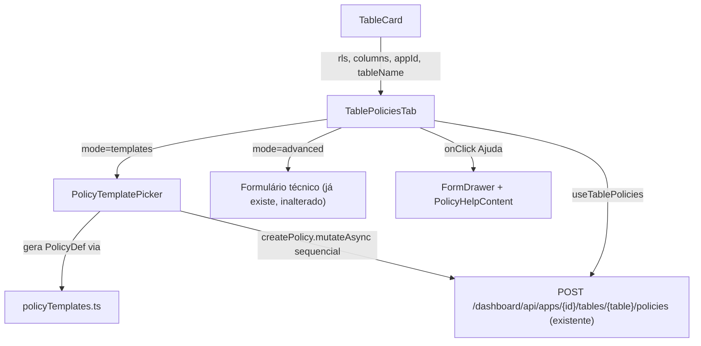

# Policy Templates & Help Drawer Design

**Spec**: `.specs/features/policy-templates/spec.md`
**Status**: Draft

---

## Architecture Overview

Frontend-only feature. Um novo módulo puro (`policyTemplates.ts`) descreve os 6 templates + affordance como dados (nenhum acesso a rede, nenhum JSX) e sabe gerar 1+ `PolicyDef` a partir de um input simples do usuário. `TablePolicies.tsx` ganha um modo "templates vs avançado" e passa a renderizar um novo `PolicyTemplatePicker` por padrão, reaproveitando os mesmos hooks `useCreateTablePolicy`/`useTablePolicies` já existentes — nenhum novo endpoint, nenhuma nova tabela. O drawer de ajuda reaproveita o padrão `FormDrawer` já usado em `Webhooks.tsx`.



---

## Code Reuse Analysis

### Existing Components to Leverage

| Component | Location | How to Use |
| --- | --- | --- |
| `useCreateTablePolicy` | `internal/dashboard/ui/src/lib/api.ts:243` | Chamado N vezes em sequência (uma por policy gerada pelo template), sem endpoint novo. |
| `useTablePolicies` | `internal/dashboard/ui/src/lib/api.ts:234` | Usado pelo template composto (P2) pra detectar quais `action` já existem antes de re-tentar. |
| `FormDrawer` | `internal/dashboard/ui/src/components/patterns/FormDrawer.tsx` | Base do drawer de ajuda — já implementa header/body/footer + Radix Dialog, mesmo padrão usado em `Webhooks.tsx`. Nenhum componente de drawer novo em `components/ui/`. |
| `Button`, `Select`, `Input`, `Icon` (`components/ui/*`) | já usados em `TablePolicies.tsx` | Reaproveitados no picker e no formulário avançado (inalterado). |
| Chip de role (`chipRoles`/`toggleRole`) | `TablePolicies.tsx:77-83` | Extraído para um pequeno componente `RoleChipPicker` compartilhado entre o formulário avançado e os templates que pedem papel (T1, T2, T6) — evita duplicar o cálculo de "role órfã" (`ROLECFG-16`) numa segunda cópia. |
| `toast.error`/`toast.success` (`sonner`) | já usado em `TablePolicies.tsx` | Mesmo padrão de feedback pro fluxo sequencial do template composto. |

### Integration Points

| System | Integration Method |
| --- | --- |
| `POST /dashboard/api/apps/{id}/tables/{table}/policies` | Reused as-is — templates só montam o `PolicyDef`, o transporte é o hook existente. Nenhuma mudança de contrato. |
| `config.HasOwnerColumn` (backend, `internal/config/rls.go`) | Espelhado no frontend por uma nova função pura `hasOwnerColumn(rls: string)`, substituindo a expressão inline duplicada hoje em `TableCard.tsx:84,91` — ver Tech Decisions. |
| i18n (`react-i18next`) | Novas chaves em `src/locales/en.json`/`pt-BR.json`, mesmo namespace `tablePolicies.*` já usado pelo componente, mais um sub-namespace `tablePolicies.templates.*` e `tablePolicies.help.*`. |

---

## Components

### `policyTemplates.ts`

- **Purpose**: Módulo de dados puro — descreve cada template e sabe gerar a(s) `PolicyDef` correspondente(s) a partir de um input mínimo do usuário. Sem JSX, sem chamada de rede — testável isoladamente.
- **Location**: `internal/dashboard/ui/src/lib/policyTemplates.ts`
- **Interfaces**:
  - `TEMPLATE_DEFINITIONS: TemplateDefinition[]` — lista ordenada dos 7 itens (6 templates acionáveis + 1 affordance), cada um com `id`, `requiresOwnerColumn: boolean`, `kind: "single" | "composite" | "info"`.
  - `buildOwnerOnlyPolicies(actions: string[], roles: string[]): PolicyDef[]` (PTPL-01) — uma `PolicyDef` por action, clause fixa `{column: "owner_id", operator: "=", value_source: "claim", value: "sub"}`.
  - `buildOpenReadPolicy(roles: string[]): PolicyDef` (PTPL-02) — `action: "select"`, clause dummy `{column: "owner_id", operator: "IS NOT NULL"}`.
  - `buildReadOnlyPolicy(roles: string[]): PolicyDef` (PTPL-04) — `action: "select"`, mesma clause dummy — reaproveita `buildOpenReadPolicy` (mesmo shape, template diferente só pela intenção mostrada na UI).
  - `buildValueMatchPolicy(column: string, value: string, roles: string[]): PolicyDef` (PTPL-05) — `action: "select"`, clause `{column, operator: "=", value_source: "literal", value}`.
  - `buildOpenReadOwnerWritePolicies(readRoles: string[]): PolicyDef[]` (PTPL-06) — array de 3: select (open), update (owner), delete (owner) — reaproveita `buildOpenReadPolicy`/`buildOwnerOnlyPolicies` internamente em vez de duplicar o shape das clauses.
  - `generatedPolicyName(templateId: string, action: string): string` — nome determinístico (`tpl_<templateId>_<action>`), único ponto que decide o `Name` enviado ao backend (Assumptions da spec).
- **Dependencies**: Nenhuma (funções puras de dados).
- **Reuses**: Nada — é o novo módulo-base que os outros componentes consomem.

### `RoleChipPicker`

- **Purpose**: Seleção de papéis via chips, incluindo papéis "órfãos" (fora de `enduser_roles_config` mas já em uso) — mesmo comportamento hoje embutido em `TablePolicies.tsx`.
- **Location**: `internal/dashboard/ui/src/components/RoleChipPicker.tsx`
- **Interfaces**:
  - `<RoleChipPicker availableRoles={string[]} selected={string[]} onToggle={(role: string) => void} label={string} />`
- **Dependencies**: Nenhuma além de React.
- **Reuses**: Extraído 1:1 do bloco `chipRoles`/`toggleRole` já existente em `TablePolicies.tsx:77-83,211-236` — comportamento idêntico, não uma reimplementação.

### `PolicyTemplatePicker`

- **Purpose**: Tela padrão de criação de policy — lista os templates (PTPL-01/02/04/05/06 acionáveis + PTPL-07 informativo), coleta o input mínimo de cada um (papéis, ações quando aplicável, coluna+valor pra PTPL-05), e dispara a criação sequencial das `PolicyDef`s geradas, com relato de sucesso/falha parcial (P2, AC2/AC3).
- **Location**: `internal/dashboard/ui/src/components/PolicyTemplatePicker.tsx`
- **Interfaces**:
  - `<PolicyTemplatePicker appId={string} tableName={string} rls={string} availableRoles={string[]} columns={ColumnDef[]} existingPolicies={TablePolicyRow[]} onDone={() => void} />`
- **Dependencies**: `useCreateTablePolicy` (chamado pelo componente pai e passado via prop `createPolicy`, ou importado direto — decisão de Tasks: importar direto do hook, mais simples, sem prop drilling extra), `policyTemplates.ts`, `RoleChipPicker`.
- **Reuses**: `Select`/`Input`/`Button`/`Icon` já usados no arquivo atual; `hasOwnerColumn` (novo helper, ver Tech Decisions) pra filtrar PTPL-01/06 quando a tabela não tem `owner_id`.

### `PolicyHelpContent`

- **Purpose**: Conteúdo estático do tutorial (P3) — títulos + explicações + ≥3 exemplos completos de cláusula avançada, todos usando só operadores/claims da allowlist real.
- **Location**: `internal/dashboard/ui/src/components/PolicyHelpContent.tsx`
- **Interfaces**: `<PolicyHelpContent />` — sem props, todo texto vem de `t("tablePolicies.help.*")`.
- **Dependencies**: `react-i18next`.
- **Reuses**: Renderizado dentro de `FormDrawer` (não implementa drawer própria).

### `TablePolicies.tsx` (modificado, não substituído)

- **Purpose**: Ganha o estado de modo (`"templates" | "advanced"`) e os botões "Ajuda"/"Modo avançado" no cabeçalho; o formulário técnico atual (linhas 188-377) permanece exatamente como está, agora só renderizado quando `mode === "advanced"`.
- **Location**: `internal/dashboard/ui/src/components/TablePolicies.tsx`
- **Interfaces**: `TablePoliciesTabProps` ganha um novo campo obrigatório `rls: string` (repassado pelo `TableCard.tsx`, que já tem `table.rls` disponível).
- **Dependencies**: `PolicyTemplatePicker`, `PolicyHelpContent`, `FormDrawer`.
- **Reuses**: Todo o formulário avançado, hooks de mutation e lista de policies já existentes — nenhuma reescrita, só um novo branch condicional no `return`.

### `TableCard.tsx` (alteração mínima)

- **Purpose**: Passar `rls={table.rls}` pro `TablePoliciesTab` (hoje só passa `appId`/`tableName`/`columns`, linha 415).
- **Location**: `internal/dashboard/ui/src/components/TableCard.tsx:415`

---

## Data Models

### `TemplateDefinition` (novo tipo, `policyTemplates.ts`)

```typescript
interface TemplateDefinition {
  id: "owner_only" | "open_read" | "value_match" | "read_only" | "open_read_owner_write" | "blocked_by_default";
  requiresOwnerColumn: boolean;
  kind: "single" | "composite" | "info";
  actionsFixed?: string[]; // ações que o template sempre cria (ex.: read_only -> ["select"]); ausente quando o usuário escolhe (owner_only)
}
```

**Relationships**: Cada `id` mapeia 1:1 a uma função `build*` do mesmo módulo e a um bloco de i18n `tablePolicies.templates.<id>.*`. Não persiste em nenhuma tabela — é dado estático de UI, igual a `ACTIONS`/`OPERATORS` hoje.

Nenhum modelo de dados novo no backend — `PolicyDef`/`PolicyClause`/`TablePolicyRow` (`api.ts:206-232`) são reutilizados sem alteração de shape.

---

## Error Handling Strategy

| Error Scenario | Handling | User Impact |
| --- | --- | --- |
| Criação via template de ação única (PTPL-01/02/04/05) falha (validação, conflito de nome, rede) | Mesmo `onError` do `useCreateTablePolicy` já existente (`toast.error(error.message)`), formulário do template permanece aberto e preenchido pra nova tentativa. | Toast com a mensagem do backend; nenhum estado de loading travado (spec AC P1-8). |
| Template composto (PTPL-06): 1ª chamada (select) ok, 2ª (update) falha | Sequência para no primeiro erro. UI mostra lista "criado: select ✓ / falhou: update (mensagem) / pendente: delete", sem tentar `delete`. | Usuário sabe exatamente o que já existe; pode reabrir o template (retry pula `select`, já existente) ou completar via modo avançado. |
| Template composto reaplicado após falha parcial | Antes de disparar cada `POST`, o picker consulta `existingPolicies` (já carregado via `useTablePolicies`) e pula a `action` cujo nome gerado (`generatedPolicyName`) já existe. | Nenhuma tentativa duplicada — evita 409 previsível. |
| Colisão de nome gerado (`tpl_owner_only_select` já existe, criado manualmente por outra via) | Mesmo 409 que o formulário avançado já trata hoje (`toast.error`), sem lógica de rename automático. | Toast de conflito; usuário resolve renomeando manualmente via modo avançado (Assumptions da spec). |
| Drawer de ajuda aberto com formulário/template em andamento | `FormDrawer` é um Radix Dialog independente por cima do conteúdo atual — fechar o drawer não desmonta `PolicyTemplatePicker`/formulário avançado por trás (estado React preservado, nenhum unmount). | Rascunho preservado ao fechar o drawer (spec AC P3-3). |

---

## Risks & Concerns

| Concern | Location (file:line) | Impact | Mitigation |
| --- | --- | --- | --- |
| `hasOwnerColumn` hoje é uma expressão inline duplicada (não uma função nomeada) em dois pontos de `TableCard.tsx` (linhas 84 e 91 fazem checagens parecidas mas não idênticas — `autoColumnsFor` inclui `"policy"`, `isPolicyRLS` só compara com `"policy"`) | `internal/dashboard/ui/src/components/TableCard.tsx:83-91` | Adicionar uma 3ª cópia da lógica "owner/enabled/policy" pros templates (4ª contando o backend) aumentaria o risco já existente de uma futura mudança de modo RLS esquecer um dos lugares — o mesmo tipo de bug que motivou a spec `rls-policy-mode` original. | Extrair `hasOwnerColumn(rls: string): boolean` como função nomeada exportada (`internal/dashboard/ui/src/lib/api.ts` ou um novo `src/lib/rls.ts`), usada pelos 2 pontos existentes em `TableCard.tsx` e pelo novo `PolicyTemplatePicker` — uma função, três consumidores, em vez de três expressões. Vira uma task explícita de refactor antes de qualquer código de template (ver Tasks). |
| Nenhum teste de frontend hoje cobre `TablePolicies.tsx` (busca por `TablePolicies.test` não encontrou arquivo) | `internal/dashboard/ui/src/components/` (ausência de `TablePolicies.test.tsx`) | Sem teste existente pra servir de base, o risco de regressão no formulário avançado (que não deveria mudar de comportamento) recai só em `npx tsc -b`/`npm run build` + verificação manual. | `policyTemplates.ts` é puro (sem JSX/rede) — vira o principal alvo de teste unitário desta feature (Vitest, se configurado no projeto; confirmar ferramenta de teste de frontend disponível na fase de Tasks). Comportamento visual do formulário avançado é coberto por verificação manual explícita no UAT do Execute, não por asserção automatizada nova. |
| Template composto (PTPL-06) faz 3 `POST` sequenciais na *mesma* mutation hook instance — nenhuma fila/lock impede o usuário de clicar duas vezes ou navegar pra outra aba no meio da sequência | Novo, não existe hoje (`PolicyTemplatePicker.tsx`, a criar) | Clique duplo durante a sequência poderia disparar duas cadeias de 3 `POST`s concorrentes, multiplicando o risco de conflito de nome. | Desabilitar o botão de aplicar template (e a navegação pra "Modo avançado"/outro template) enquanto a sequência do composto está em andamento — mesmo padrão já usado pelo `isSaving` do formulário atual (`TablePolicies.tsx:174`, `disabled={isSaving}`). |

---

## Tech Decisions

| Decision | Choice | Rationale |
| --- | --- | --- |
| Onde fica a lógica dos templates | Módulo puro `policyTemplates.ts`, sem JSX | Testável sem renderizar nada, mesma filosofia de `internal/provisioner/policy.go` no backend (validação/tradução separada da camada HTTP) — mantém paridade de estilo entre as duas pontas. |
| Import direto do hook `useCreateTablePolicy` dentro de `PolicyTemplatePicker` em vez de recebê-lo via prop | Import direto | Evita prop drilling de 3 mutation hooks (`create`/`update`/`delete`) só pra alimentar um componente filho; `TablePolicies.tsx` já importa os hooks pro formulário avançado, então ambos os componentes chamam o mesmo `useCreateTablePolicy(appId, tableName)` — o React Query dedupe/cachê é por `queryKey`, não por instância do hook, então não há duplicação de estado. |
| `hasOwnerColumn` centralizado | Nova função exportada, substitui as 2 expressões inline hoje em `TableCard.tsx` | Ver Risks & Concerns — mesma classe de bug que motivou `rls-policy-mode` (`AGENTS.md`: "a única forma correta de derivar..." — aqui o princípio se estende de schema name pra essa checagem de capacidade). |
| Templates PTPL-04 e PTPL-02 geram o mesmo shape de `PolicyDef` (select, clause dummy) | Mantidos como 2 entradas de `TEMPLATE_DEFINITIONS` distintas, reaproveitando a mesma função `buildOpenReadPolicy` internamente | São a mesma capacidade técnica com 2 propósitos de produto diferentes ("deixar ler" vs "impedir escrita") — a spec (PTPL-02, PTPL-04) os trata como templates distintos na lista voltada ao usuário; unificar a UI dos dois reintroduziria a ambiguidade que os templates existem pra evitar. |
