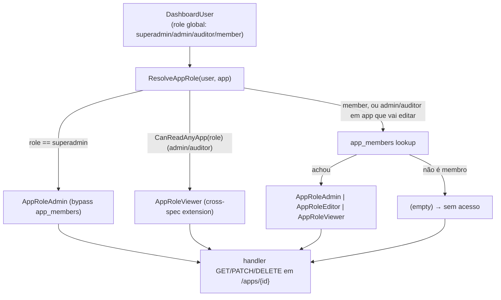

# RBAC Per-App Design

**Spec**: `.specs/features/rbac-per-app/spec.md`
**Status**: Draft
**Cross-spec**: ponto de extensão de `dashboard-global-roles` T-06 (documentado em `.specs/features/dashboard-global-roles/design.md`, Seção "Where the extensão de `CanReadAnyApp` é implementada").

---

## Architecture Overview

Modelo de ownership unificado via `app_members` (tabela única cobrindo backend apps e frontend apps) + uma função central `ResolveAppRole(user, app)` que decide a role efetiva de um usuário num app. Toda checagem de autorização per-app passa por essa função — sem `if role == "superadmin"` espalhado, sem checagem de `owner_id` ad-hoc em cada handler.



A integração cross-spec com `dashboard-global-roles` mora **dentro** de `ResolveAppRole` (não numa função paralela). Isso evita duas fontes de verdade sobre "quem pode ler/editar qual app" — uma função, um lugar só, conforme decisão registrada no design de `dashboard-global-roles` (Seção Tech Decisions).

---

## Code Reuse Analysis

### Existing Components to Leverage

| Component | Location | How to Use |
|---|---|---|
| `ProvisionZeepSystem` (migration orquestrada, idempotente, advisory lock) | `internal/dashboard/provisioner.go` | Adicionar criação de `app_members` no array de `stmts`, com `CREATE TABLE IF NOT EXISTS` + `CREATE UNIQUE INDEX IF NOT EXISTS` |
| `CanReadAnyApp` (decisão de admin/auditor global) | `internal/dashboard/platform_roles.go` | Chamada dentro de `ResolveAppRole` antes do lookup em `app_members` — extensão cross-spec que `dashboard-global-roles` T-06 espera |
| `DashboardUser` (id + role do usuário logado) | `internal/dashboard/store.go` | Input de `ResolveAppRole` |
| Padrão "invariante ≥1 admin" (transacional, lock) | Já usado em `dashboard-global-roles` T-05 (`DeleteUser`/`PATCH users/{id}`) | Replicado em T-07 para "≥1 admin por app" |
| `InsertAuditLog` | `internal/dashboard/audit_store.go` | Eventos `app_member.added` / `app_member.removed` / `app_member.role_changed` em T-06 |
| Padrão de teste com DB real + `TEST_DATABASE_URL` skip | `internal/dashboard/provisioner_roles_test.go` | Mesmo padrão em `rbac_test.go` |
| Padrão `errors.Is(err, pgx.ErrNoRows)` | `internal/dashboard/apps_store.go` (e outros) | Para distinguir "não é membro" (zero value) de erro de query |

### Integration Points

| System | Integration Method |
|---|---|
| `dashboard-global-roles` (`CanReadAnyApp` em `platform_roles.go`) | `ResolveAppRole` chama `CanReadAnyApp(user.Role)` quando role ≠ superadmin. Se true, retorna `AppRoleViewer` sem consultar `app_members` (leitura irrestrita, sem escrita). |
| Handlers existentes de `apps` (`ListApps`, `GetApp`, `DeleteApp`, `GetAppSecret`, `GetAppAuthProviders`, ...) | Substituir filtros por `owner_id`/`app_ownership` (em `apps_store.go`) por filtro via `app_members`/`ResolveAppRole`. Não remover o `owner_id` da tabela ainda — só parar de usá-lo como fonte de autorização. |
| Handlers existentes de `frontend_apps` (`frontend_apps.go`, `frontend_apps_store.go`) | Mesmo tratamento, com `frontend_app_id` no lugar de `backend_app_id`. |
| Tabela `app_ownership` (existente, vai morrer) | Mantida até T-08 para que o enforcement incremental não quebre acesso de ninguém. Drop em T-08, depois de enforcement estar verde. |
| `apps.owner_id`, `frontend_apps.created_by`, `frontend_apps.owner_id` | Viram só metadado histórico ("criado por") depois que `app_members` assume o papel de fonte de autorização. Não removidos fisicamente — é metadado, e remoção quebraria integrações externas que dependem do campo. |

---

## Components

### `internal/dashboard.ResolveAppRole` + `AppRole` + `AppRef`

- **Purpose**: Função central de resolução de role per-app, com integração cross-spec para `CanReadAnyApp`.
- **Location**: `internal/dashboard/rbac.go` (perto de `platform_roles.go`, mesmo pacote — sem criar pacote novo, é parte do mesmo eixo de autorização).
- **Interfaces**:
  ```go
  type AppRole string

  const (
      AppRoleAdmin  AppRole = "admin"
      AppRoleEditor AppRole = "editor"
      AppRoleViewer AppRole = "viewer"
      // AppRole zero value ("") = "não é membro"
  )

  func (r AppRole) Effective() bool       // any non-empty role
  func (r AppRole) CanWrite() bool        // admin or editor
  func (r AppRole) CanManage() bool       // admin only (config, members, archive)

  type AppRef struct {
      BackendAppID  string  // UUID; vazio se FrontendAppID está setado
      FrontendAppID string  // UUID; vazio se BackendAppID está setado
  }

  var ErrInvalidAppRef = errors.New("rbac: AppRef must have exactly one of BackendAppID/FrontendAppID set")

  // ResolveAppRole returns the user's effective role on the given app.
  // Resolution order (first match wins):
  //   1. user is superadmin → AppRoleAdmin (bypass app_members)
  //   2. CanReadAnyApp(user.Role) is true (admin/auditor global) → AppRoleViewer
  //      (cross-spec extension — dashboard-global-roles T-06)
  //   3. Look up app_members. Returns "" if not a member.
  //
  // Returns ("", ErrInvalidAppRef) if AppRef is malformed.
  // Returns ("", nil) when the user has no access.
  func ResolveAppRole(ctx context.Context, pool *db.Pool, user *DashboardUser, app AppRef) (AppRole, error)
  ```
- **Dependencies**: `db.Pool`, `DashboardUser`, `CanReadAnyApp` (de `platform_roles.go`).
- **Reuses**: nenhum pacote externo; só `pgx` para o query.
- **Por que sem cache em v1:** a query tem índice UNIQUE composto `(backend_app_id, user_id)`/`(frontend_app_id, user_id)`, é O(1). Adicionar cache aqui antes de saber o perfil de carga seria otimização prematura; sem o ponto de invalidação correto (mudança de membership em outra réplica), o cache vira fonte de bug. Se virar hot path em profiling, cache local com TTL de 30s + invalidação via audit log é a evolução natural.

---

## Data Models

### Tabela `app_members` (criada em T-01)

```sql
CREATE TABLE IF NOT EXISTS zeep_system.app_members (
    id              UUID        PRIMARY KEY DEFAULT gen_random_uuid(),
    backend_app_id  UUID        REFERENCES zeep_system.apps(id)         ON DELETE CASCADE,
    frontend_app_id UUID        REFERENCES zeep_system.frontend_apps(id) ON DELETE CASCADE,
    user_id         UUID        NOT NULL REFERENCES zeep_system.dashboard_users(id) ON DELETE CASCADE,
    role            TEXT        NOT NULL CHECK (role IN ('admin', 'editor', 'viewer')),
    created_at      TIMESTAMPTZ NOT NULL DEFAULT now(),
    -- Exactly one of backend_app_id / frontend_app_id must be set
    CHECK ((backend_app_id IS NOT NULL AND frontend_app_id IS NULL)
        OR (backend_app_id IS NULL AND frontend_app_id IS NOT NULL))
);

-- UNIQUE parcial por eixo: um user não pode ter duas roles no mesmo app,
-- mas pode ser admin de um backend app E admin de um frontend app.
CREATE UNIQUE INDEX IF NOT EXISTS idx_app_members_backend_unique
    ON zeep_system.app_members(backend_app_id, user_id)
    WHERE backend_app_id IS NOT NULL;

CREATE UNIQUE INDEX IF NOT EXISTS idx_app_members_frontend_unique
    ON zeep_system.app_members(frontend_app_id, user_id)
    WHERE frontend_app_id IS NOT NULL;

-- Lookup reverso "em que apps esse user é membro?" — usado por ListApps
-- depois do enforcement, em T-04.
CREATE INDEX IF NOT EXISTS idx_app_members_user
    ON zeep_system.app_members(user_id);
```

**Por que UNIQUE parcial em vez de UNIQUE condicional:** o `CHECK` permite que o índice não se aplique quando a coluna é NULL. UNIQUE condicional precisaria de índice com WHERE NOT NULL ou trigger; índice parcial é nativo do Postgres e mais barato.

### Tabela `app_ownership` (existente, removida em T-08)

Não tocada em T-01. Continua existindo e sendo consultada em paralelo a `app_members` durante a Fase 2-4 (enforcement incremental), para garantir que ninguém perde acesso durante a transição. Drop em T-08 depois que enforcement estiver 100% em `ResolveAppRole`.

### Coluna `apps.owner_id` (existente)

Continua existindo em T-01. Deixa de ser fonte de autorização a partir de T-04 (handlers passam a usar `ResolveAppRole`). Mantida como metadado histórico (não removida).

### Colunas `frontend_apps.created_by` / `frontend_apps.owner_id` (existentes)

Mesma decisão: continuam existindo, deixam de ser fonte de autorização, viram metadado.

---

## Error Handling Strategy

| Error Scenario | Handling | User Impact |
|---|---|---|
| Usuário não é membro, sem acesso global de leitura | `ResolveAppRole` retorna `("", nil)` | Handler decide 403 (`/apps/{id}` retorna 403) ou omit (`/apps` simplesmente não lista) |
| `admin`/`auditor` global acessa app de terceiro | `ResolveAppRole` retorna `AppRoleViewer` | Leitura ok; tentativa de escrita (POST/PUT/DELETE) é bloqueada no handler via `role.CanWrite() == false` |
| `member` com `AppRoleViewer` no app tenta editar dado | `CanWrite() == false` | 403 claro no handler |
| `AppRef` inválido (ambos campos set, ambos vazios, ou UUID malformado) | `ResolveAppRole` retorna `ErrInvalidAppRef` | Programmer error — handler faz panic ou log + 500, depende da convenção do handler |
| `superadmin` faz qualquer coisa | `ResolveAppRole` retorna `AppRoleAdmin` (bypass) | Sem checagem adicional — superadmin é superadmin |
| Migração de dados falha mid-way | `ProvisionZeepSystem` reverte (rollback) | Sem inconsistência — mesmo padrão das demais migrations |
| App sem nenhum `admin` (caso `frontend_apps.created_by` não resolveu) | Não é erro de migration; app fica "órfão" | `superadmin` acessa; `superadmin` é o único que pode adicionar o primeiro `admin` via `POST /members` |

---

## Tech Decisions (only non-obvious ones)

| Decision | Choice | Rationale |
|---|---|---|
| Nome do pacote da função | `internal/dashboard` (não `internal/rbac/`) | É parte do mesmo eixo de autorização de `platform_roles.go`; pacote novo seria over-engineering. Comentário em `platform_roles.go:66` já referencia `rbac-per-app.ResolveAppRole` como função desta spec, mas pode ser resolvida por uma função no mesmo pacote — o nome do pacote não é contrato. |
| Tabela única `app_members` para backend e frontend apps | Sim | Spec exige modelo unificado. UNIQUE parcial por eixo permite que o mesmo user seja admin de um backend e viewer de um frontend sem ambiguidade. |
| `owner_id` removido da tabela `apps`? | Não em v1; vira só metadado | Remoção quebraria integrações externas (responses da API ainda retornam `owner_id` em `AppRow`). Mesmo padrão de `created_by` em `frontend_apps` — metadado preservado, autorização migrada. |
| `app_ownership` removida em T-01? | Não — em T-08, depois do enforcement estar verde | Durante T-04/T-05, enforcement pode usar `app_ownership` como fallback se algo der errado. Remover só quando a transição está garantida. |
| Cache de `ResolveAppRole` em v1? | Não | Query com índice UNIQUE é O(1). Cache antes de saber o perfil de carga + sem ponto de invalidação correto = fonte de bug. Adicionar depois com TTL+invalidação via audit log se virar hot path. |
| Integração cross-spec (`CanReadAnyApp` dentro de `ResolveAppRole`) | Sim, dentro da função | Decisão já registrada em `dashboard-global-roles/design.md` (Tech Decisions: "Onde a extensão de `CanReadAnyApp` é implementada → Dentro de `ResolveAppRole` (spec `rbac-per-app`)"). Cumprimos o contrato aqui. |
| `AppRoleViewer` para `admin`/`auditor` global | Sim — read-only | A spec é clara: `admin` global tem acesso de plataforma (não leitura irrestrita de apps). O bypass de `CanReadAnyApp` é só leitura; escrita continua exigindo membership explícita. Alinhado com P1 AC-1 ("viewer, editor ou admin per-app" pode visualizar). |
| Onde mora `AppRef` | `internal/dashboard/rbac.go` | Mesmo lugar da função. Sem struct público em outro lugar; é input da função. |
| Uso de `CHECK` constraint para "exactly one" de backend/frontend FK | Sim — além do `UNIQUE` parcial | Defesa em profundidade: o `CHECK` rejeita inserts com ambos ou nenhum setados, mesmo se o índice parcial for mal-dropado. Custo zero, valor alto. |

---

## Tips aplicadas

- Cross-spec com `dashboard-global-roles` é documentada como requisito de integração (Integration Points + Tech Decisions), não como "ah, depois a gente vê". O ponto de extensão de `CanReadAnyApp` está dentro de `ResolveAppRole`, conforme contrato.
- `app_ownership` é preservada intencionalmente durante a transição. Removida em T-08 só depois do enforcement estar verde. Plano de migração é: criar → popular → enforcement → remover.
- Tabela `apps.owner_id` e `frontend_apps.created_by`/`owner_id` viram metadado, não são removidas. Spec de P1 AC-3 é explícita sobre isso.
- Decisão de cache documentada como "não em v1" com critério claro pra revisitar (perfil de carga + ponto de invalidação), evitando o anti-pattern de "otimização prematura vira bug".
- Função `ResolveAppRole` é puramente uma função de **lookup**, não é middleware, não tem efeito colateral. Toda decisão de "403 vs omit" fica no handler — função só diz "qual a role", não "o que fazer com ela". Isso mantém a função trivial de testar e de reusar.
