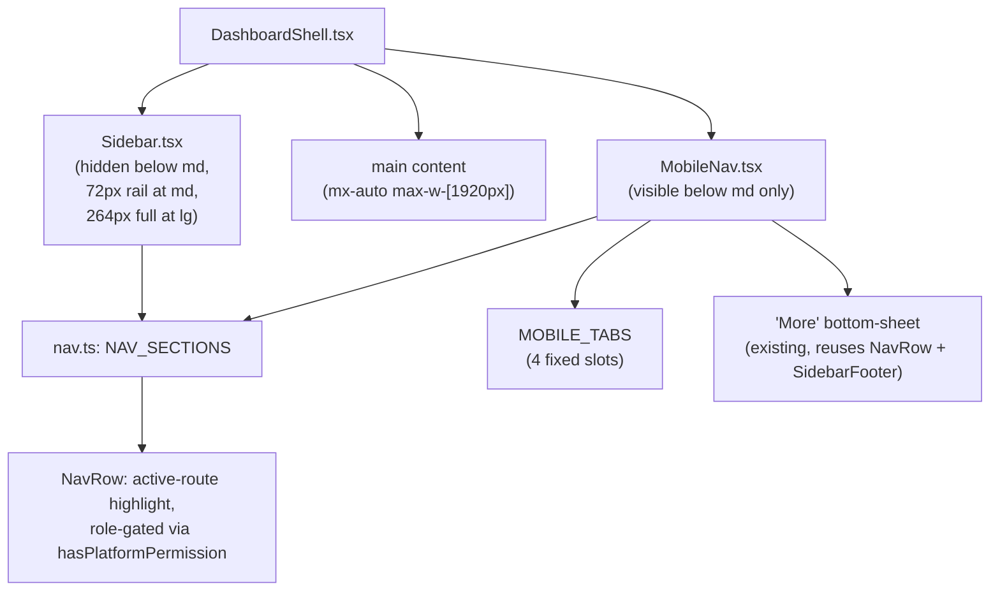

# Responsive Layout Design

**Spec**: `.specs/features/responsive-layout/spec.md`
**Status**: Draft

---

## Architecture Overview

All three nav states (mobile bottom bar, tablet icon rail, desktop full sidebar) are pure-CSS variants of the two components that already exist and already mount unconditionally today (`Sidebar.tsx`, `MobileNav.tsx`). No JS breakpoint hook, no new nav component, no conditional-render-by-JS logic — matches the codebase's existing convention (100% Tailwind `max-md:`/`md:`/`lg:` variants, zero `useMediaQuery`/`matchMedia` anywhere today) and the user's chosen approach.

Three width states, one component, resolved purely by the viewport at render/resize time:

| Width | Sidebar.tsx | MobileNav.tsx |
| --- | --- | --- |
| `<768px` (mobile) | `hidden` | visible, bottom bar + drawer |
| `768–1023px` (tablet) | visible, `w-[72px]`, icon-only | `hidden` |
| `≥1024px` (desktop) | visible, `w-[264px]`, icon+label | `hidden` |

---

## Code Reuse Analysis

### Existing Components to Leverage

| Component | Location | How to Use |
| --- | --- | --- |
| `Sidebar.tsx` (incl. `NavRow`, `SidebarFooter`) | `src/components/layout/Sidebar.tsx` | Extend in place with responsive width/label classes; `NavRow` and `SidebarFooter` stay exported and reused by `MobileNav.tsx` exactly as today. |
| `MobileNav.tsx` custom bottom-sheet | `src/components/layout/MobileNav.tsx` | Unchanged mechanism (per user decision) — only its data source (`MOBILE_TABS`) grows from 3 to 4 items. |
| `NAV_SECTIONS` / `MOBILE_TABS` | `src/components/layout/nav.ts` | Single source of truth for both nav surfaces already; add one entry to `MOBILE_TABS`. No new config file. |
| `ui/tooltip.tsx` (Radix `@radix-ui/react-tooltip`) | `src/components/ui/tooltip.tsx` | Wrap each rail icon in the tablet-width render to satisfy RESP-02 AC2 — already installed, zero new dependency. |
| `ui/separator.tsx` | `src/components/ui/separator.tsx` | Reuse for the tablet-only section-boundary marker (RESP-02 AC4) — already used elsewhere (`AppDetailsPage.tsx` tabs). |
| `hasPlatformPermission` | `src/lib/permissions.ts` | Unchanged — both the rail and the full sidebar keep filtering `NAV_SECTIONS` through this exactly as today. |
| Existing `max-md:flex max-md:flex-col` collapse pattern | `src/pages/DataBrowserPage.tsx:291-292` | RESP-07: widen the same pattern's breakpoint from `md` to `lg` (`max-lg:` instead of `max-md:`), no new markup. |
| Existing `overflow-x-auto` table wrapper | `src/components/patterns/DataTable.tsx:84` | No change needed — already prevents page-level overflow from wide tables at every breakpoint; confirmed out of scope per spec. |

### Integration Points

| System | Integration Method |
| --- | --- |
| `react-router-dom` v7 (`NavLink`) | Unchanged — `NavRow`'s `NavLink`-based active-state logic is reused verbatim at every breakpoint. |
| Tailwind v4 (`@theme`, no config file) | Uses only default breakpoints already relied on elsewhere (`md`=768px, `lg`=1024px); no new `--breakpoint-*` token needed since `768`/`1024`/`1920` map to `md`/`lg`/a one-off arbitrary value (`max-w-[1920px]`) respectively. |
| Playwright (`playwright.config.ts`) | Add 3 new `projects` entries (viewport-only, reusing `devices['Desktop Chrome']` as a base and overriding `viewport`) alongside the existing single `chromium` project. |

---

## Components

### `Sidebar.tsx` (modified, not new)

- **Purpose**: Render the app's primary navigation as a full 264px labeled sidebar on desktop (`≥1024px`) or a 72px icon-only rail on tablet (`768–1023px`); stay hidden on mobile (`<768px`).
- **Location**: `src/components/layout/Sidebar.tsx`
- **Interfaces** (unchanged signature — internal render logic only):
  - `Sidebar(props: { banner?: ReactNode }): JSX.Element` — same props as today.
  - `NavRow(props: { item: NavItem; onNavigate?: () => void }): JSX.Element` (exported, reused by `MobileNav.tsx`) — gains an internal tooltip wrap and a `label`-hiding class; its `isActive` styling logic (tint + fill + left bar) is unchanged, only the left-bar/tint target shifts from "row" to "icon button" visually at `72px` via CSS, no new prop.
  - `SidebarFooter` (exported, reused by `MobileNav.tsx`) — unchanged.
- **Dependencies**: `nav.ts` (`NAV_SECTIONS`), `permissions.ts` (`hasPlatformPermission`), `ui/tooltip.tsx`, `ui/separator.tsx`.
- **Reuses**: Its own existing active-route logic, icon rendering (`Icon` component / Material Symbols), i18n keys already defined for every label and section title.
- **Class changes** (illustrative, exact Tailwind arbitrary values to be finalized during implementation):
  - `<aside>`: from `style={{width: 264}}` + `max-md:hidden` to `hidden md:flex md:w-[72px] lg:w-[264px]` (inline style removed in favor of responsive width classes).
  - Nav item label ``: add `hidden lg:inline` (hidden at tablet width, shown again at desktop).
  - Section title `
` (`nav.sectionGeneral` etc.): add `hidden lg:block`.
  - New: a `<Separator>` between sections, classed `md:block lg:hidden` (visible only in the tablet icon-only state, replacing the section title there — RESP-02 AC4).
  - `NavRow`'s icon wrapper: always wrapped in `<Tooltip><TooltipTrigger>...</TooltipTrigger><TooltipContent>{label}</TooltipContent></Tooltip>` — tooltip is harmless (if slightly redundant) at desktop width where the label is already visible; this avoids any JS branch to conditionally attach it, consistent with the chosen CSS-only approach. (Design decision — see Tech Decisions.)

### `MobileNav.tsx` (modified, not new)

- **Purpose**: Render the mobile bottom bar (5 slots: 4 fixed + "More") and the "More" bottom-sheet drawer. Mechanism unchanged; content grows by one fixed tab.
- **Location**: `src/components/layout/MobileNav.tsx`
- **Interfaces**: Unchanged component signature. Internally now maps 4 `MOBILE_TABS` entries instead of 3 (layout math — flex-basis / grid-cols for the bottom bar — adjusts from a 4-slot to a 5-slot row, "More" button included in the count).
- **Dependencies**: `nav.ts` (`MOBILE_TABS`, `NAV_SECTIONS`), `Sidebar.tsx` (`NavRow`, `SidebarFooter`, reused inside the sheet — unchanged).
- **Reuses**: Its own existing bottom-sheet overlay, animation, safe-area padding, and `data-testid="mobile-nav-sheet"` (kept for the existing e2e test).

### `nav.ts` (modified, not new)

- **Purpose**: Single source of truth for both nav surfaces.
- **Location**: `src/components/layout/nav.ts`
- **Change**: `MOBILE_TABS` array gains one entry — SDKs (`code` icon, `/sdks` route, matching the entry already defined in `NAV_SECTIONS`) — going from 3 to 4 fixed tabs. `NAV_SECTIONS` itself is unchanged (SDKs already exists there).

### `DashboardShell.tsx` (modified, not new)

- **Purpose**: Cap and center the main content area on ultra-wide viewports (RESP-04); otherwise identical to today.
- **Location**: `src/pages/DashboardShell.tsx`
- **Change**: The inner content wrapper (today `w-full min-w-0 p-10 max-md:px-4 max-md:py-4`, line 138) gains `mx-auto max-w-[1920px]`. The `<aside>` (sidebar) stays outside this wrapper and pinned to the grid's first column, so it remains flush against the left edge of the viewport even when content centers past 1920px (per RESP-03 AC2 — sidebar not centered with content).

### `DataBrowserPage.tsx` (modified, not new)

- **Purpose**: RESP-07 — widen the existing mobile-only two-pane collapse to also apply at tablet widths.
- **Location**: `src/pages/DataBrowserPage.tsx:291-292`
- **Change**: `max-md:flex max-md:flex-col` → `max-lg:flex max-lg:flex-col` (and the paired `max-h-[220px]` scrollable-strip class on the table-list panel gets the same `md`→`lg` swap). The `240px_1fr` desktop grid now only applies at `≥1024px`.

### `BrandSettingsPage.tsx` / `GitHubIntegrationPage.tsx` (modified, not new)

- **Purpose**: RESP-05 — remove the confirmed sub-420px overflow bug.
- **Location**: `BrandSettingsPage.tsx:151,241,387,540,661`; `GitHubIntegrationPage.tsx:334,1037,1292`
- **Change**: Each `min-w-[420px]` becomes `min-w-0` (or the class is dropped entirely where no other min-width purpose exists) combined with keeping the existing `flex-1`/`w-full` so the field still fills available space above 420px and simply stops forcing overflow below it.

### `playwright.config.ts` (modified, not new)

- **Purpose**: RESP-06 — add automated coverage for the three nav states and the ultra-wide cap.
- **Location**: `playwright.config.ts`
- **Change**: Add 3 `projects` entries: `mobile` (390×844), `tablet` (820×1180), `ultrawide` (2560×1440), each `use: { ...devices['Desktop Chrome'], viewport: {...} }`, alongside the existing `chromium` project (kept as-is for the default 1280×720-class desktop suite).

### New e2e specs (new files)

- **Purpose**: RESP-06 acceptance criteria.
- **Location**: `e2e/responsive-nav.spec.ts` (new file, mirrors the structure of `e2e/personal-access-tokens.spec.ts`'s existing mobile-viewport block rather than duplicating it there).
- **Interfaces**: Playwright test file, no exported API — 3 tests: bottom-bar 5-slot + drawer contents (mobile project), icon-rail-not-sidebar-not-bottombar + tooltip + navigation (tablet project), content max-width assertion via `boundingBox()` (ultrawide project).
- **Dependencies**: existing Playwright auth/login helper already used by `personal-access-tokens.spec.ts` (reused, not reinvented).

---

## Data Models

Not applicable — this feature is presentation-layer only (CSS classes, one array entry, one config file addition, one test config addition). No new data model, no API/schema change.

---

## Error Handling Strategy

| Error Scenario | Handling | User Impact |
| --- | --- | --- |
| Viewport resized live across a breakpoint boundary while the "More" bottom-sheet is open | The sheet is `md:hidden`-scoped already (only mounts its interactive affordance below `md`); if the width crosses `768px` while open, the sheet's own overlay becomes `hidden` via the existing CSS, which visually closes it without a JS listener — verified as an edge case (spec Edge Cases section), not a new failure mode to introduce handling for. | Sheet disappears if the window is resized past the mobile breakpoint mid-interaction; re-opening requires tapping "More" again at whatever the new state is (if still mobile) or is simply unavailable (if now tablet/desktop, where the full nav is already visible). |
| A role has zero visible items in a `NAV_SECTIONS` group at any breakpoint | Existing filter (`hasPlatformPermission`) already returns an empty group; render logic (existing, unchanged) already skips rendering an empty section's heading/separator. | No visual gap — matches current desktop behavior, now confirmed identical at tablet/mobile too. |
| `min-w-[420px]` removal changes visual width of a field above 420px | None needed — `flex-1`/`w-full` already governs width above the old floor; removing the floor only changes behavior below 420px, which was already broken (overflow) rather than working as intended. | No visible change on any viewport ≥420px; only fixes viewports below it. |

---

## Risks & Concerns

| Concern | Location (file:line) | Impact | Mitigation |
| --- | --- | --- | --- |
| `Sidebar.tsx`'s render loop will carry 3 breakpoint-conditional class sets (label visibility, section title visibility, separator visibility) once this ships — readability risk if a future nav change is added without checking all 3 states. | `src/components/layout/Sidebar.tsx` (render loop over `NAV_SECTIONS`) | A future maintainer could add a new nav item/section without noticing it must render correctly at 72px icon-only width too. | Task-level: add a one-line comment at the top of the render loop noting the 3-state contract (mirrors the existing `orbit-internals` skill convention of flagging load-bearing invariants inline). No code duplication is introduced — it's the same loop, just more conditional classes — so the risk is documentation, not architecture. |
| Tooltip always attached to `NavRow`'s icon (including at desktop width, where it's redundant with the visible label) | `src/components/layout/Sidebar.tsx` (`NavRow`) | Minor UX redundancy at desktop — hovering an icon shows both its tooltip and its always-visible label. Not a correctness bug. | Accepted trade-off (see Tech Decisions) in exchange for avoiding a JS breakpoint branch; if it reads as visually noisy during implementation, a `lg:hidden` wrapper around just the `TooltipContent` (still zero JS) can suppress it at desktop without reintroducing a hook. |
| Existing e2e test `e2e/personal-access-tokens.spec.ts:185-203` asserts on `mobile-nav-sheet` with 3 `MOBILE_TABS`-derived assumptions (indirectly, via the sheet listing `NAV_SECTIONS`) | `e2e/personal-access-tokens.spec.ts:185-203` | Adding a 4th fixed tab (SDKs) to `MOBILE_TABS` does not change `NAV_SECTIONS` (SDKs was already a member), so this existing test's assertions (about the sheet's contents) should remain valid — but the bottom bar's *fixed-tab* rendering itself isn't asserted there today. | No fix required to this existing test; RESP-06's new `mobile` project test explicitly covers the 5-slot bottom bar so the gap is closed by new coverage, not by touching the old test. |
| No existing Playwright project touches tablet or ultra-wide widths at all | `playwright.config.ts` (single `chromium` project today) | Before this feature, a regression at 820px or 2560px would ship undetected. | Directly addressed by RESP-06 — the 3 new projects are the mitigation, not a residual risk once implemented. |

---

## Tech Decisions

| Decision | Choice | Rationale |
| --- | --- | --- |
| Nav-state implementation mechanism | Pure CSS (Tailwind responsive classes) on existing `Sidebar.tsx`/`MobileNav.tsx`, no JS breakpoint hook, no new component | User-confirmed choice; matches 100% of existing responsive code in this repo (zero `useMediaQuery`/`matchMedia` today) — introducing the first JS-based breakpoint pattern for this alone isn't justified when CSS suffices for every AC. |
| Tooltip scoping | Always-attached to `NavRow`'s icon regardless of breakpoint, rather than conditionally attached only at tablet width | Attaching/detaching a Radix `Tooltip` conditionally by breakpoint would require knowing the current breakpoint in JS — reintroducing the exact pattern this design avoids. The minor desktop-only redundancy (tooltip + visible label both appearing on hover) is an acceptable, low-severity trade-off logged in Risks & Concerns. |
| Ultra-wide cap location | Single change in `DashboardShell.tsx`'s content wrapper (`max-w-[1920px] mx-auto`), not per-page | One shell-level change satisfies RESP-04 for every route without touching individual pages; per-page grid tweaks (`SdkPage.tsx`, `WebhookMappingEditor.tsx`, `MCPPage.tsx` fixed 2-col grids) are explicitly deferred (see spec Assumptions table) since the global cap already bounds the worst case. |
| Tablet breakpoint boundary | `768px`–`1023px` maps to Tailwind's built-in `md` (and switches to `lg` at 1024px) rather than a custom breakpoint token | No `tailwind.config.*` exists (Tailwind v4 CSS-first config, no custom `--breakpoint-*` declared anywhere) — reusing `md`/`lg` avoids introducing the repo's first custom breakpoint for a feature that doesn't need one. |

> **Project-level decision candidate:** The "pure-CSS, no breakpoint-JS-hook" convention is now explicit across 3 features' worth of code (this one plus the pre-existing `max-md:` pattern in `TableCard.tsx`/`DataBrowserPage.tsx`). Worth appending to `.specs/STATE.md` `## Decisions` as the next `AD-NNN` once this feature ships, so a future feature doesn't reach for `useMediaQuery` without first checking this precedent.

---

## Tips

(Not applicable — implementation guidance is captured directly in the Components section above.)
