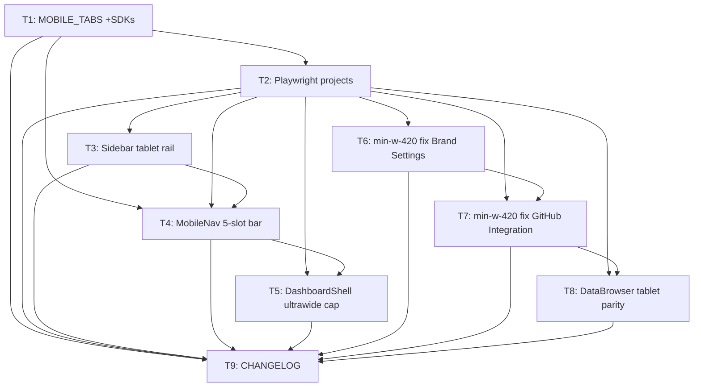

# Responsive Layout Tasks

## Execution Protocol (MANDATORY -- do not skip)

Implement these tasks with the `tlc-spec-driven` skill: **activate it by name and follow its Execute flow and Critical Rules.** Do not search for skill files by filesystem path. The skill is the source of truth for the full flow (per-task cycle, sub-agent delegation, adequacy review, Verifier, discrimination sensor).

**If the skill cannot be activated, STOP and tell the user - do not proceed without it.**

---

**Design**: `.specs/features/responsive-layout/design.md`
**Status**: Draft

---

## Test Coverage Matrix

> Generated from codebase sampling — confirm before Execute. Guidelines found: `AGENTS.md` §3/§5 (frontend gate: `npx tsc -b`, `npm run build`; every user-facing string through i18n — not applicable here, no new strings introduced), `.github/workflows/reusable-ci.yml` (CI gate reference). No unit-test layer exists in `internal/dashboard/ui` today (`package.json` has no `test:unit`/vitest/jest script) — the frontend's only test type is Playwright e2e (`e2e/*.spec.ts`, `test:e2e` script). This is a floor, not a gap to fill outside this feature's scope.

| Code Layer | Required Test Type | Coverage Expectation | Location Pattern | Run Command |
| --- | --- | --- | --- | --- |
| Nav components (`Sidebar.tsx`, `MobileNav.tsx`, `DashboardShell.tsx`) — new responsive behavior | e2e | 1:1 with spec ACs: RESP-01 (AC1-5), RESP-02 (AC1-5), RESP-03 (AC1-4) each get an explicit assertion | `e2e/responsive-nav.spec.ts` | `npx playwright test --project=mobile\|tablet\|ultrawide` |
| Page-level fixes (`BrandSettingsPage.tsx`, `GitHubIntegrationPage.tsx` — separate tasks, same fix — `DataBrowserPage.tsx`) | e2e | 1:1 with spec ACs: RESP-05 (AC1-2), RESP-07 (AC1) | `e2e/responsive-nav.spec.ts` | `npx playwright test --project=mobile\|tablet` |
| Config / data-only changes (`nav.ts` array entry, `playwright.config.ts` projects, `CHANGELOG.md`) | none | — build gate only, no independently testable logic | — | build gate only |

**Coverage Expectation values** — no project-specific guideline overrides the strong default for UI/e2e layers (happy path + every listed edge case), so the strong default applies: every RESP-NN acceptance criterion gets an explicit e2e assertion; config/data-only edits are covered transitively by the tests of the tasks that consume them.

## Gate Check Commands

> Generated from codebase — confirm before Execute. This feature touches only `internal/dashboard/ui`; no Go backend code changes, so `go build`/`go test`/`go vet`/`gofmt` are NOT required by any task here (would be a no-op gate).

| Gate Level | When to Use | Command |
| --- | --- | --- |
| Quick | After config/data-only tasks (no runtime behavior to assert) | `cd internal/dashboard/ui && npx tsc -b` |
| Full | After a task that adds/changes a testable nav or page behavior | `cd internal/dashboard/ui && npx tsc -b && npx playwright test --project=<relevant project(s)>` |
| Build | After the final task / phase completion | `cd internal/dashboard/ui && npx tsc -b && npm run build && npx playwright test` (all projects, full suite) |

---

**Co-located tests confirmed**: every task below that creates or modifies a nav/page behavior writes its e2e assertions into `e2e/responsive-nav.spec.ts` in the same task — no task defers its tests to a later one.

---

## Execution Plan

Phases are ordered and run sequentially - each phase completes before the next begins, and tasks within a phase execute in order.

### Phase 1: Foundation (nav data + test infrastructure)

Tasks: T1, T2 (executed in order; dependency graph is authoritative in the Phase Execution Map below).

### Phase 2: Core nav behavior

Tasks: T3, T4, T5 (executed in order; dependency graph is authoritative in the Phase Execution Map below).

### Phase 3: Page-level fixes

Tasks: T6, T7, T8 (executed in order; dependency graph is authoritative in the Phase Execution Map below).

### Phase 4: Documentation closure

Tasks: T9.

---

## Task Breakdown

### T1: Add SDKs to `MOBILE_TABS` — ✅ Complete

**What**: Add a 4th fixed entry (SDKs, `code` icon, `/sdks` route) to the `MOBILE_TABS` array so the mobile bottom bar has 4 fixed slots + "More" = 5 total.
**Where**: `src/components/layout/nav.ts`
**Depends on**: None
**Reuses**: The existing SDKs entry already defined in `NAV_SECTIONS` (same icon/route/label key) — copy its `icon`/`route`/label key, don't invent new ones.
**Requirement**: RESP-01

**Tools**:

- MCP: NONE
- Skill: NONE

**Done when**:

- [ ] `MOBILE_TABS` array has 4 entries: Apps, Data Browser, Logs, SDKs (in that order).
- [ ] No TypeScript errors.
- [ ] Gate check passes: `cd internal/dashboard/ui && npx tsc -b`

**Tests**: none (data-only array change; behavior is verified in T4, which renders this array)
**Gate**: quick

**Commit**: `feat(dashboard): add SDKs to mobile bottom-bar fixed tabs`

---

### T2: Add mobile/tablet/ultrawide Playwright projects — ✅ Complete (SPEC_DEVIATION: added `testMatch` scoping each new project to `responsive-nav.spec.ts` — not in design.md, added to avoid the existing 26-test suite silently running 4x under untested viewports)

**What**: Add 3 new `projects` entries to `playwright.config.ts` — `mobile` (390×844), `tablet` (820×1180), `ultrawide` (2560×1440) — each based on `devices['Desktop Chrome']` with an overridden `viewport`, alongside the existing `chromium` project (kept unchanged).
**Where**: `playwright.config.ts`
**Depends on**: T1
**Reuses**: The existing `chromium` project's shape (`use: { ...devices['Desktop Chrome'] }`) as the base for each new project, just overriding `viewport`.
**Requirement**: RESP-06 (foundation for all other tasks' tests)

**Tools**:

- MCP: NONE
- Skill: NONE

**Done when**:

- [ ] `playwright.config.ts` has 4 `projects` total: `chromium` (unchanged), `mobile`, `tablet`, `ultrawide`.
- [ ] `npx playwright test --list --project=mobile` (and `tablet`, `ultrawide`) each resolve without error (no tests need to exist yet — this validates the config itself parses and the project names resolve).
- [ ] Gate check passes: `cd internal/dashboard/ui && npx tsc -b`

**Tests**: none (test-infrastructure config; no application logic to assert)
**Gate**: quick

**Commit**: `test(dashboard): add mobile/tablet/ultrawide Playwright projects`

---

### T3: `Sidebar.tsx` — tablet icon-only rail — ✅ Complete (3 SPEC_DEVIATIONs: (1) `DashboardShell.tsx`'s grid track was still hardcoded to `264px_1fr` — design.md only covered `Sidebar.tsx`'s own width classes, but the grid column itself needed matching responsive tracks or the 72px rail would leave a 192px gap; (2) the logo/company-name block's fate at 72px width wasn't specified — hidden below `lg` rather than adding a new icon-only logo asset out of scope; (3) `NavRow` (shared with `MobileNav.tsx`'s "More" sheet) needed a new `alwaysShowLabel` prop — the rail's `hidden lg:inline` label class broke the sheet's always-full-label requirement below 1024px, confirmed via a real regression in the existing `personal-access-tokens.spec.ts` "MCP nav link ... reachable on mobile" test, fixed and reverified passing. Also confirmed via a baseline diff run that 11 pre-existing e2e failures in the full chromium suite are environmental, unrelated to this task.)

**What**: Make `Sidebar.tsx` render as a 72px icon-only rail at tablet width (768–1023px) and the unchanged 264px full sidebar at desktop width (≥1024px): remove the inline `style={{width: 264}}` in favor of `hidden md:flex md:w-[72px] lg:w-[264px]`; add `hidden lg:inline` to each nav-item label span; add `hidden lg:block` to each section-title div; insert a `<Separator>` between sections classed `md:block lg:hidden`; wrap each `NavRow` icon in a `<Tooltip>` showing the item's label (always-attached, per design's Tech Decisions — no breakpoint-conditional JS).
**Where**: `src/components/layout/Sidebar.tsx`
**Depends on**: T2 (needs the `tablet` Playwright project to exist to run this task's own e2e test)
**Reuses**: `ui/tooltip.tsx`, `ui/separator.tsx` (both already installed Radix-based components); existing `NavRow`/`isActive` active-route logic untouched.
**Requirement**: RESP-02 (AC1-5), RESP-03 (AC1)

**Tools**:

- MCP: NONE
- Skill: NONE

**Done when**:

- [ ] At `820×1180` (tablet project viewport): a 72px-wide icon-only rail renders — no visible labels, no visible section titles, a thin separator between the 3 sections, and no bottom bar.
- [ ] Hovering/focusing a rail icon shows a tooltip with that item's label.
- [ ] Clicking a rail icon navigates to its route and the icon shows the active-state tint/fill.
- [ ] At `≥1024px`: the full 264px sidebar with visible labels and section titles renders exactly as before this task (no visual regression) — desktop screenshot/assert unchanged text content.
- [ ] `e2e/responsive-nav.spec.ts` created with a `tablet`-project test covering the 4 bullets above.
- [ ] Gate check passes: `cd internal/dashboard/ui && npx tsc -b && npx playwright test --project=tablet`

**Tests**: e2e
**Gate**: full

**Commit**: `feat(dashboard): tablet icon-only sidebar rail`

---

### T4: `MobileNav.tsx` — 5-slot bottom bar — ✅ Complete (no code change needed: the existing `flex-1`-per-tab layout already scales correctly from 3 to 4 fixed tabs + More once T1 grew `MOBILE_TABS`; this task's actual deliverable was verification + the e2e test. Confirmed via a baseline-vs-fix comparison that a naive Portuguese-label assertion (`'Mais'`) would have trivially passed for the wrong reason under the default English locale — fixed to assert `'More'`, the actually-rendered text, same correction applied retroactively to T3's test)

**What**: Confirm/adjust the bottom bar's layout math (flex-basis / grid-cols) to correctly render 5 slots now that `MOBILE_TABS` has 4 entries (T1) instead of 3, with "More" as the 5th; verify the existing "More" bottom-sheet still lists the full role-filtered `NAV_SECTIONS` unchanged.
**Where**: `src/components/layout/MobileNav.tsx`
**Depends on**: T1 (needs the 4-entry `MOBILE_TABS`), T2 (needs the `mobile` Playwright project), T3 (phase-sequential; no functional coupling)
**Reuses**: The existing bottom-sheet overlay, animation, safe-area padding, and `data-testid="mobile-nav-sheet"` — mechanism is unchanged per design, only the fixed-tab count changes.
**Requirement**: RESP-01 (AC1-5)

**Tools**:

- MCP: NONE
- Skill: NONE

**Done when**:

- [ ] At `390×844` (mobile project viewport): bottom bar renders exactly 5 slots — Apps, Data Browser, Logs, SDKs, More.
- [ ] Tapping a fixed slot navigates and shows the active-state indicator on that slot.
- [ ] Tapping "More" opens the sheet listing Users/Audit/Integrations/Settings/MCP for a superadmin role (role-filtered per `hasPlatformPermission`, unchanged logic).
- [ ] Bottom bar stays above `env(safe-area-inset-bottom)` (no visual regression to existing padding).
- [ ] `e2e/responsive-nav.spec.ts` extended with a `mobile`-project test covering the above (new test, does not modify the existing `e2e/personal-access-tokens.spec.ts` mobile check).
- [ ] Gate check passes: `cd internal/dashboard/ui && npx tsc -b && npx playwright test --project=mobile`

**Tests**: e2e
**Gate**: full

**Commit**: `feat(dashboard): mobile bottom bar renders 5 slots (adds SDKs)`

---

### T5: `DashboardShell.tsx` — ultra-wide content cap — ✅ Complete

**What**: Add `mx-auto max-w-[1920px]` to the main content wrapper (currently `w-full min-w-0 p-10 max-md:px-4 max-md:py-4`) so content centers and stops stretching past 1920px, while the sidebar/rail/bottom-bar stay outside this wrapper (pinned to the viewport edge, not centered with content).
**Where**: `src/pages/DashboardShell.tsx`
**Depends on**: T2 (needs the `ultrawide` Playwright project), T4 (phase-sequential; no functional coupling)
**Reuses**: The existing grid structure (`grid-cols-[264px_1fr] max-md:grid-cols-1`) — no change to the grid itself, only the content wrapper inside the second column.
**Requirement**: RESP-03 (AC2-4)

**Tools**:

- MCP: NONE
- Skill: NONE

**Done when**:

- [ ] At `2560×1440` (ultrawide project viewport): the content wrapper's rendered width (via `boundingBox()`) is ≤1920px and horizontally centered within the remaining space right of the sidebar.
- [ ] At `1920×1080` and below: content wrapper still uses full available width (no visual regression at or below the cap).
- [ ] No page-level horizontal scrollbar appears on `/apps` or `/data-browser` at `2560×1440`.
- [ ] `e2e/responsive-nav.spec.ts` extended with an `ultrawide`-project test covering the above.
- [ ] Gate check passes: `cd internal/dashboard/ui && npx tsc -b && npx playwright test --project=ultrawide`

**Tests**: e2e
**Gate**: full

**Commit**: `feat(dashboard): cap main content at 1920px on ultra-wide viewports`

---

### T6: Fix `min-w-[420px]` overflow in `BrandSettingsPage.tsx` — ✅ Complete

**What**: Replace every `min-w-[420px]` in `BrandSettingsPage.tsx` (lines 151, 241, 387, 540, 661) with `min-w-0` (dropping the hard floor), keeping the existing `flex-1`/`w-full` so fields still fill available width above 420px and simply stop forcing overflow below it.
**Where**: `src/pages/BrandSettingsPage.tsx`
**Depends on**: T2 (needs the `mobile` Playwright project for the 375px overflow assertion)
**Reuses**: Existing `flex-1`/`w-full` sibling classes on the same elements — no new layout mechanism.
**Requirement**: RESP-05 (AC1-2)

**Tools**:

- MCP: NONE
- Skill: NONE

**Done when**:

- [ ] No `min-w-[420px]` occurrence remains in the file (grep-verifiable).
- [ ] At `375×667`: `/configuracoes` produces no horizontal page-level scrollbar and every affected field is fully visible.
- [ ] `e2e/responsive-nav.spec.ts` created with a `mobile`-project test asserting no horizontal overflow (`document.documentElement.scrollWidth <= window.innerWidth`, or equivalent Playwright check) on `/configuracoes` at 375px.
- [ ] Gate check passes: `cd internal/dashboard/ui && npx tsc -b && npx playwright test --project=mobile`

**Tests**: e2e
**Gate**: full

**Commit**: `fix(dashboard): remove min-w-[420px] floor in brand settings causing overflow below 420px`

---

### T7: Fix `min-w-[420px]` overflow in `GitHubIntegrationPage.tsx`

**What**: Replace every `min-w-[420px]` in `GitHubIntegrationPage.tsx` (lines 334, 1037, 1292) with `min-w-0`, same fix as T6, applied to the GitHub integration page's fields.
**Where**: `src/pages/GitHubIntegrationPage.tsx`
**Depends on**: T2 (needs the `mobile` Playwright project), T6 (extends the same `e2e/responsive-nav.spec.ts` overflow-check test with a second route rather than duplicating the check in a new file)
**Reuses**: Existing `flex-1`/`w-full` sibling classes; extends T6's e2e test file/pattern.
**Requirement**: RESP-05 (AC1-2)

**Tools**:

- MCP: NONE
- Skill: NONE

**Done when**:

- [ ] No `min-w-[420px]` occurrence remains in the file (grep-verifiable).
- [ ] At `375×667`: `/integracoes/github` produces no horizontal page-level scrollbar and every affected field is fully visible.
- [ ] `e2e/responsive-nav.spec.ts` extended (from T6) with the same overflow assertion for `/integracoes/github` at 375px.
- [ ] Gate check passes: `cd internal/dashboard/ui && npx tsc -b && npx playwright test --project=mobile`

**Tests**: e2e
**Gate**: full

**Commit**: `fix(dashboard): remove min-w-[420px] floor in GitHub integration page causing overflow below 420px`

---

### T8: `DataBrowserPage.tsx` — extend table-list collapse to tablet

**What**: Change the two-pane layout's collapse breakpoint from `max-md:` to `max-lg:` (both the `flex flex-col` container class and the paired `max-h-[220px]` scrollable-strip class on the table-list panel), so the desktop `240px_1fr` grid only applies at `≥1024px` instead of `≥768px`.
**Where**: `src/pages/DataBrowserPage.tsx`
**Depends on**: T2 (needs the `tablet` Playwright project), T7 (phase-sequential; no functional coupling)
**Reuses**: The existing mobile collapse markup/classes verbatim — only the breakpoint prefix changes (`md`→`lg`).
**Requirement**: RESP-07 (AC1)

**Tools**:

- MCP: NONE
- Skill: NONE

**Done when**:

- [ ] At `820×1180` (tablet project viewport): `/data-browser` shows the collapsed/scrollable table-list strip (not the desktop `240px_1fr` grid).
- [ ] At `≥1024px`: the desktop two-pane grid still renders unchanged.
- [ ] `e2e/responsive-nav.spec.ts` extended with a `tablet`-project test covering the above.
- [ ] Gate check passes: `cd internal/dashboard/ui && npx tsc -b && npx playwright test --project=tablet`

**Tests**: e2e
**Gate**: full

**Commit**: `fix(dashboard): collapse data browser table list at tablet width too`

---

### T9: Document the feature in `CHANGELOG.md`

**What**: Add an entry under `## [Unreleased]` → `### Added` (or `### Fixed` for RESP-05/RESP-07, per existing changelog convention of splitting by type) summarizing: the 3-state responsive nav (mobile bottom bar/tablet icon rail/desktop sidebar), the 1920px ultra-wide content cap, and the `min-w-[420px]` overflow fix.
**Where**: `CHANGELOG.md`
**Depends on**: T1, T2, T3, T4, T5, T6, T7, T8 (summarizes the completed feature; per AGENTS.md §6, must land in the same change that ships the feature)
**Reuses**: The existing `## [Unreleased]` section structure (already has entries from prior sessions this cycle — MCP `instructions`, `orbit-internals` skill).
**Requirement**: N/A (repo convention, not a spec AC)

**Tools**:

- MCP: NONE
- Skill: NONE

**Done when**:

- [ ] `CHANGELOG.md` has a new bullet (or bullets) under `[Unreleased]` describing the responsive layout work, following the existing bullet style/voice in that section.
- [ ] Gate check passes: `cd internal/dashboard/ui && npx tsc -b && npm run build && npx playwright test` (full suite, all 4 projects — final feature-level gate).

**Tests**: none (documentation)
**Gate**: build

**Commit**: `docs(changelog): document responsive layout overhaul`

---

## Phase Execution Map

Execution is strictly sequential - there is no intra-phase parallelism. A single agent works one task at a time, in order: T1 → T2 → T3 → T4 → T5 → T6 → T7 → T8 → T9.

**Batching**: 9 tasks total — just above the single-batch ceiling (~8 tasks). Given how thin the excess is (1 task) and that Phase 4 (T9) is a 1-task documentation closure with a hard dependency on everything before it, this executes inline in one batch rather than splitting into sub-agents — offering a sub-agent split for a single trailing docs task would add coordination overhead for no benefit. Flagged per the skill's offer-then-confirm rule: proceeding inline; say so if a split is preferred instead.

---

## Task Granularity Check

| Task | Scope | Status |
| --- | --- | --- |
| T1: Add SDKs to `MOBILE_TABS` | 1 array entry, 1 file | ✅ Granular |
| T2: Add 3 Playwright projects | 1 config file | ✅ Granular |
| T3: Sidebar tablet icon-only rail | 1 component, 1 cohesive visual feature (width+label+tooltip+separator are inseparably one testable state) | ✅ Granular (2-3 related edits, same file, same concern — OK per rubric) |
| T4: MobileNav 5-slot bottom bar | 1 component | ✅ Granular |
| T5: DashboardShell ultra-wide cap | 1 file, 1 class change | ✅ Granular |
| T6: `min-w-[420px]` fix — Brand Settings | 1 file, 1 mechanical class swap repeated 5× | ✅ Granular |
| T7: `min-w-[420px]` fix — GitHub Integration | 1 file, 1 mechanical class swap repeated 3× | ✅ Granular |
| T8: DataBrowserPage tablet parity | 1 file, 1 breakpoint swap | ✅ Granular |
| T9: CHANGELOG entry | 1 file | ✅ Granular |

---

## Diagram-Definition Cross-Check

| Task | Depends On (task body) | Diagram Shows | Status |
| --- | --- | --- | --- |
| T1 | None | (no incoming edge) | ✅ Match |
| T2 | T1 | T1 → T2 | ✅ Match |
| T3 | T2 | T2 → T3 | ✅ Match |
| T4 | T1, T2, T3 | T1 → T4, T2 → T4, T3 → T4 | ✅ Match |
| T5 | T2, T4 | T2 → T5, T4 → T5 | ✅ Match |
| T6 | T2 | T2 → T6 | ✅ Match |
| T7 | T2, T6 | T2 → T7, T6 → T7 | ✅ Match |
| T8 | T2, T7 | T2 → T8, T7 → T8 | ✅ Match |
| T9 | T1, T2, T3, T4, T5, T6, T7, T8 | T1→T9, T2→T9, T3→T9, T4→T9, T5→T9, T6→T9, T7→T9, T8→T9 | ✅ Match |

No task depends on a later-phase task. All dependencies point backward (Phase 1 → Phase 2 → Phase 3 → Phase 4) or within the same phase in order.

---

## Test Co-location Validation

| Task | Code Layer Created/Modified | Matrix Requires | Task Says | Status |
| --- | --- | --- | --- | --- |
| T1: Add SDKs to `MOBILE_TABS` | Config/data-only | none | none | ✅ OK |
| T2: Playwright projects | Config/data-only | none | none | ✅ OK |
| T3: Sidebar tablet rail | Nav component | e2e | e2e | ✅ OK |
| T4: MobileNav 5-slot bar | Nav component | e2e | e2e | ✅ OK |
| T5: DashboardShell ultra-wide cap | Nav component (shell) | e2e | e2e | ✅ OK |
| T6: `min-w-[420px]` fix — Brand Settings | Page-level fix | e2e | e2e | ✅ OK |
| T7: `min-w-[420px]` fix — GitHub Integration | Page-level fix | e2e | e2e | ✅ OK |
| T8: DataBrowserPage tablet parity | Page-level fix | e2e | e2e | ✅ OK |
| T9: CHANGELOG entry | Config/data-only (docs) | none | none | ✅ OK |

No violations. No task defers its tests to a later task ("tested in another task") — each e2e-required task writes its own assertions into `e2e/responsive-nav.spec.ts` within the same task.

---

## Tools Confirmation Needed

For every task above: no MCP or Skill dependency identified beyond the `tlc-spec-driven` skill itself (already active for this workflow). All work is direct file edits (Read/Edit/Bash for `tsc`/`playwright`), no external MCP integration touches this feature.
