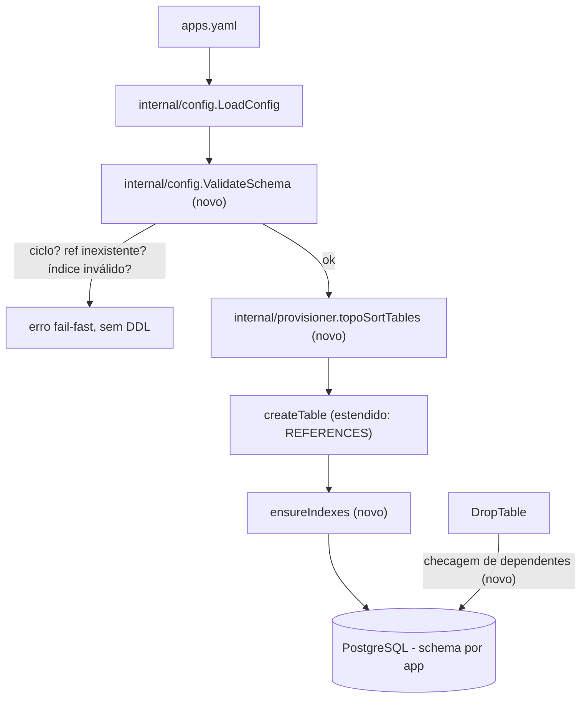

# Schema Relationships and Indexes Design

**Spec**: `.specs/features/schema-relationships-and-indexes/spec.md`
**Status**: Verified — implementado e mergeado (verificado 2026-08-10 contra o código; ver `tasks.md`)

---

## Architecture Overview

Extensão do schema builder existente (`internal/config` + `internal/provisioner`), sem componente novo de alto nível. Três pontos tocados: (1) modelo de config ganha campos `references`/`indexes`; (2) um validador novo faz o fail-fast (referência inexistente, ciclo, coluna de índice inválida, nome de índice duplicado) antes de qualquer DDL; (3) o provisioner ganha topological sort na ordem de `CREATE TABLE` e geração de `REFERENCES`/`CREATE INDEX`.



---

## Code Reuse Analysis

### Existing Components to Leverage

- `internal/config.TableConfig`/`ColumnConfig` (`internal/config/types.go:42-55`) — ganham campos novos, sem quebrar os existentes (`Unique`, `RenameFrom` continuam como estão).
- `internal/provisioner/table.go:64-112` (`createTable`) — `columnDDL` ganha emissão de `REFERENCES ... ON DELETE ...`; loop principal de colunas continua igual.
- `internal/provisioner/table.go:125-160` (`addMissingColumns`) — mesmo padrão de "detectar coluna faltando, ADD COLUMN" reaproveitado para FK adicionada em apply incremental.
- `internal/provisioner/provisioner.go:61` (loop `for _, table := range app.Tables`) — substituído por iteração sobre a lista já ordenada pelo topological sort, mesma assinatura de chamada para `createTable`/`applyColumnChanges`/`addMissingColumns`.
- Padrão de idempotência já usado em `addMissingColumns` (`ADD COLUMN IF NOT EXISTS`) — replicado para índice (`CREATE INDEX IF NOT EXISTS` já é sintaxe nativa do Postgres, não precisa de checagem manual de existência como coluna precisa).

### Integration Points

- `internal/config.LoadConfig` (`internal/config/loader.go`) — ponto onde a validação de schema (ciclo, referência, índice) deve rodar, antes de qualquer chamada ao provisioner. Se não existir hoje um passo de validação pós-parse separado do parse YAML em si, esta spec introduz `ValidateSchema(cfg *Config) error` chamado logo após o unmarshal.
- `internal/provisioner/provisioner.go` — ponto de entrada do `zeep apply`; troca o loop plano por: `tables := topoSortTables(app.Tables)` antes do loop existente.
- `internal/provisioner/table.go:116-122` (`DropTable`) — ganha checagem de dependentes antes do `DROP TABLE`, usando o mesmo grafo de FK já calculado para o sort.

---

## Components

### `internal/config.ValidateSchema` (novo)

Função pura, sem I/O, chamada após `LoadConfig` parsear o YAML. Recebe `*Config`, retorna `error` com todas as violações (não só a primeira) agregadas em uma mensagem, para o usuário corrigir tudo de uma vez.

Checagens, por app:
1. Toda `ColumnConfig.References.Table` existe entre as tabelas do mesmo app.
2. `ColumnConfig.References.Column` na tabela alvo é `id` ou tem `Unique: true`.
3. `ColumnConfig.References.OnDelete` (se presente) é um de `cascade|restrict|set_null|no_action`.
4. `OnDelete == "set_null"` implica `Required == false` na coluna de origem.
5. Grafo de FK entre tabelas do app é acíclico (DFS com detecção de back-edge).
6. Toda coluna citada em `TableConfig.Indexes[].Columns` existe na tabela.
7. Nomes de índice (`TableConfig.Indexes[].Name`) são únicos dentro do app (schema PostgreSQL == app).

### `internal/provisioner.topoSortTables` (novo)

Recebe `[]config.TableConfig` de um app, monta grafo de dependência a partir de `ColumnConfig.References.Table`, retorna slice reordenado (Kahn's algorithm) com tabelas referenciadas antes das que referenciam. Erro de ciclo não deveria ocorrer aqui (já barrado por `ValidateSchema`), mas a função retorna erro defensivamente em vez de paranicar ou entrar em loop infinito.

### `internal/provisioner.ensureIndexes` (novo, chamado por tabela após `createTable`/`addMissingColumns`)

Para cada entrada em `TableConfig.Indexes`, gera e executa `CREATE [UNIQUE] INDEX IF NOT EXISTS %q ON %q.%q (%s)`. Idempotente por natureza do `IF NOT EXISTS` — sem necessidade de query prévia em `pg_indexes` como `addMissingColumns` precisa fazer para coluna (Postgres não tem `ADD COLUMN IF NOT EXISTS` universalmente seguro em versões antigas do fluxo atual, por isso aquele código faz checagem manual; índice já tem a cláusula nativa).

### `internal/provisioner.checkDependents` (novo, chamado dentro de `DropTable`)

Antes do `DROP TABLE IF EXISTS`, consulta `information_schema.table_constraints`/`key_column_usage` (ou reusa o grafo de FK já montado a partir do config, se `DropTable` for chamado no mesmo fluxo de `apply` que já tem o `Config` em mãos) para achar tabelas do mesmo schema que referenciam a que está sendo removida. Se houver, retorna erro citando a tabela/coluna dependente, sem executar o `DROP`.

---

## Data Models

### `ColumnConfig` (estendido)

```go
type ColumnConfig struct {
	Name       string              `json:"name" yaml:"name"`
	Type       string              `json:"type" yaml:"type"`
	Required   bool                `json:"required" yaml:"required"`
	Default    string              `json:"default" yaml:"default"`
	Unique     bool                `json:"unique" yaml:"unique"`
	RenameFrom string              `json:"rename_from,omitempty" yaml:"rename_from,omitempty"`
	References *ReferenceConfig    `json:"references,omitempty" yaml:"references,omitempty"` // novo
}

type ReferenceConfig struct {
	Table    string `json:"table" yaml:"table"`
	Column   string `json:"column" yaml:"column"`
	OnDelete string `json:"on_delete,omitempty" yaml:"on_delete,omitempty"` // cascade|restrict|set_null|no_action, default no_action
}
```

### `TableConfig` (estendido)

```go
type TableConfig struct {
	Name    string         `yaml:"name"`
	RLS     string         `yaml:"rls"`
	Columns []ColumnConfig `yaml:"columns"`
	Indexes []IndexConfig  `yaml:"indexes,omitempty"` // novo
}

type IndexConfig struct {
	Name    string   `json:"name" yaml:"name"`
	Columns []string `json:"columns" yaml:"columns"`
	Unique  bool     `json:"unique,omitempty" yaml:"unique,omitempty"`
}
```

Exemplo de `apps.yaml`:

```yaml
apps:
  - name: shop
    tables:
      - name: customers
        columns:
          - {name: email, type: text, required: true, unique: true}
      - name: orders
        columns:
          - {name: status, type: text, required: true}
          - name: customer_id
            type: uuid
            required: true
            references: {table: customers, column: id, on_delete: cascade}
        indexes:
          - {name: idx_orders_customer, columns: [customer_id]}
          - {name: idx_orders_status_customer, columns: [status, customer_id], unique: false}
```

---

## Error Handling Strategy

- Toda violação de `ValidateSchema` é **fail-fast**: `zeep apply` para antes de qualquer `CREATE`/`ALTER`/`DROP`, igual ao comportamento atual de erro de parse YAML.
- Erros agregados (não só o primeiro achado) — usuário corrige tudo numa passada, evitando ciclo de "roda, corrige um erro, roda de novo, acha o próximo".
- `checkDependents` em `DropTable` retorna erro específico (não genérico de SQL) citando tabela e coluna dependente — mensagem deve ser acionável, não só "foreign key violation" cru do Postgres.
- Erro de ciclo em `topoSortTables` não deveria disparar em produção (barrado antes por `ValidateSchema`), mas existe como segunda camada de defesa — nunca confiar apenas na validação de entrada para código que manipula schema de banco.

---

## Tech Decisions (only non-obvious ones)

- **FK só intra-app**: decisão derivada diretamente do isolamento schema-per-app já existente no produto — não é uma escolha nova desta spec, é consequência de uma decisão arquitetural anterior (ver PROJECT.md). Não modelamos FK cross-schema porque isso quebraria a garantia de isolamento entre apps que é a base do produto.
- **Sem `DROP INDEX` automático quando removido do YAML**: mesma política conservadora que o resto do schema builder já aplica a colunas (nunca há `DROP COLUMN` implícito hoje) — consistência de comportamento, não invenção de regra nova.
- **Validação centralizada em uma função pura (`ValidateSchema`)** em vez de espalhar checagens pelo provisioner: mantém o provisioner livre de lógica de "é válido?" e só de "como aplicar" — mesma separação que já existe entre `config` (parse) e `provisioner` (execução) no código atual.
- **Kahn's algorithm para o topological sort**: mais simples de implementar com short-circuit de detecção de ciclo (fila vazia + nós restantes) do que DFS recursivo, e já que ciclo é o único caso de erro possível aqui, o sinal fica direto.

---

## Riscos e Perguntas em Aberto

- Quando `applyColumnChanges`/`addMissingColumns` roda em apply incremental e adiciona uma FK nova para uma tabela que também é nova no mesmo apply — a ordem entre "criar tabelas" e "adicionar colunas em tabelas existentes" precisa ser validada com teste de integração explícito; não basta o topological sort cobrir só a fase de `CREATE TABLE`.
- Não localizado um arquivo de validação de schema pré-existente (`ParseSchema`/`ValidateSchema`) durante a investigação — a peça `internal/config.ValidateSchema` é nova; confirmar durante a implementação que não há lógica equivalente e duplicada em outro lugar (ex: dentro do dashboard, na hora de o usuário criar app pela UI).
