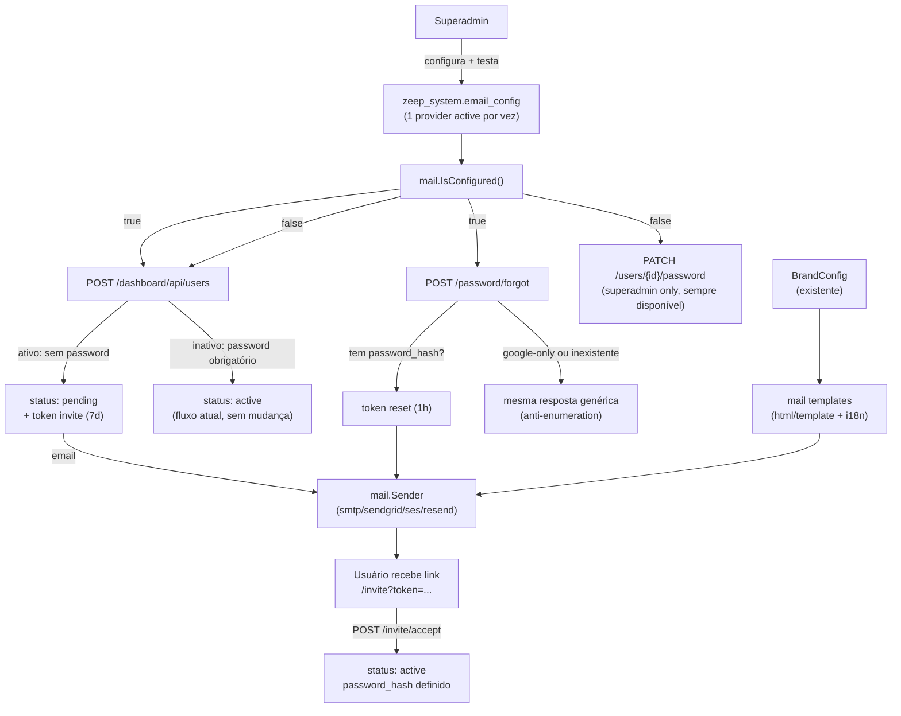

# SMTP/Email Integration Design

**Spec**: `.specs/features/smtp-email-integration/spec.md`
**Status**: Draft

---

## Architecture Overview

Pacote novo `internal/mail` concentra config, providers e templates. Nenhuma dependência de estado em memória por processo — tokens de convite/reset seguem exatamente o padrão `signState`/`verifyState` (`internal/dashboard/google.go`), stateless e corretos sob múltiplas réplicas atrás de load balancer não-sticky (regra explícita do `AGENTS.md`). `CreateUser` e os endpoints de senha consultam `mail.IsConfigured()` para decidir entre o caminho novo (email) e o caminho atual (manual), preservando o comportamento de hoje quando nenhum provider está ativo.



---

## Code Reuse Analysis

### Existing Components to Leverage

| Component | Location | How to Use |
|---|---|---|
| `signState`/`verifyState` (HMAC-SHA256 stateless) | `internal/dashboard/google.go` | Padrão direto para tokens de `invite`/`reset` — mesmo formato, campo `purpose` adicional |
| `crypto.Encrypt`/`Decrypt` | `internal/crypto` | Criptografar credenciais de cada provider antes de persistir em `email_config.credentials` |
| `BrandConfig`/`brand_store.go` | `internal/dashboard/brand_store.go` | Fonte de `CompanyName`/`LogoURL` para os templates, sem tabela nova |
| Audit log | `internal/dashboard/audit_store.go` | Eventos em toda mutação de config de email, criação/aceite de convite, reset de senha |
| Padrão de handler config (`DeployProviderConfigHandler`) | `internal/dashboard/deploy_provider_config.go` | Esqueleto para `EmailConfigHandler` |
| `dashboard_users` (`role`, agora + `status`) | `internal/dashboard/store.go`, `provisioner.go` | Nova coluna `status` (`active`/`pending`) na mesma tabela, sem tabela nova |
| `usePublicConfig()` | `internal/dashboard/ui/src/lib/api.ts` | `IsConfigured()` exposto nesse mesmo payload público, para a UI decidir mostrar "esqueci senha" e o form de criação de usuário sem senha |

### Integration Points

| System | Integration Method |
|---|---|
| `POST /dashboard/api/users` (existente) | Contrato muda condicionalmente conforme `mail.IsConfigured()` — sem quebra quando não há provider ativo |
| Login (`AuthJWTMiddleware`/handler de login) | Nova checagem: `status == 'pending'` nega acesso antes de validar senha/Google |
| Providers externos (SendGrid, SES, Resend) | `mail.Sender` implementado por provider, cada um com seu próprio formato de request |
| Dashboard UI | Nova página "Email", campo de senha condicional em criação de usuário, telas públicas `/invite`, `/forgot-password`, `/reset-password` |

---

## Components

### `internal/mail.Config` + `email_config` (provider ativo)

- **Purpose**: Persistir credenciais por provider, garantir só um `active` por vez.
- **Location**: `internal/mail/config_store.go`
- **Interfaces**:
  ```go
  type Provider string

  const (
      ProviderSMTP     Provider = "smtp"
      ProviderSendGrid Provider = "sendgrid"
      ProviderSES      Provider = "ses"
      ProviderResend   Provider = "resend"
  )

  type Config struct {
      Provider    Provider
      Active      bool
      FromAddress string
      Credentials json.RawMessage // campos variam por provider, valores sensíveis já cifrados
  }

  func UpsertConfig(ctx context.Context, pool *db.Pool, cfg Config) error
  func Activate(ctx context.Context, pool *db.Pool, p Provider) error // desativa os demais atomicamente
  func ListConfigs(ctx context.Context, pool *db.Pool) ([]Config, error)
  func IsConfigured(ctx context.Context, pool *db.Pool) (bool, error)
  ```
- **Dependencies**: `internal/crypto`, `internal/db`
- **Reuses**: padrão de tabela/handler de `deploy_provider_config.go`

### `internal/mail.Sender` (interface) + providers

- **Purpose**: Abstrair formato de envio por provider, extensível sem alterar consumidores.
- **Location**: `internal/mail/sender.go`, `smtp.go`, `sendgrid.go`, `ses.go`, `resend.go`
- **Interfaces**:
  ```go
  type Sender interface {
      Send(ctx context.Context, to, subject, htmlBody string) error
  }

  var providerRegistry = map[Provider]func(cfg Config) Sender{
      ProviderSMTP:     newSMTPSender,     // net/smtp, sem lib externa
      ProviderSendGrid: newSendGridSender, // POST api.sendgrid.com/v3/mail/send, Bearer
      ProviderSES:      newSESSender,      // AWS SigV4, região de Credentials
      ProviderResend:   newResendSender,   // POST api.resend.com/emails, Bearer
  }

  func ActiveSender(ctx context.Context, pool *db.Pool) (Sender, error) // nil se nenhum ativo
  ```
- **Dependencies**: `net/http`/`net/smtp`
- **Reuses**: nenhum precedente de envio no repo (novo)

### `internal/mail.Token` (convite/reset)

- **Purpose**: Emitir e validar tokens stateless por propósito.
- **Location**: `internal/mail/token.go`
- **Interfaces**:
  ```go
  type Purpose string
  const (
      PurposeInvite Purpose = "invite"
      PurposeReset  Purpose = "reset"
  )

  func SignToken(userID string, purpose Purpose, ttl time.Duration) (string, error)
  func VerifyToken(token string, want Purpose) (userID string, err error) // erro único para expirado/adulterado/propósito errado
  ```
- **Dependencies**: mesmo segredo HMAC já usado em `signState` (ou um dedicado, decidir em tasks)
- **Reuses**: formato de `signState`/`verifyState`

### `internal/mail.Templates`

- **Purpose**: Renderizar HTML final com dados de marca, para qualquer provider.
- **Location**: `internal/mail/templates/invite.html`, `templates/reset.html`, `internal/mail/render.go`
- **Interfaces**:
  ```go
  type TemplateData struct {
      CompanyName string
      LogoURL     string
      ActionURL   string
      Locale      string
  }

  func RenderInvite(data TemplateData) (subject, html string, err error)
  func RenderPasswordReset(data TemplateData) (subject, html string, err error)
  ```
- **Dependencies**: `embed.FS`, `html/template` (stdlib), `internal/dashboard.GetBrandConfig`
- **Reuses**: `BrandConfig` existente — sem tabela nova

### `internal/dashboard.EmailConfigHandler`

- **Purpose**: CRUD + ativação + teste de provider, pro frontend.
- **Location**: `internal/dashboard/email_config.go`
- **Interfaces**: `GET/PUT /dashboard/api/email-config`, `POST /dashboard/api/email-config/{provider}/activate`, `POST /dashboard/api/email-config/{provider}/test` — todos superadmin-only
- **Dependencies**: `internal/mail.Config`, `internal/mail.ActiveSender`
- **Reuses**: `InsertAuditLog`, esqueleto de `DeployProviderConfigHandler`

### Alterações em `internal/dashboard/handler.go`

- **Purpose**: `CreateUser` dual-path; novos endpoints de convite/reset/fallback administrativo.
- **Location**: `internal/dashboard/handler.go` (edição), `internal/dashboard/invite.go` (novo), `internal/dashboard/password_reset.go` (novo)
- **Interfaces**:
  - `POST /dashboard/api/invite/accept` `{token, password}` (público)
  - `POST /dashboard/api/users/{id}/resend-invite` (superadmin only)
  - `POST /dashboard/api/password/forgot` `{email}` (público)
  - `POST /dashboard/api/password/reset` `{token, password}` (público)
  - `PATCH /dashboard/api/users/{id}/password` `{password}` (superadmin only, fallback)
- **Dependencies**: `internal/mail` (todos os componentes acima)
- **Reuses**: `bcrypt.GenerateFromPassword` já usado em `CreateUser`, `h.audit(...)`

### `internal/dashboard/ui/src/pages/EmailConfigPage.tsx` + telas públicas

- **Purpose**: Config de provider, telas de convite/forgot/reset.
- **Location**: `internal/dashboard/ui/src/pages/EmailConfigPage.tsx`, `pages/InviteAcceptPage.tsx`, `pages/ForgotPasswordPage.tsx`, `pages/ResetPasswordPage.tsx`
- **Dependencies**: `usePublicConfig()` (para `IsConfigured`), `sonner` (toast em erro)
- **Reuses**: componentes de formulário/layout existentes

---

## Data Models

```sql
CREATE TABLE zeep_system.email_config (
    id          uuid PRIMARY KEY DEFAULT gen_random_uuid(),
    provider    text NOT NULL,        -- 'smtp' | 'sendgrid' | 'ses' | 'resend'
    active      boolean NOT NULL DEFAULT false,
    from_address text NOT NULL,
    credentials jsonb NOT NULL,       -- valores sensíveis cifrados individualmente antes de compor o jsonb
    updated_at  timestamptz NOT NULL DEFAULT now(),
    UNIQUE (provider)
);

-- Ativar um provider desativa os demais atomicamente (transação: UPDATE ... SET active=false WHERE provider != $1; UPDATE ... SET active=true WHERE provider = $1)
```

```sql
ALTER TABLE zeep_system.dashboard_users
    ADD COLUMN status text NOT NULL DEFAULT 'active' CHECK (status IN ('active', 'pending'));
```

**Payload do token** (antes do encode, mesmo formato de `signState`):

```json
{ "user_id": "uuid", "purpose": "invite", "exp": "2026-08-08T00:00:00Z" }
```

**Credentials por provider** (campo `jsonb`, exemplos):

```json
// smtp
{ "host": "...", "port": 587, "username": "...", "password_encrypted": "..." }
// sendgrid / resend
{ "api_key_encrypted": "..." }
// ses
{ "access_key_encrypted": "...", "secret_encrypted": "...", "region": "us-east-1" }
```

---

## Error Handling Strategy

| Error Scenario | Handling | User Impact |
|---|---|---|
| Credencial de provider inválida no teste de envio | Erro explícito retornado, provider nunca marcado `active` | Superadmin corrige antes de ativar |
| `CreateUser` sem provider ativo e sem `password` no body | 400, mensagem clara ("password required when no email provider is active") | Frontend mostra campo senha condicionalmente, evitando esse erro na prática |
| Token de convite/reset expirado, adulterado ou propósito errado | 400 único e genérico (não distingue motivo exato, evita vazar detalhe de criptoanálise) | Usuário vê "link inválido ou expirado", pede novo convite/reset |
| `forgot-password` para conta Google-only ou inexistente | Resposta 200 idêntica ao caso de sucesso real, nenhum token gerado | Anti-enumeration — usuário não distingue os 3 casos |
| Login de usuário `status: pending` | Rejeitado antes de checar senha/Google, mensagem genérica | Usuário é instruído a verificar o email de convite |
| Provider de email indisponível no momento do envio (timeout, 5xx) | Erro logado server-side; para convite/reset, a criação do usuário/token **não é desfeita** — endpoint de reenvio cobre o caso | Ação administrativa (criar usuário, pedir reset) não falha por completo; envio pode ser tentado de novo |

---

## Tech Decisions (only non-obvious ones)

| Decision | Choice | Rationale |
|---|---|---|
| Tokens de convite/reset | HMAC-SHA256 stateless, mesmo padrão de `signState`/`verifyState` | Regra explícita do `AGENTS.md`: nada de estado em memória por processo sob múltiplas réplicas/LB não-sticky |
| Multiplicidade de provider ativo | Só 1 por vez (`UNIQUE(provider)` + ativação atômica desativa os demais) | Email é canal único, diferente do fan-out de observability — não faz sentido mandar o mesmo email por 2 providers |
| Dual-path em `CreateUser` | Contrato de request muda conforme `IsConfigured()`, sem endpoint novo separado | Preserva 100% do comportamento atual quando não há provider — decisão explícita do usuário no brainstorm, prioridade sobre introduzir um único fluxo novo que quebraria instâncias sem SMTP |
| Login híbrido (Google ganha senha local via reset) | Rejeitado | Risco de segurança levantado e confirmado explicitamente: abriria segundo caminho de acesso à conta sem a segurança do Google |
| Templates de email | `html/template` versionado no código, sem editor no dashboard | Escopo definido explicitamente no brainstorm — editor de template é feature maior, candidata a spec própria futura |
| Dados dinâmicos nos templates | Reusa `BrandConfig` já existente, sem tabela nova | Evita duplicar conceito de "nome da empresa/logo" que já existe na plataforma |
| Revogação de token antes da expiração | Não implementada | Trade-off aceito do modelo stateless — mitigado com TTL curto (reset: 1h, convite: 7d), documentado como Out of Scope |

---

## Tips aplicadas

- Reuso verificado por leitura direta do código antes de propor: `signState`/`verifyState`, `BrandConfig`, `dashboard_users` (coluna nova em vez de tabela nova).
- Risco de segurança do login híbrido levantado explicitamente ao usuário antes de aceitar a decisão, não assumido silenciosamente.
- Dual-path de `CreateUser` documentado tanto no spec quanto na tabela de Tech Decisions — decisão explícita do usuário, não implícita.
