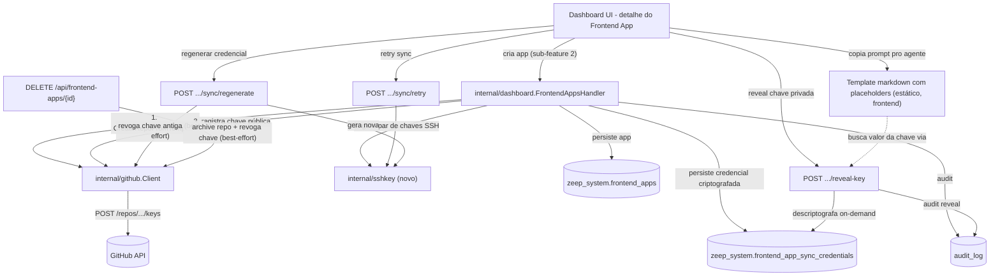

# Sync Local↔Repo Design

**Spec**: `.specs/features/sync-local-repo/spec.md`
**Status**: Verified — implementado e mergeado (verificado 2026-08-10 contra o código; ver `tasks.md`)

---

## Architecture Overview

A criação de frontend app (sub-feature 2, `POST /api/frontend-apps`) passa a incluir, na mesma chamada síncrona, a geração de um par de chaves SSH e o registro da chave pública como deploy key no repositório recém-criado. Falha nessa etapa não derruba o app — fica isolada em `sync_status: pending`, com retry e regenerate dedicados. Nenhuma peça nova de infraestrutura (CLI, proxy git) — o mecanismo de transporte continua sendo git puro sobre SSH, configurado pelo agente de IA do usuário a partir de um prompt copiável.



---

## Code Reuse Analysis

### Existing Components to Leverage

| Component | Location | How to Use |
|---|---|---|
| `internal/dashboard.FrontendAppsHandler` | `internal/dashboard/frontend_apps.go` (sub-feature 2) | Estender criação e delete existentes; adicionar 4 rotas novas de sync no mesmo arquivo |
| `internal/github.Client` | `internal/github/client.go` | Adicionar métodos `AddDeployKey`, `RevokeDeployKey` (novos, análogos ao `ArchiveRepo` já previsto na sub-feature 2) |
| `internal/crypto` (AES-256-GCM) | pacote já usado para credenciais da GitHub App, S3, Google OAuth | Criptografar/descriptografar `private_key_encrypted` |
| Audit log | `internal/dashboard/audit_store.go` (`h.audit(...)`) | Eventos `frontend_app.sync.reveal`, `.retry`, `.regenerate` |
| Middleware de autenticação padrão | `internal/dashboard/middleware.go` | `RequireAuth`, mesmo padrão da sub-feature 2 |
| Provisionamento de tabelas `zeep_system.*` | `internal/dashboard/provisioner.go` | Adicionar `CREATE TABLE IF NOT EXISTS frontend_app_sync_credentials` |

### Novo Componente

| Component | Location | How to Use |
|---|---|---|
| Geração de par de chaves SSH | `internal/sshkey/sshkey.go` (novo pacote) — usar `golang.org/x/crypto/ssh` (já indireta no `go.sum` via outras libs? confirmar; senão dependência nova mínima) | Gerar par ed25519, serializar chave pública em formato `authorized_keys`/deploy key do GitHub |

### Integration Points

| System | Integration Method |
|---|---|
| `internal/github.Client` | `AddDeployKey` (`POST /repos/{owner}/{repo}/keys`) na criação/retry/regenerate; `RevokeDeployKey` (`DELETE /repos/{owner}/{repo}/keys/{key_id}`) no regenerate e no delete |
| PostgreSQL (`zeep_system`) | Tabela nova `frontend_app_sync_credentials`, 1:1 com `frontend_apps` |
| Audit log | Eventos de reveal, retry e regenerate |

---

## Components

### Extensão de `internal/dashboard.FrontendAppsHandler`

- **Purpose**: Endpoints HTTP de sync — reveal, retry e regenerate de credencial; delete estendido pra revogar chave.
- **Location**: `internal/dashboard/frontend_apps.go` (mesmo arquivo da sub-feature 2)
- **Interfaces**:
  - `GET /api/frontend-apps/{id}/sync` — `sync_status`, `public_key`, `error_message`
  - `POST /api/frontend-apps/{id}/reveal-key` — descriptografa e retorna chave privada uma vez
  - `POST /api/frontend-apps/{id}/sync/retry` — regenera credencial se `pending`/`failed`
  - `POST /api/frontend-apps/{id}/sync/regenerate` — revoga (best-effort) e emite nova credencial, mesmo se `ready`
- **Dependencies**: `internal/github.Client`, `internal/sshkey`, `internal/crypto`, `frontendAppSyncCredentialsStore`, `audit_store`
- **Reuses**: `middleware.RequireAuth`, `h.audit(...)`

### `internal/dashboard.frontendAppSyncCredentialsStore`

- **Purpose**: CRUD 1:1 de `zeep_system.frontend_app_sync_credentials`.
- **Location**: `internal/dashboard/frontend_app_sync_credentials_store.go`
- **Interfaces**:
  - `Create(ctx, frontendAppID) error` — cria linha `pending` no momento da criação do frontend app
  - `Get(ctx, frontendAppID) (*SyncCredential, error)`
  - `UpdateSuccess(ctx, frontendAppID, githubKeyID, publicKey, privateKeyEncrypted string) error`
  - `UpdateFailure(ctx, frontendAppID, errorMessage string) error`
- **Reuses**: mesmo padrão de store simples com `pgx` já usado por `frontend_apps_store`

---

## Data Models

### `frontend_app_sync_credentials`

```sql
CREATE TABLE zeep_system.frontend_app_sync_credentials (
    id                     UUID PRIMARY KEY DEFAULT gen_random_uuid(),
    frontend_app_id        UUID NOT NULL UNIQUE REFERENCES zeep_system.frontend_apps(id),
    github_key_id          BIGINT,
    public_key             TEXT NOT NULL DEFAULT '',
    private_key_encrypted  TEXT NOT NULL DEFAULT '',
    sync_status            TEXT NOT NULL DEFAULT 'pending',  -- 'ready' | 'pending' | 'failed'
    error_message           TEXT NOT NULL DEFAULT '',
    created_at             TIMESTAMPTZ NOT NULL DEFAULT now(),
    updated_at             TIMESTAMPTZ NOT NULL DEFAULT now()
);
```

**Relationships**: `frontend_app_id` com FK real e `UNIQUE`, relação 1:1 — cada frontend app tem no máximo uma credencial de sync ativa.

**Retry e regenerate atualizam o mesmo registro** (`UPDATE`, não `INSERT`) — mesmo padrão de "reusar registro" já usado no retry da sub-feature 2, evita acumular histórico de tentativas.

**Sem tabela de histórico de rotação** — fora de escopo (YAGNI); rastro de regenerações fica só no `audit_log`.

---

## Error Handling Strategy

| Error Scenario | Handling | User Impact |
|---|---|---|
| Geração do par de chaves falha (erro interno) | `sync_status: pending` + `error_message`, app permanece `status: ready` | Frontend app usável, sync indisponível até retry |
| Registro da chave pública no GitHub falha (rede/rate limit) | Mesmo tratamento acima — não distingue causa interna de causa externa pro usuário | Mesma UX — botão de retry disponível |
| Retry chamado com `sync_status: ready` | Rejeita antes de qualquer chamada | "Sync já configurado — use regenerar se precisar de uma nova credencial" |
| Regenerate chamado, revogação da chave antiga falha | Segue mesmo assim emitindo e registrando a nova (best-effort) | Chave antiga pode ficar órfã no GitHub até revogação manual — risco aceito e documentado |
| Regenerate chamado com `sync_status: pending/failed` | Tratado como equivalente a retry (não há chave antiga real pra revogar) | Comportamento idêntico ao retry nesse caso |
| Reveal-key chamado sem `sync_status: ready` | Rejeita (404/409) | "Nenhuma credencial disponível pra revelar" |
| Delete do frontend app, revogação da chave falha | Segue mesmo assim (mesmo padrão já aceito pro archive do repo) | App removido normalmente, chave pode ficar órfã até limpeza manual |

---

## Tech Decisions (only non-obvious ones)

| Decision | Choice | Rationale |
|---|---|---|
| Mecanismo de transporte | Git puro sobre SSH (deploy key), sem CLI dedicada | CLI (`zeep-orbit push`) e proxy git no backend avaliados e descartados — custo de build/manutenção alto pra este estágio; documentados como estudo futuro |
| Credencial de acesso | Deploy key SSH por repo, sem expiração, API-mintável (`POST /repos/{owner}/{repo}/keys`) | Fine-grained PAT não é emitível via API por terceiros — só auto-serviço no GitHub; installation token expira em ~1h (má UX); deploy key resolve com API já existente |
| Complexidade de setup SSH absorvida por quem? | Pelo agente de IA (Claude Code/Codex), não pelo usuário humano diretamente | Quem roda os comandos git na prática é o agente, não o usuário não-técnico — setup SSH deixa de ser fricção humana |
| Armazenamento da chave privada | Criptografada em repouso (`internal/crypto` AES-256-GCM), nunca embutida em payload de listagem/detalhe padrão | Reaproveita padrão já usado para credenciais da GitHub App; exposição só via endpoint dedicado de reveal, audit-logged |
| Geração da credencial: junto da criação vs. sob demanda | Junto da criação do frontend app, mesma chamada síncrona | Menos passos manuais pro usuário; falha isolada em `sync_status: pending` não bloqueia o resto |
| Retry e regenerate no mesmo registro vs. novo registro | Mesmo registro (`UPDATE`) | Consistente com decisão equivalente já tomada na sub-feature 2 (retry de criação) |
| Revogação best-effort (regenerate e delete) | Nunca bloqueia a ação principal por falha na revogação remota | Consistente com o tratamento de archive de repo já aceito na sub-feature 2 — risco de chave órfã aceito, sem retry automático |
| Prompt pro agente: template estático vs. endpoint dinâmico | Template estático interpolado no frontend, reaproveitando o endpoint de reveal já existente | YAGNI — endpoint dedicado (`agent-prompt`) resolveria um problema hipotético (variação por SO) não levantado ainda |

---

## Tips aplicadas

- Diagramas: `mermaid-studio` não detectado no ambiente — mermaid inline conforme fallback do skill.
- Risco técnico sinalizado durante o brainstorm (fine-grained PAT não é API-mintável por terceiros) corrigiu uma decisão intermediária antes de chegar no design — registrado explicitamente na tabela de Tech Decisions, não escondido.
- Interfaces definidas antes de qualquer implementação.
