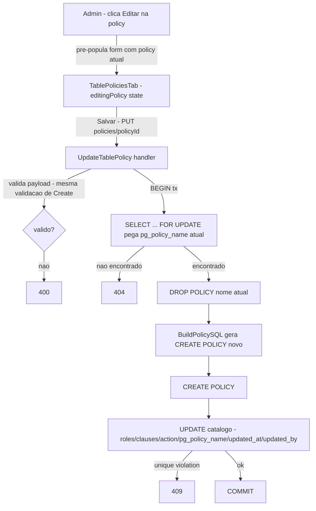

# Table Policy Edit Design

**Spec**: `.specs/features/table-policy-edit/spec.md`
**Status**: Draft

---

## Architecture Overview

Novo endpoint `PUT /dashboard/api/apps/{id}/tables/{table}/policies/{policyId}` que, dentro de uma única transação, trava a linha do catálogo (`SELECT ... FOR UPDATE`), dropa a policy nativa pelo nome atual, cria a policy nova via `BuildPolicySQL` (reuso total, zero mudança em `internal/provisioner/policy.go`), e faz `UPDATE` no catálogo com `updated_at`/`updated_by`. O frontend reaproveita 100% do formulário de criação já existente em `TablePoliciesTab` — só adiciona um modo "editando" que pré-popula os mesmos campos e troca `POST` por `PUT` no submit.



---

## Code Reuse Analysis

### Existing Components to Leverage

| Component | Location | How to Use |
| --- | --- | --- |
| `BuildPolicySQL` | `internal/provisioner/policy.go:120-170` | Reusado sem qualquer mudança — a edição gera o SQL de `CREATE POLICY` exatamente como a criação, só que depois de um `DROP` do nome antigo. Nenhuma lógica de `ALTER POLICY` é introduzida (decisão do spec). |
| Validação de payload de `CreateTablePolicy` | `internal/dashboard/handler.go:1367-1424` | Mesma validação (roles via `identRe`, allowlist de coluna/operador, `action` no enum) reusada tal como está no novo handler — nenhuma regra nova de formato. |
| Padrão de transação de `CreateTablePolicy` | `internal/dashboard/table_policies_store.go:94-167` | Estrutura da tx (contar policies, `BuildPolicySQL`, executar SQL, `INSERT`) é o molde pro `UPDATE` — só troca o passo final de `INSERT` por `SELECT FOR UPDATE` + `DROP` + `CREATE` + `UPDATE`. |
| Padrão de `DROP POLICY IF EXISTS` de `DeleteTablePolicy` | `internal/dashboard/table_policies_store.go:228-231` | Reusado literalmente — mesma sintaxe `DROP POLICY IF EXISTS %q ON %q.%q`, só que seguido de um `CREATE` em vez de terminar ali. |
| `useCreateTablePolicy`/`useDeleteTablePolicy` (padrão de mutation hook) | `internal/dashboard/ui/src/lib/api.ts:241-280` | Novo `useUpdateTablePolicy` copia a mesma forma (mutation, `invalidateQueries(['table-policies', appId, table])`, `onError: toast.error`). |
| Formulário de criação (`TablePoliciesTab`) | `internal/dashboard/ui/src/components/TablePolicies.tsx:58-340` | 100% reusado — nenhum campo novo, nenhum componente novo. Só um novo estado `editingPolicy` decide se `submit()` chama create ou update, e uma função `openEditForm(policy)` popula os mesmos `useState` que `resetForm()`/`openForm()` já usam. |
| Chips de role (`chipRoles`, `toggleRole`) | `TablePolicies.tsx:76-83` | Reusado sem mudança — já foi implementado na feature anterior (`enduser-roles-config`, T14) e já lida com role órfã (`ROLECFG-16`), que esta feature finalmente torna testável. |
| `RequireAuth` middleware | `internal/server/server.go:178-179` (mesmo grupo de rotas de policies) | Nova rota registrada no mesmo grupo protegido, nenhum middleware novo. |

### Integration Points

| System | Integration Method |
| --- | --- |
| `zeep_system.table_policies` | `ALTER TABLE ... ADD COLUMN IF NOT EXISTS updated_at`/`updated_by`, mesma migração idempotente das demais colunas dessa tabela (`internal/dashboard/provisioner.go:324-334`). `UPDATE` na linha existente em vez de `INSERT`. |
| Postgres nativo (`pg_policies`) | `DROP POLICY` (nome antigo) + `CREATE POLICY` (nome novo, pode ser igual ao antigo) — nunca `ALTER POLICY`, ambos dentro da mesma transação do `UPDATE` de catálogo. |
| `BuildPolicySQL` (`internal/provisioner/policy.go`) | Chamado exatamente como em `CreateTablePolicy`, sem novo parâmetro nem branch de edição — do ponto de vista da função, um `CREATE POLICY` de edição é indistinguível de um de criação. |

---

## Components

### Backend: migração `updated_at`/`updated_by`

- **Purpose**: Auditoria de edição na tabela de catálogo.
- **Location**: `internal/dashboard/provisioner.go` (mesma lista de `ALTER TABLE` de `zeep_system.table_policies`, ~linha 324-334).
- **Interfaces**: N/A (DDL).
- **Dependencies**: Nenhuma.
- **Reuses**: Padrão exato de `created_at`/`created_by` já existente na mesma tabela.

```sql
ALTER TABLE zeep_system.table_policies ADD COLUMN IF NOT EXISTS updated_at TIMESTAMPTZ
ALTER TABLE zeep_system.table_policies ADD COLUMN IF NOT EXISTS updated_by UUID REFERENCES zeep_system.dashboard_users(id)
```

### Backend: store `UpdateTablePolicy`

- **Purpose**: Aplica a edição — trava a linha, dropa a policy nativa antiga, cria a nova, atualiza o catálogo, tudo numa transação.
- **Location**: `internal/dashboard/table_policies_store.go` (novo, ao lado de `CreateTablePolicy`/`DeleteTablePolicy`).
- **Interfaces**: `UpdateTablePolicy(ctx context.Context, pool *pgxpool.Pool, appID, schemaName, tableName, policyID string, columns []ColumnDef, def PolicyDef, updatedBy string) (TablePolicyRow, error)`.
- **Dependencies**: `provisioner.BuildPolicySQL`, `identRe` (reuso indireto via a mesma validação de `CreateTablePolicy`).
- **Reuses**: Estrutura de transação de `CreateTablePolicy` (`table_policies_store.go:94-167`) + sintaxe de `DROP POLICY IF EXISTS` de `DeleteTablePolicy` (`:228-231`).

**Lógica da função:**
1. `BEGIN` tx.
2. `SELECT pg_policy_name FROM zeep_system.table_policies WHERE id = $1 AND app_id = $2 FOR UPDATE` — trava a linha (evita corrida com um `DeleteTablePolicy` concorrente). Zero linhas → `ErrPolicyNotFound` (handler traduz pra 404).
3. `provisioner.BuildPolicySQL(def)` gera o novo `CREATE POLICY` — mesma validação de coluna/operador/`identRe` já embutida na função (nenhuma duplicação de regra).
4. `DROP POLICY IF EXISTS %q ON %q.%q` com o `pg_policy_name` **antigo** (lido no passo 2).
5. Executa o `CREATE POLICY` novo.
6. `UPDATE zeep_system.table_policies SET action=$, roles=$, clauses=$, pg_policy_name=$, updated_at=now(), updated_by=$ WHERE id=$ AND app_id=$`. Erro de unique violation (Postgres code `23505`, mesma constraint `(app_id, table_name, action, pg_policy_name)`) → `ErrPolicyConflict` (handler traduz pra 409).
7. `COMMIT`; retorna a `TablePolicyRow` atualizada.

### Backend: handler `UpdateTablePolicy`

- **Purpose**: Endpoint HTTP da edição.
- **Location**: `internal/dashboard/handler.go` (novo, ao lado de `CreateTablePolicy`/`DeleteTablePolicy`, ~linha 1367-1455).
- **Interfaces**:
  - `PUT /dashboard/api/apps/{id}/tables/{table}/policies/{policyId}` — body idêntico ao de `CreateTablePolicy`: `{name, action, roles[], clauses[]}`.
  - 200 com a `TablePolicyRow` atualizada.
  - 400 (validação, mesma mensagem de `CreateTablePolicy`), 404 (`ErrPolicyNotFound`), 409 (`ErrPolicyConflict`), 500 genérico pra qualquer outro erro (nunca `err.Error()` bruto).
- **Dependencies**: `UpdateTablePolicy` (store).
- **Reuses**: Parse/validação de body de `CreateTablePolicy` (`handler.go:1368-1403`) — extraído ou duplicado de forma mínima, decisão de implementação na fase Tasks/Execute, não estrutural aqui.

### Backend: rota

- **Purpose**: Registrar o endpoint.
- **Location**: `internal/server/server.go` (~linha 178-179, mesmo grupo de `CreateTablePolicy`/`DeleteTablePolicy`).
- **Interfaces**: `r.With(dashboard.RequireAuth(pool)).Put("/api/apps/{id}/tables/{table}/policies/{policyId}", dashH.UpdateTablePolicy)`.
- **Dependencies**: `RequireAuth` (já existente).
- **Reuses**: Grupo de rotas já existente.

### Frontend: hook `useUpdateTablePolicy`

- **Purpose**: Mutation React Query pro novo endpoint.
- **Location**: `internal/dashboard/ui/src/lib/api.ts` (ao lado de `useCreateTablePolicy`/`useDeleteTablePolicy`, ~linha 241-280).
- **Interfaces**: `useUpdateTablePolicy(appId: string, table: string): UseMutationResult<TablePolicyRow, Error, {policyId: string; def: PolicyDef}>`.
- **Dependencies**: `queryClient.invalidateQueries(['table-policies', appId, table])`.
- **Reuses**: Forma exata de `useCreateTablePolicy`.

### Frontend: `TablePoliciesTab` — modo de edição

- **Purpose**: Reusa o formulário de criação pra também editar.
- **Location**: `internal/dashboard/ui/src/components/TablePolicies.tsx` (modifica o componente existente, ~linha 58-390).
- **Interfaces**:
  - Novo estado `editingPolicy: TablePolicyRow | null` (`null` = modo criação, presente = modo edição).
  - Nova função `openEditForm(policy: TablePolicyRow)`: popula `name` (de `policy.pg_policy_name`), `action`, `selectedRoles` (de `policy.roles`), `clauses` (de `policy.clauses`, mapeado pra `ClauseDraft[]` — mesma forma, sem transformação), seta `editingPolicy(policy)` e `showForm(true)`.
  - `submit()` passa a ramificar: `editingPolicy` presente → `updatePolicy.mutate({policyId: editingPolicy.id, def})`; ausente → `createPolicy.mutate(def)` (comportamento atual, inalterado).
  - Novo botão "Editar" (ícone, ao lado do botão de delete já existente em `:374-382`), `onClick={() => openEditForm(policy)}`.
- **Dependencies**: `useUpdateTablePolicy`.
- **Reuses**: Todo o form existente (`name`/`action`/`selectedRoles`/`clauses`/`chipRoles`/`toggleRole`/`addClause`/`removeClause`/`updateClause`) — nenhum componente novo, nenhum campo novo.

---

## Data Models

```typescript
// internal/dashboard/ui/src/lib/api.ts — estendendo TablePolicyRow existente
interface TablePolicyRow {
  // ...campos existentes (id, table_name, action, roles, clauses, pg_policy_name, created_at, created_by)
  updated_at: string | null // null em policies nunca editadas (coluna sem valor até a primeira edição)
  updated_by: string | null
}
```

```go
// internal/dashboard/table_policies_store.go
type TablePolicyRow struct {
    // ...campos existentes
    UpdatedAt *time.Time `json:"updated_at"`
    UpdatedBy *string    `json:"updated_by"`
}
```

**Relationships**: `updated_by` referencia `dashboard_users(id)`, mesma FK de `created_by` — sem relação nova além da coluna espelhada.

---

## Error Handling Strategy

| Error Scenario | Handling | User Impact |
| --- | --- | --- |
| Payload inválido (formato de role, coluna/operador fora da allowlist, `action` fora do enum) | 400, mesma validação/mensagem de `CreateTablePolicy` | Toast de erro no formulário, nada é alterado no Postgres nem no catálogo. |
| `policyId` inexistente ou de outro app | 404 (`ErrPolicyNotFound`) | Toast de erro; cenário só ocorre por chamada direta à API ou corrida rara (policy deletada entre abrir o form e salvar). |
| Conflito de unicidade após a edição (`action`+`pg_policy_name` já usados por outra policy) | 409 (`ErrPolicyConflict`, traduzido do erro Postgres `23505`) | Toast de erro pedindo pra escolher outro nome ou action. |
| `DROP POLICY`/`CREATE POLICY` falha dentro da tx (dessincronia catálogo↔Postgres) | Transação inteira abortada, 500 genérico (nunca `err.Error()` bruto) | Toast de erro genérico; nenhuma mutação parcial fica no catálogo nem no Postgres. |
| Dois admins editam a mesma policy concorrentemente | Last-write-wins (`SELECT FOR UPDATE` serializa as duas transações, a segunda commit vence) | Sem erro visível — decisão aceita no spec (Edge Cases). |

---

## Risks & Concerns

| Concern | Location (file:line) | Impact | Mitigation |
| --- | --- | --- | --- |
| Corrida entre `DeleteTablePolicy` e `UpdateTablePolicy` na mesma policy | `internal/dashboard/table_policies_store.go` (novo código) | Sem lock, a edição poderia dropar um nome que o delete concorrente já removeu, ou o `UPDATE` final poderia afetar 0 linhas silenciosamente se o delete comitou entre o `SELECT` e o `UPDATE` | `SELECT ... FOR UPDATE` no passo 2 trava a linha do catálogo pra qualquer transação concorrente que tente `DELETE`/`UPDATE` a mesma linha — a segunda transação espera o commit da primeira, nunca vê um estado intermediário. Se a linha foi de fato deletada antes do lock (delete já comitou), o `SELECT FOR UPDATE` retorna zero linhas → 404, tratado explicitamente. |
| `UPDATE` do catálogo pode afetar 0 linhas se a policy foi deletada exatamente entre o `DROP`/`CREATE` nativo e o `UPDATE` do catálogo (janela pequena, mas existe sem o lock do passo 2) | Mesmo store, passo 6 | Sem o lock, ficaria um `CREATE POLICY` nativo "solto" sem linha de catálogo correspondente | Coberto pela mesma trava do passo 2 — como a transação inteira roda com a linha travada desde o início, nenhuma outra transação consegue deletar a policy até este `COMMIT`. |
| Duplicação de lógica de validação de payload entre `CreateTablePolicy` e `UpdateTablePolicy` (dois handlers, mesmo parsing) | `internal/dashboard/handler.go:1368-1424` (existente) | Se a validação de criação mudar no futuro, alguém pode esquecer de espelhar na edição | Fora do escopo estrutural desta spec decidir extrair um helper compartilhado — fica registrado como candidato a limpeza na fase Tasks (extrair `parsePolicyDefBody` reusável pelos dois handlers é uma escolha de implementação razoável, não uma decisão de design que precise de aprovação separada). |

> Nenhum risco de segurança novo — mesmo middleware `RequireAuth`, mesma validação de entrada, nenhuma superfície de SQL livre introduzida (`BuildPolicySQL` continua sendo o único gerador de SQL).

---

## Tech Decisions (only non-obvious ones)

| Decision | Choice | Rationale |
| --- | --- | --- |
| Sempre `DROP`+`CREATE`, nunca `ALTER POLICY` | Confirmado pelo usuário na fase Specify | `ALTER POLICY` não cobre troca de `FOR <action>`/`TO <role>` — só `USING`/`WITH CHECK`. Um caminho único (sempre `DROP`+`CREATE`) evita manter dois fluxos de código pra um ganho de performance irrelevante (edição de policy é operação rara de admin, não hot path). |
| Lock via `SELECT ... FOR UPDATE` em vez de lock otimista (`version` column) | `SELECT FOR UPDATE` | Mais simples — não exige adicionar coluna de versão nem lógica de retry no cliente; a operação é rara o suficiente pra um lock pessimista de linha não ser um problema de contenção. |
| Nome da policy pode ser trocado livremente durante a edição | Handler sempre dropa o nome ANTIGO (lido do catálogo) antes de criar com o nome novo | Não exige campo adicional no payload (o catálogo já sabe o nome atual) e nunca deixa uma policy nativa órfã (dropada seria o antigo, criada é a nova — sempre 1:1). |
| Validação de payload não extraída num helper compartilhado nesta fase de design | Duplicação aceita entre `CreateTablePolicy`/`UpdateTablePolicy`, candidato a limpeza na Execute | Decisão de implementação de baixo risco, não estrutural — não vale travar a aprovação do design por isso; registrado em Risks & Concerns. |

> Nenhuma decisão aqui estabelece uma convenção de projeto que precise virar `AD-NNN` em `.specs/STATE.md` — `STATE.md` ainda não existe neste projeto.
