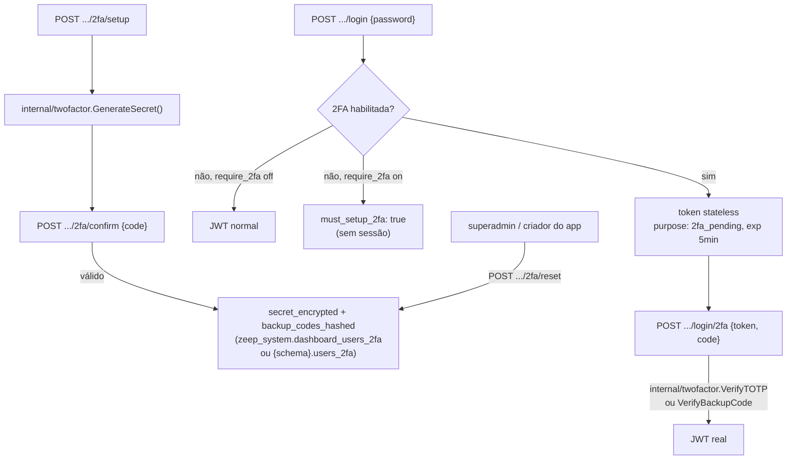

# Two-Factor Authentication (2FA) Design

**Spec**: `.specs/features/two-factor-auth/spec.md`
**Status**: Draft

---

## Architecture Overview

Pacote novo `internal/twofactor` concentra toda a lógica criptográfica (geração/verificação de TOTP, backup codes), consumido simetricamente por `internal/dashboard` (2FA de admin) e `internal/auth` (2FA de usuário final de app). Nenhum dos dois lados reimplementa TOTP — só chamam o pacote compartilhado e persistem em tabelas próprias (schema-per-app do lado app, `zeep_system` do lado dashboard).



---

## Code Reuse Analysis

### Existing Components to Leverage

| Component | Location | How to Use |
|---|---|---|
| `crypto.Encrypt`/`Decrypt` | `internal/crypto` | Cifra o secret TOTP antes de persistir, mesmo padrão de outras integrações |
| `internal/auth/ratelimit.go` (rate limiter existente) | `internal/auth` | Reusado no endpoint `/login/2fa`, mesmo mecanismo já usado no login normal |
| Padrão de token stateless HMAC (`signState`/`mail.SignToken`) | `internal/dashboard/google.go`, `internal/mail/token.go` | Token de step-up (`purpose: "2fa_pending"`) segue exatamente o mesmo formato |
| `bcrypt` (já usado em `CreateUser`) | `internal/dashboard/handler.go` | Hash dos backup codes, mesmo mecanismo de senha |
| Audit log | `internal/dashboard/audit_store.go` | Eventos em setup/disable/reset de 2FA, e em toggle de `require_2fa` |
| Schema-per-app | `internal/registry`, `internal/provisioner` | `{schema}.users_2fa` segue o mesmo padrão de isolamento de qualquer outra tabela de app |

### Integration Points

| System | Integration Method |
|---|---|
| Login do dashboard (`internal/dashboard` handler de login) | Passa a checar 2FA antes de emitir sessão — mesma função de login, ramificação nova |
| Login de app (`internal/auth.Handler.Login`) | Mesma ramificação, aplicada ao login de usuário final |
| `config.AppConfig` | Novo campo `require_2fa bool` no config já existente do app, sem tabela nova pra essa flag |
| Dashboard UI | Página "Segurança" (perfil), toggle de exigência (config de plataforma); UI do app ganha toggle equivalente na config do app |

---

## Components

### `internal/twofactor` (núcleo compartilhado)

- **Purpose**: Gerar/verificar TOTP e backup codes, sem estado — funções puras sobre os dados fornecidos pelo chamador.
- **Location**: `internal/twofactor/totp.go`, `backup_codes.go`
- **Interfaces**:
  ```go
  func GenerateSecret() (secret string, err error)
  func ProvisioningURI(secret, accountName, issuer string) string
  func VerifyTOTP(secretEncrypted string, code string) bool // decrypt interno, janela ±1 step

  func GenerateBackupCodes() (codes []string, hashes []string) // 8 códigos, formato "XXXX-XXXX"
  func VerifyBackupCode(hashes []string, code string) (remainingHashes []string, ok bool)
  ```
- **Dependencies**: `crypto/hmac`, `crypto/sha1` (TOTP é SHA1 por padrão RFC 6238, mesmo se soar contraintuitivo — é o padrão de facto que todo app autenticador espera), `internal/crypto`, `golang.org/x/crypto/bcrypt`
- **Reuses**: nenhum precedente de TOTP no repo (novo)

### `internal/dashboard.TwoFactorHandler`

- **Purpose**: Setup/confirm/disable/reset de 2FA para `dashboard_users`, toggle de `require_2fa` global.
- **Location**: `internal/dashboard/twofactor.go`
- **Interfaces**:
  - `POST /dashboard/api/2fa/setup`, `POST /dashboard/api/2fa/confirm`, `POST /dashboard/api/2fa/disable` (usuário autenticado, sobre a própria conta)
  - `POST /dashboard/api/users/{id}/2fa/reset` (superadmin only)
  - `GET/PUT /dashboard/api/platform-config/require-2fa` (superadmin only)
  - `POST /dashboard/api/login/2fa` (público, completa o step-up)
- **Dependencies**: `internal/twofactor`, `internal/mail.SignToken`/`VerifyToken` (reuso do formato, não do pacote — ou um `internal/twofactor.SignPendingToken` dedicado, a decidir em tasks)
- **Reuses**: `crypto.Encrypt`, `bcrypt`, `InsertAuditLog`

### `internal/auth` — extensão de `Handler`

- **Purpose**: Mesmo conjunto de endpoints, escopado a usuários finais de um app.
- **Location**: `internal/auth/twofactor.go` (novo arquivo), edição de `handler.go` (`Login`)
- **Interfaces**: espelha exatamente os endpoints do dashboard, prefixados pela rota do app (`/v1/{app}/2fa/...`, `/v1/{app}/login/2fa`)
- **Dependencies**: `internal/twofactor`, `internal/auth/ratelimit.go` (reuso direto)
- **Reuses**: mesmo padrão de handler de `internal/auth/handler.go`

### Frontend: `SecurityPage.tsx` (perfil) + `TwoFactorSetupModal.tsx`

- **Purpose**: UI de setup (QR code, confirmação, exibição única dos backup codes) e toggles de exigência.
- **Location**: `internal/dashboard/ui/src/pages/SecurityPage.tsx`, `components/TwoFactorSetupModal.tsx`
- **Dependencies**: biblioteca de QR code no frontend (a única exceção razoável de dependência nova — renderizar `otpauth://` como imagem exige alguma lib, ex: `qrcode.react`; decidir exata em tasks)
- **Reuses**: componentes de formulário/modal existentes, `toast.error` padrão

---

## Data Models

```sql
-- Dashboard
CREATE TABLE zeep_system.dashboard_users_2fa (
    user_id             uuid PRIMARY KEY REFERENCES zeep_system.dashboard_users(id) ON DELETE CASCADE,
    secret_encrypted    text NOT NULL,
    enabled             boolean NOT NULL DEFAULT false,
    backup_codes_hashed text[] NOT NULL DEFAULT '{}',
    created_at          timestamptz NOT NULL DEFAULT now()
);

-- Config global (tabela/local exato de platform config a confirmar em tasks — pode ser
-- zeep_system.platform_config já existente, ou nova tabela singleton se não houver uma)
-- ADD COLUMN require_2fa boolean NOT NULL DEFAULT false;
```

```sql
-- Por app, dentro do schema do próprio app
CREATE TABLE {schema}.users_2fa (
    user_id             uuid PRIMARY KEY REFERENCES {schema}.users(id) ON DELETE CASCADE,
    secret_encrypted    text NOT NULL,
    enabled             boolean NOT NULL DEFAULT false,
    backup_codes_hashed text[] NOT NULL DEFAULT '{}',
    created_at          timestamptz NOT NULL DEFAULT now()
);
```

`require_2fa` de app entra como campo novo em `config.AppConfig` (jsonb já existente), sem tabela nova.

**Token de step-up** (payload antes do encode, mesmo formato de `signState`/`mail.SignToken`):

```json
{ "user_id": "uuid", "scope": "dashboard" | "app:{app_name}", "purpose": "2fa_pending", "exp": "..." }
```

---

## Error Handling Strategy

| Error Scenario | Handling | User Impact |
|---|---|---|
| Código de confirmação de setup inválido | Setup não persiste nada, erro claro | Usuário tenta de novo, secret pendente descartado |
| Código de login (`/login/2fa`) inválido | 401, conta como tentativa de rate limit | Após N tentativas, bloqueio temporário (mesmo mecanismo do login normal) |
| Backup code já usado reenviado | Rejeitado, sem consumir novamente | Usuário usa outro código da lista |
| Token de step-up expirado | 401, exige novo login (senha) do zero | Sem sessão parcial pendurada |
| Tentativa de `disable` com `require_2fa` ativo | 403 explícito ("2FA é obrigatória nesta conta/app") | Usuário entende que precisa de ação do superadmin/criador do app pra sair da exigência |
| Reset administrativo de 2FA | Sempre permitido independente de `require_2fa`, auditado | Conta volta a "sem 2FA", sujeita a `must_setup_2fa` no próximo login se exigência ativa |

---

## Tech Decisions (only non-obvious ones)

| Decision | Choice | Rationale |
|---|---|---|
| Método de 2FA | Só TOTP + backup codes, sem SMS/email | Decidido explicitamente no brainstorm: evita dependência de provider de SMS e não acopla a `smtp-email-integration` (ainda não implementada) |
| 2FA aplica a contas Google OAuth? | Não | Google já provê segurança própria (2FA/verificação em 2 etapas); redundante e mais estado a sincronizar sem ganho real — mesma lógica já usada em `smtp-email-integration` |
| Enforcement de `require_2fa` sem 2FA configurada | `must_setup_2fa: true`, não bloqueio permanente | Trata como desvio de onboarding obrigatório, não como lockout — usuário sempre tem um caminho pra frente |
| Desativar 2FA com `require_2fa` ativo | Bloqueado (403) | Evita usuário se autoexcluir do próprio login por engano |
| Token de step-up | Stateless HMAC, TTL 5 minutos, sem invalidação ativa (replay possível dentro do TTL) | Mesmo trade-off já aceito em `smtp-email-integration`; consistente com a regra do `AGENTS.md` contra estado em memória multi-réplica |
| Onde vive `users_2fa` do lado app | Schema do próprio app (`{schema}.users_2fa`), não `zeep_system` | Consistente com o modelo schema-per-app já usado em todo o resto do produto — 2FA de usuário final é dado do app, não da plataforma |
| Dependência de lib de QR code no frontend | Aceita como exceção pontual (única exceção real de "sem lib nova" nesta spec) | Gerar QR code a partir de `otpauth://` sem lib é inviável em tempo razoável; decisão consciente, documentada aqui, não descoberta tarde na implementação |

---

## Tips aplicadas

- Núcleo criptográfico (`internal/twofactor`) desenhado uma vez, reusado nos dois escopos — evita duplicar TOTP em `internal/dashboard` e `internal/auth` separadamente.
- Exceção de dependência nova (lib de QR code) sinalizada explicitamente na tabela de Tech Decisions, não escondida — YAGNI foi respeitado em todo o resto (sem SMS, sem WebAuthn, sem editor de nada).
- `must_setup_2fa` em vez de bloqueio duro evita o modo de falha mais comum de "exigir 2FA" mal implementado: usuário trancado fora sem caminho de setup.
